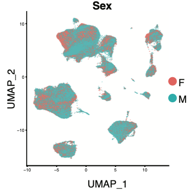

```{r setup, include=FALSE}
knitr::opts_chunk$set(echo = TRUE)
```


<p>&nbsp;</p>


# 1. Introduction

<div style="text-align: justify"> <div style="line-height: 2em"> This document describes the computational pipeline of the document **Efthymios Motakis, Siddhi Nargund1, Romy Kursawe, Vijay Selvam, Giray Naim Eryilmaz, Sai Nivedita Krishnan, Duygu Ucar, Michael L. Stitzel (2023). Single cell genomic decoding of human islet cell type-specific defects in type 2 diabetes**.

Pancreatic islet (dys)function is central to glucose homeostasis and type 2 diabetes (patho)physiology. Human islets consist of multiple endocrine (alpha, beta, delta, gamma), endothelial, and resident/infiltrating immune cells whose coordinated functions modulate glucose mobilization or disposal. Single cell transcriptome profiling (scRNA-seq) studies have been applied to dissect human islet cellular heterogeneity, identify islet cell (sub)populations, and define their molecular repertoire. However, precise understanding of cell type-specific alterations in type 2 diabetic vs. non-diabetic individuals is lacking, due in part to the limited number of individuals or single cell transcriptomes per individual profiled for comparison. 

Here, we create a comprehensive single cell transcriptome atlas of 245,878 human islet cells from 48 individuals spanning non-diabetic (ND), pre-diabetic (PD), and type 2 diabetic (T2D) states and matched for sex, age, and ancestry to define marker gene sets that are robustly expressed across disease states for each of the 14 cell types identified. We observe significant 15-20% decreases in the number of beta cells sampled from T2D vs. ND or PD donors.

Two of eight putative beta cell subpopulations, with ‘high functioning’ and ‘senescent’ cell gene signatures, increase and decrease in T2D donor islets, respectively. Importantly, we identify 511 differentially expressed genes in beta cells from T2D vs. ND donors. This includes monogenic and type 2 diabetes effector genes, such as HNF1A, DGKB, ST6GAL1, and FXYD2, for which genetic and environmental effects on their expression is concordant.  Human beta cell and islet knockdown of selected newly-identified down-regulated genes impairs beta cell viability or function. Together, this study provides new and robust, cell type-resolved insights on the cellular and molecular changes in healthy vs. diabetic human islets and represents a valuable resource to the islet biology and type 2 diabetes communities.

The pipeline and methodology have been extensively discussed in the submitted manuscript. Here, we will show in detail the computational steps (R script, tables and plots) that generated the main findings and other supporting material. The reader can use our code to replicate the results and to explore other aspects of our data.

The description of the data used in this manuscript can also be found at <https://github.com/ArisStefanosSn/PancreaticAtlas>. The folder and functions below contain all necessary information  to replicate the results of this study. </div></div>

```{r,eval=TRUE}
folder<-"~/Documents/Work/Stitzel_lab/Islet_sets/Rmarkdown/"
suppressMessages(
  source(paste(folder,"functions.R",sep=""))
                )
```

### 1.1. Single-cell Sequencing

<div style="text-align: justify"> <div style="line-height: 2em"> Pancreatic islets were cultured using CMRL, supplemented with 10% FBS, 1% Glutamax,1% Pen/Strep for 14 days. Islet-derived fibroblasts were harvested and gDNA extracted using the Blood & Tissue kit (Qiagen). The RNAse A (Qiagen) treated genomic DNA samples were genotyped using the Infinium Global Diversity Array-8 v1.0 Kit (Illumina). 

Single cell capture, barcoding and library preparation were performed using the 10X Chromium platform (https://www.10xgenomics.com) according to the manufacturer’s protocol for chemistries v2 (#CG00052) and v3 (#CG000183). Illumina base call files for all libraries were converted to FASTQs using CellRanger-6.1.2 demultiplexing and count pipelines (https://www.10xgenomics.com). Initially, we used cellranger’s mkfastq to demultiplex the raw base call (BCL) files generated by Illumina sequencers, perform adapter trimming and retrieve the 10-bp length UMI bases to be included into the generated FASTQ files for downstream processing. We loaded the FASTQs to STARsolo with STAR 2.7.9a and, using the v2 / v3 whitelists associated with cellranger v.6 installation, we aligned the reads onto the Ensembl human genome GRCh38 (https://uswest.ensembl.org/Homo_sapiens/Info/Index) for each of the Gel bead-in Emulsions (GEMs) of each library. We filtered out the empty droplets with STARsolo’s EmptyDrops_CR option keeping a median of 7748 cells across libraries for further analysis (25% - 75% IQR: 5891 - 9133). In total 414,082 cell-containing droplets were estimated. Our original target was to sequence 6,000 cells per library. The excess of droplet-containing cells estimated by STARsolo can be probably accounted as false positives whose amount, as the IQRs imply, was library dependent.</div></div>

### 1.2. Experimental Design

<div style="text-align: justify"> <div style="line-height: 2em"> We generated the single-cell RNA-seq data of 17 non-diabetic (ND), 14 prediabetic (PD) and 17 type 2 diabetic (T2D) human cadavers of matched sex, ethnic and age groups. The separation of ND from PD was done in terms of their measured HbA1c levels ($HbA1c < 5.9$ for ND and $5.9 \leq HbA1c \leq 6.4$ for PD). For T2D we considered the specific diagnosis on the donor chart/patient history. Several T2D donors were on medication and exhibited controlled levels of HbA1c (14 out of the 17 donors had $HbA1c \geq 6.4$). Cells from 12 donors had their RNA sequenced in multiple donor-specific or genetically multiplexed libraries. Specifically, each of the following islet pairs with IDs Islet70 (PD) / Islet71 (T2D), Islet84 (T2D) / Islet85 (PD) and Islet118 (PD) / Islet119 (T2D) were multiplexed twice (in two different libraries). On the other hand, the data of IDs Islet47 (ND) / Islet48 (T2D), Islet57 (ND) / Islet58 (PD) and Islet59 (ND) / Islet60 (T2D) were sequenced separately (a standalone library per ID) and in multiplex (a pair-specific library). As such, the data of our 48 donors spanned across 54 libraries. 

We took a closer look at the islet characteristics by tabulating / plotting the clinical and demographic information of this study. We started by tabulating the categorical variables across conditions, i.e. sex, race, chemistry, center, medication (T2D only) and Cause Of Death against ND, PD and T2D:</div></div>

```{r,democlinical1,eval = TRUE}
########################
# load the stored data #
########################
info<-read.table(paste(folder,"islet_info.txt",sep=""),sep="\t",header=T)
head(info)

###################################################################################
# sex frequencies and fisher test for independence of rows and columns (matching) #
###################################################################################
table(info$Condition,info$Sex)
fisher.test(table(info$Condition,info$Sex))

####################################################################################
# race frequencies and fisher test for independence of rows and columns (matching) #
####################################################################################
table(info$Condition,info$Race)
fisher.test(table(info$Condition,info$Race))

#########################
# chemistry frequencies #
#########################
table(info$Condition,info$Chemistry)

######################
# center frequencies #
######################
table(info$Condition,info$Center)

###################
# COD frequencies #
###################
table(info$Condition,info$COD)

########################################################
# medication frequencies (T2D only, NR = Non-Reported) #
########################################################
table(info$Condition,info$Medication)
```

<div style="text-align: justify"> <div style="line-height: 2em"> We can also visualize the distribution of the continuous factors across conditions. First we checked the age distributions:</div></div>

```{r,democlinical2,eval=TRUE,fig.cap='**Figure 1.1: Distribution of Age in ND, PD and T2D conditions.**',fig.pos='left',figure.height = 9, figure.width = 9,out.width = "9in"}
#####################
# make the age plot #
#####################
fig<-plot_ly(info,x=~Condition,y=~Age,type="box",boxpoints = "all", jitter = 0.3,color=~Condition)
fig
```


<p>&nbsp;</p>


<div style="text-align: justify"> <div style="line-height: 2em"> We tested for significant differences with ANOVA and Tukey's Honest Significant Differences (HSD) with Bonferroni correction. There were no significant age differences.</div></div>
 
```{r,democlinical3,eval = TRUE}
#######################
# Tukey's HSD for Age #
#######################
mod<-aov(Age~Condition,data=info)
TukeyHSD(mod, conf.level=.95)
```


<div style="text-align: justify"> <div style="line-height: 2em"> In the same way we plotted and tested for differences in BMI, HbA1c, Viability and Purity. For BMI:</div></div> 

```{r,democlinical4,eval=TRUE,fig.cap='**Figure 1.2: Distribution of BMI in ND, PD and T2D conditions.**',fig.pos='left',figure.height = 9, figure.width = 9,out.width = "9in"}
#####################
# make the BMI plot #
#####################
fig<-plot_ly(info,x=~Condition,y=~BMI,type="box",boxpoints = "all", jitter = 0.3,color=~Condition)
fig
```


<p>&nbsp;</p>


```{r,democlinical5,eval = TRUE}
#######################
# Tukey's HSD for BMI #
#######################
mod<-aov(BMI~Condition,data=info)
TukeyHSD(mod, conf.level=.95)
```

<div style="text-align: justify"> <div style="line-height: 2em"> For HbA1c:</div></div>

```{r,democlinical6,eval=TRUE,fig.cap='**Figure 1.3: Distribution of HbA1c in ND, PD and T2D conditions.**',fig.pos='left',figure.height = 9, figure.width = 9,out.width = "9in"}
#######################
# make the HbA1c plot #
#######################
fig<-plot_ly(info,x=~Condition,y=~HbA1c,type="box",boxpoints = "all", jitter = 0.3,color=~Condition)
fig
```


<p>&nbsp;</p>


<div style="text-align: justify"> <div style="line-height: 2em"> Here, the homogeneity of variance assumption required in Tukey's HSD test is clearly not satisfied. The T2D group exhibited larger variance as a result of the medication. For this reason, we tested for differences using a standard t-test for unequal variances followed by Bonferroni adjustment of the p-values: </div></div>

```{r,democlinical7,eval = TRUE}
###############################
# t-test of HbA1c in ND vs PD #
###############################
nd_vs_pd<-t.test(info$HbA1c[info$Condition=="ND"],info$HbA1c[info$Condition=="PD"])
nd_vs_pd

################################
# t-test of HbA1c in ND vs T2D #
################################
nd_vs_t2d<-t.test(info$HbA1c[info$Condition=="ND"],info$HbA1c[info$Condition=="T2D"])
nd_vs_t2d

################################
# t-test of HbA1c in PD vs T2D #
################################
pd_vs_t2d<-t.test(info$HbA1c[info$Condition=="PD"],info$HbA1c[info$Condition=="T2D"])
pd_vs_t2d

################################
# Bonferroni adjusted p-values #
################################
p<-c(nd_vs_pd$p.value,nd_vs_t2d$p.value,pd_vs_t2d$p.value)
p<-p.adjust(p,"bonferroni")
names(p)<-c("NDvsPD","NDvsT2D","PDvsT2D")
p
```


<div style="text-align: justify"> <div style="line-height: 2em"> For cell viability:</div></div>

```{r,democlinical8,eval=TRUE,fig.cap='**Figure 1.4: Distribution of cell viability in ND, PD and T2D conditions.**',fig.pos='left',figure.height = 9, figure.width = 9,out.width = "9in"}
###########################
# make the Viability plot #
###########################
fig<-plot_ly(info,x=~Condition,y=~Viability,type="box",boxpoints = "all", jitter = 0.3,color=~Condition)
fig
```


<p>&nbsp;</p>


```{r,democlinical9,eval = TRUE}
############################# 
# Tukey's HSD for Viability #
#############################
mod<-aov(Viability~Condition,data=info)
TukeyHSD(mod, conf.level=.95)
```

<div style="text-align: justify"> <div style="line-height: 2em"> For cell purity:</div></div>

```{r,democlinical10,eval=TRUE,fig.cap='**Figure 1.5: Distribution of cell purity in ND, PD and T2D conditions.**',fig.pos='left',figure.height = 9, figure.width = 9,out.width = "9in"}
########################
# make the Purity plot #
########################
fig<-plot_ly(info,x=~Condition,y=~Purity,type="box",boxpoints = "all", jitter = 0.3,color=~Condition)
fig
```


<p>&nbsp;</p>


```{r,democlinical11,eval = TRUE}
##########################
# Tukey's HSD for Purity #
##########################
mod<-aov(Purity~Condition,data=info)
TukeyHSD(mod, conf.level=.95)
```

<p>&nbsp;</p>

<div style="text-align: justify"> <div style="line-height: 2em"> Note that the ND and PD donors were manually selected to match the demographics (BMI, Age, Sex and Race) of T2D donors. To quantify the similarity among the selected donors, we used a dot product similarity measure:</div></div>

```{r,democlinical12,eval = TRUE}
###########################################
# Dot product similarity among conditions #
###########################################
demo.mat<-info[,c(3,6,2,4,13)]
cols.numeric.factors<-1:2
cols.categorical.factors<-3:4

# Normalize numeric factors
maxvect<-apply(demo.mat[,cols.numeric.factors],MARGIN=2,FUN=max)
minvect<-apply(demo.mat[,cols.numeric.factors],MARGIN=2,FUN=min)
rangevect<-maxvect-minvect
num_matrix <- as.matrix(demo.mat[,cols.numeric.factors])
norm<-matrix(nrow=nrow(num_matrix),ncol=length(cols.numeric.factors))
colnames(norm)<-colnames(num_matrix)
for (i in 1:length(cols.numeric.factors)){ 
  norm[,i]<-(num_matrix[,i]-minvect[i]*rep(1,nrow(num_matrix)))/rangevect[i]
}
head(norm)


# Sex design matrix
sex<-unique(demo.mat$Sex)
sex.mat<-matrix(0,nrow=nrow(demo.mat),ncol=length(sex))
for (i in 1:length(sex)){
  sex.mat[,i]<-as.numeric(demo.mat$Sex==sex[i])
} 
colnames(sex.mat)<-sex
head(sex.mat)


# Race design matrix
race<-unique(demo.mat$Race)
race.mat<-matrix(0,nrow=nrow(demo.mat),ncol=length(race))
for (i in 1:length(race)){
  race.mat[,i]<-as.numeric(demo.mat$Race==race[i])
} 
colnames(race.mat)<-race
head(race.mat)


# Combine the above matrices
comb.submat<-cbind(sex.mat,race.mat,norm)
comb.submat<-t(apply(comb.submat,MARGIN=1,FUN=function(x) x/sqrt(sum(x*x))))
comb.mat<-data.frame(Condition=demo.mat$Condition,comb.submat)
head(comb.mat)


# Condition matrix for similarity
cond.mat<-matrix(0,length(unique(demo.mat$Condition)),ncol(comb.submat))
rownames(cond.mat)<-unique(demo.mat$Condition)
uu<-unique(demo.mat$Condition)
for (i in 1:length(uu)){
  mm<-(comb.mat[,1]==uu[i])*seq(1,nrow(comb.mat))
  mm<-mm[mm>0]
  ll<-length(mm)
  mat1<-matrix(comb.submat[mm,],nrow=length(mm),ncol=ncol(comb.submat))
  csums<-colSums(mat1)
  cond.mat[i,]<-csums/sqrt(sum(csums^2))
}
colnames(cond.mat)<-colnames(comb.submat)


# Dot product similarity
cond.mat%*%t(cond.mat)
```

<p>&nbsp;</p>

<div style="text-align: justify"> <div style="line-height: 2em"> The dot product similarity ranges in 0 (completely dissimilar) and 1 (completely similar). Our analysis shows the high similarity of the donors across the three conditions (ND vs PD: 0.982; ND vs T2D: 0.962; PD vs T2D: 0.982). </div></div>


### 1.3. Step-by-Step Pipeline for Single-cell RNA-seq Data Processing 

<div style="text-align: justify"> <div style="line-height: 2em"> We employed the multi-step quality control pipeline, described in the following paragraphs, to clean and analyze our heterogeneous dataset. We performed read alignment and gene quantification with STARsolo giving us a starting set of 414,082 cell-containing droplets. Working with each library separately, we decontaminated the ambient RNA with SoupX and, where needed, we deconvoluted the donor information with Demuxlet using estimated donor-specific SNPs from the genotype information. We estimated homotypic (different cell types) doublets by Scrublet and DoubletFinder and used a multi-criteria quality control approach considering features, UMIs, percentage of reads mapped to the mitochondrial genome and markers analysis to filter out low-quality cells.

The high-quality cells were merged, integrated with Harmony, cleaned further for doublets and annotated using well known and estimated markers from differential expression analysis. Focusing on the donor variability, we converted the heterogeneous single-cell RNA-seq into pseudobulk raw counts that were fed into a differential expression analysis model to compare, for each cell type, the three disease states, ND vs PD s T2D, across donors (replicates). Further insights into the differences across the three disease states were gained via cell type subclustering and subsequent differential expression at the single-cell level.</div></div>     

### 1.4. Data availability

<div style="text-align: justify"> <div style="line-height: 2em"> The raw fastq data and the processed STARsolo data (filtered barcodes.tsv, features.tsv and matrix.mtx) have been deposited in GEO under the ID **GSE221156**. The raw / normalized counts, the UMAP coordinates, the clustering results and the other donor characteristics can downloaded / visualized at **USCS Cell Browser** ([link here]) and at **cellxgene** ([put link here]). The aggregated (pseudobulk) data and the associated differential expression analysis across the three disease states and cell types can be visualized in our **TAPIC R shiny applet** via interactive heatmaps, boxplots, scatterplots and data tables.

Due to data size limitations, this document uses mainly summarized versions of the original data to describe the analysis and the characteristics of this rich information. We provide the analytic and annotated code to create the summary tables and model estimates, and all informative plots that appear in our submitted work. This information along with the R libraries and functions used have been stored here at <https://github.com/ArisStefanosSn/Islets_Study>.</div></div>  


<p>&nbsp;</p>


# 2. Reads alignment and gene quantification with STARsolo

<div style="text-align: justify"> <div style="line-height: 2em"> We used **STARsolo** for mapping/quantification of each of our scRNA-seq libraries capturing the transcriptome of single or multiple (genetic multiplexing) donors. STARsolo is built directly into the RNA-seq aligner STAR that, in our analysis, performed read alignment to the full HG38 human genome. It follows CellRanger's logic for cell barcode whitelisting and UMI deduplication while being much faster than its competitor.

We ran Alex Dobin's STARsolo with STAR 2.7.9a (2021/05/05) from <https://github.com/alexdobin/STAR/blob/master/docs/STARsolo.md>. The model parameters varied slightly according to the two different 10x chemistries of our collection. As an example, **MS17001** generated under the V2 chemistry was processed as:</div></div>

```{r,STARsolo_MS17001,eval = FALSE}
##################################
# STARsolo execution for MS17001 #
##################################
path/to/STAR-2.7.9a/source/STAR 
  --genomeDir path/to/hg38_index \
  --readFilesIn path/to/MS17001_GT17-04740_S3_L002_R2_001.fastq.gz 
                path/to/MS17001_GT17-04740_S3_L002_R1_001.fastq.gz \
  --soloBarcodeReadLength 26 \
  --soloType CB_UMI_Simple \
  --soloCBwhitelist path/to/whitelist_v2.txt \
  --soloCellFilter EmptyDrops_CR
```

<div style="text-align: justify"> <div style="line-height: 2em"> The input data were supplied in the following parameters: *--genomeDir* that accepted the path to the hg38 genome index (the same as for normal STAR runs), *--readFilesIn* that took the standard 10x fastq files, the first of which had the cDNA reads and the second having the barcode reads (cell+UMI) and *--soloCBwhitelist* that specified the V2's whitelist coming with the Cellranger installation. Among other parameters, *--soloBarcodeReadLength*  specified the length of the barcode read (26 in V2 chemistry), *--soloType* was the type of single-cell RNA-seq (here Droplet) and *--soloCellFilter* determined the type of cell filtering (the above documented value performed Cellranger's 3 or higher type of filtering).  

Likewise, for the libraries of V3 chemistry such as the **MS19001**, STARsolo was executed as:</div></div>

```{r,STARsolo_MS19001,eval = FALSE}
##################################
# STARsolo execution for MS19001 #
##################################
path/to/STAR-2.7.9a/source/STAR 
  --genomeDir path/to/hg38_index \
  --readFilesIn path/to/MS19001_GT19-02598_SI-GA-G11_S7_L002_R2_001.fastq 
                path/to/MS19001_GT19-02598_SI-GA-G11_S7_L002_R1_001.fastq \
  --soloBarcodeReadLength 28 \
  --soloType CB_UMI_Simple \
  --soloCBwhitelist path/to/whitelist_v2.txt \
  --soloCellFilter EmptyDrops_CR
```

<div style="text-align: justify"> <div style="line-height: 2em"> with the only difference being the value of *--soloBarcodeReadLength* parameter. The above commands generated a list of files the most important of which were: (1) the barcodes (tab separated), the features (tab separated) and expression matrix (mtx format) of the raw data including all droplets, (2) the barcodes (tab separated), the features (tab separated) and expression matrix (mtx format) of the filtered data including all cell-containing droplets as estimated by the **EmptyDrops_CR** filtering step and (3) a list of QC metrics that showed a preliminary QC of the data. The data were stored in library-specific folders. In our GEO uploaded data, we provide the filtered barcodes, features and expression matrix along with the raw fastqs.

We examined the standard library QC metrics generated by STARsolo. Our data (UMIs, barcodes, features) exhibited the typical high-quality features suggested by the 10x's guidelines: <https://support.10xgenomics.com/single-cell-gene-expression/sequencing/doc/technical-note-interpreting-cell-ranger-web-summary-files-for-single-cell-gene-expression-assays>. The summary statistics of all collected metrics are shown below.</div></div>

```{r,STARsoloQC,eval=TRUE}
#######################################
# read the stored STARsolo QC metrics #
#######################################
x<-read.table(paste(folder,"STARsolo_libSummary.txt",sep=""),sep="\t",header=T)

##################################
# QC summary of STARsolo results #
##################################
summary(x[,2:22])

########################################
# total number of cells after STARsolo #
########################################
sum(x$Estimated_Number_of_Cells)

###############################################
# quantiles of number of cells after STARsolo #
###############################################
quantile(x$Estimated_Number_of_Cells)
```

<div style="text-align: justify"> <div style="line-height: 2em"> We plotted the total numbers of reads, the ratio of unique reads mapped to the genome, the total number of cells, the average UMI per cell and the number of detected genes. Mouse over on the below interactive plots reveals more details of the data background information. The libraries were sorted by the date of sequencing (the first 12 libraries were generated with the V2 chemistry).</div></div>

```{r,STARsoloPlot1,eval=TRUE,fig.cap='**Figure 2.1: Total number of reads per library (STARsolo estimates).**',fig.pos='left',figure.height = 9, figure.width = 9,out.width = "9in"}
#################################################################################
# plot the number of reads per library (donors or donor pairs separated by '/') #
#################################################################################
fig <- plot_ly(x, x = ~Library, y = ~Number_of_Reads, type = 'bar',colors = "Set2",
       text = ~Composite, textposition = 'middle right',color=~Chemistry) %>%
       layout(xaxis = list(tickfont = list(size = 7)),yaxis=list(title="Total Number of Reads"))
fig
```


<p>&nbsp;</p>


```{r,STARsoloPlot2,eval=TRUE,fig.cap='**Figure 2.2: Ratio of unique reads mapped to the genome per library (STARsolo estimates).**',fig.pos='left',figure.height = 9, figure.width = 9,out.width = "9in"}
###################################################################
# plot the ratio of unique reads mapped to the genome per library #
###################################################################
fig <- plot_ly(x, x = ~Library, y = ~Reads_Mapped_to_Genome._Unique, type = 'bar',colors = "Set2",
       text = ~Composite, textposition = 'middle right',color=~Chemistry) %>%
       layout(xaxis = list(tickfont = list(size = 7)),yaxis=list(title="Ratio Reads Mapped to Genome (Unique)"))
fig
```


<p>&nbsp;</p>


```{r,STARsoloPlot3,eval=TRUE,fig.cap='**Figure 2.3: Number of cells per library (STARsolo estimates).**',fig.pos='left',figure.height = 9, figure.width = 9,out.width = "9in"}
##################################################
# plot the estimated number of cells per library #
##################################################
fig <- plot_ly(x, x = ~Library, y = ~Estimated_Number_of_Cells, type = 'bar',colors = "Set2",
       text = ~Composite, textposition = 'middle right',color=~Chemistry) %>%
       layout(xaxis = list(tickfont = list(size = 7)),yaxis=list(title="Number of Cells"))
fig
```


<p>&nbsp;</p>


```{r,STARsoloPlot4,eval=TRUE,fig.cap='**Figure 2.4: Average UMI per cell per library (STARsolo estimates).**',fig.pos='left',figure.height = 9, figure.width = 9,out.width = "9in"}
#############################################
# plot the average UMI per cell per library #
#############################################
fig <- plot_ly(x, x = ~Library, y = ~Mean_UMI_per_Cell, type = 'bar',colors = "Set2",
       text = ~Composite, textposition = 'middle right',color=~Chemistry) %>%
       layout(xaxis = list(tickfont = list(size = 7)),yaxis=list(title="Average UMI per Cell"))
fig
```


<p>&nbsp;</p>


```{r,STARsoloPlot5,eval=TRUE,fig.cap='**Figure 2.5: Number of detected genes per library (STARsolo estimates).**',fig.pos='left',figure.height = 9, figure.width = 9,out.width = "9in"}
#######################################################
# plot the total number of detected genes per library #
#######################################################
fig <- plot_ly(x, x = ~Library, y = ~Total_Gene_Detected, type = 'bar',colors = "Set2",
       text = ~Composite, textposition = 'middle right',color=~Chemistry) %>%
       layout(xaxis = list(tickfont = list(size = 7)),yaxis=list(title="Detected Genes"))
fig
```


<p>&nbsp;</p>


<div style="text-align: justify"> <div style="line-height: 2em"> Several libraries were genetically multiplexed (mouse over on the plots for details). The donor demultiplexing will be discussed in a subsequent paragraph.</div></div>

```{r,STARsoloMutli,eval=TRUE}
##############################################################
# table of disease states ('/' implies genetic multiplexing) #
##############################################################
table(x[,23])
```


<p>&nbsp;</p>


# 3. RNA contamination and removal by SoupX

<div style="text-align: justify"> <div style="line-height: 2em"> Droplet-based single-cell RNA-seq assumes that all acquired RNAs are endogenous to cells. Violations of this assumption, known as **cross-contamination**, have been widely observed in practice. Cross-contamination occurs when ambient RNA (mRNA from stress/ apoptotic cells) gets incorporated into the GEMs and is barcoded and amplified along with a cell’s native mRNA. Its sequencing along with the cell's native RNA confounds the biological interpretation of single-cell transcriptomic data.

In our work, we utilized **SoupX** to estimate and remove the ambient RNA contamination from the raw counts of each cell. SoupX operates in 3 steps: (1) it estimates the ambient RNA expression profile from empty droplets, (2) it estimates contamination independently for each gene in each cell and (3) it corrects the expression profiles for each cell.

Essentially, the STARsolo's filtered and raw data of each library (barcodes, features and expression matrix) were converted into a Seurat object of raw counts and merged into a soupX object. The Seurat object of the filtered data were normalized with the **LogNormalize()** function and scaled. Dimensionality reduction with PCA and UMAP was performed on the scaled data of the top 2000 variable genes. The cells were clustered on the UMAP with the Leuven algorithm. The clustering of the soupX unadjusted data served as input in soupX (via the soupX object) for ambient RNA contamination estimation and adjustment (removal) leading to an updated Seurat file for each library. 

The script below shows SoupX implementation in R (<https://github.com/constantAmateur/SoupX>) for the library *MS21001* (Chemistry: V3, Disease state: T2D, Sex: Female, Race: African American, BMI: 43.9, Age: 38). Similar scripts were implemented in all other libraries.</div></div>

```{r,SoupX.1,eval=FALSE}
################################################################################
# generate the SoupX object from the filtered and raw STARsolo data of MS21001 #
################################################################################
sampleid <- "MS21001"
toc = Seurat::Read10X("path/to/MS21011/filtered")
tod = Seurat::Read10X("path/to/MS21011/raw")
sc = SoupChannel(tod, toc)
sc

#########################################################
# create a Seurat object from the filtered data         #
# normalization method : LogNormalize (default) and vst #
# select top 2000 variable features                     #
#########################################################
toc <- CreateSeuratObject(toc)
toc <- NormalizeData(toc)
toc <- FindVariableFeatures(toc, selection.method = "vst", nfeatures = 2000)
toc <- ScaleData(toc)
toc <- RunPCA(toc, features = VariableFeatures(object = toc))
toc <- FindNeighbors(toc, dims = 1:10)
toc <- FindClusters(toc, resolution = 0.5)
toc <- RunUMAP(toc, dims = 1:10)

########################################################
# plot the UMAP clusters of MS21001 (uncorrected data) #
########################################################
DimPlot(toc, reduction= "umap", label = T)
```

```{r before1, echo = FALSE, message=FALSE, fig.align='left', fig.cap='**Figure 3.1: Uncorrected data. UMAP clustering of MS21001.**',out.width='80%'}
knitr::include_graphics("before1.png")
```


<p>&nbsp;</p>


```{r,SoupX.2,eval=FALSE}
###############################################################################
# plot the expression of highly variable genes on the UMAP (uncorrected data) #
###############################################################################
FeaturePlot(toc, features = c("INS", "GCG", "SST", "PPY"))
```

```{r before2, echo = FALSE, message=FALSE, fig.align='left', fig.cap='**Figure 3.2: Uncorrected data. Expression profiles of four selected endocrine cell markers.**',out.width='80%'}
knitr::include_graphics("before2.png")
```


<p>&nbsp;</p>


<div style="text-align: justify"> <div style="line-height: 2em"> The above script generated the basic information required by soupX. The four genes, INS, GCG, SST and PPY are major endocrine cell types markers for namely Beta, Alpha, Delta and Gamma cells respectively. We expected them to highlight different locations of the UMAP. This was clearly the case for all of them even though Gamma and Delta (in this example) were located close to each other.

Next, soupX corrected the raw counts. We plotted again the clusters and the expression profiles: </div></div>

```{r,SoupX.3,eval=FALSE}
#############
# run SoupX #
#############
metadata <- toc@meta.data
metadata <- metadata %>% rownames_to_column("cell") %>% 
                         column_to_rownames("cell") %>% 
                         as.data.frame(stringsAsFactors = F)
p <- setNames(metadata$seurat_clusters, rownames(metadata))
sc = setClusters(sc, p)
sc = autoEstCont(sc)
head(sc$soupProfile[order(sc$soupProfile$est, decreasing = TRUE), ], n = 50)
out = adjustCounts(sc)

###########################################################
# create an updated Seurat object with the corrected data #
###########################################################
toc2 <- CreateSeuratObject(out)
toc2 <- NormalizeData(toc2)
toc2 <- FindVariableFeatures(toc2, selection.method = "vst", nfeatures = 2000)
toc2 <- ScaleData(toc2)
toc2 <- RunPCA(toc2, features = VariableFeatures(object = toc2))
toc2 <- FindNeighbors(toc2, dims = 1:10)
toc2 <- FindClusters(toc2, resolution = 0.5)
toc2 <- RunUMAP(toc2, dims = 1:10)
writeRDS(toc2,"/path/to/MS21001/soupX_corrected_data.rds")

######################################################
# plot the UMAP clusters of MS21001 (corrected data) #
######################################################
DimPlot(toc2, reduction= "umap", label = T)
```

```{r after1, echo = FALSE, message=FALSE, fig.align='left', fig.cap='**Figure 3.3: soupX corrected data. UMAP clustering of MS21001.**',out.width='80%'}
knitr::include_graphics("after1.png")
```


<p>&nbsp;</p>


```{r,SoupX.4,eval=FALSE}
#############################################################################
# plot the expression of highly variable genes on the UMAP (corrected data) #
#############################################################################
FeaturePlot(toc2, features = c("INS", "GCG", "SST", "PPY"))
```

```{r after2, echo = FALSE, message=FALSE, fig.align='left', fig.cap='**Figure 3.4: soupX corrected data. Expression profiles of four selected endocrine cell markers.**',out.width='80%'}
knitr::include_graphics("after2.png")
```


<p>&nbsp;</p>


<div style="text-align: justify"> <div style="line-height: 2em"> To see more clearly SoupX's correction, we visualized the expression profiles of a few highly variable genes (here INS and GCG). Evidently, substantial decontamination was performed on the small clusters of the left side. Regarding the right side cluster, contaminating INS was removed from the bottom part while contaminating GCG from the top part, leading to the conclusion that the top right side probably consisted of Beta cells and the bottom right side of Alpha cells.</div></div>

```{r,SoupX.5,eval=FALSE}
#################################
# decontamination visualization #
# select INS and GCG genes      #
#################################
bef_gene1 <- FetchData(toc, "INS")
aft_gene1 <- FetchData(toc2, "INS")
bef_gene2 <- FetchData(toc, "GCG")
aft_gene2 <- FetchData(toc2, "GCG")

##############################################
# calculate the uncorrected - corrected data #
##############################################
df1 <-merge(bef_gene1,aft_gene1,by='row.names',all=TRUE)
rownames(df1) <- df$Row.names
colnames(df1) <- c('Cell',"INS_uncorrected","INS_corrected")
df1["INS_diff"] <- (df1["INS_uncorrected"] - df1["INS_corrected"])
df2 <-merge(bef_gene2,aft_gene2,by='row.names',all=TRUE)
rownames(df2) <- df2$Row.names
colnames(df2) <- c('Cell',"GCG_uncorrected","GCG_corrected")
df2["GCG_diff"] <- (df2["GCG_uncorrected"] - df2["GCG_corrected"])
toc2@meta.data <- cbind(toc2@meta.data, INS_diff=df1$INS_diff,GCG_diff=df2$GCG_diff)

########################
# plot the differences #
########################
FeaturePlot(toc2, features= "INS_diff", cols = c("red", "blue"))
FeaturePlot(toc2, features= "GCG_diff", cols = c("red", "blue"))
```

```{r diff, echo = FALSE, message=FALSE, fig.align='left', fig.cap='**Figure 3.5: Expression differences: Uncorrected - Corrected. Left: INS. Right: GCG.**',out.width='80%'}

```


<p>&nbsp;</p>


<div style="text-align: justify"> <div style="line-height: 2em"> To see the contaminants in all cells simultaneously and the degree of decontamination at different expression levels, we generated an MA plot of all g = 1,...,36601 genes whose expression is depicted in our datasets. On the x-axis, we plotted for each gene *g* the $A_g=\frac{\sum_{j=1}^{J} [\bar U_g^{j} + \bar C_g^{j}]}{J}$ and on the y-axis the $M_g=\frac{\sum_{j=1}^{J} [\bar U_g^{j} - \bar C_g^{j}]}{J}$, where $\bar U_g^{j}$ is the average uncorrected raw count of gene *g* across all cells of library j and $\bar C_g^{j}$ is the average corrected raw count of gene *g* across all cells of library j. The two averages form the final average of averages (A) and average of differences (M) for plotting.</div></div>   

```{r,allcontaminants,eval=FALSE}
################
# list all IDs #
################
ss<-sort(c("MS17001","MS17005","MS18003","MS19001","MS19005","MS19009",
           "MS19013","MS19017","MS19021","MS19032","MS19038","MS20001",
           "MS20033","MS21001","MS17002","MS17006","MS18004","MS19002",
           "MS19006","MS19010","MS19014","MS19018","MS19022","MS19040",
           "MS20003","MS20086","MS21003","MS18001","MS17003","MS18005",
           "MS19003","MS19007","MS19011","MS19015","MS19019","MS19023",
           "MS19042","MS20005","MS20087","MS21009","MS17004","MS18002",
           "MS18006","MS19004","MS19008","MS19012","MS19016","MS19020",
           "MS19026","MS19035","MS19043","MS20017","MS20104"))

########################
# Generate the MA data #
########################
diff<-ave<-matrix(0,36601,length(ss))
detunc<-detcor<-rep(0,length(ss))
for(i in 1:length(ss)){
    print(paste("Now processing sample ",ss[i],sep=""))
    unc <- Read10X(paste0("path/to/MS21011/filtered"))
    unc <- CreateSeuratObject(unc)
    detunc[i]<-mean(unc$nFeature_RNA)
    unc<-log2(unc@assays$RNA@counts+1)
    cor<-readRDS(paste0("path/to/MS21011/soupX_corrected_data.rds"))
    detcor[i]<-mean(cor$nFeature_RNA)
    cor<-log2(cor@assays$RNA@counts+1)
    diff1<-unc-cor
    diff[,i]<-rowMeans(diff1)
    ave1<-unc+cor
    ave[,i]<-rowMeans(ave1)
}
Diff<-data.frame(diff)
Ave<-data.frame(ave)
rownames(Diff)<-rownames(Ave)<-rownames(cor)
colnames(Diff)<-colnames(Ave)<-ss
M<-apply(Diff,1,mean)
A<-apply(Ave,1,mean)
MA<-data.frame(M=M,A=A)

##############################
# generate the average ranks #
##############################
ran<-matrix(0,nrow(Diff),ncol(Diff))
for(i in 1:ncol(Diff)){
    ran[,i]<-rank(-as.numeric(as.character(Diff[,i])))
}
ran<-data.frame(ran)
colnames(ran)<-colnames(Diff)
rownames(ran)<-rownames(Diff)
ran<-apply(ran,1,mean)
MA<-cbind(MA,Rank=ran,
             Composite=apply(cbind(names(ran),round(as.numeric(as.character(ran)),3)),1,paste,collapse=": "))
```

<div style="text-align: justify"> <div style="line-height: 2em"> Mouse over on the plot reveals the gene name and its average ranking $r_g$ in the contamination list, ie $r_g = \frac{\sum_{j=1}^{J} rank(M_g^j)}{J}$, where $M_g^j$ is the $\bar U_g^{j} - \bar C_g^{j}$ of library j.</div></div>

```{r,allcontaminants.plot,eval=TRUE,fig.pos='left',fig.cap='**Figure 3.6: Degree of contamination of each gene by average expression level. The data are summarized as averages of averages. Mouse over provides the average rank of contamination across all cells.**',figure.height = 9, figure.width = 9,out.width = "9in"}
########################
# read the stored data #
########################
MA<-read.table("MA.txt",sep="\t")

#####################
# generate the plot #
#####################
fig <- plot_ly(MA, x = ~A, y = ~M,text = ~Composite, textposition = 'middle right', 
               type="scatter",mode="markers") %>%
       layout(xaxis = list(title="A"),
              yaxis=list(title="M"))
fig
```


<p>&nbsp;</p>


# 4. Donor deconvolution by Demuxlet

<div style="text-align: justify"> <div style="line-height: 2em"> Genetic multiplexing via modern barcoding technology improves the throughput of cells and genes detected in single-cell RNA-seq studies. Various computational tools have thus been developed to harness natural genetic variation and determine the genetic (donor) identity of each droplet. Our dataset consisted of 6 library pairs of V3 chemistry where two donors of different clinical / demographic backgrounds were multiplexed (twice): 

1. MS19006 and MS19007: A 53 years old, white, non-diabetic female with 22.7 BMI (Islet 47) and 37 years old, hispanic, type 2 diabetic female with 33 BMI (Islet 48).

2. MS19016 and MS19017:  A 35 years old, white, non-diabetic female with 33.4 BMI (Islet 57) and 51 years old, hispanic, pre-diabetic male with 26.7 BMI (Islet 58).

3. MS19020 and MS19021:  A 48 years old, white, non-diabetic male with 38.8 BMI (Islet 59) and 58 years old, white, type 2 diabetic male with 32.5 BMI (Islet 60).

4. MS19034 and MS19035:  A 57 years old, white, pre-diabetic female with 32.9 BMI (Islet 70) and 63 years old, white, type 2 diabetic male with 31.7 BMI (Islet 71).

5. MS19042 and MS19043:  A 52 years old, hispanic, type 2 diabetic male with 24.7 BMI (Islet 84) and 58 years old, hispanic, pre-diabetic male with 26.6 BMI (Islet 85).

6. MS20086 and MS20087:  A 25 years old, white, pre-diabetic male with 31.6 BMI (Islet 118) and 62 years old, african american, type 2 diabetic female with 28.5 BMI (Islet 119).

To each of these 12 libraries, we ran Demuxlet that considered the donor's genetic variation to determine the genetic identity of each single cell in a droplet. In Demuxlet, a Bayesian mixture model evaluated the likelihood of observing RNA-seq reads overlapping a set of SNPs from each cell-containing droplet. A small number of reads overlapping common SNPs was sufficient to accurately demultiplex the data. Demuxlet had the ability to identify and remove doublets, i.e. droplets with cells from two different individuals. In the data, such cases showed as cells with reads overlapping SNPs of more than one donor. 

To identify the SNPs of interest we utilized the respective donor genotyping information. The genotyped samples underwent quality control against the dbSNP database (<https://bravo.sph.umich.edu/freeze5/hg38/>) using the **HRC-1000G-check-bim** reference SNP check tool from <https://www.well.ox.ac.uk/~wrayner/tools/> to remove duplicate variants, mismatched variants, palindromic variants with frequency > 0.4 and to correct strand flips. Then, the chromosome-specific .vcf files were generated, checked for errors and updated for use. 

This part of the analysis required the following software: *bcftools-1.11* and *htslib-1.14* (<https://samtools.github.io/bcftools/>), *plink* v1.90 (<https://www.cog-genomics.org/plink/>), *HRC-1000G-check-bim* Version 4.3.0 (<https://www.well.ox.ac.uk/~wrayner/tools/>) and *LiftoverVcf* (<https://gatk.broadinstitute.org/hc/en-us/articles/360037060932-LiftoverVcf-Picard->). The initial input was the .map / .ped files which carried the donor genotyping information. Using this input **plink** generated the necessary .bim and .freq files by chromosome. Then, we examined each of them for errors with *HRC-1000G-check-bim* using the reference file *PASS.Variantsbravo-dbsnp-all.tab* containing 170M variants on ~15k individuals (downloaded from <https://bravo.sph.umich.edu/freeze3a/hg19/>). The error-free, chromosome-specific vcf files were generated, concatenated (all chromosomes joined) and sorted with *bcftools*. In the final step, we *liftOver*'ed the .vcf to HG38 and obtained the estimates for the libraries of interest (the library ID information is contained at *Samples_filter.txt* as input in **bcftools**). </div></div>

```{r,SNPqc,eval=FALSE}
#########################################
# make bed / bim files                  #
# folder: contains the map / ped files  #
#         also the output folder        #
#########################################
plink --make-bed \
      --file path/to/folder/ \
      --out path/to/folder/    

#######################################################
# make the frq files                                  #
# folder: contains the map / ped and bim / bed files  #
#         also the output folder                      #
#######################################################
plink --freq \
      --bfile /path/to/folder \
      --out /path/to/folder

############################################################
# Check the bim and frq files and correct potential errors #
# folder: contains the map / ped and bim / bed files       #
############################################################
perl /path/to/HRC-1000G-check-bim-NoReadKey.pl \
      -b /path/to/folder/ \
      -f /path/to/folder/ \
      -r /path/to/PASS.Variantsbravo-dbsnp-all.tab \
      -h

#############################################################
# the perl script below generates the Run-plink.sh          #
# its execution corrects potential errors and generates vcf #
#############################################################
sh /path/to/Run-plink.sh

##########################
# combining vcf and sort #
##########################
bcftools concat path/to/vcf/folder/ \
                -o path/to/joined.vcf
bcftools sort path/to/joined.vcf \
              -m 30G \
              -o path/to/joined_and_sorted.vcf

################################################
# add chr prefix in front of chromosome number #
################################################
awk '{if($0 !~ /^#/) print "chr"$0; else print $0}' \
      path/to/joined_and_sorted.vcf > path/to/joined_and_sorted_with_prefix.vcf

##################################
# liftover vcf from hg19 to hg38 #
##################################
java -jar /path/to/Programs/picard.jar LiftoverVcf \
      I=path/to/joined_and_sorted_with_prefix.vcf \
      O=path/to/joined_and_sorted_with_prefix_hg38.vcf \
      CHAIN=/path/to/hg19ToHg38.over.chain \
      REJECT=/path/to/rejected_variants.vcf \
      R=/path/to/hg38.fa

####################################
# filter to get the proper samples #
####################################
bcftools view --threads 20 /path/to/joined_and_sorted_with_prefix_hg38.vcf
              -S Samples_filter.txt 
              -o /path/to/joined_and_sorted_with_prefix_hg38_filtered.vcf

###########################################################
# rename the VCF file sample names to match Islet Numbers #
###########################################################
bcftools reheader /path/to/joined_and_sorted_with_prefix_hg38_filtered.vcf
                  -s Samples_reheader.txt 
                  -o /path/to/final.vcf 
```

<div style="text-align: justify"> <div style="line-height: 2em"> The final.vcf contained all necessary SNP information by islet ID (the Islet numbers in parentheses at points 1-6 above):</div></div>

```{r,vcf1,eval=TRUE}
###############################
# read the generated vcf file #
###############################
vcf_file<-read.vcfR(paste(folder,"final.vcf",sep=""),verbose=F)
head(vcf_file)
```

<div style="text-align: justify"> <div style="line-height: 2em"> We subset the *vcf_file* to analyze each islet pair separately and thus simplify the process. In the example below, we extracted the information of Islet47 and Islet48 columns of the *vcf_file* and run Demuxlet on them to associate cell IDs (barcodes of the MS19006 bam file) to donor ID (Islet number of the vcf file):</div></div>

```{r,vcf2,eval=FALSE}
#####################################
# read the vcf file of Islets 47-48 #
#####################################
vcf_file_islets47.48<-read.vcfR(paste(folder,"islet47_48.vcf",sep=""))

################
# run Demuxlet #
################
./path/to/demuxlet --sam /path/to/MS19006.bam \
                   --vcf /path/to/islet47_48.vcf \
                   --field GT \
                   --out /path/to/MS19006/output
```

<div style="text-align: justify"> <div style="line-height: 2em"> Demuxlet's output consisted of a number of files that determined the cell-to-islet (donor) association in terms of a maximum likelihood test. We examined further the *.best* output files of each library that associated each barcode either to a single islet (singlets) or to multiple islets with high probability (doublets). The doublets were dropped from further analysis (**Demuxlet doublets**).</div></div>

```{r,vcf3,eval=TRUE}
###################################################################
# read the MS19006 file with the best estimates                   #
# display the first 6 rows and 10 columns with the relevant info  #
###################################################################
best_MS19006<-fread(paste(folder,"MS19006.best",sep=""))
head(best_MS19006[,1:10])
```

<div style="text-align: justify"> <div style="line-height: 2em"> On the above list coming from the analysis of MS19006, barcode *AAACCCAAGATGAATC-1* (1st row) was associated to both islets with high probability (see the maximum likelihood estimates of the last four columns) and thus was labeled as a *Demuxlet doublet*. On the other hand, barcodes *AAACCCATCCTCGATC-1* (3rd row) and *AAACGAAAGTGGATAT-1* (5th row) were respectively associated to Islets 48 and 47 with confidence. Similar analysis was performed to the rest of the libraries of interest.</div></div> 

### 4.1. Demuxlet doublet filtering

<div style="text-align: justify"> <div style="line-height: 2em"> We integrated the *.best* information and the Seurat soupX corrected objects of the previous section to filter out the Demuxlet doublets from further analysis. Here, we used the file *donor_chars* that carried the donor demographics / clinical information. For the multiplexed libraries, this information was separated for each islet by the '_' symbol.</div></div>

```{r,bestIntegration1,eval=TRUE}
##########################################################
# donor characteristics for 6 libraries                  #
# rows 4-5 show the data of a multiplexed library pair   #
#     where the donor-specific data are separated by '_' #
##########################################################
design<-read.table(paste(folder,"donor_chars.txt",sep=""),sep="\t",header=T)
design[c(1:3,18:20),]
```

```{r,bestIntegration2,eval=FALSE}
##############################################
# list the folders containing the soupX data #
##############################################
demux_folder<-"/path/to/Demuxlet/folder"
lf<-paste("/path/to/soupX/corrected/data/",design$LibraryID,sep="")

########################################################
# output the number of cells before and after Demuxlet #
########################################################
cells<-matrix(0,length(lf),3)
colnames(cells)<-c("LibraryID","STARsolo_cells","Demuxlet_singlets")

for(i in 1:length(lf)){
    
    # create new Seurat objects
    nn<-design$LibraryID[i]
    desi<-design[design$LibraryID==nn,]
    data<-readRDS(lf[i])
    data@meta.data<-data@meta.data[,1:3]
    data$orig.ident<-nn
    data<-PercentageFeatureSet(data, pattern = "MT-", col.name = "percent.mt")
    data@meta.data<-cbind(data@meta.data,desi[-1])
    
    # library ID and cells before Demuxlet integration
    cells[i,1]<-nn
    cells[i,2]<-ncol(data)
 
    # pick the multiplexed libraries
    g<-grep("_",desi$Chemistry)
    if(length(g)>0){
        ms<-matrix(unlist(apply(data@meta.data[1,5:12],2,strsplit,"_")),nrow=2)
        demux<-read.table(paste(demux_folder,"cr_",tolower(nn),"_demux.best",sep=""),sep="\t",header=T)
        demux$BARCODE<-t(matrix(unlist(strsplit(as.character(demux$BARCODE),"-")),nrow=2))[,1]
        ii<-intersect(as.character(rownames(data@meta.data)),as.character(demux$BARCODE))
        demux<-demux[match(ii,as.character(demux$BARCODE)),]
        data<-data[,match(ii,as.character(rownames(data@meta.data)))]
        data@meta.data<-cbind(data@meta.data,Demux=demux$BEST)
        ww<-which(data$Demux==paste("SNG-",ms[1,ncol(ms)],sep=""))
        for(j in 1:length(ww)){
            data@meta.data[ww[j],5:(ncol(data@meta.data)-1)]<-ms[1,]
        }
        ww<-which(data$Demux==paste("SNG-",ms[2,ncol(ms)],sep=""))
        for(j in 1:length(ww)){
            data@meta.data[ww[j],5:(ncol(data@meta.data)-1)]<-ms[2,]
        }
    
    # or keep the information of the non-multiplexed libraries
    } else {
        data$Demux<-paste("SNG-",data$IsletID,sep="")
    }
    
    # remove Demuxlet doublets and update
    ww<-grep("SNG-",data$Demux)
    data<-data[,ww]
    
    # cells after Demuxlet integration
    cells[i,3]<-ncol(data)
    
    saveRDS(data,paste("/path/to/Demuxlet/output/",design$LibraryID,sep=""))
}
write.table(cells,"/path/to/Demuxlet/output/CellNumbers.txt",sep="\t",row.names=F,quote=F)
```

<div style="text-align: justify"> <div style="line-height: 2em"> The above script generated a new Seurat object for each library. For the multiplexed libraries, only the barcodes associated to a specific islet ID (Demuxlet signlets) were kept for further analysis. The islet information was kept on the *Demux* meta data column. Below we show the results of library MS19006. </div></div>

```{r,bestIntegration3,eval=FALSE}
##############################################################
# load the Seurat object with the Demux singlets for MS19006 #
##############################################################
x<-readRDS(paste(folder,"MS19006_DemuxSinglets.rds",sep=""))
head(x@meta.data)

##                  orig.ident nCount_RNA nFeature_RNA percent.mt Chemistry
## AAACCCATCCTCGATC    MS19006   4026.174         1079  51.433257        V3
## AAACGAAAGTGGATAT    MS19006   2789.702         1050   1.173824        V3
## AAACGAAGTCACTTCC    MS19006   1181.242          547   4.778182        V3
## AAACGAAGTCCACTCT    MS19006   1044.655          550   2.420323        V3
## AAACGAATCCACAGGC    MS19006  29902.095         5434  19.859819        V3
## AAACGCTAGGTAAGGA    MS19006  18398.509         4183   9.447074        V3
##                  Condition Sex  BMI Race HbA1c Age IsletID       Demux
## AAACCCATCCTCGATC       T2D   F   33    H  13.1  37 Islet48 SNG-Islet48
## AAACGAAAGTGGATAT        ND   F 22.7    W   4.8  53 Islet47 SNG-Islet47
## AAACGAAGTCACTTCC        ND   F 22.7    W   4.8  53 Islet47 SNG-Islet47
## AAACGAAGTCCACTCT        ND   F 22.7    W   4.8  53 Islet47 SNG-Islet47
## AAACGAATCCACAGGC       T2D   F   33    H  13.1  37 Islet48 SNG-Islet48
## AAACGCTAGGTAAGGA        ND   F 22.7    W   4.8  53 Islet47 SNG-Islet47


############################
# number of cells by donor #
############################
table(x$Demux)

## 
## SNG-Islet47 SNG-Islet48 
##        3163        1660
```

<div style="text-align: justify"> <div style="line-height: 2em"> We visualized the number of **Demuxlet doublets** as a function of the **library processing date** (date ordering: MS19006 / MS19007, MS19016 / MS19017, MS19020 / MS19021, MS19034 / MS19035, MS19042 / MS19043 and MS20086 / MS200087) and the number of **STARsolo estimated cells** (cell-containing droplets after EmptyDrops_CR). The extracted data indicated a weak negative correlation between library processing date and the number of Demuxlet doublets (as if our data handling improved across time) and a weak positive correlation between the STARsolo identified cells and the number of Demuxlet doublets (as if STARsolo filtering affected the number of doublets).</div></div>

```{r,bestIntegration4,eval=TRUE}
###################################################
# loading of the CellNumbers data estimated above #
###################################################
cn<-read.table(paste(folder,"CellNumbers.txt",sep=""),sep="\t",header=T)

######################################################################
# adding the difference between STARsolo cells and Demuxlet singlets #
######################################################################
cn$Doublets<-cn$STARsolo_cells - cn$Demuxlet_singlets

#########################################
# check the numbers for some libraries: #
# rows 1-3: non-multiplexed             #
# rows 4-5: multiplexed                 #
#########################################
cn[c(1:3,18:19),]

####################################################
# extract the entries of all multiplexed libraries #
####################################################
cn1<-cn[c(18:19,
          28:29,
          32:33,
          38:39,
          42:43,
          49:50),]

###########################################
# adding a date variable as defined above #
###########################################
cn1$Date<-rep(1:6,each=2)
cn1

##############################################
# correlation of processing date vs doublets #
##############################################
cor.test(cn1$Date,cn1$Doublets)
```

```{r,bestIntegration4.1,eval=TRUE,fig.cap='**Figure 4.1: Number of Demuxlet doublets as a function of processing date.**',fig.pos='left',figure.height = 9, figure.width = 9,out.width = "9in"}
#######################################
# plot of processing date vs doublets #
#######################################
fig <- plot_ly(cn1, x = ~Date, y = ~Doublets,text = ~LibraryID, textposition = 'middle right', 
               type="scatter",mode="markers") %>%
       layout(xaxis = list(title="Processing Date"),
              yaxis=list(title="Filtered Out (Doublets)"))
fig
```


<p>&nbsp;</p>


```{r,bestIntegration4.2,eval=TRUE}
#############################################
# correlation of STARsolo cells vs doublets #
#############################################
cor.test(cn1$STARsolo_cells,cn1$Doublets)
```

```{r,bestIntegration4.3,eval=TRUE,fig.cap='**Figure 4.2: Number of Demuxlet doublets as a function of STARsolo estimated cells.**',fig.pos='left',figure.height = 9, figure.width = 9,out.width = "9in"}
######################################
# plot of STARsolo cells vs doublets #
######################################
fig <- plot_ly(cn1, x = ~STARsolo_cells, y = ~Doublets,text = ~LibraryID, textposition = 'middle right', 
               type="scatter",mode="markers") %>%
       layout(xaxis = list(title="STARsolo estimated cells"),
              yaxis=list(title="Filtered Out (Doublets)"))
fig
```


<p>&nbsp;</p>


<div style="text-align: justify"> <div style="line-height: 2em"> Finally, each of the demultiplexed libraries is split into two, each containing only the donor-specific data. We ended up with 66 libraries. We show the case of MS19006 below:</div></div>

```{r,bestIntegration5,eval=TRUE}
#######################################
# example of splitting MS19006 into:  #
#   MS19006_Islet47                   #
#   MS19006_Islet48                   #
#######################################
x47<-x[,x$Demux=="SNG-Islet47"]
x48<-x[,x$Demux=="SNG-Islet48"]

#####################################################
# number of cells of each library after donor split #
#####################################################
table(x47$Demux)
table(x48$Demux)
```

```{r,bestIntegration6,eval=FALSE}
##################
# store the data #
##################
saveRDS(x47,paste("/path/to/Demuxlet/output/MS19006_Islet47",sep=""))
saveRDS(x48,paste("/path/to/Demuxlet/output/MS19006_Islet48",sep=""))
```


<p>&nbsp;</p>


# 5. Doublet estimation

<div style="text-align: justify"> <div style="line-height: 2em"> Doublets or multiplets arise when two or more cells are isolated in the same droplet, generating a hybrid transcriptome. Such events introduced a source of bias that, unless minimized / removed from the downstream analysis, can affect the data interpretation. In the previous section we saw how Demuxlet removed such doublets from each library separately. However, (1) the Demuxlet analysis will remove doublets (or multiplets) from different donors but not doublets (or multiplets) from the same donor and (2) the majority of our libraries was not processed with Demuxlet, thus possibly containing still a substantial number of doublets. For simplicity, in the paragraphs below the term **doublet** refers to the isolation of two or more cells in the same droplet.</div></div>  

### 5.1. Scrublet doublets

<div style="text-align: justify"> <div style="line-height: 2em"> We used Scrublet (<https://github.com/swolock/scrublet>) to address the issue of removing the extra doublets from each of our libraries. Briefly, Scrublet simulated doublets by randomly sampling and combining observed transcriptomes into cell clusters. The local density of simulated doublets, as measured by a nearest neighbor graph, was used to calculate a doublet score for each observed transcriptome. Cells with high doublet scores were potential doublets and removed from further analysis.

As suggested by the developers, we cleaned the data of each library before applying Scrublet. In this premilinary QC step, we kept for further analysis only the cells with more than 500 expressed features (genes), more than 1000 UMIs and less than 50% reads mapped to the MT genome.</div></div>

```{r,Scrublet1,eval=FALSE}
###################################
# list the names of all libraries #
###################################
libs<-list.files("/path/to/Demuxlet/output/",pattern="MS",full.names=T)

#######################################
# set the output file names (libID)   #
# work with each library individually #
#######################################
for(i in 1:length(libs)){
  dat<-readRDS(libs[i])
  
  # generate new seurat objects 
  # makes a difference for the demultiplexed data
  # change the variable name (dat -> x) because dat contains useful meta info
  x<-CreateSeuratObject(dat@assays$RNA@counts)
  x[["percent.mt"]] <- PercentageFeatureSet(x, pattern = "^MT-")
  
  # add the meta.data information from dat
  mm<-match(colnames(dat@meta.data),colnames(x@meta.data),nomatch=0)
  x@meta.data<-cbind(x@meta.data,
                    dat@meta.data[,which(mm==0)])

  x <- subset(x, subset = nFeature_RNA > 500 & nCount_RNA > 1000 & percent.mt < 50)
  
  # save the clean data in the 10x format
  # new LibraryID-specific folders are generated
  write10xCounts(paste("/path/to/Scrublet/folder/",libID[i],"/subfolder",sep=""), x@assays$RNA@counts, version="3")
  
  # save the clean Seurat .rds data of each library
  saveRDS(x,paste("/path/to/cleanQC1/output/folder/",libID[i],"_cleanQC1.rds",sep=""))
}
```

<div style="text-align: justify"> <div style="line-height: 2em"> Scrublet was run in Python 3.6.15 on the 10x-formatted, unzipped data (barcodes.tsv, features.tsv and matrix.mtx) of each library. Below we present the example of library MS19001 (Chemistry: V3, Disease state: ND, Sex: Male, Race: White, BMI: 27.2, Age: 66).</div></div> 

```{r,Scrublet2,eval=FALSE}
#########################################
# Python script for Scrublet of MS19001 #
#########################################
import scrublet as scr
import scipy.io
import matplotlib.pyplot as plt
import numpy as np
import os

input_dir = "/path/to/Scrublet/folder/MS19001/subfolder"
counts_matrix = scipy.io.mmread(input_dir + 'matrix.mtx').T.tocsc()
genes = np.array(scr.load_genes(input_dir + 'features.tsv', delimiter='\t', column=1))

scrub = scr.Scrublet(counts_matrix, expected_doublet_rate=0.1)
doublet_scores, predicted_doublets = scrub.scrub_doublets(min_counts=2,
min_cells=3,
min_gene_variability_pctl=85,
n_prin_comps=30)

## Preprocessing...
## Simulating doublets...
## Embedding transcriptomes using PCA...
## Calculating doublet scores...
## Automatically set threshold at doublet score = 0.36
## Detected doublet rate = 3.4%
## Estimated detectable doublet fraction = 38.8%
## Overall doublet rate:
##	Expected   = 10.0%
## 	Estimated  = 8.8%
## Elapsed time: 13.5 seconds

scrub.plot_histogram();
plt.savefig('/path/to/Scrublet/folder/MS19001/subfolder/doublet.png')
```

<div style="text-align: justify"> <div style="line-height: 2em"> We visualized the doublet score of the observed and simulated doublets in a histogram. To call (neotypic) doublets vs singlets, we inspected the bimodal distribution of the simulated doublet scores. Scrublet automatically set a threshold at the point between the two modes with the minimum probability density and called as doublets all cells of the observed transcriptome that exceeded this score (here the automatic threshold was equal to 0.36).</div></div>

```{r scrublet3, echo = FALSE, message=FALSE, fig.align='left', fig.cap='**Figure 5.1: Scrublet doublet score histogram: Left: Observed transriptome. Right: Simulated doublets.**',out.width='80%'}
knitr::include_graphics("doublet.png")
```


<p>&nbsp;</p>


<div style="text-align: justify"> <div style="line-height: 2em"> In practice, the developers suggest to manually set the threshold to lie between the two peaks of the histogram. We checked the histograms of all libraries and set a global threshold equal to 0.25. This value was less conservative in doublet detection and fitted better our data in overall.</div></div>

```{r,Scrublet4,eval=FALSE}
#########################################################
# re-predict the MS19001 doublets with a manual cut-off #
#########################################################
repredicted_doublets=scrub.call_doublets(threshold=0.25)
## Detected doublet rate = 6.1%
## Estimated detectable doublet fraction = 47.3%
## Overall doublet rate:
## 	Expected   = 10.0%
##	Estimated  = 12.9%

scrub.plot_histogram();
plt.savefig('/path/to/Scrublet/folder/MS19001/subfolder/redoublet.png')
```

```{r scrublet5, echo = FALSE, message=FALSE, fig.align='left', fig.cap='**Figure 5.2: Scrublet doublet score histogram after threshold adjustment to 0.25: Left: Observed transriptome. Right: Simulated doublets.**',out.width='80%'}

```


<p>&nbsp;</p>


<div style="text-align: justify"> <div style="line-height: 2em"> In Python, we stored the doublets scores and predictions in .txt files for integration with the clean Seurat data.</div></div> 

```{r,Scrublet6,eval=FALSE}
###############################################################
# save the doublet scores and predictions (Doublet / Singlet) #
###############################################################
a_file = open('/path/to/Scrublet/folder/MS19001/subfolder/doublet_scores_MS19001.txt', "w")
np.savetxt(a_file, doublet_scores)
a_file.close()

b_file = open('/path/to/Scrublet/folder/MS19001/subfolder/doublet_predictions_MS19001.txt', "w")
np.savetxt(b_file, repredicted_doublets)
b_file.close()
```

<div style="text-align: justify"> <div style="line-height: 2em"> Going back to R, we integrated each library's doublet scores and predictions with the clean Seurat data. Using again MS19001 as an example, we show Scrublet's 294 doublets associated with higher scores:</div></div>

```{r,Scrublet7,eval=FALSE}
################################
# load the stored MS19001 data #
################################
scrub19001<-readRDS(paste(folder,"MS19001_cleanQC1.rds",sep=""))
scr_doublet<-scan(paste(folder,"doublet_predictions_MS19001.txt",sep=""))
scr_score<-scan(paste(folder,"doublet_scores_MS19001.txt",sep=""))
scrub19001@meta.data<-cbind(scrub19001@meta.data,
                            scr_doublet=ifelse(scr_doublet==0,"Singlet","Doublet"),
                            scr_score=scr_score)

#########################
# doublets and singlets #
#########################
table(scrub19001$scr_doublet)

##
## Doublet  Singlet
##     294     4536

###############################
# score quantiles by category #
###############################
aggregate(scrub19001$scr_score,list(scrub19001$scr_doublet),quantile)

##   Group.1       x.0%      x.25%      x.50%      x.75%     x.100%
## 1 Doublet 0.25414365 0.28658537 0.40740741 0.53125000 0.85483871
## 2 Singlet 0.01038485 0.06170213 0.08831169 0.12479741 0.24010554

```

<div style="text-align: justify"> <div style="line-height: 2em"> Similar results are obtained for all other libraries:</div></div>

```{r,Scrublet8,eval=TRUE}
################################################
# read the predictions per cell and library ID #
################################################
all.scrub<-read.table(paste(folder,"AllScrublet.txt",sep=""),sep="\t",header=T)

##########################
# make the summary table #
##########################
tab<-table(all.scrub$LibraryID,all.scrub$predicted_doublet)
tab<-data.frame(cbind(LibraryID=rownames(tab),
                      Singlet=paste("Singlets: ",tab[,2],sep=""),
                      Doublet=paste("Doublets: ",tab[,1],sep=""),
                      Ratio=tab[,1]/apply(tab,1,sum)))
tab$Ratio<-round(as.numeric(as.character(tab$Ratio)),3)
tab$Composite<-apply(tab[,2:3],1,paste,collapse=", ")
```

```{r,Scrublet8.1,eval=TRUE,fig.cap='**Figure 5.3: Scrublet doublet ratios per library.**',fig.pos='left',figure.height = 9, figure.width = 9,out.width = "9in"}
################################################
# plot the Scrublet doublet ratios per library #
################################################
fig <- plot_ly(tab, x = ~LibraryID, y = ~Ratio, type = 'bar',colors = "Set2",
       text = ~Composite, textposition = 'middle right') %>%
       layout(xaxis = list(tickfont = list(size = 5)),yaxis=list(title="Scrublet doublet ratio"))
fig
```


<p>&nbsp;</p>


### 5.2. DoubletFinder doublets

<div style="text-align: justify"> <div style="line-height: 2em"> DoubletFinder (<https://github.com/chris-mcginnis-ucsf/DoubletFinder>) works similar to Scrublet. The function expects a set of normalized and clustered data, which in our study was performed in Seurat using 10 PCs and Leuven clustering with resolution 0.5. Using this information, DoubletFinder generated artificial doublets from the single-cell RNA-seq data. The number of the generated artificial doublets was determined by a user-specified parameter $p_N$. The real and the simulated data were merged and fed into a PCA model that used the principal components distance matrix to find each cell's proportion of artificial k nearest neighbors of a user-defined neighborhood size $p_K$ expressed as a proportion of the merged real-artificial data. For each library separately, we used $p_N=0.25$ (default), $p_K=0.09$ and the first 10 principal components to estimate the DoubletFinder doublets. The script was executed in R. Below we see again the example of MS19001 library:</div></div> 

```{r,df1,eval=FALSE}
###################################################
# read the clean Seurat data of the previous step #
###################################################
df19001<-readRDS(paste(folder,"MS19001_cleanQC1.rds",sep=""))
df19001[["percent.mt"]] <- PercentageFeatureSet(df19001, pattern = "^MT-")

##################################
# Normalize and cluster the data #
##################################
df19001 <- NormalizeData(df19001)
df19001 <- FindVariableFeatures(df19001, selection.method = "vst", nfeatures = 2000)
df19001 <- ScaleData(df19001)
df19001 <- RunPCA(df19001, features = VariableFeatures(object = df19001))
df19001 <- RunUMAP(df19001, dims = 1:10)
df19001 <- FindNeighbors(df19001, dims = 1:10)
df19001 <- FindClusters(df19001, resolution = 0.5)

#######################################################
# run DoubletFinder with expected doublet ratio = 0.1 #
#######################################################
nExp_poi <- round(0.1*nrow(df19001@meta.data))
df19001 <- doubletFinder_v3(df19001, PCs = 1:10, 
                            pN = 0.25, pK = 0.09, 
                            nExp = nExp_poi, 
                            reuse.pANN = FALSE, 
                            sct = FALSE)

#######################################################
# rename the meta data column having the doublet info #
#######################################################
colnames(df19001@meta.data)[ncol(df19001@meta.data)] <- "DF_doublet"
```

<div style="text-align: justify"> <div style="line-height: 2em"> Summarizing for all libraries, we observed that DoubletFinder reported exactly 10% of the cells as doublets (the pre-defined doublet ratio):</div></div>

```{r,df2,eval=TRUE}
#################################
# Load all DoubletFinder ratios #
#################################
all.df<-read.table(paste(folder,"AllDF.txt",sep=""),sep="\t",header=T)

##########################
# make the summary table #
##########################
tab<-table(all.df$LibraryID,all.df$predicted_doublet)
tab<-data.frame(cbind(LibraryID=rownames(tab),
                      Singlet=paste("Singlets: ",tab[,2],sep=""),
                      Doublet=paste("Doublets: ",tab[,1],sep=""),
                      Ratio=tab[,1]/apply(tab,1,sum)))
tab$Ratio<-round(as.numeric(as.character(tab$Ratio)),3)
tab$Composite<-apply(tab[,2:3],1,paste,collapse=", ")
```

```{r,df3,eval=TRUE,fig.cap='**Figure 5.4: DF doublet ratios per library.**',fig.pos='left',figure.height = 9, figure.width = 9,out.width = "9in"}
##########################################
# plot the DF doublet ratios per library #
##########################################
fig <- plot_ly(tab, x = ~LibraryID, y = ~Ratio, type = 'bar',colors = "Set2",
       text = ~Composite, textposition = 'middle right') %>%
       layout(xaxis = list(tickfont = list(size = 5)),yaxis=list(title="DF doublet ratio"))
fig
```


<p>&nbsp;</p>


### 5.3. Preliminary doublet filtering

<div style="text-align: justify"> <div style="line-height: 2em"> At this point of the analysis, we merged the Scrublet and DoubletFinder estimates of each library. In terms of MS19001, the merging had the form:</div></div>

```{r,scrubletDF1,eval=FALSE}
####################################################
# first make sure that we merge identical barcodes #
####################################################
identical(rownames(df19001@meta.data),
          rownames(scrub19001@meta.data))

## [1] TRUE

###############################################################################
# then merge the DF estimates into Scrublet and add a 'Common_doublet' column #
###############################################################################
scrub19001@meta.data<-cbind(scrub19001@meta.data,df_doublet=df19001$DF_doublet)
scrub19001@meta.data<-cbind(scrub19001@meta.data,
                            Common_doublet=ifelse(scrub19001$scr_doublet=="Doublet" & 
                                                   scrub19001$df_doublet=="Doublet",
                                                   "Doublet","Singlet"))
head(scrub19001@meta.data)

##                     orig.ident nCount_RNA nFeature_RNA percent.mt Chemistry
## AAACCCAAGAACTGAT SeuratProject  27659.683         4652  20.343214        V3
## AAACCCAAGGCCCACT SeuratProject  64466.046         7046  15.923591        V3
## AAACCCAAGTGGTTCT SeuratProject  11814.778         3853   6.808507        V3
## AAACCCACAAAGGCTG SeuratProject  27254.244         4206  15.171803        V3
## AAACCCACAAGAATAC SeuratProject   6183.392         1257  32.605182        V3
## AAACCCACAGTATACC SeuratProject  21423.819         3768  13.198620        V3
##                  Condition Sex  BMI Race HbA1c Age IsletID       Demux
## AAACCCAAGAACTGAT        ND   M 27.2    W   4.7  66 Islet42 SNG-Islet42
## AAACCCAAGGCCCACT        ND   M 27.2    W   4.7  66 Islet42 SNG-Islet42
## AAACCCAAGTGGTTCT        ND   M 27.2    W   4.7  66 Islet42 SNG-Islet42
## AAACCCACAAAGGCTG        ND   M 27.2    W   4.7  66 Islet42 SNG-Islet42
## AAACCCACAAGAATAC        ND   M 27.2    W   4.7  66 Islet42 SNG-Islet42
## AAACCCACAGTATACC        ND   M 27.2    W   4.7  66 Islet42 SNG-Islet42
##                  scr_doublet  scr_score df_doublet Common_doublet
## AAACCCAAGAACTGAT     Singlet 0.11987382    Singlet        Singlet
## AAACCCAAGGCCCACT     Singlet 0.12479741    Singlet        Singlet
## AAACCCAAGTGGTTCT     Singlet 0.03087886    Doublet        Singlet
## AAACCCACAAAGGCTG     Singlet 0.08831169    Singlet        Singlet
## AAACCCACAAGAATAC     Singlet 0.03087886    Singlet        Singlet
## AAACCCACAGTATACC     Singlet 0.17671518    Singlet        Singlet


###############################
# number of Scrublet doublets #
###############################
table(scrub19001$scr_doublet)

## 
## Doublet Singlet 
##     294    4536

####################################
# number of DoubletFinder doublets #
####################################
table(scrub19001$df_doublet)

## 
## Doublet Singlet 
##     483    4347

#############################
# number of common doublets #
#############################
table(scrub19001$Common_doublet)

## 
## Doublet Singlet 
##      98    4732
```

<div style="text-align: justify"> <div style="line-height: 2em"> Detailed analysis showed that, in contrast to Scrublet's, DoubletFinder's doublets were often enriched in particular cell types thus biasing the analysis (if removed blindly). A particular example was this of MS19015 for which we ran Scrublet and DoubletFinder as above, plotted the doublets on the UMAP and pre-annotated the clusters with a set of well-known endocrine and exocrine markers that we will discuss in a subsequent paragraph:</div></div>

```{r,scrubletDF2,eval=FALSE}
###################################
# read the stored MS19015 results #
###################################
scrub19015<-readRDS("/path/to/Scrublet/and/DF/estimates/of/MS19015.rds")

#####################
# plot the doublets #
#####################
DimPlot(scrub19015,group.by="scr_doublet")
DimPlot(scrub19015,group.by="df_doublet")
DimPlot(scrub19015,group.by="Common_doublet")
```

```{r scrubletDF3, echo = FALSE, message=FALSE, fig.align='left', fig.cap='**Figure 5.5: Doublets for MS19015 (post-editted plots). Left: Scrublet doublets. Middle: DoubletFinder doublets. Right: Common doublets.**',out.width='80%'}

```


<p>&nbsp;</p>


<div style="text-align: justify"> <div style="line-height: 2em"> In this indicative example, DoubletFinder doublets were enriched in $COL1A1^+$ (Stellate cells) an $PECAM1^+$ (Endothelial cells) clusters which was not observed in Scrublet. Several such cases could be found in our data. To avoid biasing our analysis, we thus removed only the common doublets:</div></div>

```{r,scrubletDF4,eval=TRUE}
###############################################################
# load the stored information of common Scrubet / DF doublets #
###############################################################
all.doub<-read.table(paste(folder,"CommonDoublets.txt",sep=""),sep="\t",header=T)

##########################
# make the summary table #
##########################
tab<-table(all.doub$LibraryID,all.doub$Common_doublet)
tab<-data.frame(cbind(LibraryID=rownames(tab),
                      Singlet=paste("Singlets: ",tab[,2],sep=""),
                      Doublet=paste("Doublets: ",tab[,1],sep=""),
                      Ratio=tab[,1]/apply(tab,1,sum)))
tab$Ratio<-round(as.numeric(as.character(tab$Ratio)),3)
tab$Composite<-apply(tab[,2:3],1,paste,collapse=", ")
```

```{r,scrubletDF4.1,eval=TRUE,fig.cap='**Figure 5.6: Ratio of common Scrublet and DF doublets per library.**',fig.pos='left',figure.height = 9, figure.width = 9,out.width = "9in"}
#####################################
# plot the ratio of common doublets #
#####################################
fig <- plot_ly(tab, x = ~LibraryID, y = ~Ratio, type = 'bar',colors = "Set2",
       text = ~Composite, textposition = 'middle right') %>%
       layout(xaxis = list(tickfont = list(size = 5)),yaxis=list(title="Common doublet ratio"))
fig
```


<p>&nbsp;</p>


<div style="text-align: justify"> <div style="line-height: 2em"> This preliminary filtering step removed the high-confidence doublets that, as our analysis showed, did not exhibit a 'preference' towards a particular cell type. Subsequently, the unique DoubletFinder doublet information was removed from the analysis while we kept the Scrublet information to use it after data integration and to further examine the existence of doublet-enriched clusters. In the case of MS19001, the removal of common doublets and the Seurat object update were done as:</div></div> 

```{r,scrubletDF5,eval=FALSE}
######################################
# finally remove the common doublets #
######################################
scrub19001<-subset(scrub19001, subset = Common_doublet == 'Singlet')

################################################
# remove the DF and Common doublet information #
################################################
scrub19001@meta.data<-scrub19001@meta.data[,1:(ncol(scrub19001@meta.data)-2)]

##################
# store the data #
##################
saveRDS(scrub19001,"path/to/clean/and/Scrub/folder/MS19001.rds")
```

<div style="text-align: justify"> <div style="line-height: 2em"> Similar Seurat objects were stored for the other libraries.</div></div>


<p>&nbsp;</p>


# 6. Identification and filtering of low-quality cells

<div style="text-align: justify"> <div style="line-height: 2em"> We implemented a multi-step quality control procedure to filter out the low quality cells from further analysis. For each library, we ran data normalization and scaling, we reduced the data dimensionality and clustered the cells. We checked the distribution of the number of features (nFEA), the number of UMIs (nUMI) and the percentage of MT reads (pMT) in each cluster in order to find appropriate cutoffs that separated the low- from the high-quality cells. To define these cutoffs and avoid over-filtering, we utilized marker expression analysis and pre-annotated the clusters, considering that the number of features, UMIs and MT percentages may vary substantially across endocrine and exocrine cells.</div></div>    

### 6.1. Dimensionality reduction and clustering

<div style="text-align: justify"> <div style="line-height: 2em"> We considered the Seurat objects containing the cleanest data up to this point, i.e. the cells with $nFEA  > 500$, $nUMI > 1000$ and $pMT < 50\%$ with the Scrublet and DoubletFinder common doublets removed. The normalization, dimensionality reduction and clustering were done as described in the *soupX* section previously. Briefly, the normalized and scaled data of the top 2000 variable genes were fed into the PCA and UMAP models. The cells were clustered on the UMAP with the Leuven algorithm:</div></div> 

```{r,mainqc1,eval=FALSE}
##############################
# list the files of interest #
##############################
input_folder<-"path/to/clean/and/Scrub/folder"
lf<-list.files(input_folder)

##################################################
# set the library IDs used in the output (libID) #
# working with each rds file                     #
##################################################
for(i in 1:length(lf)){
  
    # read the data and keep the relevant meta.data
    x<-readRDS(paste(input_folder,lf[i],sep=""))
    meta<-x@meta.data[,c(1,6:13)]
    
    # start a new Seurat object and slightly modify
    obj<-CreateSeuratObject(counts = x@assays$RNA@counts,min.cells=1,min.features=1)
    obj<-PercentageFeatureSet(obj, pattern = "MT-", col.name = "percent.mt")
    mm<-match(rownames(obj@meta.data),rownames(meta),nomatch=0)
    meta<-meta[mm,]
    obj$orig.ident<-libID[i]
    obj@meta.data<-cbind(obj@meta.data,meta[,-1])
    
    # run the normalization -> clustering pipeline
    # and do the plots
    obj<-Seurat_preliminaryQC(obj=obj,sampleID=libID[i],
                              outdir="path/to/plots/output/folder",
                              feature.cut=c(seq(400,3000,200),10000),
                              count.cut=c(seq(600,3000,200),4000,5000,100000),
                              mt.cut=seq(15,45,5),mt.pattern="MT-",
                              hb.cut=NULL,
                              genes2show=c("INS","GCG","PPY","SST","GHRL",
                                           "KRT19","REG1B","COL1A1","FABP4","PLVAP",
                                           "CRYAB","APOE","TPSB2","TOP2A"),
                              dims=50,resolution=0.8)[[1]]
}
```

<div style="text-align: justify"> <div style="line-height: 2em"> Our function *Seurat_preliminaryQC()* summarized the dimensionality reduction and clustering pipeline discussed above. It created a new Seurat object for each library *i* with all relevant information and generated a series of QC plots for inspection. Among the various parameters, the most useful were:

1. feature.cut: a set of nFEA cutoffs displayed on the features plot.

2. count.cut: a set of nUMI cutoffs displayed on the UMI plot.

3. mt.cut: a set of pMT cutoffs displayed on the MT plot.

4. genes2show: the genes whose expression gradient was depicted on the UMAP.

5. dims: defined how many dimensions to use for the construction of the UMAP.

6. resolution: defined the clustering resolution.

Regarding point 4 (*genes2show* parameter), we used by default a subset of well-known endocrine and exocrine markers that characterized our cells. Specifically the markers were: INS (Beta cells), GCG (Alpha cells), PPY (Gamma cells), SST (Delta cells), GHRL (Epsilon cells), KRT19 (Ductal cells), REG1B (Acinar cells), COL1A1 (Stellate cells), FABP4 (Activated Stellate cells), PLVAP (Endothelial cells), NGFR (Schwann cells), C1QC (Immune cells), TPSB2 (Mast cells) and TOP2A (any type of proliferating cells).</div></div>

### 6.2. Filtering out of low-quality cells

<div style="text-align: justify"> <div style="line-height: 2em"> In this paragraph we show how we filtered low-quality cells by referring to specific examples covering different chemistries and donor backgrounds. First we will refer to the quality control of **MS18001** (Chemistry: V2, Disease state: ND, Sex: Male, Race: Hispanic, BMI: 25.3, Age: 40).</div></div>

```{r qc1_MS18001, echo=FALSE, fig.align='left', fig.cap='**Figure 6.1: QC for low-quality cells of MS18001. Top/left: UMAP clustering. Top/right: log nFEA by cluster. Bottom/left: log nUMI by cluster. Bottom/right: pMT by cluster.**', message=FALSE, out.width='80%'}

```


<p>&nbsp;</p>


<div style="text-align: justify"> <div style="line-height: 2em"> The MS18001 data were separated in 21 clusters whose distribution of nFEA, nUMI and pMT varied markedly. At first inspection, clusters 16 and 19 and 20 were suspicious and we attempted characterizing them in terms of marker expression. We found that the only informative markers are INS and GCG whose expression is plotted below:</div></div>

```{r qc2_MS18001, echo = FALSE, message=FALSE, fig.align='left', fig.cap='**Figure 6.2: Marker expression of MS18001. Left: INS (Beta cells). Right: GCG (Alpha cells).**',out.width='80%'}
knitr::include_graphics("qc2_MS18001.png")
```


<p>&nbsp;</p>


<div style="text-align: justify"> <div style="line-height: 2em"> Taken together, the above plots showed that cluster 16 was close to the GCG cluster and it expressed comparable amounts of INS and GCG. Compared to other INS and GCG clusters (e.g. 9 and 0), it exhibited low nFEA and nUMI but relatively high pMT. Similar observations were drawn for clusters 19 and 20. Both were close to INS and GCG clusters respectively with distributions of nFEA and nUMI that differed from the rest of the cells of seemingly same type. The combination  of low pMT and low nUMI could also be the result of RNA degradation. We removed these clusters from further analysis.

Cluster 6 expressing both GCG and INS, and having low nFEA and nUMI was also suspicious. However, its nFEA and nUMI data also exhibited long right tails which might have been an indication of high-quality cells mixed there. We did not remove cluster 6 completely but rather heavily filter its cells with our chosen cutoffs.

Next example is that of **MS19015** (Chemistry: V3, Disease state: PD, Sex: Male, Race: Hispanic, BMI: 26.7, Age: 51). Of the 26 identified clusters, cluster 21 and 24 were the most suspicious for complete removal with both nFEA and nUMI being relatively low.</div></div> 

```{r qc1_MS19015, echo = FALSE, message=FALSE, fig.align='left', fig.cap='**Figure6.3: QC for low-quality cells of MS19015. Top/left: UMAP clustering. Top/right: log nFEA by cluster. Bottom/left: log nUMI by cluster. Bottom/right: pMT by cluster.**',out.width='80%'}
knitr::include_graphics("qc1_MS19015.png")
```


<p>&nbsp;</p>


<div style="text-align: justify"> <div style="line-height: 2em"> Cluster 21 did not express any of the known markers and it was removed from the analysis. Cluster 24 expressed uniquely TPSB2 that is observed in Mast cells and it was kept in the analysis. Clusters 9 and 11 were close to the INS cluster and expressed both INS and GCG that were the major RNA contaminants of our study. Their pMT heavy right tails could also imply the presence of apoptotic cells. Alpha and Beta cells have been associated to higher pMT rates in the literature so that these clusters might have also contained high-quality cells. For these reasons we did not remove these clusters completely but rather heavily filter their cells with our chosen cutoffs.</div></div>      

```{r qc2_MS19015, echo = FALSE, message=FALSE, fig.align='left', fig.cap='**Figure 6.4: Marker expression of MS19015. Top/left: INS (Beta cells). Top/right: GCG (Alpha cells). Bottom/left: PPY (Gamma cells). Bottom/right: TPSB2 (Mast cells).**',out.width='80%'}

```


<p>&nbsp;</p>


<div style="text-align: justify"> <div style="line-height: 2em"> The last example discusses the case of **MS19035_Islet71** that had been demultiplexed (Chemistry: V3, Disease state: T2D, Sex: Male, Race: White, BMI: 31.7, Age: 63). We show it because the filtering was resolved with subclustering.</div></div>

```{r qc1_MS19035_Islet71, echo = FALSE, message=FALSE, fig.align='left', fig.cap='**Figure 6.5: QC for low-quality cells of MS19035_Islet71. Top/left: UMAP clustering. Top/right: log nFEA by cluster. Bottom/left: log nUMI by cluster. Bottom/right: pMT by cluster.**',out.width='80%'}
knitr::include_graphics("qc1_MS19035_Islet71.png")
```


<p>&nbsp;</p>


<div style="text-align: justify"> <div style="line-height: 2em"> Clusters 3 and 8 contained several potential low-quality cells as shown by the nFEA and nUMI distributions. Both of them were located between the INS and GCG clusters and expressed both markers. Possibly the most important feature of the marker plots was the expression profile of cluster 7. Before filtering we split it into 7_1 (expressing COL1A1) and 7_2 (expressing PLVAP).</div></div> 

```{r qc2_MS19035_Islet71, echo = FALSE, message=FALSE, fig.align='left', fig.cap='**Figure 6.6: Marker expression of MS19035_Islet71. Top/left: INS (Beta cells). Top/right: GCG (Alpha cells). Bottom/left: COL1A1 (Stellate cells). Bottom/right: PLVAP (Endothelial cells).**',out.width='80%'}
knitr::include_graphics("qc2_MS19035_Islet71.png")
```


<p>&nbsp;</p>


<div style="text-align: justify"> <div style="line-height: 2em"> None of the clusters of MS19035_Islet71 were completely removed from the analysis.</div></div>    

### 6.3. Setting global cutoffs for low-quality cell filtering and data cleaning with nFEA

<div style="text-align: justify"> <div style="line-height: 2em"> We inspected the nFEA, nUMI and pMT plots of all libraries and observed that we could roughly separate the high-quality from the low-quality cells at nFEA = 1400 ($\log nFEA \approx 3.14$). This cutoff often marked the high end of the low-quality cells (as discussed above) and, simultaneously, the low end of clusters with mostly high-quality cells. As an indicative example, see the case of MS18001 (low-quality clusters: 16, 19, 20; high-quality clusters: 0-2, 5, 10-13).   

As discussed there were two filtering strategies applied: (1) whole cluster filtering that removed whole low-quality clusters and (2) cell filtering that removed low-quality cells at nFEA cutoff = 1400 unless these cells belonged to a cluster of a specific cell type with left-shifted nFEA distribution as was the case of MS19015's TPSB2 cells . In such cases, we found that the most appropriate global cutoff was at nFEA = 1000 ($\log nFEA =3$).</div></div> 


### 6.4. Inspection of the pMT distribution across libraries and markers and data cleaning with pMT

<div style="text-align: justify"> <div style="line-height: 2em"> After features-based cell filtering, we examined whether certain cell types and, more importantly, disease states (ND, PD, T2D) exhibited higher pMT rates than others. We concatenated all estimated, pre-annotated clusters (from the marker analysis discussed above) across all libraries and plotted different quantiles of their pMT distribution.</div></div> 

```{r,mt1,eval=FALSE}
################################################
# list the folders containing the cleaner data #
################################################
input_folder<-"path/to/nFEA/cleaned/data"
lf<-list.files(input_folder)

################################
# define the cell type markers #
################################
markers<-c("INS","GCG","PPY","SST","GHRL",
           "KRT19","REG1B","COL1A1","FABP4",
           "PLVAP","CRYAB","APOE","TPSB2","TOP2A")

###################################################
# define the output variable                      #
# the columns will store the pMT quantile values  #
###################################################
resultMT<-matrix(0,1,22)

for(i in 1:length(lf)){
    
    x<-readRDS(paste(input_folder,lf[i],sep=""))
    aa<-matrix(0,(max(as.numeric(as.character(x$seurat_clusters)))+1),(length(markers)+1))
    aa[,1]<-0:max(as.numeric(as.character(x$seurat_clusters)))
    for(j in 1:length(markers)){
        mm<-match(markers[j],rownames(x@assays$RNA@data),nomatch=0)
        if(mm>0){
            dat<-log(as.numeric(as.character(x@assays$RNA@data[mm,]))+1,2)
            aa[,(j+1)]<-as.numeric(as.character(aggregate(dat,list(x$seurat_clusters),mean)[,2]))
        }
    }
    bb<-matrix(0,nrow(aa),4)
    bb[,1]<-x$Condition[1]
    bb[,2]<-id[i]
    bb[,3]<-paste("C",aa[,1],sep="")
    for(j in 1:nrow(aa)){
        cl<-aa[j,1]
        nn<-markers
        dat<-aa[j,-1]
        sl<-sort.list(dat,decreasing=T)
        dat<-dat[sl[1:2]]
        nn<-nn[sl[1:2]]
        bb[j,4]<-paste(paste(nn,round(dat,1),sep=":"),collapse="|")
    }
    bb<-apply(bb,1,paste,collapse=";")
    
    x$ClusterType<-NA
    for(j in 1:length(bb)){
        x$ClusterType[x$seurat_clusters==(j-1)]<-bb[j]
    }
    res<-as.matrix(aggregate(x$percent.mt,list(x$ClusterType),quantile,seq(0,1,0.05)))
    resultMT<-rbind(resultMT,res)
    
}
resultMT<-resultMT[-1,]
resultMT<-data.frame(resultMT)
lab<-lab[,c(1,4)]
lab<-cbind(lab,t(matrix(unlist(strsplit(lab[,2],":")),nrow=3)))
lab<-lab[,1:3]
resultMT<-cbind(lab,resultMT[,-1])
colnames(resultMT)<-c("Disease_State","Top2Markers:average_expression","TopMarker",
                      paste("q",seq(0,100,5),sep=""))
```

<div style="text-align: justify"> <div style="line-height: 2em"> The above script generated the quantiles estimated from the pMT of the cells of each cluster across all libraries. Extra manual work was required to show the correct pre-annotation (we automatically pre-annotated based on the most expressed marker but due to differences in the expression ranges and the ambient RNA it might not have been always accurate). For illustration reasons, we present here only the most prevalent cell types: Alpha, Beta, Gamma, Delta, Ductal, Acinar, Endothelial, Stellate/Activated Stellate and Immune. Note that this pre-annotation gave us a rough picture of the cell types by library. The cell types represented by relatively few cells (e.g. gamma, epsilon, endothelial, immune, mast cells etc) may not have been well-separated in the library-specific analysis (and thus under-represented here). We will see later how they clearly stand out after data integration.</div></div> 

```{r,mt2,eval=TRUE}
##################################################################
# read the stored MT quantiles with the most accurate annotation #
##################################################################
x<-read.table(paste(folder,"MTdata.txt",sep=""),sep="\t",header=T)

##################################################
# fix some extra information to show at the plot #
##################################################
cols<-c(rep("#C6D57E",370),rep("#D57E7E",279),rep("#A2CDCD",336))
y<-x[,3]
pp<-y[-1]==y
pp<-cbind(as.character(y),pp,1:length(pp))
pp<-pp[pp[,2]=="FALSE",]
med<-c(0,as.numeric(pp[,3]))
for(i in 2:length(med)){
    med[(i-1)]<-median(med[(i-1)]:med[i])
}
pp<-cbind(pp,med[-length(med)])

#####################################
# show some quantiles               #
#   column 14: median pMT           #
#   column 19: 75th quantile of pMT #
#   column 22: 90th quantile of pMT #
#####################################
columns<-c(14,19,22)
```

```{r,mt2.1,eval=TRUE,fig.cap='**Figure 6.7: Median pMT of each cluster across the pre-estimated cell types. Each dot corresponds to an estimated cluster. Its annotation is depicted in the top axis.**',fig.pos='left'}
#######################################
# plot the median pMT of each cluster #
#######################################
plot(x[,columns[1]],pch=20,col=cols,cex=0.5,xlab="Number of clusters",
     ylab=paste("% MT (",colnames(x)[columns[1]],")",sep=""),ylim=c(0,50),xlim=c(0,1100))
     legend("topright",inset=0.01,c("ND","PD","T2D"),pch=20,
            col=c("#C6D57E","#D57E7E","#A2CDCD"),cex=0.5)
     abline(v=as.numeric(pp[,3]),lwd=0.5,lty=2)
     axis(3,at=as.numeric(pp[,4]), labels=pp[,1],las=2,cex.axis=0.5)
```


<p>&nbsp;</p>


```{r,mt2.2,eval=TRUE,fig.cap='**Figure 6.8: 75th pMT quantile of each cluster across the pre-estimated cell types. Each dot corresponds to an estimated cluster. Its annotation is depicted in the top axis.**',fig.pos='left'}
##############################################
# plot the 75th pMT quantile of each cluster #
##############################################
plot(x[,columns[2]],pch=20,col=cols,cex=0.5,xlab="Number of clusters",
     ylab=paste("% MT (",colnames(x)[columns[2]],")",sep=""),ylim=c(0,50),xlim=c(0,1100))
     legend("topright",inset=0.01,c("ND","PD","T2D"),pch=20,
            col=c("#C6D57E","#D57E7E","#A2CDCD"),cex=0.5)
     abline(v=as.numeric(pp[,3]),lwd=0.5,lty=2)
     axis(3,at=as.numeric(pp[,4]), labels=pp[,1],las=2,cex.axis=0.5)
```


<p>&nbsp;</p>


```{r,mt2.13,eval=TRUE,fig.cap='**Figure 6.9: 90th pMT quantile of each cluster across the pre-estimated cell types. Each dot corresponds to an estimated cluster. Its annotation is depicted in the top axis.**',fig.pos='left'}
##############################################
# plot the 90th pMT quantile of each cluster #
##############################################
plot(x[,columns[3]],pch=20,col=cols,cex=0.5,xlab="Number of clusters",
     ylab=paste("% MT (",colnames(x)[columns[3]],")",sep=""),ylim=c(0,50),xlim=c(0,1100))
     legend("topright",inset=0.01,c("ND","PD","T2D"),pch=20,
            col=c("#C6D57E","#D57E7E","#A2CDCD"),cex=0.5)
     abline(v=as.numeric(pp[,3]),lwd=0.5,lty=2)
     axis(3,at=as.numeric(pp[,4]), labels=pp[,1],las=2,cex.axis=0.5)
```


<p>&nbsp;</p>


<div style="text-align: justify"> <div style="line-height: 2em"> Each point of the plots represents a pre-annotated cluster of a library (not specified here) as shown on the top axis. Visually, the pMTs differed substantially across the cell types with Alpha and Beta cells exhibiting greater pMT rates. Analysis of Variance and Tukey's HSD test supported this claim, especially for Beta cells (Bonferroni cutoff at 5%). Our *tukey_fun()* function below tested exactly this.</div></div>

```{r,mt3,eval=TRUE}
###########################################
# Tukey test: median(pMT)~Cell_Type in ND #
###########################################
tukey_fun(data=x,quantile="q50",fit="~Cell_Type",pcut=0.05,disease_state="ND")

###########################################
# Tukey test: median(pMT)~Cell_Type in PD #
###########################################
tukey_fun(data=x,quantile="q50",fit="~Cell_Type",pcut=0.05,disease_state="PD")

############################################
# Tukey test: median(pMT)~Cell_Type in T2D #
############################################
tukey_fun(data=x,quantile="q50",fit="~Cell_Type",pcut=0.05,disease_state="T2D")

########################################
# Tukey test: q90(pMT)~Cell_Type in ND #
########################################
tukey_fun(data=x,quantile="q90",fit="~Cell_Type",pcut=0.05,disease_state="ND")

########################################
# Tukey test: q90(pMT)~Cell_Type in PD #
########################################
tukey_fun(data=x,quantile="q90",fit="~Cell_Type",pcut=0.05,disease_state="PD")

#########################################
# Tukey test: q90(pMT)~Cell_Type in T2D #
#########################################
tukey_fun(data=x,quantile="q90",fit="~Cell_Type",pcut=0.05,disease_state="T2D")
```

<div style="text-align: justify"> <div style="line-height: 2em"> We checked if there were differences in pMT across the disease states for the same cell types. Alpha, Beta, Gamma, Delta, Ductal and Acinar were identified everywhere in sufficient sizes. In general, the analysis showed no significant differences. There were no emerging patterns across these cell types.</div></div>  

```{r,mt4,eval=TRUE}
#################################################
# Tukey test: median(pMT)~Disease_State in Beta #
#################################################
tukey_fun(data=x,quantile="q50",fit="~Disease_State",pcut=0.05,cell_type="Beta")

##################################################
# Tukey test: median(pMT)~Disease_State in Alpha #
##################################################
tukey_fun(data=x,quantile="q50",fit="~Disease_State",pcut=0.05,cell_type="Alpha")

##################################################
# Tukey test: median(pMT)~Disease_State in Gamma #
##################################################
tukey_fun(data=x,quantile="q50",fit="~Disease_State",pcut=0.05,cell_type="Gamma")

##################################################
# Tukey test: median(pMT)~Disease_State in Delta #
##################################################
tukey_fun(data=x,quantile="q50",fit="~Disease_State",pcut=0.05,cell_type="Delta")

###################################################
# Tukey test: median(pMT)~Disease_State in Ductal #
###################################################
tukey_fun(data=x,quantile="q50",fit="~Disease_State",pcut=0.05,cell_type="Ductal")

###################################################
# Tukey test: median(pMT)~Disease_State in Acinar #
###################################################
tukey_fun(data=x,quantile="q50",fit="~Disease_State",pcut=0.05,cell_type="Acinar")

##############################################
# Tukey test: q90(pMT)~Disease_State in Beta #
##############################################
tukey_fun(data=x,quantile="q90",fit="~Disease_State",pcut=0.05,cell_type="Beta")

###############################################
# Tukey test: q90(pMT)~Disease_State in Alpha #
###############################################
tukey_fun(data=x,quantile="q90",fit="~Disease_State",pcut=0.05,cell_type="Alpha")

###############################################
# Tukey test: q90(pMT)~Disease_State in Gamma #
###############################################
tukey_fun(data=x,quantile="q90",fit="~Disease_State",pcut=0.05,cell_type="Gamma")

###############################################
# Tukey test: q90(pMT)~Disease_State in Delta #
###############################################
tukey_fun(data=x,quantile="q90",fit="~Disease_State",pcut=0.05,cell_type="Delta")

################################################
# Tukey test: q90(pMT)~Disease_State in Ductal #
################################################
tukey_fun(data=x,quantile="q90",fit="~Disease_State",pcut=0.05,cell_type="Ductal")

################################################
# Tukey test: q90(pMT)~Disease_State in Acinar #
################################################
tukey_fun(data=x,quantile="q90",fit="~Disease_State",pcut=0.05,cell_type="Acinar")
```

<div style="text-align: justify"> <div style="line-height: 2em"> Inspecting the above pMT plots, we set a global pMT cutoff for cell filtering at 40% (which agrees with the maximum % MT observed from isolated Beta and Alpha in RNA-seq). Since there were essentially no differences or an emerging pattern across disease states, this cutoff was applied everywhere. The final filtering step had the form:</div></div> 

```{r,mt5,eval=FALSE}
####################################
# list the mFEA-based cleaned data #
####################################
input_folder<-"/path/to/nFEA/cleaned/data"
lf<-list.files(input_folder,full.names=T)

##################################################
# set the library IDs used in the output (libID) #
##################################################
for(i in 1:length(lf)){
  dat<-readRDS(lf[i])
  dat <- subset(dat, subset = percent.mt < 40)

  # save the clean Seurat .rds data of each library
  saveRDS(dat,paste("/path/to/QC/cleaned/data/output/folder/",libID[i],".rds",sep=""))
}
```


### 6.5. Library merging

<div style="text-align: justify"> <div style="line-height: 2em"> The cleaned data were merged together to serve as input for  Harmony integration which adjusted for technical (chemistry) and other effects (sex, race, BMI and age).</div></div> 

```{r,merge1,eval=FALSE}
##############################################
# list the folders containing the clean data #
##############################################
input_folder<-"/path/to/QC/cleaned/data/output/folder/"
lf<-list.files(input_folder,full.names=T)

######################################################
# set the library IDs used in the meta.data rownames #
# here: MS17001, MS17002, ..., MS21009  (libID)      #            
# store the data in a list variable                  # 
######################################################
list.libs<-as.list(rep(0,length(lf)))
for(i in 1:length(lf)){
  list.libs[[i]]<-readRDS(lf[i])
}

################
# merge & save #
################
merged<-merge(list.libs[[1]],
              list.libs[2:length(list.libs)],
              add.cell.ids=libID)
saveRDS(merged,"/path/to/MergedData.rds")
```

<div style="text-align: justify"> <div style="line-height: 2em"> The merged data have been uploaded to GEO [put GEO ID here]. Here, we summarize the meta data information. We merged together 66 libraries of islet specific data with a total number of 257,070 cells. The doublet ratios were comparable across libraries.</div></div> 

```{r,merge2,eval=TRUE}
#############################
# read the stored meta data #
#############################
mergedMeta<-read.table(paste(folder,"merged_meta.txt",sep=""),sep="\t")

###################
# number of cells #
###################
nrow(mergedMeta)

###############################
# number of cells per library #
###############################
table(mergedMeta$orig.ident,mergedMeta$Condition)

#########################################
# doublet frequency / ratio per library #
#########################################
tab<-table(mergedMeta$orig.ident,mergedMeta$scr_doublet)
cbind(tab,Ratio=tab[,1]/apply(tab,1,sum))

###############################################
# doublet frequency / ratio per disease state #
###############################################
tab<-table(mergedMeta$Condition,mergedMeta$scr_doublet)
cbind(tab,Ratio=tab[,1]/apply(tab,1,sum))

#####################################
# number of cells per disease state #
#####################################
table(mergedMeta$Condition)

#############################################
# number of cells per disease state vs race #
#############################################
table(mergedMeta$Condition,mergedMeta$Race)

##################################
# HbA1c ranges per disease state #
##################################
tab<-as.matrix(aggregate(as.numeric(as.character(mergedMeta$HbA1c)),
                         list(mergedMeta$Condition),range))
colnames(tab)<-c("Condition","min_HbA1c","max_HbA1c")
tab
```

<div style="text-align: justify"> <div style="line-height: 2em"> We visualized the effect of sex, ancestry and chemistry on the merged data in terms of UMAP plots. The chemistry can be considered as a genuine batch effect:

```{r,merge3,eval=FALSE}
#############################################################
# UMAP plot of the merged data highlighting the chemistries #
#############################################################
DimPlot(merged,group.by="Chemistry",label=F)
```

```{r merge4, echo = FALSE, message=FALSE, fig.align='left', fig.cap='**Figure 6.10: UMAP representation of the merged data highlighting the different chemistries.**',out.width='80%'}

```

<p>&nbsp;</p>

<div style="text-align: justify"> <div style="line-height: 2em"> Similarly, we plotted the UMAP of the sex variable:

```{r,merge5,eval=FALSE}
#######################################################
# UMAP plot of the merged data highlighting the sexes #
#######################################################
DimPlot(merged,group.by="Sex",label=F)
```

```{r merge6, echo = FALSE, message=FALSE, fig.align='left', fig.cap='**Figure 6.11: UMAP representation of the merged data highlighting the different sexes.**',out.width='80%'}

```

<p>&nbsp;</p>

<div style="text-align: justify"> <div style="line-height: 2em"> and that of the different ancestries:

```{r,merge7,eval=FALSE}
############################################################
# UMAP plot of the merged data highlighting the ancestries #
############################################################
DimPlot(merged,group.by="Ancestry",label=F)
```

```{r merge8, echo = FALSE, message=FALSE, fig.align='left', fig.cap='**Figure 6.12: UMAP representation of the merged data highlighting the different ancestries.**',out.width='80%'}

```

<p>&nbsp;</p>


# 7. Data integration

<div style="text-align: justify"> <div style="line-height: 2em"> We used Harmony v3.8 within the Seurat v4.0 workflow to integrate the 66 libraries and adjust for chemistry (technical), sex and race (demographic). First, we generated a new Seurat object of the merged raw counts and updated the nFeature_RNA, nCount_RNA and percent.mt quantities. Harmony corrected for the factors of interest in 3 iterations and the adjusted data were embedded in a 100-dimensional UMAP space. The subsequent clustering was done with the Leuven method and resolution parameter 1.</div></div> 

```{r,harmony1,eval=FALSE}
########################
# read the merged data #
########################
merged<-readRS("/path/to/MergedData.rds")

######################################################
# create a new Seurat object with updated summaries: #
# nFeatures_RNA, nCounts_RNA, percent.mt             #
######################################################
merged <- CreateSeuratObject(counts = merged@assays$RNA@counts, 
                         min.cells=3, min.features=100)
merged <- PercentageFeatureSet(merged, pattern = "MT-", col.name = "percent.mt")

#######################
# Harmony integration #
#######################
harm <- merged %>%
        RunHarmony(group.by.vars = c("Chemistry","Sex","Race"))
harmony_embeddings <- Embeddings(harm, 'harmony')
harm <- harm %>%
    RunUMAP(reduction = "harmony", dims = 1:100) %>%
    FindNeighbors(reduction = "harmony", dims = 1:100) %>%
    FindClusters(resolution = 1.0) %>%
    identity()
```

<div style="text-align: justify"> <div style="line-height: 2em"> The analysis identified 36 clusters separating clearly the various cell types. The cell annotation will be discussed in a subsequent paragraph.</div></div>

```{r,harmony2,eval=FALSE}
########################################
# UMAP plot of Harmony integrated data #
########################################
DimPlot(harm,label=T)
```

```{r harmony3, echo = FALSE, message=FALSE, fig.align='left', fig.cap='**Figure 7.1: UMAP clustering of the adjusted data.**',out.width='80%'}
knitr::include_graphics("harmonyUMAP.png")
```


<p>&nbsp;</p>


<div style="text-align: justify"> <div style="line-height: 2em"> The clinical and demographic factors were adequately integrated. The median female ratio across clusters was 0.36 (25%-75% IQR: 0.3 - 0.41), i.e. close to the overall ratio of 0.37 of all data indicating that the proportions did not differ substantially across clusters.</div></div>     

```{r,harmony4,eval=TRUE}
###################################################
# load the stored Harmony meta data with doublets #
###################################################
harmonyMeta<-read.table(paste(folder,"harmony_meta.txt",sep=""),sep="\t")

#############################
# sex ratio across clusters #
#############################
x<-table(harmonyMeta$seurat_clusters,harmonyMeta$Sex)
x[,1]<-as.numeric(as.character(x[,1]))/(as.numeric(as.character(x[,1]))+
                                        as.numeric(as.character(x[,2])))
x[,2]<-1-x[,1]
x<-data.frame(cbind(rownames(x),x))
colnames(x)<-c("Cluster","F","M")
x$Cluster<-factor(x$Cluster,levels=0:35)
x$F<-as.numeric(as.character(x$F))
x$M<-as.numeric(as.character(x$M))
head(x)

########################################
# quantiles of female ratio by cluster #
#   and ratio in all data              #
########################################
quantile(x$F)

t1<-table(harmonyMeta$Sex)
t1[1]/sum(t1)
```

```{r,harmony5,eval=TRUE,fig.cap='**Figure 7.2: Sex ratios across the integrated clusters.**',fig.pos='left',figure.height = 9, figure.width = 9,out.width = "9in"}
#######################################
# plot the sex frequencies by cluster #
#######################################
fig <- plot_ly(x, x = ~Cluster, y = ~F, type = 'bar',colors = "Set2",name = 'Female') %>%
       add_trace(y = ~M, name = 'Male') %>%
       layout(xaxis = list(tickfont = list(size = 5)),yaxis=list(title="Sex ratio"))
fig
```


<p>&nbsp;</p>


<div style="text-align: justify"> <div style="line-height: 2em"> Similar results were obtained for the chemistries and race:</div></div>

```{r,harmony6,eval=TRUE}
###################################
# chemistry ratio across clusters #
###################################
x<-table(harmonyMeta$seurat_clusters,harmonyMeta$Chemistry)
x[,1]<-as.numeric(as.character(x[,1]))/(as.numeric(as.character(x[,1]))+
                                        as.numeric(as.character(x[,2])))
x[,2]<-1-x[,1]
x<-data.frame(cbind(rownames(x),x))
colnames(x)<-c("Cluster","V2","V3")
x$Cluster<-factor(x$Cluster,levels=0:35)
x$V2<-as.numeric(as.character(x$V2))
x$V3<-as.numeric(as.character(x$V3))
head(x)

#####################################
# quantiles of V3 ratio by cluster  #
#   and ratio in all data           #
#####################################
quantile(x$V3)

t1<-table(harmonyMeta$Chemistry)
t1[2]/sum(t1)
```

```{r,harmony7,eval=TRUE,fig.cap='**Figure 7.3: Chemistry ratios across the integrated clusters.**',fig.pos='left',figure.height = 9, figure.width = 9,out.width = "9in"}
#############################################
# plot the chemistry frequencies by cluster #
#############################################
fig <- plot_ly(x, x = ~Cluster, y = ~V2, type = 'bar',colors = "Set2",name = 'V2') %>%
       add_trace(y = ~V3, name = 'V3') %>%
       layout(xaxis = list(tickfont = list(size = 5)),yaxis=list(title="Chemistry ratio"))
fig
```


<p>&nbsp;</p>


```{r,harmony8,eval=TRUE}
##############################
# race ratio across clusters #
##############################
x<-table(harmonyMeta$seurat_clusters,harmonyMeta$Race)
a<-as.numeric(as.character(x[,1]))/(as.numeric(as.character(x[,1]))+
                                    as.numeric(as.character(x[,2]))+
                                    as.numeric(as.character(x[,3])))
b<-as.numeric(as.character(x[,2]))/(as.numeric(as.character(x[,1]))+
                                    as.numeric(as.character(x[,2]))+
                                    as.numeric(as.character(x[,3])))
c<-as.numeric(as.character(x[,3]))/(as.numeric(as.character(x[,1]))+
                                    as.numeric(as.character(x[,2]))+
                                    as.numeric(as.character(x[,3])))

x<-data.frame(cbind(rownames(x),a,b,c))
colnames(x)<-c("Cluster","AA","H","W")
x$Cluster<-factor(x$Cluster,levels=0:35)
x$AA<-as.numeric(as.character(x$AA))
x$H<-as.numeric(as.character(x$H))
x$W<-as.numeric(as.character(x$W))
head(x)

#######################################
# quantiles of white ratio by cluster #
#   and ratio in all data             #
#######################################
quantile(x$W)

t1<-table(harmonyMeta$Race)
t1[3]/sum(t1)

##########################################
# quantiles of hispanic ratio by cluster #
#   and ratio in all data                #
##########################################
quantile(x$H)

t1[2]/sum(t1)
```

```{r,harmony9,eval=TRUE,fig.cap='**Figure 7.4: Race ratios across the integrated clusters.**',fig.pos='left',figure.height = 9, figure.width = 9,out.width = "9in"}
########################################
# plot the race frequencies by cluster #
########################################
fig <- plot_ly(x, x = ~Cluster, y = ~W, type = 'bar',colors = "Set2",name = 'White') %>%
       add_trace(y = ~H, name = 'Hispanic') %>%
       add_trace(y = ~AA, name = 'African American') %>%
       layout(xaxis = list(tickfont = list(size = 5)),yaxis=list(title="Race ratio"))
fig
```


<p>&nbsp;</p>


<div style="text-align: justify"> <div style="line-height: 2em"> Of particular interest was the fact that even though Harmony did not adjust for disease state, the ratios of ND, PD and T2D were generally similar across clusters. </div></div>

```{r,harmony10,eval=TRUE}
###################################
# condition ratio across clusters #
###################################
x<-table(harmonyMeta$seurat_clusters,harmonyMeta$Condition)
a<-as.numeric(as.character(x[,1]))/(as.numeric(as.character(x[,1]))+
                                    as.numeric(as.character(x[,2]))+
                                    as.numeric(as.character(x[,3])))
b<-as.numeric(as.character(x[,2]))/(as.numeric(as.character(x[,1]))+
                                    as.numeric(as.character(x[,2]))+
                                    as.numeric(as.character(x[,3])))
c<-as.numeric(as.character(x[,3]))/(as.numeric(as.character(x[,1]))+
                                    as.numeric(as.character(x[,2]))+
                                    as.numeric(as.character(x[,3])))

x<-data.frame(cbind(rownames(x),a,b,c))
colnames(x)<-c("Cluster","ND","PD","T2D")
x$Cluster<-factor(x$Cluster,levels=0:35)
x$ND<-as.numeric(as.character(x$ND))
x$PD<-as.numeric(as.character(x$PD))
x$T2D<-as.numeric(as.character(x$T2D))
head(x)

#####################################
# quantiles of ND ratio by cluster  #
#   and ratio in all data           #
#####################################
quantile(x$ND)

t1<-table(harmonyMeta$Condition)
t1[1]/sum(t1)

#####################################
# quantiles of T2D ratio by cluster #
#   and ratio in all data           #
#####################################
quantile(x$T2D)

t1[3]/sum(t1)
```

```{r,harmony11,eval=TRUE,fig.cap='**Figure 7.5: Disease state ratios across the integrated clusters.**',fig.pos='left',figure.height = 9, figure.width = 9,out.width = "9in"}
#############################################
# plot the condition frequencies by cluster #
#############################################
fig <- plot_ly(x, x = ~Cluster, y = ~ND, type = 'bar',colors = "Set2",name = 'Non-diabetic') %>%
       add_trace(y = ~PD, name = 'Pre-diabetic') %>%
       add_trace(y = ~T2D, name = 'Type 2 diabetic') %>%
       layout(xaxis = list(tickfont = list(size = 5)),yaxis=list(title="Disease state ratio"))
fig
```


<p>&nbsp;</p>


### 7.1. Integrated data filtering

<div style="text-align: justify"> <div style="line-height: 2em"> At this point, we had a second look at he estimated Scrublet doublets that were kept in the analysis. We examined their location in Harmony's UMAP plot and attempted to identify clusters enriched with them. To this extent, we estimated for each cluster *i*, *i* = 0, ..., 35, the quantity $DR_i = \frac{D_i}{S_i}$, where $D_i$ denotes the number of doublets in *i* and $S_i$ the number of respective singlets. Then, we compared the $DR_i$ values across clusters.</div></div>

```{r,harmonyqc1,eval=TRUE}
###############################################################
# check the Scrublet doublets (numbers and ratios) by cluster #
###############################################################
tab<-table(harmonyMeta$seurat_clusters,harmonyMeta$scr_doublet)
tab<-data.frame(cbind(Cluster=as.numeric(rownames(tab)),tab,Ratio=round(tab[,1]/tab[,2],3)))
tab
```

```{r,harmonyqc1.1,eval=TRUE,fig.cap='**Figure 7.6: DR doublet ratio by cluster.**',fig.pos='left',figure.height = 9, figure.width = 9,out.width = "9in"}
#################################
# plot the DR ratios by cluster #
#################################
fig <- plot_ly(tab, x = ~Cluster, y = ~Ratio, type = 'bar',colors = "Set2",
       textposition = 'middle right') %>%
       layout(xaxis = list(tickfont = list(size = 5)),yaxis=list(title="Doublet Ratio"))
fig
```


<p>&nbsp;</p>


<div style="text-align: justify"> <div style="line-height: 2em"> In general, the estimated doublets seemed to be uniformly spread across all clusters except for a handful of them most prominently of which were clusters 20 and 29. Formally, we tested the enrichment of Scrublet doublets in each cluster by a Fisher test of the ratios $DR_i$ vs $DR_{-i}$. The latter quantity was estimated as $DR_{-i} = \frac{\sum D_{-i}}{\sum S_{-i}}$ where $\sum D_{-i}$ is the sum of all doublets except for those of cluster $i$ and $\sum S_{-i}$ is the sum of all singlets except for those of cluster $i$. We reported as significant all hits with $DR_i > DR_{-i}$ at $FDR=5\%$ and Odds Ratio $OR > 5$. The tests were preformed by our **fisher_test()** function:

```{r,harmonyqc1.2,eval=TRUE}
####################################
# run the fisher test for doublets #
####################################
ff<-fisher_test(data=tab)
ff[sort.list(ff$OR,decreasing=TRUE),]
```

Clusters 20 and 29 stood out as highly enriched in Scrublet doublets. As the marker analysis showed, cluster 20 consisted of $INS^+$ (Beta cells) and $SST^+$ (Delta cells). Similarly, cluster 29 consists of cells expressing both GCG (Alpha cells) and SST (Delta cells).</div></div>

```{r harmonyqc_plot1, echo = FALSE, message=FALSE, fig.align='left', fig.cap='**Figure 7.7: Doublet detection on Harmony integrated UMAP. Top/left: Singlets and Scrublet doublets. Top/right: INS expression (Beta cells). Bottom/left: GCG expression (Alpha cells). Bottom/right: SST expression (Delta cells).**',out.width='80%'}
knitr::include_graphics("harmony_qc1.png")
```


<p>&nbsp;</p>


<div style="text-align: justify"> <div style="line-height: 2em"> We also checked the results of the *Likelihood Ratio* differential expression test of Seurat. The model estimated the differentially expressed genes of each cluster *i* vs all other clusters. We kept only the genes with $\log_2 FC \geq 0.2$:</div></div>

```{r,harmonyqc2,eval=FALSE}
###############################################################################
# run the single-cell based differential expression analysis cross cell types #
###############################################################################
Idents(harm)<-harm$seurat_clusters
all_markers <- FindAllMarkers(harm, slot="data",test.use="LR", 
                              latent.vars=c("Chemistry","Sex","Race"), 
                              only.pos=TRUE)
```

<div style="text-align: justify"> <div style="line-height: 2em"> Below we show the top 20 markers per comparison. Cluster 29 upregulated both CGC and SST. Cluster's 20 top list included only SST (Delta cells).</div></div>   

```{r,harmonyqc3,eval=FALSE}
######################################################################
# load the stored differential expression analysis across cell types #
######################################################################
all_markers<-read.table(paste(folder,"SC_all_celltype_markers.txt",sep=""),sep="\t",header=T)
all_markers %>% group_by(cluster) %>% top_n(n = 20, wt = avg_log2FC) -> top

##################
# for cluster 20 #
##################
top[top$cluster==20,]
## # A tibble: 20 × 7
## # Groups:   cluster [1]
##       p_val avg_log2FC pct.1 pct.2 p_val_adj cluster gene    
##       <dbl>      <dbl> <dbl> <dbl>     <dbl>   <int> <chr>   
##  1 0              3.20  0.918 0.404 0              20 SST     
##  2 0              2.93  0.988 0.391 0              20 RBP4    
##  3 1.48e-165      1.82  0.694 0.53  4.11e-161      20 HSPA1A  
##  4 2.68e-131      1.63  0.192 0.058 7.43e-127      20 HSPA6   
##  5 2.37e-193      1.21  0.595 0.354 6.57e-189      20 HSPA1B  
##  6 0              1.09  0.989 0.91  0              20 SEC11C  
##  7 1.29e-129      1.02  0.583 0.409 3.58e-125      20 DNAJB1  
##  8 0              0.991 0.915 0.491 0              20 PCSK1   
##  9 0              0.944 0.837 0.401 0              20 DHRS2   
## 10 4.69e- 97      0.897 0.618 0.457 1.3 e- 92      20 HSPH1   
## 11 0              0.894 0.64  0.201 0              20 RGS2    
## 12 0              0.808 0.863 0.534 0              20 PCP4    
## 13 1.86e-268      0.802 0.685 0.347 5.16e-264      20 TPPP3   
## 14 1.77e-284      0.802 0.49  0.096 4.92e-280      20 PRG4    
## 15 2.02e-228      0.737 0.674 0.308 5.6 e-224      20 AQP3    
## 16 0              0.725 0.91  0.547 0              20 HADH    
## 17 0              0.717 0.879 0.5   0              20 PKIB    
## 18 1.74e- 94      0.705 0.995 0.986 4.84e- 90      20 HSP90AA1
## 19 0              0.677 0.588 0.103 0              20 HHEX    
## 20 1.58e-202      0.557 0.909 0.64  4.39e-198      20 MIR7-3HG

##################
# for cluster 29 #
##################
top[top$cluster==29,]
## # A tibble: 20 × 7
## # Groups:   cluster [1]
##       p_val avg_log2FC pct.1 pct.2 p_val_adj cluster gene   
##       <dbl>      <dbl> <dbl> <dbl>     <dbl>   <int> <chr>  
##  1 1.13e-199      2.79  0.787 0.409 3.13e-195      29 SST    
##  2 1.01e- 92      1.39  0.841 0.396 2.81e- 88      29 RBP4   
##  3 1.82e- 63      1.06  0.968 0.642 5.04e- 59      29 GPX3   
##  4 1.88e- 92      0.799 0.992 0.852 5.21e- 88      29 IDS    
##  5 3.15e- 64      0.795 0.984 0.469 8.74e- 60      29 TM4SF4 
##  6 5.15e- 70      0.765 0.922 0.543 1.43e- 65      29 ISL1   
##  7 7.09e- 80      0.743 0.965 0.609 1.97e- 75      29 ARFGEF3
##  8 1.17e- 39      0.732 0.857 0.525 3.23e- 35      29 PEG10  
##  9 1.37e- 45      0.725 0.968 0.82  3.8 e- 41      29 BEX3   
## 10 7.05e- 70      0.723 1     0.818 1.96e- 65      29 PCSK1N 
## 11 5.71e- 43      0.709 0.876 0.536 1.58e- 38      29 PCP4   
## 12 1.96e- 57      0.691 0.997 0.804 5.43e- 53      29 BEX1   
## 13 6.97e- 47      0.679 0.968 0.601 1.93e- 42      29 CRYBA2 
## 14 1.37e- 42      0.677 0.981 0.886 3.81e- 38      29 NENF   
## 15 4.04e- 63      0.663 0.984 0.911 1.12e- 58      29 SEC11C 
## 16 1.99e- 91      0.652 0.987 0.705 5.53e- 87      29 GCG    
## 17 2.54e- 41      0.629 0.876 0.531 7.04e- 37      29 BTG2   
## 18 1.42e- 33      0.625 0.739 0.253 3.93e- 29      29 SMIM24 
## 19 1.91e- 66      0.614 0.949 0.712 5.31e- 62      29 ZKSCAN1
## 20 7.1 e- 49      0.613 0.96  0.611 1.97e- 44      29 PPP1R1A
```

<div style="text-align: justify"> <div style="line-height: 2em"> Based on the $DR$ statistic, the expression profiles and the results of the differential expression analysis, we considered clusters 20 and 29 as doublets-enriched and we removed their cells from the data. Our final single-cell set to be annotated and studied further was:</div></div>

```{r,harmonyqc4,eval=FALSE}
#####################################################################
# remove the Scrublet doublets (individual cells and cell clusters) #
#####################################################################
clean_harm <- subset(harm, subset = scr_doublet == "Singlet")
clean_harm <- clean_harm[,-which(clean_harm$seurat_clusters!=20 |
                                 clean_harm$seurat_clusters!=29)]
saveRDS(clean_harm,"/path/to/final/IntegratedData.rds")
```


### 7.2. Quality control on the filtering results 

<div style="text-align: justify"> <div style="line-height: 2em"> We summarized the number of cells after each filtering step by islet and examined whether our strategy and cutoffs led to differences in the cell percentages of each step across the disease states. We used ANOVA and Tukey’s HSD to test the null hypothesis $H_0: \bar s_{ND}^{i} = \bar s_{PD}^{i} = \bar s_{T2D}^{i}$ vs the alternative that at least one of the  $\bar s^{i}$ differed, where $\bar s_{ND}^{i}$, $\bar s_{PD}^{i}$ and $\bar s_{T2D}^{i}$ were the average percentage of cells across the ND, PD and T2D islets, respectively, after filtering step i.</div></div>

```{r,harmonyqc4.1,eval=TRUE}
#########################################################################
# read the stored summarized cell percentages after each filtering step #
#########################################################################
filt.cell<-read.table(paste(folder,"cell_filtering.txt",sep=""),sep="\t",header=T)
filt.cell$Filtering<-factor(filt.cell$Filtering,levels=c("Basic","Scrublet","Final"))
head(filt.cell)
```

<div style="text-align: justify"> <div style="line-height: 2em"> Visual inspection of the boxplots across the three main filtering steps (basic: $nFEA > 500$ and $nUMI > 1000$, $pMT < 50\%$ without the common Scrublet / DoubletFinder doublets; Scrublet: without the Scrublet doublets; Final: $nFEA > 1400$ and $pMT < 40\%$ without clusters 20 and 29 or $nFEA > 1000$ and $pMT < 40\%$ without clusters 20 and 29) did not indicate any bias (differences in the disease states) in the filtering process:</div></div>

```{r,harmonyqc4.2,eval=TRUE,fig.cap='**Figure 7.8: Perecentage of cells per disease state after each filtering step. Basic: nFEA > 500 and nUMI > 1000, pMT < 50% without the common Scrublet / DoubletFinder doublets. Scrublet: without the Scrublet doublets. Final: nFEA > 1400 and pMT < 40% without clusters 20 and 29 or nFEA > 1000 and pMT < 40% without clusters 20 and 29.**',fig.pos='left'}
#################################################################
# plot the cell percentages by disease state and filtering step #
#################################################################
p <- ggplot(filt.cell, aes(Condition, Percentage)) +
     geom_boxplot(width=0.3, size=1.5, fatten=1.5, colour="grey70") +
     facet_grid(cols = vars(Filtering)) +
     theme(text = element_text(size = 20)) + theme(axis.text.x = element_text(size = 20))  +   
     theme(axis.text.x = element_text(angle = 45, vjust = 1, hjust=1))
p
```


<p>&nbsp;</p>


<div style="text-align: justify"> <div style="line-height: 2em"> ANOVA and Tukey's HSD pairwise tests confirmed the result:</div></div>

```{r,harmonyqc4.3,eval=TRUE}
#################################
# test the basic filtering data #
#################################
step1.data<-filt.cell[filt.cell$Filtering=="Basic",]
model <- aov(Percentage~Condition, data=step1.data)
TukeyHSD(model, conf.level=.95)

####################################
# test the Scrublet filtering data #
####################################
step2.data<-filt.cell[filt.cell$Filtering=="Scrublet",]
model <- aov(Percentage~Condition, data=step2.data)
TukeyHSD(model, conf.level=.95)

#################################
# test the Final filtering data #
#################################
step3.data<-filt.cell[filt.cell$Filtering=="Final",]
model <- aov(Percentage~Condition, data=step3.data)
TukeyHSD(model, conf.level=.95)
```

<div style="text-align: justify"> <div style="line-height: 2em"> The cleaned integrated data have been uploaded to GEO [put GEO ID here]. Below, we visualize some of their characteristics:</div></div>

```{r,harmonyqc5,eval=FALSE}
##############################################################
# define the Idents and make the Age / BMI numeric variables #
##############################################################
Idents(clean_harm)<-clean_harm$seurat_clusters
clean_harm$BMI<-as.numeric(as.character(clean_harm$BMI))
clean_harm$Age<-as.numeric(as.character(clean_harm$Age))

#####################################################
# plot the clusters, nFEA, nUMI and pMT on the UMAP #
#####################################################
DimPlot(clean_harm,label=T,raster=FALSE)
FeaturePlot(object = clean_harm, features = "nFeature_RNA", cols = c("purple", "yellow"), label= T, raster = F)
FeaturePlot(object = clean_harm, features = "nCount_RNA", cols = c("purple", "yellow"), label= T, raster = F)
FeaturePlot(object = clean_harm, features = "percent.mt", cols = c("purple", "yellow"), label= T, raster = F)
```

```{r harmonyqc_plot2, echo = FALSE, message=FALSE, fig.align='left', fig.cap='**Figure 7.9: UMAP clustering of the integrated data and cell characteristics. Top/left: UMAP clusters. Top/right: Number of UMIs. Bottom/left: Number of features. Bottom/right: Percentage of reads pmapped to MT genome.**',out.width='80%'}

```


<p>&nbsp;</p>


```{r,harmonyqc6,eval=FALSE}
###############################################
# plot some technical and demographic factors #
###############################################
DimPlot(clean_harm, reduction = "umap", raster = F, group.by= "Chemistry")
DimPlot(clean_harm, reduction = "umap", raster = F, group.by= "Condition")
FeaturePlot(object = clean_harm, features = "BMI", cols = c("purple", "yellow"), label= T, raster = F)
FeaturePlot(object = clean_harm, features = "Age", cols = c("purple", "yellow"),label= T,  raster = F)
```

```{r harmonyqc_plot3, echo = FALSE, message=FALSE, fig.align='left', fig.cap='**Figure 7.10: UMAP clustering of the integrated data and library / donor characteristics. Top/left: Chemistry. Top/right: Disease state. Bottom/left: BMI. Bottom/right: Age.**',out.width='80%'}
knitr::include_graphics("harmony_qc3.png")
```


<p>&nbsp;</p>


# 8. Cell annotation

<div style="text-align: justify"> <div style="line-height: 2em"> We annotated the cells using well-known markers from the literature. Alternative cell type markers were highly reproducible. Here we focus on this set: INS (Beta cells), GCG (Alpha cells), PPY (Gamma cells), SST (Delta cells), GHRL (Epsilon cells), KRT19 (Ductal cells), REG1B (Acinar cells), COL1A1 (Stellate cells), FABP4 (Activated Stellate cells), PLVAP (Endothelial cells), NGFR (Schwann cells), C1QC (Immune cells), TPSB2 (Mast cells) and TOP2A (proliferating cells).</div></div>

```{r,annotation1,eval=FALSE}
##################################
# read the clean integrated data #
##################################
dat<-readRDS("/path/to/final/IntegratedData.rds")

######################
# define the markers #
######################
markers<-c("INS","GCG","PPY","SST","GHRL","TOP2A",  # endocrine & cycling
           "KRT19","REG1B","COL1A1","FABP4","PLVAP","NGFR","C1QC","TPSB2")  # exocrine

###########################################
# generate the marker plots (markers 1-6) #
###########################################
Idents(dat)<-dat$seurat_clusters
FeaturePlot(dat,features=markers[1:6],label=T,combine=F,raster=F)
```

```{r annotation_plot1, echo = FALSE, message=FALSE, fig.align='left', fig.cap='**Figure 9.1: Gradient expression of endocrine markers on UMAP. Top/left: INS (Beta cells). Top/middle: GCG (Alpha cells). Top/right: PPY (Gamma cells). Bottom/left: SST (Delta cells). Bottom/middle: GHRL (Epsilon cells). Bottom/right: TOP2A (cycling Alpha and Ductal cells).**',out.width='80%'}

```


<p>&nbsp;</p>


```{r,annotation1.1,eval=FALSE}
############################################
# generate the marker plots (markers 7-10) #
############################################
FeaturePlot(dat,features=markers[7:10],label=T,combine=F,raster=F)
```

```{r annotation_plot2, echo = FALSE, message=FALSE, fig.align='left', fig.cap='**Figure 9.2: Gradient expression of exocrine markers on UMAP (set1). Top/left: KRT19 (Ductal cells). Top/right: REG1B (Acinar cells). Bottom/left: COL1A1 (Stellate cells). Bottom/right: FABP4 (Activated Stellate cells).**',out.width='80%'}

```


<p>&nbsp;</p>


```{r,annotation1.2,eval=FALSE}
#############################################
# generate the marker plots (markers 11-14) #
#############################################
FeaturePlot(dat,features=markers[11:14],label=T,combine=F,raster=F)
```

```{r annotation_plot3, echo = FALSE, message=FALSE, fig.align='left', fig.cap='**Figure 9.3: Gradient expression of exocrine markers on UMAP (set2). Top/left: PLVAP (Endothelial cells). Top/right: NGFR (Schwann cells). Bottom/left: C1QC (Immune cells). Bottom/right: TPSB2 (Mast cells).**',out.width='80%'}
knitr::include_graphics("annotation3.png")
```


<p>&nbsp;</p>


<div style="text-align: justify"> <div style="line-height: 2em"> After cell annotation, we generated a more condensed view of marker expression and cell annotation by violin plots:</div></div>

```{r,annotation2.1,eval=TRUE,echo=FALSE}
annot_colors<-c(BetaND = "gold2", BetaPD = "goldenrod2", BetaT2D = "goldenrod3", 
                AlphaND = "orchid2", AlphaPD = "orchid3", AlphaT2D = "mediumorchid3", 
                GammaND = "darkolivegreen2", GammaPD = "darkolivegreen3",
                                                        GammaT2D = "darkolivegreen3",
                DeltaND = "lightsalmon2", DeltaPD = "salmon2",DeltaT2D = "salmon3",
                EpsilonND = "brown1", EpsilonPD = "brown2",EpsilonT2D = "brown3", 
                AcinarND = "slateblue", AcinarPD = "slateblue2",AcinarT2D = "slateblue4", 
                DuctalND = "skyblue1", DuctalPD = "skyblue3",DuctalT2D = "skyblue4", 
                StellateND = "cyan1", StellatePD = "cyan3", StellateT2D = "cyan4", 
                EndothelialND = "springgreen1", EndothelialPD = "springgreen3",
                                                        EndothelialT2D="springgreen4", 
                Activated_StellateND = "plum1", Activated_StellatePD = "plum3",
                                                        Activated_StellateT2D= "plum4",
                ImmuneND = "indianred1", ImmunePD = "indianred3", ImmuneT2D = "indianred4",
                MastND = "hotpink", MastPD = "hotpink2", MastT2D = "hotpink4",
                SchwannND = "mediumpurple1", SchwannPD = "mediumpurple3", 
                                                        SchwannT2D= "mediumpurple4",
                Proliferating_AlphaND = "tan1", Proliferating_AlphaPD = "tan3", 
                                                        Proliferating_AlphaT2D= "tan4")

```

```{r,annotation2,eval=FALSE}
#####################
# update the Idents #
#####################
Idents(dat)<-dat$Clusters
Idents(dat) <- factor(Idents(dat), levels= c("Alpha","Proliferating_Alpha","Beta",
                                             "Delta","Epsilon","Gamma","Acinar",
                                             "Ductal", "Endothelial","Immune","Mast",
                                             "Schwann","Stellate","Activated_Stellate"))

###############################################
# make an extra variable to color the violins #
###############################################
dat$ClustersCondition<-apply(cbind(dat$Clusters,dat$Condition),1,paste,collapse="")

#########################################################
# make the violin plots with a set of predefined colors #
#########################################################
annot_colors<-c(BetaND = "gold2", BetaPD = "goldenrod2", BetaT2D = "goldenrod3", 
                AlphaND = "orchid2", AlphaPD = "orchid3", AlphaT2D = "mediumorchid3", 
                GammaND = "darkolivegreen2", GammaPD = "darkolivegreen3",
                                                        GammaT2D = "darkolivegreen3",
                DeltaND = "lightsalmon2", DeltaPD = "salmon2",DeltaT2D = "salmon3",
                EpsilonND = "brown1", EpsilonPD = "brown2",EpsilonT2D = "brown3", 
                AcinarND = "slateblue", AcinarPD = "slateblue2",AcinarT2D = "slateblue4", 
                DuctalND = "skyblue1", DuctalPD = "skyblue3",DuctalT2D = "skyblue4", 
                StellateND = "cyan1", StellatePD = "cyan3", StellateT2D = "cyan4", 
                EndothelialND = "springgreen1", EndothelialPD = "springgreen3",
                                                        EndothelialT2D="springgreen4", 
                Activated_StellateND = "plum1", Activated_StellatePD = "plum3",
                                                        Activated_StellateT2D= "plum4",
                ImmuneND = "indianred1", ImmunePD = "indianred3", ImmuneT2D = "indianred4",
                MastND = "hotpink", MastPD = "hotpink2", MastT2D = "hotpink4",
                SchwannND = "mediumpurple1", SchwannPD = "mediumpurple3", 
                                                        SchwannT2D= "mediumpurple4",
                Proliferating_AlphaND = "tan1", Proliferating_AlphaPD = "tan3", 
                                                        Proliferating_AlphaT2D= "tan4")
p <- VlnPlot(dat, feature= c("GCG","TOP2A","INS",
                             "SST","GHRL","PPY","REG1B",
                             "KRT19","PLVAP","C1QC","TPSB2",
                             "NGFR", "COL1A1", "FABP4"),
                             stack = TRUE, flip = TRUE, 
                             split.by= "ClustersCondition") + 
    theme(axis.text.x = element_text(angle = 90, vjust = 0.5, hjust=1)) 

p + ggplot2::scale_fill_manual(values = annot_colors) + NoLegend()
```

```{r annotation_plot4, echo = FALSE, message=FALSE, fig.align='left', fig.cap='**Figure 9.4: Violin plots of annotated clusters for a selected set of markers.**',out.width='80%'}
knitr::include_graphics("annotation4.png")
```


<p>&nbsp;</p>


<div style="text-align: justify"> <div style="line-height: 2em"> The UMAP plots below summarize the annotation information. Optionally, the user can generate an interactive UMAP to access some aspects of the data. Due to memory limitations, only the respective script is shown here. The viewer can visualize the **UCSC CellBrowser** version of it at [put the http here].</div></div> 

```{r,annotation4.1,eval=TRUE}
#####################################################
# read the stored meta data of the annotated object #
#####################################################
annotMeta<-read.table(paste(folder,"annotated_meta.txt",sep=""),sep="\t",header=T)

# number of high-quality cells
nrow(annotMeta)
```

```{r,annotation4.2,eval=TRUE,fig.cap='**Figure 9.5: UMAP clustering and cell annotation.**',fig.pos='left'}
#######################
# plot the cell types #
#######################
p<-ggplot(annotMeta,aes(x=UMAP1,y=UMAP2,color=Clusters))+geom_point(size=0.1)
p
```


<p>&nbsp;</p>


```{r,annotation4.3,eval=TRUE,fig.cap='**Figure 9.6: UMAP clustering and conditions (disease states).**',fig.pos='left'}
#######################
# plot the conditions #
#######################
p<-ggplot(annotMeta,aes(x=UMAP1,y=UMAP2,color=Condition))+geom_point(size=0.1)
p
```


<p>&nbsp;</p>


```{r,annotation4.4,eval=FALSE}
#########################################
# plot the interactive UMAP (code only) #
#########################################
fig <- plot_ly(annotMeta,x = ~UMAP1, y = ~UMAP2,text = ~Comp, color=~Clusters,
               textposition = 'middle right',type="scatter",mode="markers",
               marker = list(size = 0.3)) %>%
        layout(xaxis = list(title="UMAP 1",zeroline = FALSE),
               yaxis=list(title="UMAP 2",zeroline = FALSE))
fig
```


<p>&nbsp;</p>


### 8.1. Cell characteristics (all cell types)

<div style="text-align: justify"> <div style="line-height: 2em"> We summarized the main characteristics of the generated data. First we compared the various cell types. As expected Beta and Alpha were the most prominent accounting for more than 70% of cells, followed by Ductal (9.9%), Acinar (5.4%), Stellate (4.4%) and Delta (4.4%):</div></div>

```{r,annotation3,eval=TRUE}
##################################
# number and ratio of cell types #
##################################
tab<-table(annotMeta$Clusters)
tab<-data.frame(cbind(Cell_Type=names(tab),Frequency=tab,Ratio=tab/sum(tab)))
tab$Frequency<-apply(cbind(tab$Cell_Type,tab$Frequency),1,paste,collapse=": ")
tab$Ratio<-as.numeric(as.character(tab$Ratio))
tab$Cell_Type<-factor(tab$Cell_Type,levels=c("Beta","Alpha","Delta","Gamma",
                                             "Proliferating_Alpha","Epsilon",
                                             "Ductal","Acinar","Stellate",
                                             "Endothelial","Immune","Activated_Stellate",
                                             "Mast","Schwann"))
tab[sort.list(tab$Ratio,decreasing=T),] 
```

```{r,annotation3.1,eval=TRUE,fig.cap='**Figure 9.7: Cell type ratios (numbers inside each bar) . The endocrine (left) and exocrine (right) cells are separated and sorted in descending order.**',fig.pos='left',figure.height = 9, figure.width = 9,out.width = "9in"}
###############################################
# plot the number and the ratio of cell types #
###############################################
fig <- plot_ly(tab, x = ~Cell_Type, y = ~Ratio, type = 'bar',colors = "Set2",
       text=~Frequency,textposition = 'middle right') %>%
       layout(xaxis = list(tickfont = list(size = 5)),yaxis=list(title="Cell type ratio"))
fig
```


<p>&nbsp;</p>


<div style="text-align: justify"> <div style="line-height: 2em"> Next, we visualized the cell frequency per cell type and condition. All cell types and conditions were represented in our dataset at various degrees. Perhaps the most striking feature of the plot was the substantial reduction of Beta cells in T2D compared to ND and PD (same number of ND and T2D donors).</div></div>  

```{r,annotation4,eval=TRUE}
###################################################
# Number of condition-specific cells by cell type #
###################################################
tab<-table(annotMeta$Clusters,annotMeta$Condition)
tab<-data.frame(cbind(Cell_Type=rownames(tab),tab))
tab$ND<-as.numeric(as.character(tab$ND))
tab$PD<-as.numeric(as.character(tab$PD))
tab$T2D<-as.numeric(as.character(tab$T2D))
tab$Cell_Type<-factor(tab$Cell_Type,levels=c("Beta","Alpha","Delta","Gamma",
                                             "Proliferating_Alpha","Epsilon",
                                             "Ductal","Acinar","Stellate",
                                             "Endothelial","Immune","Activated_Stellate",
                                             "Mast","Schwann"))
tab
```

```{r,annotation4.01,eval=TRUE,fig.cap='**Figure 9.8: Number of cells per cell type and disease state. The endocrine (left) and exocrine (right) cells are separated and sorted in descending order.**',fig.pos='left',figure.height = 9, figure.width = 9,out.width = "9in"}
####################################
# make the number of cells barplot #
####################################
fig <- plot_ly(tab, x = ~Cell_Type, y = ~ND, type = 'bar',colors = "Set2",name="ND",
       textposition = 'middle right') %>%
       layout(xaxis = list(tickfont = list(size = 5)),yaxis=list(title="Number of cells"))
fig <- fig %>% add_trace(y = ~PD, name = 'PD')
fig <- fig %>% add_trace(y = ~T2D, name = 'T2D')
fig
```


<p>&nbsp;</p>


<div style="text-align: justify"> <div style="line-height: 2em"> To account for the differences in cell numbers across cell types, we generated the same plot using cell ratios:</div></div>

```{r,annotation5,eval=TRUE}
#############################
# calculate the percentages #
#############################
tab$ND<-tab$ND/sum(tab$ND)
tab$PD<-tab$PD/sum(tab$PD)
tab$T2D<-tab$T2D/sum(tab$T2D)
```

```{r,annotation5.1,eval=TRUE,fig.cap='**Figure 9.9: Cell type ratios per disease state. The endocrine (left) and exocrine (right) cells are separated and sorted in descending order.**',fig.pos='left',figure.height = 9, figure.width = 9,out.width = "9in"}
###################################
# make the ratio of cells barplot #
###################################
fig <- plot_ly(tab, x = ~Cell_Type, y = ~ND, type = 'bar',colors = "Set2",name="ND",
       textposition = 'middle right') %>%
       layout(xaxis = list(tickfont = list(size = 5)),yaxis=list(title="Ratio of cells"))
fig <- fig %>% add_trace(y = ~PD, name = 'PD')
fig <- fig %>% add_trace(y = ~T2D, name = 'T2D')
fig
```


<p>&nbsp;</p>


<div style="text-align: justify"> <div style="line-height: 2em"> The ratio barplot corroborated the observation of the Beta cell reduction in T2D while the ND and PD values looked very comparable. This was in par with the notion of beta cell death in type 2 diabetic donors. 


### 8.2. Cell characteristics (endocrine cells)

<div style="text-align: justify"> <div style="line-height: 2em"> We shifted our focus to the endocrine cells whose numbers were not influenced by technical (experimental) factors aimed to minimize their influence to our data. We estimated the ratios by condition and quantified the statistical difference in cell type numbers and ratios by Tukey HSD test p-values and boxplots:</div></div>

```{r,annotation6,eval=TRUE}
################################################################################
# calculate the number of endocrine cells per islet ID and cluster / condition #
################################################################################
tab1<-table(annotMeta$Islet,annotMeta$ClustersCondition)
gg<-c(grep("^Alpha",colnames(tab1)),
      grep("Beta",colnames(tab1)),
      grep("Gamma",colnames(tab1)),
      grep("Delta",colnames(tab1)),
      grep("Epsilon",colnames(tab1)))
tab1<-tab1[,gg]

########################
# calculate the ratios #
########################
tab2<-tab1
for(i in 1:nrow(tab2)){
  tab2[i,]<-tab2[i,]/sum(tab2[i,])
}

############################################
# see the Beta cell data (number of cells) #
############################################
beta1<-tab1[,grep("Beta",colnames(tab1))]

###########################################
# see the Beta cell data (ratio of cells) #
###########################################
beta2<-tab2[,grep("Beta",colnames(tab2))]

#########################################################
# make the data for boxplot of the number of beta cells #
#########################################################
betaND<-beta1[beta1[,1]>0,1]
betaPD<-beta1[beta1[,2]>0,2]
betaT2D<-beta1[beta1[,3]>0,3]
```

```{r,annotation6.1,eval=TRUE,fig.cap='**Figure 9.10: Boxplot of the number of Beta cells per disease state.**',fig.pos='left',figure.height = 9, figure.width = 9,out.width = "9in"}
########################################################
# boxplot of the number of beta cells by disease state #
########################################################
fig <- plot_ly(y = ~betaND, type = "box",name="ND",
               boxpoints = "all", jitter = 0.3,pointpos = -1.8) %>%
       layout(xaxis = list(tickfont = list(size = 10)),
              yaxis=list(title="Number of Beta cells"))
fig <- fig %>% add_trace(y = ~betaPD,name="PD")
fig <- fig %>% add_trace(y = ~betaT2D,name="T2D")
fig
```


<p>&nbsp;</p>


```{r,annotation6.2,eval=TRUE}
######################################################################
# pairwise statistical differences by Tukey's test (number of cells) #
######################################################################
test.data<-rbind(cbind(nCells=betaND,Condition="ND"),
                 cbind(nCells=betaPD,Condition="PD"),
                 cbind(nCells=betaT2D,Condition="T2D"))
test.data<-data.frame(test.data)
test.data$nCells<-as.numeric(as.character(test.data$nCells))
test.data$Condition<-factor(test.data$Condition)

mod<-aov(nCells~Condition,data=test.data)
TukeyHSD(mod, conf.level=.95)

############################################################
# make the data for the boxplot of the ratio of beta cells #
############################################################
betaND<-beta2[beta2[,1]>0,1]
betaPD<-beta2[beta2[,2]>0,2]
betaT2D<-beta2[beta2[,3]>0,3]
```

```{r,annotation6.3,eval=TRUE,fig.cap='**Figure 9.11: Boxplot of the ratio of Beta cells per disease state.**',fig.pos='left',figure.height = 9, figure.width = 9,out.width = "9in"}
#######################################################
# boxplot of the ratio of beta cells by disease state #
#######################################################
fig <- plot_ly(y = ~betaND, type = "box",name="ND",
               boxpoints = "all", jitter = 0.3,pointpos = -1.8) %>%
       layout(xaxis = list(tickfont = list(size = 10)),
              yaxis=list(title="Ratio of Beta cells"))
fig <- fig %>% add_trace(y = ~betaPD,name="PD")
fig <- fig %>% add_trace(y = ~betaT2D,name="T2D")
fig
```


<p>&nbsp;</p>


```{r,annotation6.4,eval=TRUE}
#############################################################
# pairwise statistical differences by Tukey's test (ratios) #
#############################################################
test.data<-rbind(cbind(Ratio=betaND,Condition="ND"),
                 cbind(Ratio=betaPD,Condition="PD"),
                 cbind(Ratio=betaT2D,Condition="T2D"))
test.data<-data.frame(test.data)
test.data$Ratio<-as.numeric(as.character(test.data$Ratio))
test.data$Condition<-factor(test.data$Condition)

mod<-aov(Ratio~Condition,data=test.data)
TukeyHSD(mod, conf.level=.95)
```

<div style="text-align: justify"> <div style="line-height: 2em"> Evidently, there was a statistically significant difference in both the number and the ratio of T2D Beta cells compared to both ND and PD at significance level $\alpha=5\%$ (Bonferroni p-values). In the same way, we quantified the number and ratio differences in Alpha cells:

```{r,annotation7,eval=TRUE}
##############################
# Alpha cells data (numbers) #
##############################
alpha1<-tab1[,grep("^Alpha",colnames(tab1))]
alphaND<-alpha1[alpha1[,1]>0,1]
alphaPD<-alpha1[alpha1[,2]>0,2]
alphaT2D<-alpha1[alpha1[,3]>0,3]
```

```{r,annotation7.1,eval=TRUE,fig.cap='**Figure 9.12: Boxplot of the number of Alpha cells per disease state.**',fig.pos='left',figure.height = 9, figure.width = 9,out.width = "9in"}
##############################
# Alpha cells plot (numbers) #
##############################
fig <- plot_ly(y = ~alphaND, type = "box",name="ND",
               boxpoints = "all", jitter = 0.3,pointpos = -1.8) %>%
       layout(xaxis = list(tickfont = list(size = 10)),
              yaxis=list(title="Number of Alpha cells"))
fig <- fig %>% add_trace(y = ~alphaPD,name="PD")
fig <- fig %>% add_trace(y = ~alphaT2D,name="T2D")
fig
```


<p>&nbsp;</p>


```{r,annotation7.2,eval=TRUE}
##############################################################
# pairwise statistical differences by Tukey's test (numbers) #
##############################################################
test.data<-rbind(cbind(nCells=alphaND,Condition="ND"),
                 cbind(nCells=alphaPD,Condition="PD"),
                 cbind(nCells=alphaT2D,Condition="T2D"))
test.data<-data.frame(test.data)
test.data$nCells<-as.numeric(as.character(test.data$nCells))
test.data$Condition<-factor(test.data$Condition)

mod<-aov(nCells~Condition,data=test.data)
TukeyHSD(mod, conf.level=.95)
```

```{r,annotation7.3,eval=TRUE}
#############################
# Alpha cells data (ratios) #
#############################
alpha2<-tab2[,grep("^Alpha",colnames(tab2))]
alphaND<-alpha2[alpha2[,1]>0,1]
alphaPD<-alpha2[alpha2[,2]>0,2]
alphaT2D<-alpha2[alpha2[,3]>0,3]
```

```{r,annotation7.4,eval=TRUE,fig.cap='**Figure 9.13: Boxplot of the ratio of Alpha cells per disease state.**',fig.pos='left',figure.height = 9, figure.width = 9,out.width = "9in"}
#############################
# Alpha cells plot (ratios) #
#############################
fig <- plot_ly(y = ~alphaND, type = "box",name="ND",
               boxpoints = "all", jitter = 0.3,pointpos = -1.8) %>%
       layout(xaxis = list(tickfont = list(size = 10)),
              yaxis=list(title="Ratio of Alpha cells"))
fig <- fig %>% add_trace(y = ~alphaPD,name="PD")
fig <- fig %>% add_trace(y = ~alphaT2D,name="T2D")
fig
```


<p>&nbsp;</p>


```{r,annotation7.5,eval=TRUE}
#############################################################
# pairwise statistical differences by Tukey's test (ratios) #
#############################################################
test.data<-rbind(cbind(Ratio=alphaND,Condition="ND"),
                 cbind(Ratio=alphaPD,Condition="PD"),
                 cbind(Ratio=alphaT2D,Condition="T2D"))
test.data<-data.frame(test.data)
test.data$Ratio<-as.numeric(as.character(test.data$Ratio))
test.data$Condition<-factor(test.data$Condition)

mod<-aov(Ratio~Condition,data=test.data)
TukeyHSD(mod, conf.level=.95)
```

<div style="text-align: justify"> <div style="line-height: 2em"> The Alpha cells showed a statistically significant difference in the cell ratios across conditions while the absolute numbers remained statistically equal. The interpretation was that Beta cells death in T2D led to more Alpha cell capture for sequencing and thus the observed increased Alpha cell ratio in T2D occurred for technical reasons.</div></div>   


<p>&nbsp;</p>


# 9. Conversion to pseudobulk

<div style="text-align: justify"> <div style="line-height: 2em"> After cell annotation, we performed differential expression (DE) analysis (1) **across cell types** and (2) **across conditions within cell types**. We considered that single cells within a donor were not independent of each other. As such, DE at the single-cell level could well-explain the variation across a cell population but not across donors. To infer which genes might be biologically important, especially across conditions, we used a pseudobulk approach and the raw counts of each individual within each cell type were aggregated. In this way, the donors served as the biological replicates of the experimental design for us to study the differences among cell types and the ND vs PD vs T2D conditions.

First we isolated the cell type specific data and then we converted the single-cell signal into pseudobulk using our function **pseudobulk_conversion()**. We show here the example of Beta cells:</div></div>

```{r,pseudobulk1,eval=FALSE}
##############################################################
# read the single cell data and keep those of the beta cells #
##############################################################
dat<-readRDS("/path/to/final/IntegratedData.rds")
beta.dat<-subset(dat,subset=Clusters=="Beta")

###################################
# do the conversion to pseudobulk #
###################################
beta.pseudo<-pseudobulk_conversion(data=beta.dat)
```

```{r,pseudobulk1.1,eval=TRUE,echo=FALSE}
beta.pseudo<-readRDS(paste(folder,"BetaPseudobulk.rds",sep=""))
```

```{r,pseudobulk1.2,eval=TRUE}
###################################
# see some of the beta raw counts #
###################################
head(beta.pseudo$Counts)

##################################
# see some of the beta meta data #
##################################
head(beta.pseudo$Design)
```

<div style="text-align: justify"> <div style="line-height: 2em"> For each cell type, the pseudobulk information was saved in a list format (raw counts and design): </div></div>

```{r,pseudobulk1.3,eval=FALSE}
########################
# save the information #
########################
saveRDS(beta.pseudo,"/path/to/pseudobulk/folder/BetaPseudobulk.rds")
```

<div style="text-align: justify"> <div style="line-height: 2em"> For analytic reasons, the pseudobulk data of all cell types was also stored in the same format and loaded with the **readRDS()** function:</div></div>

```{r,pseudobulk1.4,eval=TRUE}
####################################
# load the pseudobulk of all cells #
####################################
all.pseudodat<-readRDS(paste(folder,"AllPseudobulk.rds",sep=""))
```

<div style="text-align: justify"> <div style="line-height: 2em"> In a similar way, we generated the pseudobulk of the other cell types. The majority of islets were captured in all cell types but at different degrees. For example, in Beta cells the median number of cells per islet was over 2,000 (with a substantial decrease in T2D) while in some cases, e.g. Epsilon and Mast cells, the medians were much smaller, so that not all donor / condition combinations were represented. There, we kept only the donors with at least one cell from the specific cell type captured (column *Ncells*). Below we show the summary statistics for all cell types:</div></div>

```{r,pseudobulk1.5,eval=TRUE}
##############################################################
# number of islets captured (at least one cell) by cell type #
##############################################################
table(all.pseudodat$Design$CellType,all.pseudodat$Design$Condition)

#############################################################################
# get the quantiles of the number of cells across islets (sorted by median) #
#############################################################################
a<-aggregate(all.pseudodat$Design$Ncells,list(all.pseudodat$Design$CellType),quantile)
a<-a[sort.list(a$x[,3],decreasing=T),]
a

#######################################################################################
# get the quantiles of the number of cells across islets by disease state (ND-PD-T2D) #
#######################################################################################
nd<-aggregate(all.pseudodat$Design$Ncells[all.pseudodat$Design$Condition=="ND"],
                list(all.pseudodat$Design$CellType[all.pseudodat$Design$Condition=="ND"]),
                quantile)
pd<-aggregate(all.pseudodat$Design$Ncells[all.pseudodat$Design$Condition=="PD"],
                list(all.pseudodat$Design$CellType[all.pseudodat$Design$Condition=="PD"]),
                quantile)

t2d<-aggregate(all.pseudodat$Design$Ncells[all.pseudodat$Design$Condition=="T2D"],
                list(all.pseudodat$Design$CellType[all.pseudodat$Design$Condition=="T2D"]),
                quantile)
b<-matrix(0,nrow(nd$x),5)
for(i in 1:ncol(nd$x)){
  b[,i]<-apply(cbind(nd$x[,i],pd$x[,i],t2d$x[,i]),1,paste,collapse="-")
}
rownames(b)<-nd[,1]
b<-b[match(a[,1],rownames(b)),]
colnames(b)<-paste(colnames(a$x),": ND-PD-T2D",sep="")
b
```

<div style="text-align: justify"> <div style="line-height: 2em"> More specifically, we show the example of Epsilon cells:</div></div>

```{r,pseudobulk2,eval=TRUE}
####################################################
# read the stored pseudobulk data of epsilon cells #
####################################################
eps<-readRDS(paste(folder,"EpsilonPseudobulk.rds",sep=""))
epsMeta<-eps$Design

###########################################
# analytic meta data of the epsilon cells #
###########################################
epsMeta

#################################################
# number of donors with at least 1 epsilon cell #
#################################################
nrow(epsMeta)
```

<div style="text-align: justify"> <div style="line-height: 2em"> As shown above, 41 out 48 donors had at least one Epsilon cell detected but the vast majority of the donors had between 1 to 4 cells.</div></div>

### 9.1. Quality control

<div style="text-align: justify"> <div style="line-height: 2em"> We ran the standard quality control analysis on the pseudobulk data. for simplicity, we will focus here on the Endocrine cells having adequate sample sizes, i.e. Alpha, Beta, Gamma and Delta but the user can generalize to any of the estimated cell types. We used our function **pseudoQC()** to plot: 

1. The library sizes and the adjusted library sizes (divided by the number of cells aggregated).

2. The library sizes and the adjusted library sizes (divided by the number of cells aggregated) excluding the MT genes and the four endocrine markers (among them are the top contaminants).

3. The percentage of reads mapped to the MT genome.

4. The number of detected genes (positive counts).

5. The expression of the top 50 expressed genes.</div></div>


```{r,pseudoqc1,eval=TRUE}
############################
# read the pseudobulk data #
############################
alpha<-readRDS(paste(folder,"AlphaPseudobulk.rds",sep=""))
beta<-readRDS(paste(folder,"BetaPseudobulk.rds",sep=""))
gamma<-readRDS(paste(folder,"GammaPseudobulk.rds",sep=""))
delta<-readRDS(paste(folder,"DeltaPseudobulk.rds",sep=""))

#########################################
# generate the data for the Alpha plots #
#########################################
figsAlpha<-pseudoQC(data=alpha)

########################################
# generate the data for the Beta plots #
########################################
figsBeta<-pseudoQC(data=beta)

#########################################
# generate the data for the Gamma plots #
#########################################
figsGamma<-pseudoQC(data=gamma)

#########################################
# generate the data for the Delta plots #
#########################################
figsDelta<-pseudoQC(data=delta)
```

<div style="text-align: justify"> <div style="line-height: 2em"> The plots below offer a cell type comparative view for each of the above characteristics. We observed a substantial jump on the library sizes of the Beta cells.</div></div> 

```{r pseudoqc_plot1, echo = FALSE, message=FALSE, fig.align='left', fig.cap='**Figure 9.1: Library size by donor sample. From left to right: Alpha, Beta, Gamma and Delta cells. Common y-scale at 0 - 100M reads.**',out.width='80%'}

```


<p>&nbsp;</p>


```{r pseudoqc_plot2, echo = FALSE, message=FALSE, fig.align='left', fig.cap='**Figure 9.2: Adjusted library size by donor sample. The adjustment accounts for the different number of aggregated cells. From left to right: Alpha, Beta, Gamma and Delta cells. Common y-scale at 0 - 40k reads.**',out.width='80%'}

```


<p>&nbsp;</p>


<div style="text-align: justify"> <div style="line-height: 2em"> We examined whether the library size differences could be explained by the expression of MT genes and the expression of the cell type markers, especially INS and GCG that were the most highly expressed and contaminant genes.</div></div>

```{r pseudoqc_plot3, echo = FALSE, message=FALSE, fig.align='left', fig.cap='**Figure 9.3: Library size by donor sample after removing the MT genes and the endocrine cell type markers. From left to right: Alpha, Beta, Gamma and Delta cells. Common y-scale at 0 - 100M reads.**',out.width='80%'}
knitr::include_graphics("Unadj_lib_nomito.png")
```


<p>&nbsp;</p>


```{r pseudoqc_plot4, echo = FALSE, message=FALSE, fig.align='left', fig.cap='**Figure 9.4: Adjusted library size by donor sample after removing the MT genes and the endocrine cell type markers. The adjustment accounts for the different number of aggregated cells. From left to right: Alpha, Beta, Gamma and Delta cells. Common y-scale at 0 - 40k reads.**',out.width='80%'}

```


<p>&nbsp;</p>


<div style="text-align: justify"> <div style="line-height: 2em"> The plots of the adjusted data showed that the differences were minimized after accounting **for both** the expression of MT genes and the endocrine markers. Accounting for one of the two was suboptimal (not shown). The percentage of reads mapped to the MT genome was slightly lower in Alpha compared to the other types. INS and GCG were the most expressed markers while the top 50 expressed genes in Beta cells seemed to be expressed at higher levels.</div></div>

```{r pseudoqc_plot5, echo = FALSE, message=FALSE, fig.align='left', fig.cap='**Figure 9.5: Percentage of reads mapped to MT genome. From left to right: Alpha, Beta, Gamma and Delta cells. Common y-scale at 0 - 25%.**',out.width='80%'}

```


<p>&nbsp;</p>


```{r pseudoqc_plot6, echo = FALSE, message=FALSE, fig.align='left', fig.cap='**Figure 9.6: Top 50 expressed markers. From left to right: Alpha, Beta, Gamma and Delta cells. Common y-scale at 0 - 25.**',out.width='80%'}
knitr::include_graphics("top.png")
```


<p>&nbsp;</p>


<div style="text-align: justify"> <div style="line-height: 2em"> Finally, Alpha and Beta cells detect a median of approximately 20,000 genes followed by the Delta cells with approximately 16,000 and the Gamma by less than 15,000.</div></div>

```{r,pseudoqc2,eval=TRUE}
#############################################
# quantiles of the number of detected genes #
#############################################
quantile(figsAlpha[[1]]$DetGenes)
quantile(figsBeta[[1]]$DetGenes)
quantile(figsGamma[[1]]$DetGenes)
quantile(figsDelta[[1]]$DetGenes)
```

```{r pseudoqc_plot7, echo = FALSE, message=FALSE, fig.align='left', fig.cap='**Figure 9.7: Number of expressed genes. From left to right: Alpha, Beta, Gamma and Delta cells. Common y-scale at 0 - 25k genes.**',out.width='80%'}
knitr::include_graphics("detg.png")
```


<p>&nbsp;</p>


# 10. Comparison of the estimated cell types

<div style="text-align: justify"> <div style="line-height: 2em"> From this point onward we mainly analyze the pseudobulk counts. First we assessed the similarities and differences across the estimated cell types with differential expression and pathway analysis.</div></div>

### 10.1 Dimensionality reduction and cell type similarities

<div style="text-align: justify"> <div style="line-height: 2em"> We examined the factors that explained the data variability by multidimensional scaling (MDS) of the top $z = 1,000$ variable features using our **MDS_fun()**. First, we explored the differences among the endocrine cell types that were of particular interest in this study:</div></div> 

```{r,celltype1,eval=TRUE}
#############################
# select the endocrine data #
#############################
endo<-which(all.pseudodat$Design$CellType=="Beta" |
            all.pseudodat$Design$CellType=="Alpha" |
            all.pseudodat$Design$CellType=="Proliferating_Alpha" |
            all.pseudodat$Design$CellType=="Gamma" |
            all.pseudodat$Design$CellType=="Delta" |
            all.pseudodat$Design$CellType=="Epsilon")
endodat<-list(Counts=all.pseudodat$Counts[,endo],
              Design=all.pseudodat$Design[endo,])
```

```{r,celltype1.1,eval=TRUE,fig.cap='**Figure 10.1: MDS plot of the pseudobulk data of the endocrine cell types.**',fig.pos='left'}
###########################################
# run the MDS using z = 1000 top features #
###########################################
mds<-MDS_fun(data=endodat,top=1000)[[2]][[2]]
mds
```


<p>&nbsp;</p>


<div style="text-align: justify"> <div style="line-height: 2em"> Apparently, the top $z=1000$ variable features separated well the endocrine cell types. The Beta cells looked more similar to the Delta, while the Gamma and Epsilon cells partly overlapped and the proliferating Alpha, exhibiting the largest variability, were as expected most similar to Alpha cells. Note however that the large variabilities and cell types similarities exhibited in this plot could be inlfuenced by the low number of Gamma, Epsilon and proliferating Alpha cells. 

The picture was much more complicated when considering all estimated cell types, possibly due to the small cell numbers. The endocrine cell types were located/mixed at the left side of the MDS plot, the Acinar and Ductal cells were at the bottom, the Endothelial and the Stellate at the right side and in the middle were the Immune and Mast cells.</div></div>

```{r,celltype2,eval=TRUE}
###########################################################
# load the stored MDS data                                #
# note: MDS_fun makes a list with the table and the plots #
#       here we stored only the table                     #
###########################################################
mds<-read.table(paste(folder,"MDS_alltypes.txt",sep=""),sep="\t",header=T)
head(mds)
```

```{r,celltype2.1,eval=FALSE}
############################################
# make the MDS plot of the endocrine cells #
############################################
fig <- plot_ly(mds, x = ~MDS_1, y = ~MDS_2,color=~CellType,
               text = ~CellType, textposition = 'middle right', 
               type="scatter",mode="markers",colors="Set2") %>%
       layout(xaxis = list(title="MDS 1"),
              yaxis=list(title="MDS 2"))
fig
```

```{r celltype2_plot1, echo = FALSE, message=FALSE, fig.align='left', fig.cap='**Figure 10.2: MDS plot of the pseudobulk data of all cell types.**',out.width='80%'}

```


<p>&nbsp;</p>


### 10.2. Cell type markers (ND data)

<div style="text-align: justify"> <div style="line-height: 2em"> We used the pseudobulk data to identify cell type markers. First we kept the ND data only to explore markers that did not depend on the disease state. Below we will show how we calculated the Beta cell markers via our function **Pseudo_marker_celltype()**.</div></div> 

```{r,celltype3,eval=TRUE}
###########################################
# DE analysis of Beta ND vs all other ND  #
###########################################
DE_betaND<-Pseudo_marker_celltype(data=all.pseudodat,
                                  condition="ND",
                                  celltype="Beta")

#############################################
# sort by logFC and showing the top markers #
#############################################
DE_betaND<-DE_betaND[sort.list(DE_betaND$logFC,decreasing=T),]
head(DE_betaND,n=10)
```

<div style="text-align: justify"> <div style="line-height: 2em"> Several well-known cell type markers could be found at the top of the list (e.g. SIX3, MAFA, INS). To characterize the list of DE genes we used **GO enrichment** and **GSEA** analysis from the *clusterProfiler* R package. For GO enrichment we used the function *enrichGO()* with all DE genes and kept the Biological Process (BP) terms with an adjusted pvalue cutoff: $pvalueCutoff \leq 5\%$ and qvalue cutoff: $qvalueCutoff \leq 10\%$. For GSEA we used the fast GSEA version of *gseGO()* with all genes with $|logFC| \geq 0.585$ and kept the BP terms with $FDR \leq 5\%$.</div></div>

```{r,celltype4,eval=TRUE}
##############################
# run enrichGO (GO analysis) #
##############################
UP_betaND <- dplyr::filter(DE_betaND, logFC >= 0.585 & FDR<=0.05)
up<-UP_betaND$logFC
names(up)<-UP_betaND$Gene
up<-up[sort.list(up,decreasing=T)]
ego_up <- enrichGO(gene = names(up),
        OrgDb     = org.Hs.eg.db,
        keyType    = "SYMBOL",
        ont      = "BP",
        pAdjustMethod = "BH",
        pvalueCutoff = 0.05,
        qvalueCutoff = 0.1)
ego_up.df<-summary(ego_up)

##############################
# run gseGO (fGSEA analysis) #
##############################
UP_betaND <- dplyr::filter(DE_betaND, logFC >= 0.585)
up<-UP_betaND$logFC
names(up)<-UP_betaND$Gene
up<-up[sort.list(up,decreasing=T)]
gse <- gseGO(geneList=up,
       ont ="BP",
       keyType = "SYMBOL",
       pvalueCutoff = 0.05,
       verbose = TRUE,
       OrgDb = org.Hs.eg.db,
       pAdjustMethod = "BH",
       eps=0,
       nPermSimple = 10000)
gse.df<-summary(gse)
```

<div style="text-align: justify"> <div style="line-height: 2em"> First, we plotted some of the top GSEA terms:</div></div>

```{r,celltype5,eval=TRUE}
#################################
# filter the terms by direction #
#################################
gse.df<-gse.df[gse.df$NES>0,]
gse.df<-gse.df[sort.list(gse.df$NES,decreasing=T),]

###############################
# number of significant terms #
###############################
nrow(gse.df)

#############
# top terms #
#############
head(gse.df)
```

```{r,celltype5.1,eval=TRUE,fig.cap='**Figure 10.3: cnetplot of chosen significant GSEA terms in Beta ND pseudobulk data.**',fig.pos='left'}
################################
# cnetplot plot of top 5 terms #
################################
cnetplot(gse,showCategory=as.character(gse.df$Description[1:5]),
         cex_category = 0.5,
             cex_gene = 0.5,
             cex_label_category = 0.5,
             cex_label_gene = 0.5)
```


<p>&nbsp;</p>


```{r,celltype5.2,eval=TRUE,fig.cap='**Figure 10.4: Dotplot of the top 20 significant GSEA terms in Beta ND pseudobulk data.**'}
###################################
# enrichment plot of top 20 terms #
###################################
gse.df$Description<-factor(gse.df$Description,levels=gse.df$Description)
ggplot(gse.df[1:20,],
             aes(x = NES, y = Description)) + 
             geom_point(aes(size = NES, color = p.adjust)) +
             theme_bw(base_size = 14) +
             scale_colour_gradient(limits=c(0, 0.10), low="red") +
             ylab(NULL) +
             ggtitle("Top 20 terms of GSEA analysis (Beta vs all other)")
```


<p>&nbsp;</p>


<div style="text-align: justify"> <div style="line-height: 2em"> We estimated the markers and enriched terms for each of the other cell types in ND as above. Below we provide the top GO terms of each cell type in a dotplot:</div></div>

```{r,celltype6,eval=TRUE}
##############################################
# read the stored GO analysis enriched terms #
##############################################
go<-read.table(paste(folder,"GO_alltypesND.txt",sep=""),sep="\t",header=T)

############################################
# select the top 5 terms of each cell type #
############################################
go %>% group_by(Celltype) %>% top_n(n = 5, wt = p.adjust) -> top
top$Description <- factor(top$Description, levels=unique(top$Description))
head(top)
```

```{r celltype6.1, eval=FALSE}
####################
# plot the results #
####################
p<- ggplot(top, aes(x=Celltype,y=Description, size=Count, color=p.adjust, group=Celltype)) + 
      geom_point(alpha = 1) + theme_classic() +
      theme(axis.text.x = element_text(angle = 90)) + 
      scale_x_discrete(limits= c("Alpha","Proliferating Alpha","Beta","Delta","Epsilon", 
                                 "Gamma","Acinar","Ductal","Endothelial","Immune","Mast",
                                 "Schwann","Stellate","Activated Stellate")) + 
      theme(text = element_text(size = 6)) + 
      coord_flip() + 
      theme(axis.text.x = element_text(angle = 45, hjust=1))
print(p)
```

```{r celltype6.2, echo = FALSE, message=FALSE, fig.align='left', fig.cap='**Figure 10.5: Dotplot of top enriched GO terms in all cell types.**',out.width='80%'}

```


<p>&nbsp;</p>


<div style="text-align: justify"> <div style="line-height: 2em"> We recorded the number of DE genes per cell type comparison and plotted the results against the number of cells detected for that cell type:</div></div>

```{r celltype6.3, eval=TRUE}
##########################################
# load the stored DEs vs number of cells #
##########################################
x<-read.table(paste(folder,"DEgenes_celltype_comp.txt",sep=""),sep="\t",header=T)
x
```

```{r,celltype6.4,eval=TRUE,fig.cap='**Figure 10.6: Number of DE genes against the number of cells of each cell type. The DE genes are estimated as cell type i vs all other cell types at logFC>0.585 and FDR<5%.**',fig.pos='left'}
###########################################################
# plot the number of DE genes against the number of cells #
###########################################################
p1<-ggplot(x, aes(Cells, DEs)) +
    geom_point() +
    geom_label_repel(aes(label = Type),box.padding   = 0.5,
      point.padding = 0.1,segment.color = 'grey50') +
    stat_smooth(method = "lm", formula = y ~ x + I(x^2), 
      size = 0.3, linetype ="dashed")
p1
```


<p>&nbsp;</p>


<div style="text-align: justify"> <div style="line-height: 2em"> There is a clear quadratic relationship between the number of differentially expressed genes ($\log_2 FC > 0.585$ and $FDR < 5\%$) and the identified number of cells. The estimated (quadratic) model is:</div></div>

```{r celltype6.5, eval=TRUE}
###########################
# adding a quadratic term #
###########################
x2<-x[,3]^2
x<-cbind(x,x2)
colnames(x)<-c("Type","DEs","Cells","CellsSq")
x<-x[sort.list(x[,3]),]

##################
# model estimate #
##################
summary(lm(x$DEs~x$Cells+x$CellsSq))
```

<div style="text-align: justify"> <div style="line-height: 2em"> The estimates imply that for every 1000 extra cells detected, our DE analysis gives roughly 100 more hits. 

### 10.3. Cell type markers across all conditions

<div style="text-align: justify"> <div style="line-height: 2em"> Generalizing to marker estimation across all conditions was straightforward. We used again **Pseudo_marker_celltype()** with the specified conditions of interest. Without loss of generality, we show the Beta cells example:</div></div> 

```{r,celltype7,eval=FALSE}
##########################################
# DE analysis of Beta ND vs all other ND #
##########################################
DE_beta<-Pseudo_marker_celltype(data=all.pseudodat,
                                  condition=c("ND","PD","T2D"),
                                  celltype="Beta")
head(DE_beta)
##                  Gene    logFC    logCPM       LR PValue FDR       Comp
## LRFN2           LRFN2 6.286631 1.6708794 3458.143      0   0 Beta-Other
## AC132217.2 AC132217.2 6.133839 2.1733989 1562.462      0   0 Beta-Other
## AP000894.2 AP000894.2 5.914060 2.0760483 1567.302      0   0 Beta-Other
## HHATL           HHATL 5.738937 1.6446275 1596.899      0   0 Beta-Other
## OLIG1           OLIG1 5.297676 1.0103970 1630.465      0   0 Beta-Other
## HAPLN4         HAPLN4 5.049870 0.8225302 1656.391      0   0 Beta-Other
```

<div style="text-align: justify"> <div style="line-height: 2em"> In a similar way, we generated the output of the other cell types. Marker expression could be visualized by UMAPs at the single-cell level or by heatmaps at the pseudobulk level. Here, we show the latter from the **pheatmap** R package. For simplicity, we hand-picked 5 top markers for each cell type. The plot below has been post-edited for cosmetic reasons but the message is fully reproducible with the provided script.</div></div> 

```{r,celltype8,eval=FALSE}
############################
# read the pseudobulk data #
############################
y<-all.pseudodat$Counts
desi<-all.pseudodat$Design

########################
# normalize the counts #
########################
cpms <- edgeR::cpm(y)
log_cpm <- log2(cpms+1)

##############################
# load the genes of interest #
##############################
genes <- c("GCG","LOXL4","TMEM236", "IRX2","PLCE1",
           "TOP2A","MKI67", "CENPF", "BIRC5", "FAM111B",
           "INS","IAPP","SIX3","MAFA","DLK1",
           "SST","BCHE","LEPR","GAST","SALL1",
           "GHRL","BHMT","PHGR1","OPRK1","ASGR1",
           "PPY","FGB","CHN2","ENTPD2","THSD7A",
           "REG1B","PRSS1","CELA2A","REG1B","CELA3A",
           "KRT19", "TSPAN8","CFTR","MMP7","LGALS4",
           "PLVAP","FCN3","VWF","PECAM1","EMCN",
           "C1QC","C1QA","CD163","LY86","MS4A6A",
           "TPSB2","TPSAB1","CPA3","MS4A2","HPGDS",
           "CRYAB","NGFR","SLITRK2","GFRA3","EGFL8",
           "COL1A1","COL6A1","PDGFRB","COL1A2","SFRP2",
           "ST8SIA2","HIGD1B","WNT6","COX4I2")

################################################
# filter the data and remove the batch effects #
################################################
sub_samp <- log_cpm[match(genes,rownames(log_cpm)), ]
sub_samp<-removeBatchEffect(sub_samp,batch=desi$Chemistry,batch2=desi$Sex)

################################
# define the labels and colors #
################################
ann_col<-data.frame(Annot=apply(cbind(desi$CellType,desi$Condition),
                                1,paste,collapse=""))
rownames(ann_col)<-rownames(desi)
ann_colors <- list(Annot=annot_colors)

####################
# plot the heatmap #
####################
p<-pheatmap(sub_samp,
               color = grDevices::colorRampPalette(c("blue1","blue1", "white",
                                                     "firebrick2","firebrick2"))(1000),
               scale="row",
               show_colnames=F,
               show_rownames = T,
               clustering_distancerows = "euclidean",
               treeheight_col = 0,
               fontsize = 3,
               cluster_cols=F,
               cluster_rows = F,
               annotation_col = ann_col,
               annotation_colors = ann_colors)
p
```

```{r celltype8_plot1, echo = FALSE, message=FALSE, fig.align='left', fig.cap='**Figure 10.7: Heatmap of top cell types markers across all estimated cell types in ND, PD and T2D.**',out.width='80%'}

```


<p>&nbsp;</p>


### 10.4. Unique endocrine cell type markers (ND data)

<div style="text-align: justify"> <div style="line-height: 2em"> We focussed on the endocrine cells that were of primary interest in this project due to their biological implications in T2D. We were interested in deriving respective markers that were unique for each cell type. To this extent, we used the following strategy implemented via our function **pairwise_analysis()**:

1. Run all pairwise comparisons among the ND data of Beta, Alpha, Gamma and Delta. The Epsilon and the proliferating Alpha cells are under-represented and not used here. 

2. For each of the above cell types, extract the DE genes that are common in all comparisons at $|\logFC| \leq 1$ and $FDR \leq 5\%$. For example, the Beta cell markers are those *i* genes with $|\log FC_i^{B-A}| = \log(\bar e_i^B) - \log(\bar e_i^A) \geq 1$ and $FDR_i^{B-A} \leq 5\%$ and $|\log FC_i^{B-G}| = \log(\bar e_i^B) - \log(\bar e_i^G) \geq 1$ and $FDR_i^{B-G} \leq 5\%$ and $|\log FC_i^{B-D}| = \log(\bar e_i^B) - \log(\bar e_i^D) \geq 1$ and $FDR_i^{B-D} \leq 5\%$. Here, $|\log FC_i^{B-A}|$ is the log fold change of gene *i* in Beta versus Alpha cells, $FDR_i^{B-A}$ is the respective FDR estimate and G, D denote the Gamma and Delta cells respectively.        

3. Combine the data across the cell types  and keep as unique markers those that appear only in one of the lists. For example, INS should be upregulated in Beta cells in all comparisons. Assuming this, we keep INS if and only if it does not appear in any of the other lists (Alpha, Gamma and Delta).   

4. We show in a heatmap that the selected markers are stable across conditions of the same cell type. However, one can optionally run the same analysis for the PD only and T2D only data and collect the cell type (and condition) specific markers. The integration of the ND, PD and T2D results, which is shown below, gives a clear picture of cell type specific markers which are common across all conditions.</div></div>   

```{r,celltype9,eval=TRUE,echo=FALSE}
unique_types<-c("Alpha","Beta","Delta","Gamma")
```

```{r,celltype9.1,eval=FALSE}
#####################################
# define the cell types of interest #
#####################################
unique_types<-c("Alpha","Beta","Delta","Gamma")

####################
# run the analysis #
####################
pairwND<-pairwise_analysis(data=all.pseudodat,
                           celltypes=unique_types,
                           condition="ND",
                           include.chemistry=TRUE)

##############################
# see the well-known markers #
##############################
pairwND[match(pairwND$Gene,c("GCG","INS","SST","PPY"),nomatch=0)>0,]
##      Gene       logFC    logCPM           LR        PValue           FDR          Comp
## GCG   GCG   7.7761733 15.511254 367.43026132  6.787519e-82  7.242606e-80  Alpha - Beta
## INS   INS  -7.2258016 17.397205 338.91258465  1.100757e-75  9.414412e-74  Alpha - Beta
## SST   SST  -1.3243900  9.003585  12.75363542  3.553179e-04  9.135930e-04  Alpha - Beta
## PPY   PPY   1.7640785  7.552757   6.61795994  1.009554e-02  1.979878e-02  Alpha - Beta
## SST1  SST  -9.8955993 17.102321 388.86428799  1.462595e-86  3.027429e-84 Alpha - Delta
## GCG1  GCG   7.6917969 15.734930 352.65852863  1.117412e-78  1.791221e-76 Alpha - Delta
## INS1  INS  -1.9067707 12.699793  30.47489724  3.382147e-08  2.539886e-07 Alpha - Delta
## PPY1  PPY   1.5408401  8.389214   2.70710614  9.990207e-02  1.854678e-01 Alpha - Delta
## PPY2  PPY  -8.6335782 16.131748 177.95586366  1.354416e-40  2.493656e-38 Alpha - Gamma
## GCG2  GCG   5.7620983 15.951760 120.81567760  4.193380e-28  3.746263e-26 Alpha - Gamma
## INS2  INS  -1.0670777 12.833092   4.13664879  4.196417e-02  1.154205e-01 Alpha - Gamma
## SST2  SST  -0.5332575  9.124238   1.04733011  3.061228e-01  4.839858e-01 Alpha - Gamma
## SST3  SST  -8.5970302 16.880794 593.45375679 4.442955e-131 3.658033e-128  Beta - Delta
## INS3  INS   5.2581088 17.361886 564.36504591 9.442375e-125 6.771097e-122  Beta - Delta
## PPY3  PPY  -0.3115056  7.426786   0.14787913  7.005704e-01  8.054658e-01  Beta - Delta
## GCG3  GCG  -0.1211625  8.895975   0.09484883  7.581011e-01  8.469488e-01  Beta - Delta
## PPY4  PPY -10.4607700 15.870807 236.29534499  2.526454e-53  3.949986e-51  Beta - Gamma
## INS4  INS   5.9907622 17.557598 120.91553318  3.987533e-28  1.916174e-26  Beta - Gamma
## GCG4  GCG  -2.0358329 10.876440  14.21625036  1.629572e-04  6.353636e-04  Beta - Gamma
## SST4  SST   0.8064050  9.332986   2.82807771  9.262917e-02  1.762328e-01  Beta - Gamma
## SST5  SST   9.3987100 17.270453 283.72793918  1.156731e-63  4.098457e-61 Delta - Gamma
## PPY5  PPY  -9.9142964 16.054399 183.02004380  1.061822e-41  1.626028e-39 Delta - Gamma
## GCG5  GCG  -1.8934902 11.034554  14.01876636  1.809952e-04  1.047592e-03 Delta - Gamma
## INS5  INS   0.7846087 13.452008   2.87111412  9.018242e-02  1.909982e-01 Delta - Gamma

####################
# save the results #
####################
write.table(pairwND,"/path/to/pseudobulk/pairwise/analysis/folder/pairwiseND.txt",
            sep="\t",row.names=F,quote=F)
```

<div style="text-align: justify"> <div style="line-height: 2em"> The top hits (both directions; in terms of FDR) of the various comparisons are shown above. Famous cell type markers such as INS (Beta cells) and GCG (Alpha cells) showed evidence of differential expression in other cell types which could be due to the ambient RNA effects. Specifically, GCG was differentially expressed in *Gamma - Delta* with $\log FC = -1.8934902$ and $FDR = 1.047592e-03$. However, due to our design, GCG will still be an Alpha specific marker. To see this consider only the GCG data:</div></div>

```{r,celltype10,eval=TRUE}
###########################################
# load the stored ND pairwise comparisons #
###########################################
pairwND<-read.table(paste(folder,"pairwiseND.txt",sep=""),sep="\t",header=T)
gcg<-pairwND[which(pairwND$Gene=="GCG"),]
gcg$Significant<-FALSE
for(i in 1:nrow(gcg)){
  if(abs(gcg$logFC[i])>1 & gcg$FDR[i]<=0.05){
    gcg$Significant[i]<-TRUE
  }
}
gcg[sort.list(gcg$Comp),]
```

<div style="text-align: justify"> <div style="line-height: 2em">The above result shows that GCG was robustly (in all pairwise comparisons) upregulated only in Alpha. That's why it is an Alpha-specific marker. In this fashion, we collected the unique markers via our function **pairwise_unique()**:</div></div>

```{r,celltype11,eval=TRUE,fig.cap='**Figure 10.8: Venn diagram of cell type specific markers in endocrine cells.**',fig.pos='left'}
###########################
# run the marker analysis #
###########################
uniND<-pairwise_unique(data=pairwND,
                       celltypes=unique_types,
                       logfc.cut=1,
                       fdr.cut=0.05)
```


<p>&nbsp;</p>


<div style="text-align: justify"> <div style="line-height: 2em"> As shown in the Venn diagram, our strict criteria reported only cell type specific markers. All well-known cell types markers were present in the output:</div></div>

```{r,celltype12,eval=TRUE}
#########################################
# see the statistics of specific marker #
#########################################
uniND[match(uniND[,1],c("INS","GCG","SST","PPY"),nomatch=0)>0,]
```

<div style="text-align: justify"> <div style="line-height: 2em"> The heatmap below, highlighted the substantial transcriptomic variability of the endocrine cell types:</div></div>

```{r,celltype13,eval=FALSE}
############################
# read the pseudobulk data #
############################
y<-all.pseudodat$Counts
desi<-all.pseudodat$Design

#########################
# filter the cell types #
#########################
ww<-c(which(desi$CellType=="Beta"),
      which(desi$CellType=="Alpha"),
      which(desi$CellType=="Delta"),
      which(desi$CellType=="Gamma"))
y<-y[,ww]
desi<-desi[ww,]

########################################
# normalize and batch correct the data #
########################################
cpms <- edgeR::cpm(y)
log_cpm <- log2(cpms+1)
sub_samp<-log_cpm[match(uniND[,1],rownames(log_cpm)),]
sub_samp<-removeBatchEffect(sub_samp,batch=desi$Chemistry,batch2=desi$Sex)

####################################################
# run the pheatmap with the chosen labels / colors #
####################################################
ann_col<-data.frame(Annot=apply(cbind(desi$CellType,desi$Condition),1,paste,collapse=""))
rownames(ann_col)<-rownames(desi)
ann_colors <- list(Annot=c(BetaND= "gold2", BetaPD = "goldenrod2", 
                                              BetaT2D = "goldenrod3",
                           AlphaND = "orchid2", AlphaPD = "orchid3", 
                                              AlphaT2D = "mediumorchid3",
                           DeltaND = "lightsalmon2", DeltaPD = "salmon2", 
                                              DeltaT2D = "salmon3",
                           GammaND = "darkolivegreen2", GammaPD = "darkolivegreen3", 
                                              GammaT2D = "darkolivegreen3"))

####################
# plot the heatmap #
####################
p<-pheatmap(sub_samp,
               color = grDevices::colorRampPalette(c("blue1","blue1", 
                                                     "white","firebrick2",
                                                     "firebrick2"))(1000),
               scale="row",
               show_colnames=F,
               show_rownames = F,
               clustering_distancerows = "euclidean",
               treeheight_col = 0,
               fontsize = 3,
               cluster_cols=F,
               cluster_rows = F,
               annotation_col = ann_col,
               annotation_colors = ann_colors)
```

```{r celltype13_plot1, echo = FALSE, message=FALSE, fig.align='left', fig.cap='**Figure 10.9: Heatmap of the endrocrine cell type specific markers in ND, PD and T2D.**',out.width='80%'}

```


<p>&nbsp;</p>


### 10.5. Unique endocrine cell type markers across all conditions

<div style="text-align: justify"> <div style="line-height: 2em"> Optionally, one could repeat the above procedure to PD and T2D conditions and estimate the two sets of endocrine type specific markers.</div></div>

```{r,celltype14,eval=FALSE}
####################################################
# run the analysis on PD (remove the V2 chemistry) #
####################################################
pairwPD<-pairwise_analysis(data=all.pseudodat,
                           celltypes=unique_types,
                           condition="PD",
                           include.chemistry=FALSE)
uniPD<-pairwise_unique(data=pairwPD,
                       celltypes=unique_types,
                       logfc.cut=1,
                       fdr.cut=0.05)

###########################
# run the analysis on T2D #
###########################
pairwT2D<-pairwise_analysis(data=all.pseudodat,
                           celltypes=unique_types,
                           condition="T2D",
                           include.chemistry=TRUE)
uniT2D<-pairwise_unique(data=pairwT2D,
                       celltypes=unique_types,
                       logfc.cut=1,
                       fdr.cut=0.05)
```

<div style="text-align: justify"> <div style="line-height: 2em"> By intersecting the information from the generated sets, we could obtain a shorter list of markers which are common across all conditions:</div></div>

```{r,celltype15,eval=FALSE}
########################################
# collect the condition-specific genes #
########################################
uni<-rbind(cbind(uniND,rep("ND",nrow(uniND))),
           cbind(uniPD,rep("PD",nrow(uniPD))),
           cbind(uniT2D,rep("T2D",nrow(uniT2D))))
uni<-cbind(uni,apply(uni[,2:3],1,paste,collapse=""))

######################################
# make the venn analysis and diagram #
######################################
par(mfrow=c(2,2),cex=1)
beta.venn<-venn(list(BetaND=uni[uni[,4]=="BetaND",1],
                     BetaPD=uni[uni[,4]=="BetaPD",1],
                     BetaT2D=uni[uni[,4]=="BetaT2D",1]))
alpha.venn<-venn(list(AlphaND=uni[uni[,4]=="AlphaND",1],
                      AlphaPD=uni[uni[,4]=="AlphaPD",1],
                      AlphaT2D=uni[uni[,4]=="AlphaT2D",1]))
delta.venn<-venn(list(DeltaND=uni[uni[,4]=="DeltaND",1],
                      DeltaPD=uni[uni[,4]=="DeltaPD",1],
                      DeltaT2D=uni[uni[,4]=="DeltaT2D",1]))
gamma.venn<-venn(list(GammaND=uni[uni[,4]=="GammaND",1],
                      GammaPD=uni[uni[,4]=="GammaPD",1],
                      GammaT2D=uni[uni[,4]=="GammaT2D",1]))
```

```{r celltype15_plot1, echo = FALSE, message=FALSE, fig.align='left', fig.cap='**Figure 10.10: Venn plots of endrocrine specific markers across conditions.**',out.width='80%'}

```

```{r,celltype15.1,eval=TRUE,echo=FALSE}
par(mfrow=c(1,1),cex=1)
```


<p>&nbsp;</p>


# 11. Disease state comparisons with edgeR 

<div style="text-align: justify"> <div style="line-height: 2em"> We switched gears to study the transcriptomic differences across conditions for each cell type using edgeR. We examined the data variability by means of MultiDimensional Scaling (MDS), Differential Expression (DE) analysis and relevant GO enrichment results.</div></div> 

### 11.1. Beta cells

<div style="text-align: justify"> <div style="line-height: 2em"> First we show the example of Beta cells in which we obtained clear ND and T2D gene signatures:</div></div>  

```{r,betadisease1,eval=TRUE}
#################################
# read the Beta pseudobulk data #
#################################
beta<-readRDS(paste(folder,"BetaPseudobulk.rds",sep=""))
```

```{r,betadisease1.1,eval=TRUE,fig.cap='**Figure 11.1: MDS plot of the Beta cell pseudobulk data highlighting the different disease states.**',fig.pos='left'}
################
# plot the MDS #
################
mds<-MDS_fun(data=beta)[[2]]
mds
```


<p>&nbsp;</p>


<div style="text-align: justify"> <div style="line-height: 2em"> The MDS plot of Beta cells (top 1,000 variable genes) showed that Sex and Chemistry were the major sources of data variability.There was a weak separation between T2D and ND/PD donors. ND and PD seemed to have very similar expression profiles. 

The differential expression analysis of the pseudobulk data wass performed by **edgeR v3.34.1** via our function **edgeR_fun()**. The model adjusted for sex, race, chemistry, BMI and Age. We called the differentially expressed genes at $|\log_2 FC| \geq 0.585$ ($FC \geq 1.5$ or $FC \leq 0.666$) and $FDR \leq 5\%$. 

```{r,betadisease2,eval=TRUE}
#####################################
# beta ND vs T2D comparison and DEs #
#####################################
res1<-edgeR_fun(data=beta,cond.1="ND",cond.2="T2D",include.chemistry=TRUE)
head(res1)
tt<-table(res1$FDR<=0.05,abs(res1$logFC)>=0.585)
rownames(tt)<-c("FDR>5%","FDR<=5%")
colnames(tt)<-c("|logFC|<0.585","|logFC|>=0.585")
tt

#####################################
# beta PD vs T2D comparison and DEs #
#####################################
res2<-edgeR_fun(data=beta,cond.1="T2D",cond.2="PD",include.chemistry=FALSE)
head(res2)
tt<-table(res2$FDR<=0.05,abs(res2$logFC)>=0.585)
rownames(tt)<-c("FDR>5%","FDR<=5%")
colnames(tt)<-c("|logFC|<0.585","|logFC|>=0.585")
tt

####################################
# beta ND vs PD comparison and DEs #
####################################
res3<-edgeR_fun(data=beta,cond.1="ND",cond.2="PD",include.chemistry=FALSE)
head(res3)
tt<-table(res3$FDR<=0.05,abs(res3$logFC)>=0.585)
rownames(tt)<-c("FDR>5%","FDR<=5%")
colnames(tt)<-c("|logFC|<0.585","|logFC|>=0.585")
tt
```

<div style="text-align: justify"> <div style="line-height: 2em"> In comparisons involving PD we had only one V2 donor and thus not enough data to adjust for the chemistry effect. For this reason, we removed the V2 data altogether in *PD vs T2D* and *PD vs ND* (in all cell type comparisons).</div></div>

```{r,betadisease2.1,eval=TRUE}
####################################
# see the chemistries by condition #
####################################
table(beta$Design$Condition,beta$Design$Chemistry)
```

<div style="text-align: justify"> <div style="line-height: 2em"> As expected the vast majority of the DE genes came from the ND vs T2D comparison with 511 hits. ND vs PD had essentially very similar transcriptomes. We constructed a Venn diagram to see the unique and common hits by comparison:</div></div>

```{r,betadisease3,eval=TRUE,fig.cap='**Figure 11.2: Venn diagram of the differentially expressed genes across all pairwise comparisons in Beta pseudobulk data.**',fig.pos='left'}
#################################
# venn of all significant genes #
#################################
v<-venn(list(NDvsT2D=as.character(res1$Gene[res1$FDR<=0.05 & abs(res1$logFC)>0.585]),
             PDvsT2D=as.character(res2$Gene[res2$FDR<=0.05 & abs(res2$logFC)>0.585]),
             NDvsPD=as.character(res3$Gene[res3$FDR<=0.05 & abs(res3$logFC)>0.585])))
```


<p>&nbsp;</p>


```{r,betadisease3.1,eval=TRUE}
#######################################################
# common in ND vs PD and ND vs T2D (ND downregulated) #
# TRUE = same direction                               #
#######################################################
attributes(v)$intersection$'NDvsT2D:NDvsPD'
sign(res1$logFC[match(attributes(v)$intersection$'NDvsT2D:NDvsPD',res1$Gene)])==
  sign(res3$logFC[match(attributes(v)$intersection$'NDvsT2D:NDvsPD',res3$Gene)])

######################################
# commons in ND vs T2D and PD vs T2D #
# TRUE = same direction              #
######################################
attributes(v)$intersection$'NDvsT2D:PDvsT2D'
sign(res1$logFC[match(attributes(v)$intersection$'NDvsT2D:PDvsT2D',res1$Gene)])==
  sign(res2$logFC[match(attributes(v)$intersection$'NDvsT2D:PDvsT2D',res2$Gene)])
```

<div style="text-align: justify"> <div style="line-height: 2em"> The MA plots highlighted the differences across the conditions:</div></div>

```{r,betadisease4,eval=TRUE,fig.cap='**Figure 11.3: MA plot of ND vs T2D in Beta cells. The genes with |log FC| >= 0.585 and FDR <= 5% were labelled as significant.**',fig.pos='left',figure.height = 9, figure.width = 9,out.width = "9in"}
########################
# MA plot of ND vs T2D #
########################
res1$Comb<-apply(res1[,c(1,6)],1,paste,collapse=": FDR=")
res1$Significance<-ifelse(res1$FDR<=0.05 & abs(res1$logFC)>=0.585,
                          "Significant","Non-significant")
fig <- plot_ly(res1, x = ~logCPM, y = ~logFC,color=~Significance,
               text = ~Comb, textposition = 'middle right', 
               type="scatter",mode="markers",colors="Set2",
               marker = list(size = 3)) %>%
       layout(xaxis = list(title="log 2 Average"),
              yaxis=list(title="log 2 Difference (T2D - ND)"))
fig
```


<p>&nbsp;</p>


```{r,betadisease4.1,eval=TRUE,fig.cap='**Figure 11.4: MA plot of PD vs T2D in Beta cells. The genes with |log FC| >= 0.585 and FDR <= 5% were labelled as significant.**',fig.pos='left',figure.height = 9, figure.width = 9,out.width = "9in"}
########################
# MA plot of PD vs T2D #
########################
res2$Comb<-apply(res2[,c(1,6)],1,paste,collapse=": FDR=")
res2$Significance<-ifelse(res2$FDR<=0.05 & abs(res2$logFC)>=0.585,
                          "Significant","Non-significant")
fig <- plot_ly(res2, x = ~logCPM, y = ~logFC,color=~Significance,
               text = ~Comb, textposition = 'middle right', 
               type="scatter",mode="markers",colors="Set2",
               marker = list(size = 3)) %>%
       layout(xaxis = list(title="log 2 Average"),
              yaxis=list(title="log 2 Difference (T2D - PD)"))
fig
```


<p>&nbsp;</p>


```{r,betadisease4.2,eval=TRUE,fig.cap='**Figure 11.5: MA plot of ND vs PD in Beta cells. The genes with |log FC| >= 0.585 and FDR <= 5% were labelled as significant.**',fig.pos='left',figure.height = 9, figure.width = 9,out.width = "9in"}
#######################
# MA plot of ND vs PD #
#######################
res3$Comb<-apply(res3[,c(1,6)],1,paste,collapse=": FDR=")
res3$Significance<-ifelse(res3$FDR<=0.05 & abs(res3$logFC)>=0.585,
                          "Significant","Non-significant")
fig <- plot_ly(res3, x = ~logCPM, y = ~logFC,color=~Significance,
               text = ~Comb, textposition = 'middle right', 
               type="scatter",mode="markers",colors="Set2",
               marker = list(size = 3)) %>%
       layout(xaxis = list(title="log 2 Average"),
              yaxis=list(title="log 2 Difference (PD - ND)"))
fig
```


<p>&nbsp;</p>


<div style="text-align: justify"> <div style="line-height: 2em"> We summarized the information in a heatmap:</div></div>

```{r,betadisease5,eval=TRUE}
############################
# read the pseudobulk data #
############################
y<-beta$Counts
desi<-beta$Design

########################
# normalize the counts #
########################
cpms <- edgeR::cpm(y)
log_cpm <- log2(cpms+1)

##############################
# load the genes of interest #
##############################
genes <- unique(c(res1$Gene[res1$Significance=="Significant"],
                  res2$Gene[res2$Significance=="Significant"],
                  res3$Gene[res3$Significance=="Significant"]))

################################################
# filter the data and remove the batch effects #
################################################
sub_samp <- log_cpm[match(genes,rownames(log_cpm),nomatch=0), ]
sub_samp<-removeBatchEffect(sub_samp,batch=desi$Chemistry,batch2=desi$Sex)

################################
# define the labels and colors #
################################
ann_col<-data.frame(Annot=desi$Condition)
rownames(ann_col)<-rownames(desi)
```

```{r,betadisease5.1,eval=TRUE,fig.cap='**Figure 11.6: Heatmap of the differentially expressed genes of ND vs PD vs T2D in Beta cell pseudobulk data.**',fig.pos='left'}
####################
# make the heatmap #
####################
grid::current.viewport()
p<-pheatmap(as.matrix(sub_samp),
               color = grDevices::colorRampPalette(c("blue1","blue1", "white",
                                                     "firebrick2","firebrick2"))(1000),
               scale="row",
               show_colnames=F,
               show_rownames = F,
               clustering_distancerows = "euclidean",
               treeheight_col = 0,
               fontsize = 3,
               cluster_cols=F,
               cluster_rows = T,
               annotation_col = ann_col)
```


<p>&nbsp;</p>


<div style="text-align: justify"> <div style="line-height: 2em"> We checked the enriched GO terms of the ND vs T2D comparison since the PD state did not seem to give a clear signature:</div></div>

```{r,betadisease6,eval=TRUE}
##################################################
# separate the T2D up- and down- regulated genes #
##################################################
signi<-res1[res1$Significance=="Significant",]
signi_up <- dplyr::filter(signi, logFC > 0)
signi_up$Direction <- "T2D>ND"
signi_down <- dplyr::filter(signi, logFC < 0)
signi_down$Direction <- "T2D<ND"

######################################################
# make the list for GO analysis with clusterProfiler #
######################################################
GO.up<-signi_up$logFC
names(GO.up)<-as.character(signi_up$Gene)
GO.up<-sort(GO.up,decreasing=T)
GO.down<-signi_down$logFC
names(GO.down)<-as.character(signi_down$Gene)
GO.down<-sort(GO.down,decreasing=F)

##############################
# enriched terms in T2D > ND #
##############################
ego_up <- enrichGO(gene=names(GO.up),
                OrgDb=org.Hs.eg.db,
                keyType="SYMBOL",
                ont="BP",
                pAdjustMethod="BH",
                pvalueCutoff=0.05,
                qvalueCutoff=0.1)
head(summary(ego_up))

##############################
# enriched terms in T2D < ND #
##############################
ego_down <- enrichGO(gene=names(GO.down),
                OrgDb=org.Hs.eg.db,
                keyType="SYMBOL",
                ont="BP",
                pAdjustMethod="BH",
                pvalueCutoff=0.05,
                qvalueCutoff=0.1)
head(summary(ego_down))
```

<div style="text-align: justify"> <div style="line-height: 2em"> In the same way, we carry out the disease state comparisons of the other cell types.</div></div>


### 11.2. Alpha cells

<div style="text-align: justify"> <div style="line-height: 2em"> It is worth showing briefly the results of the Alpha cells as well. The MDS plot was similar to that of Beta in the sense that Sex and Chemistry were again the variables that explained most of the data variability. The transcriptional differences across conditions were very small, essentially undetectable.</div></div>

```{r,alphadisease1,eval=TRUE}
##################################
# read the Alpha pseudobulk data #
##################################
alpha<-readRDS(paste(folder,"AlphaPseudobulk.rds",sep=""))
```

```{r,alphadisease1.1,eval=TRUE,,fig.cap='**Figure 11.7: MDS plot of the Alpha cell pseudobulk data highlighting the different disease states.**',fig.pos='left'}
################
# plot the MDS #
################
mds<-MDS_fun(data=alpha)[[2]]
mds
```


<p>&nbsp;</p>


<div style="text-align: justify"> <div style="line-height: 2em"> The differential expression analysis after adjusting for sex, race, chemistry, BMI and Age (or any subset of these variables) gave only 3 differentially expressed genes at $|\log_2 FC| \geq 0.585$ and $FDR \leq 5\%$:</div></div> 

```{r,alphadisease2,eval=TRUE}
######################################
# alpha ND vs T2D comparison and DEs #
######################################
res4<-edgeR_fun(data=alpha,cond.1="ND",cond.2="T2D",include.chemistry=TRUE)
head(res4)
tt<-table(res4$FDR<=0.05,abs(res4$logFC)>=0.585)
rownames(tt)<-c("FDR>5%","FDR<=5%")
colnames(tt)<-c("|logFC|<0.585","|logFC|>=0.585")
tt
res4$Significance<-ifelse(res4$FDR<=0.05 & abs(res4$logFC)>=0.585,"Significant","Non-significant")
res4[res4$Significance=="Significant",]

######################################
# alpha PD vs T2D comparison and DEs #
######################################
res5<-edgeR_fun(data=alpha,cond.1="T2D",cond.2="PD",include.chemistry=FALSE)
head(res5)
tt<-table(res5$FDR<=0.05,abs(res5$logFC)>=0.585)
rownames(tt)<-"FDR>5%"
colnames(tt)<-c("|logFC|<0.585","|logFC|>=0.585")
tt
res5$Significance<-ifelse(res5$FDR<=0.05 & abs(res5$logFC)>=0.585,"Significant","Non-significant")
res5[res5$Significance=="Significant",]

#####################################
# alpha ND vs PD comparison and DEs #
#####################################
res6<-edgeR_fun(data=alpha,cond.1="ND",cond.2="PD",include.chemistry=FALSE)
head(res6)
tt<-table(res6$FDR<=0.05,abs(res6$logFC)>=0.585)
rownames(tt)<-c("FDR>5%","FDR<=5%")
colnames(tt)<-c("|logFC|<0.585","|logFC|>=0.585")
tt
res6$Significance<-ifelse(res6$FDR<=0.05 & abs(res6$logFC)>=0.585,"Significant","Non-significant")
res6[res6$Significance=="Significant",]
```

<div style="text-align: justify"> <div style="line-height: 2em"> To examine more closely this result, we collected all genes that showed 'weak' differences across the conditions at $|\log_2 FC| \geq 0.585$ and $p-value \leg 0.05\%$ (not an FDR threshold):</div></div>

```{r,alphadisease3,eval=TRUE}
##################################
# weak significance in ND vs T2D #
##################################
res4$WeakSignificance<-ifelse(res4$PValue<=0.0005 & 
                              abs(res4$logFC)>=0.585,"Significant","Non-significant")
table(res4$WeakSignificance)

##################################
# weak significance in PD vs T2D #
##################################
res5$WeakSignificance<-ifelse(res5$PValue<=0.0005 & 
                              abs(res5$logFC)>=0.585,"Significant","Non-significant")
table(res5$WeakSignificance)

#################################
# weak significance in ND vs PD #
#################################
res6$WeakSignificance<-ifelse(res6$PValue<=0.0005 & 
                              abs(res6$logFC)>=0.585,"Significant","Non-significant")
table(res6$WeakSignificance)
```

<div style="text-align: justify"> <div style="line-height: 2em"> The analysis indicated the existence of approximately 65 genes exhibiting weak differences that went undetected with edgeR. A heatmap summarized their expression profiles highlighting the visual differences in ND vs T2D.</div></div>

```{r,alphadisease4,eval=TRUE}
############################
# read the pseudobulk data #
############################
y<-alpha$Counts
desi<-alpha$Design

########################
# normalize the counts #
########################
cpms <- edgeR::cpm(y)
log_cpm <- log2(cpms+1)

##############################
# load the genes of interest #
##############################
genes <- unique(c(res4$Gene[res4$WeakSignificance=="Significant"],
                  res5$Gene[res5$WeakSignificance=="Significant"],
                  res6$Gene[res6$WeakSignificance=="Significant"]))

################################################
# filter the data and remove the batch effects #
################################################
sub_samp <- log_cpm[match(genes,rownames(log_cpm),nomatch=0), ]
sub_samp<-removeBatchEffect(sub_samp,batch=desi$Chemistry,batch2=desi$Sex)

################################
# define the labels and colors #
################################
ann_col<-data.frame(Annot=desi$Condition)
rownames(ann_col)<-rownames(desi)
```

```{r,alphadisease4.1,eval=TRUE,fig.cap='**Figure 11.8: Heatmap of the genes whose expression showed weak differences among ND vs PD vs T2D in Alpga cell pseudobulk data.**',fig.pos='left'}
####################
# make the heatmap #
####################
grid::current.viewport()
p<-pheatmap(as.matrix(sub_samp),
               color = grDevices::colorRampPalette(c("blue1","blue1", "white",
                                                     "firebrick2","firebrick2"))(1000),
               scale="row",
               show_colnames=F,
               show_rownames = F,
               clustering_distancerows = "euclidean",
               treeheight_col = 0,
               fontsize = 3,
               cluster_cols=F,
               cluster_rows = T,
               annotation_col = ann_col)
```


<p>&nbsp;</p>


# 12. Disease state comparisons with HbA1c modeling

<div style="text-align: justify"> <div style="line-height: 2em"> We examined alternative differential expression models to detect genes whose expression levels could confidently separate the conditions under study.To this extent, we considered the glycated hemoglobin levels, HbA1c, as a proxy for disease progression and built a Negative Binomial generalized linear model, fitting the gene expression profiles as a function of HbA1c. The differentially expressed genes were detected using the log-likelihood ratio (LR) test. 

The null model had the form: $E_i= Chemistry + Sex + Race + Age + BMI$. Here, $E_i$ was the expression (raw counts) of gene $i$ across the donor data being tested. The alternative model was $E_i = sm.ns(HbA1c,df=2) + Chemistry + Sex + Race + Age + BMI$ where $sm.ns$ generated a basis matrix for natural cubic splines with 2 degrees of freedom, quantifying the smooth changes in mean expression as a function of HbA1c. The model adjusted for the chemistry, sex, race, age and BMI effects. The LR test assessed the goodness of fit of the two competing models based on the ratio of their likelihoods $\lambda_{LR}= \frac{Null-likelihood}{Alt-likelihood} \sim \chi_1^2$. Rejection of the null model at significance level $\alpha$ was associated with a potentially significant finding, i.e. a gene whose expression could vary significantly across the HbA1c levels **and** across the disease states.</div></div>

### 12.1. Beta cells

<div style="text-align: justify"> <div style="line-height: 2em"> As before, we show the case of the Beta cells:</div></div>

```{r,beta_hba1c_1,eval=FALSE}
########################################
# read the gene annotation information #
########################################
genes.attr<-read.table(paste(folder,"Human_transcripts_to_genes.txt",sep=""),sep="\t",header=T)

##############################
# run the ND vs T2D analysis #
##############################
res_NDvsT2D<-hb_fun(data=beta,genes.attr=genes.attr,conds=c("ND","T2D"),
                    include.chemistry=TRUE,model.df=2)
## [1] "Assuming that rownames(counts) are gene symbols. Converting them to EnsemblID:Symbol!"
## [1] "Estimating size factors and dispersions..."
## [1] "Variable filters was not defined. All data will be used for analysis!"
## [1] "Setting HbA1c as pseudotime."
## [1] "9 unique pseudotimes (out of 17) in branch 1"
## [1] "16 unique pseudotimes (out of 17) in branch 2"
## [1] "Now running LorgnetteDE for all data (joined branches )..."
```

```{r,beta_hba1c_1.1,eval=TRUE,echo=FALSE}
res_NDvsT2D<-readRDS(paste(folder,"NDvsT2D_Beta.rds",sep=""))
```

```{r,beta_hba1c_1.2,eval=TRUE}
########################
# show the top 5 genes #
########################
res_NDvsT2D$DE$Comb<-apply(res_NDvsT2D$DE[,c(1,7)],1,paste,collapse=": qval=")
res_NDvsT2D$DE$Significance<-ifelse(res_NDvsT2D$DE$qval<=0.05 & 
                                      abs(res_NDvsT2D$DE$logFC)>=0.585,
                                                "Significant","Non-significant")
res_NDvsT2D$DE<-res_NDvsT2D$DE[sort.list(res_NDvsT2D$DE$qval),]
head(res_NDvsT2D$DE)

########################################
# show the number of significant genes #
########################################
tab<-table(res_NDvsT2D$DE$qval<=0.05,abs(res_NDvsT2D$DE$logFC)>0.585)
rownames(tab)<-c("qval>5%","qval<=5%")
colnames(tab)<-c("|logFC|<0.585","|logFC|>=0.585")
tab
```


<p>&nbsp;</p>


```{r,beta_hba1c_2,eval=FALSE}
#############################
# run the ND vs PD analysis #
#############################
res_NDvsPD<-hb_fun(data=beta,genes.attr=genes.attr,conds=c("ND","PD"),
                   include.chemistry=FALSE,model.df=2)
## [1] "Assuming that rownames(counts) are gene symbols. Converting them to EnsemblID:Symbol!"
## [1] "Estimating size factors and dispersions..."
## [1] "Variable filters was not defined. All data will be used for analysis!"
## [1] "Setting HbA1c as pseudotime."
## [1] "8 unique pseudotimes (out of 13) in branch 1"
## [1] "6 unique pseudotimes (out of 13) in branch 2"
## [1] "Now running LorgnetteDE for all data (joined branches )..."
```

```{r,beta_hba1c_2.1,eval=TRUE,echo=FALSE}
res_NDvsPD<-readRDS(paste(folder,"NDvsPD_Beta.rds",sep=""))
```

```{r,beta_hba1c_2.2,eval=TRUE}
########################
# show the top 5 genes #
########################
res_NDvsPD$DE$Comb<-apply(res_NDvsPD$DE[,c(1,7)],1,paste,collapse=": qval=")
res_NDvsPD$DE$Significance<-ifelse(res_NDvsPD$DE$qval<=0.05 & 
                                   abs(res_NDvsPD$DE$logFC)>=0.585,
                                            "Significant","Non-significant")
res_NDvsPD$DE<-res_NDvsPD$DE[sort.list(res_NDvsPD$DE$qval),]
head(res_NDvsPD$DE)

########################################
# show the number of significant genes #
########################################
tab<-table(res_NDvsPD$DE$qval<=0.05,abs(res_NDvsPD$DE$logFC)>0.585)
rownames(tab)<-c("qval>5%","qval<=5%")
colnames(tab)<-c("|logFC|<0.585","|logFC|>=0.585")
tab
```


<p>&nbsp;</p>


```{r,beta_hba1c_3,eval=FALSE}
##############################
# run the PD vs T2D analysis #
##############################
res_PDvsT2D<-hb_fun(data=beta,genes.attr=genes.attr,conds=c("PD","T2D"),
                    include.chemistry=FALSE,model.df=2)
## [1] "Assuming that rownames(counts) are gene symbols. Converting them to EnsemblID:Symbol!"
## [1] "Estimating size factors and dispersions..."
## [1] "Variable filters was not defined. All data will be used for analysis!"
## [1] "Setting HbA1c as pseudotime."
## [1] "6 unique pseudotimes (out of 13) in branch 1"
## [1] "9 unique pseudotimes (out of 10) in branch 2"
## [1] "Now running LorgnetteDE for all data (joined branches )..."
```

```{r,beta_hba1c_3.1,eval=TRUE,echo=FALSE}
res_PDvsT2D<-readRDS(paste(folder,"PDvsT2D_Beta.rds",sep=""))
```

```{r,beta_hba1c_3.2,eval=TRUE}
########################
# show the top 5 genes #
########################
res_PDvsT2D$DE$Comb<-apply(res_PDvsT2D$DE[,c(1,7)],1,paste,collapse=": qval=")
res_PDvsT2D$DE$Significance<-ifelse(res_PDvsT2D$DE$qval<=0.05 & 
                                    abs(res_PDvsT2D$DE$logFC)>=0.585,
                                            "Significant","Non-significant")
res_PDvsT2D$DE<-res_PDvsT2D$DE[sort.list(res_PDvsT2D$DE$qval),]
head(res_PDvsT2D$DE)

########################################
# show the number of significant genes #
########################################
tab<-table(res_PDvsT2D$DE$qval<=0.05,abs(res_PDvsT2D$DE$logFC)>0.585)
rownames(tab)<-c("qval>5%","qval<=5%")
colnames(tab)<-c("|logFC|<0.585","|logFC|>=0.585")
tab
```

<div style="text-align: justify"> <div style="line-height: 2em"> Note that in the HbA1c analysis, we detected significant genes at $qval=5\%$ and $|\log_2 FC| \geq 0.585$ (edgeR estimate). The latter filter was added to avoid keeping genes with small $qval$ estimates driven by a few outliers (due to the small sample size that might have resulted to over-smoothing). To compare the results against edgeR's we ran a series of checks. First, we looked at venn diagrams per comparison:</div></div>

```{r,beta_hba1c_4,eval=FALSE}
#####################
# venn of ND vs T2D #
#####################
v1<-venn(list(edgeR=res1$Gene[res1$Significance=="Significant"],
              HbA1c=res_NDvsT2D$DE$Symbol[res_NDvsT2D$DE$Significance=="Significant"]))

#####################
# venn of PD vs T2D #
#####################
v2<-venn(list(edgeR=res2$Gene[res2$Significance=="Significant"],
              HbA1c=res_PDvsT2D$DE$Symbol[res_PDvsT2D$DE$Significance=="Significant"]))

####################
# venn of ND vs PD #
####################
v3<-venn(list(edgeR=res3$Gene[res3$Significance=="Significant"],
              HbA1c=res_NDvsPD$DE$Symbol[res_NDvsPD$DE$Significance=="Significant"]))
```

```{r,beta_hba1c_4.1,eval=TRUE,echo=FALSE}
# venn of ND vs T2D
v1<-venn(list(edgeR=res1$Gene[res1$Significance=="Significant"],
              HbA1c=res_NDvsT2D$DE$Symbol[res_NDvsT2D$DE$Significance=="Significant"]),show.plot=F)

# venn of PD vs T2D
v2<-venn(list(edgeR=res2$Gene[res2$Significance=="Significant"],
              HbA1c=res_PDvsT2D$DE$Symbol[res_PDvsT2D$DE$Significance=="Significant"]),show.plot=F)

# venn of ND vs PD
v3<-venn(list(edgeR=res3$Gene[res3$Significance=="Significant"],
              HbA1c=res_NDvsPD$DE$Symbol[res_NDvsPD$DE$Significance=="Significant"]),show.plot=F)
```

```{r beta_hba1c_4_plot1, echo = FALSE, message=FALSE, fig.align='left', fig.cap='**Figure 12.1: Venn plots of differentially expressed genes by edgeR and HbA1c analysis.**',out.width='80%'}
knitr::include_graphics("venn_hba1c.png")
```


<p>&nbsp;</p>


<div style="text-align: justify"> <div style="line-height: 2em"> We found that the two methods produced largely different results. In ND vs T2D analysis, despite the several common hits, we also detected relatively large numbers of HbA1c-unique and edgeR-unique DE genes. We summarized these findings in heatmaps:</div></div>

```{r,beta_hba1c_5,eval=FALSE}
############################
# read the pseudobulk data #
############################
y<-beta$Counts
desi<-beta$Design
ww<-which(desi$Condition!="PD")
y<-y[,ww]
desi<-desi[ww,]
sl<-order(desi$Condition,desi$HbA1c)
desi<-desi[sl,]
y<-y[,sl]

########################
# normalize the counts #
########################
cpms <- edgeR::cpm(y)
log_cpm <- log2(cpms+1)

#########################
# load the common genes #
#########################
genes1 <- attributes(v1)$intersections$'edgeR:HbA1c'

########################
# load the edgeR genes #
########################
genes2 <- attributes(v1)$intersections$'edgeR'

########################
# load the HbA1c genes #
########################
genes3 <- attributes(v1)$intersections$'HbA1c'

################################################
# filter the data and remove the batch effects #
################################################
sub_samp1 <- log_cpm[match(genes1,rownames(log_cpm),nomatch=0), ]
sub_samp1<-removeBatchEffect(sub_samp1,batch=desi$Chemistry,batch2=desi$Sex)
sub_samp2 <- log_cpm[match(genes2,rownames(log_cpm),nomatch=0), ]
sub_samp2<-removeBatchEffect(sub_samp2,batch=desi$Chemistry,batch2=desi$Sex)
sub_samp3 <- log_cpm[match(genes3,rownames(log_cpm),nomatch=0), ]
sub_samp3<-removeBatchEffect(sub_samp3,batch=desi$Chemistry,batch2=desi$Sex)

################################
# define the labels and colors #
################################
ann_col<-data.frame(Annot=desi$Condition)
rownames(ann_col)<-rownames(desi)

##########################
# make heatmap of common #
##########################
grid::current.viewport()
p1<-pheatmap(as.matrix(sub_samp1),
               color = grDevices::colorRampPalette(c("blue1","blue1", "white",
                                                     "firebrick2","firebrick2"))(1000),
               scale="row",
               show_colnames=F,
               show_rownames = F,
               clustering_distancerows = "euclidean",
               treeheight_col = 0,
               fontsize = 6,
               cluster_cols=F,
               cluster_rows = T,
               annotation_col = ann_col)

####################
# heatmap of edgeR #
####################
grid::current.viewport()
p2<-pheatmap(as.matrix(sub_samp2),
               color = grDevices::colorRampPalette(c("blue1","blue1", "white",
                                                     "firebrick2","firebrick2"))(1000),
               scale="row",
               show_colnames=F,
               show_rownames = F,
               clustering_distancerows = "euclidean",
               treeheight_col = 0,
               fontsize = 6,
               cluster_cols=F,
               cluster_rows = T,
               annotation_col = ann_col)

####################
# heatmap of HbA1c #
####################
grid::current.viewport()
p3<-pheatmap(as.matrix(sub_samp3),
               color = grDevices::colorRampPalette(c("blue1","blue1", "white",
                                                     "firebrick2","firebrick2"))(1000),
               scale="row",
               show_colnames=F,
               show_rownames = F,
               clustering_distancerows = "euclidean",
               treeheight_col = 0,
               fontsize = 6,
               cluster_cols=F,
               cluster_rows = T,
               annotation_col = ann_col)
```

```{r beta_hba1c_5_plot1, echo = FALSE, message=FALSE, fig.align='left', fig.cap='**Figure 12.2: Heatmaps of differentially expressed genes. Left: Common by edgeR and HbA1c analysis. Middle: EdgeR only. Right: HbA1c only.**',out.width='80%'}

```


<p>&nbsp;</p>


<div style="text-align: justify"> <div style="line-height: 2em"> As expected, the common genes showed strong ND and T2D signatures (left heatmap panel). Several new hits emerged from the HbA1c analysis (right heatmap panel). Many of the edgeR-specific and HbA1c-specific genes exhibited relatively large variability (compared to the common). To see what was missed by each method, we characterized the edgeR and HbA1c only sets by GO enrichment analysis (biological processes).</div></div>

```{r,beta_hba1c_6.1,eval=TRUE,echo=FALSE}
genes.attr<-read.table(paste(folder,"Human_transcripts_to_genes.txt",sep=""),sep="\t",header=T)
y<-beta$Counts
desi<-beta$Design
ww<-which(desi$Condition!="PD")
y<-y[,ww]
desi<-desi[ww,]
sl<-order(desi$Condition,desi$HbA1c)
desi<-desi[sl,]
y<-y[,sl]
cpms <- edgeR::cpm(y)
log_cpm <- log2(cpms+1)
genes1 <- attributes(v1)$intersections$'edgeR:HbA1c'
genes2 <- attributes(v1)$intersections$'edgeR'
genes3 <- attributes(v1)$intersections$'HbA1c'
sub_samp1 <- log_cpm[match(genes1,rownames(log_cpm),nomatch=0), ]
sub_samp1<-removeBatchEffect(sub_samp1,batch=desi$Chemistry,batch2=desi$Sex)
sub_samp2 <- log_cpm[match(genes2,rownames(log_cpm),nomatch=0), ]
sub_samp2<-removeBatchEffect(sub_samp2,batch=desi$Chemistry,batch2=desi$Sex)
sub_samp3 <- log_cpm[match(genes3,rownames(log_cpm),nomatch=0), ]
sub_samp3<-removeBatchEffect(sub_samp3,batch=desi$Chemistry,batch2=desi$Sex)
```

```{r,beta_hba1c_6,eval=TRUE}
##############################################
# enriched terms in the ND upregulated genes #
##############################################
x2<-res_NDvsT2D$DE[match(rownames(sub_samp2),res_NDvsT2D$DE$Symbol),]
x2.up<-x2[x2$logFC>0,]
up <- x2.up$logFC
names(up)<-x2.up$Symbol
up<-up[sort.list(up,decreasing=T)]
ego_up <- enrichGO(gene = names(up),
        OrgDb     = org.Hs.eg.db,
        keyType    = "SYMBOL",
        ont      = "BP",
        pAdjustMethod = "BH",
        pvalueCutoff = 0.05,
        qvalueCutoff = 0.1)
ego_up.df<-summary(ego_up)
ego_up.df

###############################################
# enriched terms in the T2D upregulated genes #
###############################################
x2.down<-x2[x2$logFC<0,]
down <- x2.down$logFC
names(down)<-x2.down$Symbol
down<-down[sort.list(down,decreasing=T)]
ego_down <- enrichGO(gene = names(down),
        OrgDb     = org.Hs.eg.db,
        keyType    = "SYMBOL",
        ont      = "BP",
        pAdjustMethod = "BH",
        pvalueCutoff = 0.05,
        qvalueCutoff = 0.1)
ego_down.df<-summary(ego_down)
ego_down.df
```

<div style="text-align: justify"> <div style="line-height: 2em"> The GO analysis with clusterProfiler detected only one enriched GO term only in the T2D upregulated list, regulation of membrane potential, at $qvalue = 10\%$.</div></div>

```{r,beta_hba1c_7,eval=TRUE}
########################################################
# number of enriched terms in the ND upregulated genes #
########################################################
x3<-res_NDvsT2D$DE[match(rownames(sub_samp3),res_NDvsT2D$DE$Symbol),]
x3.up<-x3[x3$logFC>0,]
up <- x3.up$logFC
names(up)<-x3.up$Symbol
up<-up[sort.list(up,decreasing=T)]
ego_up <- enrichGO(gene = names(up),
        OrgDb     = org.Hs.eg.db,
        keyType    = "SYMBOL",
        ont      = "BP",
        pAdjustMethod = "BH",
        pvalueCutoff = 0.05,
        qvalueCutoff = 0.1)
ego_up.df<-summary(ego_up)
nrow(ego_up.df)
ego_up.df[c(11,13,21,22,55),]

#########################################################
# number of enriched terms in the T2D upregulated genes #
#########################################################
x3.down<-x3[x3$logFC<0,]
down <- x3.down$logFC
names(down)<-x3.down$Symbol
down<-down[sort.list(down,decreasing=T)]
ego_down <- enrichGO(gene = names(down),
        OrgDb     = org.Hs.eg.db,
        keyType    = "SYMBOL",
        ont      = "BP",
        pAdjustMethod = "BH",
        pvalueCutoff = 0.05,
        qvalueCutoff = 0.1)
ego_down.df<-summary(ego_down)
nrow(ego_down.df)
ego_down.df[c(1,5,17,22,29),]
```

<div style="text-align: justify"> <div style="line-height: 2em"> Much richer results were obtained in the HbA1c analysis. There were 67 enriched terms in the ND upregulated list several of which were related to hormone secretion / transport (5 examples are provided here). On the other hand, the T2D upregulated list enriched for 95 terms, highly related to immune response (5 examples are provided here). All these genes showed weaker signal than those found in the common edgeR-HbA1c list but nevertheless were biologically meaningful and statistically significant.

Another aspect of this analysis was the discovery of several candidates separating PD and T2D as well as the more challenging ND and PD conditions. For simplicity we will only show the genes found by HbA1c, i.e. the intersection and the HbA1c-specific parts of the above venn diagrams.</div></div>

```{r,beta_hba1c_8,eval=TRUE}
############################
# read the pseudobulk data #
############################
y<-beta$Counts
desi<-beta$Design

#########################################
# keep the PD vs T2D data and normalize #
#########################################
ww<-which(desi$Condition!="ND")
y<-y[,ww]
desi<-desi[ww,]
sl<-order(desi$Condition,desi$HbA1c)
desi<-desi[sl,]
y<-y[,sl]
cpms <- edgeR::cpm(y)
log_cpm <- log2(cpms+1)

##########################################
# load the HbA1c genes and make the plot #
##########################################
genes_HbA1c <-rbind( 
          cbind(Genes=attributes(v2)$intersections$'HbA1c',
                Found=rep("HbA1c",length(attributes(v2)$intersections$'HbA1c'))),
          cbind(Genes=attributes(v2)$intersections$'edgeR:HbA1c',
                Found=rep("Common",length(attributes(v2)$intersections$'edgeR:HbA1c')))
                    )
sub_samp <- log_cpm[match(genes_HbA1c[,1],rownames(log_cpm),nomatch=0), ]
sub_samp<-removeBatchEffect(sub_samp,batch=desi$Chemistry,batch2=desi$Sex)
ann_col<-data.frame(Annot=desi$Condition)
rownames(ann_col)<-rownames(desi)
ann_row<-data.frame(Source=genes_HbA1c[,2])
rownames(ann_row)<-genes_HbA1c[,1]
```

```{r,beta_hba1c_8.1,eval=TRUE,fig.cap='**Figure 12.3: Heatmap of significant genes by the HbA1c model in PD vs T2D of Beta cells.**',fig.pos='left'}
####################
# make the heatmap #
####################
grid::current.viewport()
p1<-pheatmap(as.matrix(sub_samp),
               color = grDevices::colorRampPalette(c("blue1","blue1", "white",
                                                     "firebrick2","firebrick2"))(1000),
               scale="row",
               show_colnames=F,
               show_rownames = F,
               clustering_distancerows = "euclidean",
               treeheight_col = 0,
               fontsize = 6,
               cluster_cols=F,
               cluster_rows = T,
               annotation_col = ann_col,
               annotation_row = ann_row)
```


<p>&nbsp;</p>


<div style="text-align: justify"> <div style="line-height: 2em"> Our model reported several undetected genes that separated the PD and T2D conditions. GO enrichment analysis of the HbA1c-specific genes revealed that the PD upregulated genes were associated to hormone secretion and hypoxia processes (5 examples are provided). The T2D upregulated genes were highly enriched in immune response processes.</div></div>  

```{r,beta_hba1c_9,eval=TRUE}
########################
# PD upregulated genes #
########################
g<-attributes(v2)$intersections$'HbA1c'
x3<-res_PDvsT2D$DE[match(g,res_PDvsT2D$DE$Symbol),]
x3.up<-x3[x3$logFC>0,]
up <- x3.up$logFC
names(up)<-x3.up$Symbol
up<-up[sort.list(up,decreasing=T)]
ego_up <- enrichGO(gene = names(up),
        OrgDb     = org.Hs.eg.db,
        keyType    = "SYMBOL",
        ont      = "BP",
        pAdjustMethod = "BH",
        pvalueCutoff = 0.05,
        qvalueCutoff = 0.1)
ego_up.df<-summary(ego_up)
dim(ego_up.df)
ego_up.df[6:10,]

#########################
# T2D upregulated genes #
#########################
x3.down<-x3[x3$logFC<0,]
down <- x3.down$logFC
names(down)<-x3.down$Symbol
down<-down[sort.list(down,decreasing=T)]
ego_down <- enrichGO(gene = names(down),
        OrgDb     = org.Hs.eg.db,
        keyType    = "SYMBOL",
        ont      = "BP",
        pAdjustMethod = "BH",
        pvalueCutoff = 0.05,
        qvalueCutoff = 0.1)
ego_down.df<-summary(ego_down)
dim(ego_down.df)
ego_down.df[c(8,12,19,21,62),]
```

<div style="text-align: justify"> <div style="line-height: 2em"> We repeated the analysis to the ND vs PD comparison that egdeR reported only 2 significant genes. As expected, the heatmap showed a weak (noisy) separation of PD and ND.</div></div>

```{r,beta_hba1c_10,eval=TRUE}
############################
# read the pseudobulk data #
############################
y<-beta$Counts
desi<-beta$Design

########################################
# keep the ND vs PD data and normalize #
########################################
ww<-which(desi$Condition!="T2D")
y<-y[,ww]
desi<-desi[ww,]
sl<-order(desi$Condition,desi$HbA1c)
desi<-desi[sl,]
y<-y[,sl]
cpms <- edgeR::cpm(y)
log_cpm <- log2(cpms+1)

##########################################
# load the HbA1c genes and make the plot #
##########################################
genes_HbA1c <-rbind( 
          cbind(Genes=attributes(v3)$intersections$'HbA1c',
                Found=rep("HbA1c",length(attributes(v3)$intersections$'HbA1c'))),
          cbind(Genes=attributes(v3)$intersections$'edgeR:HbA1c',
                Found=rep("Common",length(attributes(v3)$intersections$'edgeR:HbA1c')))
                    )
sub_samp <- log_cpm[match(genes_HbA1c[,1],rownames(log_cpm),nomatch=0), ]
sub_samp<-removeBatchEffect(sub_samp,batch=desi$Chemistry,batch2=desi$Sex)
ann_col<-data.frame(Annot=desi$Condition)
rownames(ann_col)<-rownames(desi)
ann_row<-data.frame(Source=genes_HbA1c[,2])
rownames(ann_row)<-genes_HbA1c[,1]
```

```{r,beta_hba1c_10.1,eval=TRUE,fig.cap='**Figure 12.4: Heatmap of significant genes by the HbA1c model in ND vs PD of Beta cells.**',fig.pos='left'}
####################
# make the heatmap #
####################
grid::current.viewport()
p1<-pheatmap(as.matrix(sub_samp),
               color = grDevices::colorRampPalette(c("blue1","blue1", "white",
                                                     "firebrick2","firebrick2"))(1000),
               scale="row",
               show_colnames=F,
               show_rownames = F,
               clustering_distancerows = "euclidean",
               treeheight_col = 0,
               fontsize = 6,
               cluster_cols=F,
               cluster_rows = T,
               annotation_col = ann_col,
               annotation_row = ann_row)
```


<p>&nbsp;</p>


<div style="text-align: justify"> <div style="line-height: 2em"> Nevertheless, the GO enrichment analysis showed enrichment of cell adhesion, hormone secretion processes (in ND) and immune-related processes (in PD).</div></div>

```{r,beta_hba1c_11,eval=TRUE}
########################
# ND upregulated genes #
########################
g<-attributes(v3)$intersections$'HbA1c'
x3<-res_NDvsPD$DE[match(g,res_NDvsPD$DE$Symbol),]
x3.up<-x3[x3$logFC>0,]
up <- x3.up$logFC
names(up)<-x3.up$Symbol
up<-up[sort.list(up,decreasing=T)]
ego_up <- enrichGO(gene = names(up),
        OrgDb     = org.Hs.eg.db,
        keyType    = "SYMBOL",
        ont      = "BP",
        pAdjustMethod = "BH",
        pvalueCutoff = 0.05,
        qvalueCutoff = 0.1)
ego_up.df<-summary(ego_up)
ego_up.df[1:10,]

########################
# PD upregulated genes #
########################
x3.down<-x3[x3$logFC<0,]
down <- x3.down$logFC
names(down)<-x3.down$Symbol
down<-down[sort.list(down,decreasing=T)]
ego_down <- enrichGO(gene = names(down),
        OrgDb     = org.Hs.eg.db,
        keyType    = "SYMBOL",
        ont      = "BP",
        pAdjustMethod = "BH",
        pvalueCutoff = 0.05,
        qvalueCutoff = 0.1)
ego_down.df<-summary(ego_down)
ego_down.df[c(4,11,13,16,17),]
```

<div style="text-align: justify"> <div style="line-height: 2em"> We visualized the trends in plots depicting all disease states. We selected some indicative examples among the 30 genes whose expression levels varied significantly **across all states**. In particular, *VIM* showed a monotonically increasing trend, *ACSM3* a monotonically decreasing trend while *CELAB3B*'s mean expression peaked at PD.</div></div> 

```{r,beta_hba1c_12,eval=TRUE}
###################################################
# select the significant genes of the HbA1c model #
###################################################
gg<-unique(c(res_NDvsT2D$DE$Gene[res_NDvsT2D$DE$Significance=="Significant"],
             res_PDvsT2D$DE$Gene[res_PDvsT2D$DE$Significance=="Significant"],
             res_NDvsPD$DE$Gene[res_NDvsPD$DE$Significance=="Significant"]))
x1<-res_NDvsT2D$DE[match(gg,res_NDvsT2D$DE$Gene),]
x2<-res_PDvsT2D$DE[match(gg,res_PDvsT2D$DE$Gene),]
x3<-res_NDvsPD$DE[match(gg,res_NDvsPD$DE$Gene),]

###################################################
# summarize the 'significance' labels in a matrix #
###################################################
stats<-matrix(0,1,4)
for(i in 1:nrow(x1)){
  if(!is.na(x1$Gene[i]) & !is.na(x2$Gene[i]) & !is.na(x3$Gene[i])){
    stats<-rbind(stats,matrix(c(gg[i],x1$Significance[i],
                                      x2$Significance[i],
                                      x3$Significance[i]),
                                      nrow=1))
  }
}
stats<-stats[-1,]

##########################################################
# keep the genes that are significant in all comparisons #
##########################################################
ww<-which(stats[,2]=="Significant" & stats[,3]=="Significant" & stats[,4]=="Significant")
stats.all<-stats[ww,]
GeneNames(stats.all[,1])
```


```{r,beta_hba1c_12.1,eval=TRUE,fig.cap='**Figure 12.5: Expression of VIM in ND, PD and T2D as a function of HbA1c levels in Beta cells. Top: Scatterplot and fitted linear model y~x. Bottom: Boxplots of gene expression across the three disease states.**',fig.pos='left'}
########################################
# plot a monotonically increasing gene #
########################################
p1<-plot_hb(data=beta,genes.attr=genes.attr,conds=c("ND","PD","T2D"),
            genes2plot=stats.all[6,1],normalize.data=TRUE,plot.formula="y~x")
```


<p>&nbsp;</p>


```{r,beta_hba1c_12.2,eval=TRUE,fig.cap='**Figure 12.6: Expression of ACSM3 in ND, PD and T2D as a function of HbA1c levels in Beta cells. Top: Scatterplot and fitted linear model y~x. Bottom: Boxplots of gene expression across the three disease states.**',fig.pos='left'}
########################################
# plot a monotonically decreasing gene #
########################################
p2<-plot_hb(data=beta,genes.attr=genes.attr,conds=c("ND","PD","T2D"),
            genes2plot=stats.all[16,1],normalize.data=TRUE,plot.formula="y~x")
```


<p>&nbsp;</p>


```{r,beta_hba1c_12.3,eval=TRUE,fig.cap='**Figure 12.7: Expression of CELAB3B in ND, PD and T2D as a function of HbA1c levels in Beta cells. Top: Scatterplot and fitted smoothed polynomial model y~poly(x,2). Bottom: Boxplots of gene expression across the three disease states.**',fig.pos='left'}
################################
# plot a gene that peaks in PD #
################################
p3<-plot_hb(data=beta,genes.attr=genes.attr,conds=c("ND","PD","T2D"),
            genes2plot=stats.all[15,1],normalize.data=TRUE,plot.formula="y~poly(x,2)")
```


<p>&nbsp;</p>


<div style="text-align: justify"> <div style="line-height: 2em"> With respect to edgeR estimates for these particular genes we noticed that only CELAB3B was completely unidentified in ND vs T2D. Importantly though, none of them was found in PD vs T2D and ND vs PD by edgeR. Our plots indicated a visually clear separation of the three disease states, at least for VIM and ACSM3. Several such examples could be retrieved from our list.</div></div>   

```{r,beta_hba1c_13,eval=TRUE}
##################################################################
# HbA1c and edgeR's estimates for these three genes in ND vs T2D #
##################################################################
res_NDvsT2D$DE[match(c("ENSG00000026025:VIM",
                       "ENSG00000005187:ACSM3",
                       "ENSG00000219073:CELA3B"),
                    res_NDvsT2D$DE$Gene),]

##################################################################
# HbA1c and edgeR's estimates for these three genes in PD vs T2D #
##################################################################
res_PDvsT2D$DE[match(c("ENSG00000026025:VIM",
                       "ENSG00000005187:ACSM3",
                       "ENSG00000219073:CELA3B"),
                    res_PDvsT2D$DE$Gene),]

##################################################################
# HbA1c and edgeR's estimates for these three genes in PD vs T2D #
##################################################################
res_NDvsPD$DE[match(c("ENSG00000026025:VIM",
                       "ENSG00000005187:ACSM3",
                       "ENSG00000219073:CELA3B"),
                    res_NDvsPD$DE$Gene),]

```

<div style="text-align: justify"> <div style="line-height: 2em"> A global view of the HbA1c-detected genes is shown in the heatmap below. Once more we observed strong ND and T2D signatures and weaker, intermediate, PD without a clear gene signature. PD seemed to be similar to the ND condition.</div></div> 

```{r,beta_hba1c_14,eval=TRUE}
############################
# read the pseudobulk data #
############################
y<-beta$Counts
desi<-beta$Design
sl<-order(desi$Condition,desi$HbA1c)
desi<-desi[sl,]
y<-y[,sl]

########################################
# keep the ND vs PD data and normalize #
########################################
cpms <- edgeR::cpm(y)
log_cpm <- log2(cpms+1)

##########################################
# load the HbA1c genes and make the plot #
##########################################
genes_HbA1c <-unique(
                    c(attributes(v1)$intersections$'HbA1c',
                      attributes(v1)$intersections$'edgeR:HbA1c',
                      attributes(v2)$intersections$'HbA1c',
                      attributes(v2)$intersections$'edgeR:HbA1c',
                      attributes(v3)$intersections$'HbA1c',
                      attributes(v3)$intersections$'edgeR:HbA1c')
                    )
sub_samp <- log_cpm[match(genes_HbA1c,rownames(log_cpm),nomatch=0), ]
sub_samp<-removeBatchEffect(sub_samp,batch=desi$Chemistry,batch2=desi$Sex)
ann_col<-data.frame(Annot=desi$Condition)
rownames(ann_col)<-rownames(desi)
```

```{r,beta_hba1c_14.1,eval=TRUE,fig.cap='**Figure 12.8: Heatmap of significant genes by the HbA1c model in ND vs PD vs T2D of Beta cells.**',fig.pos='left'}
####################
# make the heatmap #
####################
grid::current.viewport()
p1<-pheatmap(as.matrix(sub_samp),
               color = grDevices::colorRampPalette(c("blue1","blue1", "white",
                                                     "firebrick2","firebrick2"))(1000),
               scale="row",
               show_colnames=F,
               show_rownames = F,
               clustering_distancerows = "euclidean",
               treeheight_col = 0,
               fontsize = 6,
               cluster_cols=F,
               cluster_rows = T,
               annotation_col = ann_col)
```


<p>&nbsp;</p>


### 12.2. Alpha cells

<div style="text-align: justify"> <div style="line-height: 2em"> Alpha cells edgeR failed to detect any significant genes by edgeR. Similar results were produced in the other cell types of this study. Here we show the performance of the HbA1c model in Alpha cells which, together with Beta, are of primary interest.</div></div>

```{r,alpha_hba1c_1,eval=FALSE}
########################################
# read the gene annotation information #
########################################
genes.attr<-read.table(paste(folder,"Human_transcripts_to_genes.txt",sep=""),sep="\t",header=T)

#############################################
# run the ND vs T2D analysis and show top 5 #
#############################################
res_NDvsT2D<-hb_fun(data=alpha,genes.attr=genes.attr,conds=c("ND","T2D"),
                    include.chemistry=TRUE,model.df=2)
## [1] "Assuming that rownames(counts) are gene symbols. Converting them to EnsemblID:Symbol!"
## [1] "Estimating size factors and dispersions..."
## [1] "Variable filters was not defined. All data will be used for analysis!"
## [1] "Setting HbA1c as pseudotime."
## [1] "9 unique pseudotimes (out of 17) in branch 1"
## [1] "16 unique pseudotimes (out of 17) in branch 2"
## [1] "Now running LorgnetteDE for all data (joined branches )..."
```

```{r,alpha_hba1c_1.1,eval=TRUE,echo=FALSE}
res_NDvsT2D<-readRDS(paste(folder,"NDvsT2D_Alpha.rds",sep=""))
```

```{r,alpha_hba1c_1.2,eval=TRUE}
########################
# show the top 5 genes #
########################
res_NDvsT2D$DE$Comb<-apply(res_NDvsT2D$DE[,c(1,7)],1,paste,collapse=": qval=")
res_NDvsT2D$DE$Significance<-ifelse(res_NDvsT2D$DE$qval<=0.05 & 
                                      abs(res_NDvsT2D$DE$logFC)>=0.585,
                                                "Significant","Non-significant")
res_NDvsT2D$DE<-res_NDvsT2D$DE[sort.list(res_NDvsT2D$DE$qval),]
head(res_NDvsT2D$DE)

########################################
# show the number of significant genes #
########################################
tab<-table(res_NDvsT2D$DE$qval<=0.05,abs(res_NDvsT2D$DE$logFC)>0.585)
rownames(tab)<-c("qval>5%","qval<=5%")
colnames(tab)<-c("|logFC|<0.585","|logFC|>=0.585")
tab
```


<p>&nbsp;</p>


```{r,alpha_hba1c_2,eval=FALSE}
#############################################
# run the PD vs T2D analysis and show top 5 #
#############################################
res_PDvsT2D<-hb_fun(data=alpha,genes.attr=genes.attr,conds=c("PD","T2D"),
                    include.chemistry=FALSE,model.df=2)
## [1] "Assuming that rownames(counts) are gene symbols. Converting them to EnsemblID:Symbol!"
## [1] "Estimating size factors and dispersions..."
## [1] "Variable filters was not defined. All data will be used for analysis!"
## [1] "Setting HbA1c as pseudotime."
## [1] "6 unique pseudotimes (out of 13) in branch 1"
## [1] "9 unique pseudotimes (out of 10) in branch 2"
## [1] "Now running LorgnetteDE for all data (joined branches )..."
```

```{r,alpha_hba1c_2.1,eval=TRUE,echo=FALSE}
res_PDvsT2D<-readRDS(paste(folder,"PDvsT2D_Alpha.rds",sep=""))
```

```{r,alpha_hba1c_2.2,eval=TRUE}
########################
# show the top 5 genes #
########################
res_PDvsT2D$DE$Comb<-apply(res_PDvsT2D$DE[,c(1,7)],1,paste,collapse=": qval=")
res_PDvsT2D$DE$Significance<-ifelse(res_PDvsT2D$DE$qval<=0.05 & 
                                      abs(res_PDvsT2D$DE$logFC)>=0.585,
                                                "Significant","Non-significant")
res_PDvsT2D$DE<-res_PDvsT2D$DE[sort.list(res_PDvsT2D$DE$qval),]
head(res_PDvsT2D$DE)

########################################
# show the number of significant genes #
########################################
tab<-table(res_PDvsT2D$DE$qval<=0.05,abs(res_PDvsT2D$DE$logFC)>0.585)
rownames(tab)<-c("qval>5%","qval<=5%")
colnames(tab)<-c("|logFC|<0.585","|logFC|>=0.585")
tab
```


<p>&nbsp;</p>


```{r,alpha_hba1c_3,eval=FALSE}
############################################
# run the ND vs PD analysis and show top 5 #
############################################
res_NDvsPD<-hb_fun(data=alpha,genes.attr=genes.attr,conds=c("ND","PD"),
                    include.chemistry=FALSE,model.df=2)
## [1] "Assuming that rownames(counts) are gene symbols. Converting them to EnsemblID:Symbol!"
## [1] "Estimating size factors and dispersions..."
## [1] "Variable filters was not defined. All data will be used for analysis!"
## [1] "Setting HbA1c as pseudotime."
## [1] "8 unique pseudotimes (out of 13) in branch 1"
## [1] "6 unique pseudotimes (out of 13) in branch 2"
## [1] "Now running LorgnetteDE for all data (joined branches )..."
```

```{r,alpha_hba1c_3.1,eval=TRUE,echo=FALSE}
res_NDvsPD<-readRDS(paste(folder,"NDvsPD_Alpha.rds",sep=""))
```

```{r,alpha_hba1c_3.2,eval=TRUE}
########################
# show the top 5 genes #
########################
res_NDvsPD$DE$Comb<-apply(res_NDvsPD$DE[,c(1,7)],1,paste,collapse=": qval=")
res_NDvsPD$DE$Significance<-ifelse(res_NDvsPD$DE$qval<=0.05 & 
                                      abs(res_NDvsPD$DE$logFC)>=0.585,
                                                "Significant","Non-significant")
res_NDvsPD$DE<-res_NDvsPD$DE[sort.list(res_NDvsPD$DE$qval),]
head(res_NDvsPD$DE)

########################################
# show the number of significant genes #
########################################
tab<-table(res_NDvsPD$DE$qval<=0.05,abs(res_NDvsPD$DE$logFC)>0.585)
rownames(tab)<-c("qval>5%","qval<=5%")
colnames(tab)<-c("|logFC|<0.585","|logFC|>=0.585")
tab
```

<div style="text-align: justify"> <div style="line-height: 2em"> The model detected several differentially expressed genes across the various comparisons. Below we summarize the GO enrichment analysis for each of these sets. We started with the ND vs T2D DE genes where we found hormone secretion processes in ND and immune response in the T2D upregulated list.</div></div>

```{r,alpha_hba1c_4,eval=TRUE}
######################
# ND vs T2D DE genes #
######################
x1<-res_NDvsT2D$DE[res_NDvsT2D$DE$Significance=="Significant",]

#########################################
# GO terms in ND > T2D (ND upregulated) #
#########################################
x1.up<-x1[x1$logFC>0,]
up <- x1.up$logFC
names(up)<-x1.up$Symbol
up<-up[sort.list(up,decreasing=T)]
ego_up <- enrichGO(gene = names(up),
        OrgDb     = org.Hs.eg.db,
        keyType    = "SYMBOL",
        ont      = "BP",
        pAdjustMethod = "BH",
        pvalueCutoff = 0.05,
        qvalueCutoff = 0.1)
ego_up.df<-summary(ego_up)
ego_up.df[c(1,12,26,29),]

##########################################
# GO terms in ND < T2D (T2D upregulated) #
##########################################
x1.down<-x1[x1$logFC<0,]
down <- x1.down$logFC
names(down)<-x1.down$Symbol
down<-down[sort.list(down,decreasing=T)]
ego_down <- enrichGO(gene = names(down),
        OrgDb     = org.Hs.eg.db,
        keyType    = "SYMBOL",
        ont      = "BP",
        pAdjustMethod = "BH",
        pvalueCutoff = 0.05,
        qvalueCutoff = 0.1)
ego_down.df<-summary(ego_down)
head(ego_down.df)
```

<div style="text-align: justify"> <div style="line-height: 2em"> In the PD vs T2D comparison, the PD upregulated genes enriched for metabolic and homeostasis processes while the T2D upregulated genes enriched, as before, for immune response processes.</div></div>

```{r,alpha_hba1c_5,eval=TRUE}
######################
# PD vs T2D DE genes #
######################
x2<-res_PDvsT2D$DE[res_PDvsT2D$DE$Significance=="Significant",]

#########################################
# GO terms in PD > T2D (PD upregulated) #
#########################################
x2.up<-x2[x2$logFC>0,]
up <- x2.up$logFC
names(up)<-x2.up$Symbol
up<-up[sort.list(up,decreasing=T)]
ego_up <- enrichGO(gene = names(up),
        OrgDb     = org.Hs.eg.db,
        keyType    = "SYMBOL",
        ont      = "BP",
        pAdjustMethod = "BH",
        pvalueCutoff = 0.05,
        qvalueCutoff = 0.1)
ego_up.df<-summary(ego_up)
ego_up.df[c(1,9,11,18),]

##########################################
# GO terms in PD < T2D (T2D upregulated) #
##########################################
x2.down<-x2[x2$logFC<0,]
down <- x2.down$logFC
names(down)<-x2.down$Symbol
down<-down[sort.list(down,decreasing=T)]
ego_down <- enrichGO(gene = names(down),
        OrgDb     = org.Hs.eg.db,
        keyType    = "SYMBOL",
        ont      = "BP",
        pAdjustMethod = "BH",
        pvalueCutoff = 0.05,
        qvalueCutoff = 0.1)
ego_down.df<-summary(ego_down)
head(ego_down.df)
```

<div style="text-align: justify"> <div style="line-height: 2em"> Finally, in the ND vs PD comparison, the PD upregulated genes were strongly associated to immune response.</div></div>

```{r,alpha_hba1c_6,eval=TRUE}
#####################
# ND vs PD DE genes #
#####################
x3<-res_NDvsPD$DE[res_NDvsPD$DE$Significance=="Significant",]

########################################
# GO terms in ND > PD (ND upregulated) #
########################################
x3.up<-x3[x3$logFC>0,]
up <- x3.up$logFC
names(up)<-x3.up$Symbol
up<-up[sort.list(up,decreasing=T)]
ego_up <- enrichGO(gene = names(up),
        OrgDb     = org.Hs.eg.db,
        keyType    = "SYMBOL",
        ont      = "BP",
        pAdjustMethod = "BH",
        pvalueCutoff = 0.05,
        qvalueCutoff = 0.1)
ego_up.df<-summary(ego_up)
ego_up.df

########################################
# GO terms in ND < PD (PD upregulated) #
########################################
x3.down<-x3[x3$logFC<0,]
down <- x3.down$logFC
names(down)<-x3.down$Symbol
down<-down[sort.list(down,decreasing=T)]
ego_down <- enrichGO(gene = names(down),
        OrgDb     = org.Hs.eg.db,
        keyType    = "SYMBOL",
        ont      = "BP",
        pAdjustMethod = "BH",
        pvalueCutoff = 0.05,
        qvalueCutoff = 0.1)
ego_down.df<-summary(ego_down)
head(ego_down.df)
```

<div style="text-align: justify"> <div style="line-height: 2em"> We generated a heatmap of the significant genes in Alpha cells to examine the existence of condition-specific signatures. Such signatures existed in ND and T2D but the differences are weaker than what had been observed in the Beta cells.</div></div> 

```{r,alpha_hba1c_7,eval=TRUE}
############################
# read the pseudobulk data #
############################
y<-alpha$Counts
desi<-alpha$Design
sl<-order(desi$Condition,desi$HbA1c)
desi<-desi[sl,]
y<-y[,sl]

########################################
# keep the ND vs PD data and normalize #
########################################
cpms <- edgeR::cpm(y)
log_cpm <- log2(cpms+1)

##########################################
# load the HbA1c genes and make the plot #
##########################################
genes_HbA1c <-unique(
                    c(res_NDvsT2D$DE$Symbol[res_NDvsT2D$DE$Significance=="Significant"],
                      res_PDvsT2D$DE$Symbol[res_PDvsT2D$DE$Significance=="Significant"],
                      res_NDvsPD$DE$Symbol[res_NDvsPD$DE$Significance=="Significant"])
                    )

sub_samp <- log_cpm[match(genes_HbA1c,rownames(log_cpm),nomatch=0), ]
sub_samp<-removeBatchEffect(sub_samp,batch=desi$Chemistry,batch2=desi$Sex)
ann_col<-data.frame(Annot=desi$Condition)
rownames(ann_col)<-rownames(desi)
```

```{r,alpha_hba1c_7.1,eval=TRUE,fig.cap='**Figure 12.9: Heatmap of significant genes by the HbA1c model in ND vs PD vs T2D of Alpha cells.**',fig.pos='left'}
####################
# make the heatmap #
####################
grid::current.viewport()
p1<-pheatmap(as.matrix(sub_samp),
               color = grDevices::colorRampPalette(c("blue1","blue1", "white",
                                                     "firebrick2","firebrick2"))(1000),
               scale="row",
               show_colnames=F,
               show_rownames = F,
               clustering_distancerows = "euclidean",
               treeheight_col = 0,
               fontsize = 6,
               cluster_cols=F,
               cluster_rows = T,
               annotation_col = ann_col)
```


<p>&nbsp;</p>


# 13. Other comparisons

<div style="text-align: justify"> <div style="line-height: 2em"> We estimated the genes whose expression varied across BMI or Age after adjusting for Sex, Race and Age or BMI, respectively. We used the above NB general linear model after replacing HbA1c with BMI or Age respectively. To account for the confounding between Age / BMI and T2D effects, only the ND and PD donors were considered. For simplicity, we will only show the case of Beta cells but the results of all other cell types can be obtained in the same way.</div></div>

### 13.1. BMI effects

<div style="text-align: justify"> <div style="line-height: 2em"> The model was specified as before but this time HbA1c was replaced with BMI. The extra criterion considered, replacing the $|\log_2 FC| \geq 0.585$, was the Pearson correlation coefficient between gene's *i* log-normalized expression and BMI with cutoff $|\rho|>0.4$. The analysis was carried out with the **hb_fun2()** function.</div></div> 

```{r,BMI_1,eval=FALSE}
########################################
# read the gene annotation information #
########################################
genes.attr<-read.table(paste(folder,"Human_transcripts_to_genes.txt",sep=""),sep="\t",header=T)

########################
# run the BMI analysis #
########################
res_bmi<-hb_fun2(data=beta,genes.attr=genes.attr,conds=c("ND","PD"),x="BMI",include.chemistry=FALSE)
## [1] "Assuming that rownames(counts) are gene symbols. Converting them to EnsemblID:Symbol!"
## [1] "Estimating size factors and dispersions..."
## [1] "Variable filters was not defined. All data will be used for analysis!"
## [1] "Setting BMI as pseudotime."
## [1] "12 unique pseudotimes (out of 13) in branch 1"
## [1] "13 unique pseudotimes (out of 13) in branch 2"
## [1] "Now running LorgnetteDE for all data (joined branches )..."
```

```{r,BMI_1.1,eval=TRUE,echo=FALSE}
res_bmi<-read.table(paste(folder,"BMI_analysis.txt",sep=""),sep="\t",header=T)
```

```{r,BMI_1.2,eval=TRUE}
########################
# show the top 5 genes #
########################
res_bmi$Significance<-ifelse(res_bmi$qval<=0.05 & 
                               abs(as.numeric(as.character(res_bmi$CorrCoef)))>=0.4,
                                 "Significant","Non-significant")
res_bmi<-res_bmi[order(res_bmi$Significance,
                       abs(as.numeric(as.character(res_bmi$CorrCoef))),decreasing=T),]
head(res_bmi)

##############################
# number of significant hits #
##############################
tt<-table(as.numeric(as.character(res_bmi$CorrCoef))>0,res_bmi$Significance)
rownames(tt)<-c("rho <= -0.4","rho >= 0.4")
colnames(tt)<-c("qval > 0.05","qval <= 0.05")
tt
```

<div style="text-align: justify"> <div style="line-height: 2em"> We found 27 genes whose log-normalized expression was positively correlated with BMI and 27 whose log-normalized expression was anti-correlated with BMI at $qval \leq 5\%$ and $|\rho|>0.4$.</div></div>

### 13.2. Age effects

<div style="text-align: justify"> <div style="line-height: 2em"> We repeated the above analysis focusing on the Age factor. The analysis gave back 121 genes whose expression was positively correlated to Age and 62 whose expression was anti-correlated to Age at $qval \leq 5\%$ and $|\rho|>0.4$.</div></div>

```{r,Age_1,eval=FALSE}
########################################
# read the gene annotation information #
########################################
genes.attr<-read.table(paste(folder,"Human_transcripts_to_genes.txt",sep=""),sep="\t",header=T)

########################
# run the BMI analysis #
########################
res_age<-hb_fun2(data=beta,genes.attr=genes.attr,conds=c("ND","PD"),x="Age",include.chemistry=FALSE)
## [1] "Assuming that rownames(counts) are gene symbols. Converting them to EnsemblID:Symbol!"
## [1] "Estimating size factors and dispersions..."
## [1] "Variable filters was not defined. All data will be used for analysis!"
## [1] "Setting Age as pseudotime."
## [1] "11 unique pseudotimes (out of 13) in branch 1"
## [1] "13 unique pseudotimes (out of 13) in branch 2"
## [1] "Now running LorgnetteDE for all data (joined branches )..."
```

```{r,Age_1.1,eval=TRUE,echo=FALSE}
res_age<-read.table(paste(folder,"Age_analysis.txt",sep=""),sep="\t",header=T)
```

```{r,Age_1.2,eval=TRUE}
########################
# show the top 5 genes #
########################
res_age$Significance<-ifelse(res_age$qval<=0.05 & 
                               abs(as.numeric(as.character(res_age$CorrCoef)))>=0.4,
                                 "Significant","Non-significant")
res_age<-res_age[order(res_age$Significance,
                       abs(as.numeric(as.character(res_age$CorrCoef))),decreasing=T),]
head(res_age)

##############################
# number of significant hits #
##############################
tt<-table(as.numeric(as.character(res_age$CorrCoef))>0,res_age$Significance)
rownames(tt)<-c("rho <= -0.4","rho >= 0.4")
colnames(tt)<-c("qval > 0.05","qval <= 0.05")
tt
```


<p>&nbsp;</p>


# 14. Cell subclustering

<div style="text-align: justify"> <div style="line-height: 2em"> We examined in more detail the functional characteristics of the endocrine cell types and identified cell subtypes related to the disease state. Such subtypes were associated to specific gene signatures and functions that we recovered via differential expression and pathway enrichment analysis. We ran the cell subclustering in Seurat. Here, We will show the cases of Beta and the Alpha cells for which we had adequately large sample sizes.</div></div>

### 14.1. Beta cell subclustering

<div style="text-align: justify"> <div style="line-height: 2em"> The subclustering was performed on the 99,029 Beta cells. The merged data were re-integrated with Harmony, adjusting for sex, chemistry, race and age. The clustering was done with Leuven and resolution parameter 0.5.</div></div>

```{r,betasub1,eval=FALSE}
#############################
# read the single-cell data #
#############################
dat<-readRDS("/path/to/final/IntegratedData.rds")

#########################
# select the beta cells #
#########################
beta.dat<-subset(dat,subset=Clusters=="Beta")

##########################
# integrate with harmony #
##########################
beta.sub <- beta.dat %>%
            RunHarmony(group.by.vars = c("Chemistry","Sex","Race","Age"))

####################
# cluster the data #
####################
beta.sub <- beta.sub %>%
            RunUMAP(reduction = "harmony", dims = 1:10) %>%
            FindNeighbors(reduction = "harmony", dims = 1:10) %>%
            FindClusters(resolution = 0.5) %>%
            identity()

##################
# store the data #
##################
beta.sub<-saveRDS(beta.sub,"/path/to/Beta/subclusters.rds")
```

<div style="text-align: justify"> <div style="line-height: 2em"> We examined the number of cells per cluster, in overall and across other experimental factors:</div></div>

```{r,betasub1.2,eval=TRUE}
#############################################
# load the stored beta subcluster meta data #
#############################################
betasubMeta<-read.table(paste(folder,"betasubcl_meta.txt",sep=""),sep="\t",header=T)

#######################################
# see the number of cells per cluster #
#######################################
table(betasubMeta$seurat_clusters)

#########################################################
# see the number of cells per cluster and disease state #
#########################################################
table(betasubMeta$seurat_clusters,betasubMeta$Condition)

#####################################################
# see the number of cells per cluster and chemistry #
#####################################################
table(betasubMeta$seurat_clusters,betasubMeta$Chemistry)

###############################################
# see the number of cells per cluster and sex #
###############################################
table(betasubMeta$seurat_clusters,betasubMeta$Sex)

################################################
# see the number of cells per cluster and race #
################################################
table(betasubMeta$seurat_clusters,betasubMeta$Race)
```

<div style="text-align: justify"> <div style="line-height: 2em"> We also visualized the above information on the UMAP plots:</div></div>

```{r,betasub2,eval=FALSE}
#####################################
# make the UMAP of beta subclusters #
#####################################
DimPlot(beta.sub, reduction = "umap", label = TRUE, raster= FALSE)
```

```{r betasub2_plot1, echo = FALSE, message=FALSE, fig.align='left', fig.cap='**Figure 14.1: Subclustering of Beta cells.**',out.width='80%'}
knitr::include_graphics("beta_sub1.png")
```


<p>&nbsp;</p>


<div style="text-align: justify"> <div style="line-height: 2em"> We examined the integration of clinical and technical factors. First, the disease states:

```{r,betasub3,eval=FALSE}
#################################################################
# make the UMAP of beta subclusters highlighting the conditions #
#################################################################
DimPlot(beta.sub, reduction = "umap", label = TRUE, raster= FALSE, split.by= 'Condition')
```

```{r betasub3_plot1, echo = FALSE, message=FALSE, fig.align='left', fig.cap='**Figure 14.2: Subclusters of Beta cells across disease states.**',out.width='80%'}
knitr::include_graphics("beta_sub2.png")
```


<p>&nbsp;</p>


<div style="text-align: justify"> <div style="line-height: 2em"> We observed that the disease states were enriched in certain subclusters. For example, cluster 0 (top/right) seemed to be populated by mostly ND cells, implying that the PD and T2D co-located there might also have been ND-like. To see more clearly the distribution of the disease states across clusters we used boxplots.</div></div>

```{r,betasub4,eval=FALSE}
#############################################
# read the stored beta subcluster meta data #
#############################################
betasubMeta<-read.table(paste(folder,"betasubcl_meta.txt",sep=""),sep="\t",header=T)

##########################################################
# calculate the percentge of cells per cluster and donor #
##########################################################
df<-table(betasubMeta$Islet,betasubMeta$seurat_clusters)
for(i in 1:nrow(df)){
    df[i,]<-100*df[i,]/sum(df[i,])
}

##############################
# add the condition variable #
##############################
cond<-unique(betasubMeta[,c(18,11,10,12,14)])
cond<-cond[match(rownames(df),cond[,1]),]
df<-data.frame(df,Condition=factor(cond[,2],levels=c("ND","PD","T2D")),
                  Chemistry=factor(cond[,3],levels=c("V2","V3")),
                  Sex=factor(cond[,4],levels=c("M","F")),
                  Race=factor(cond[,5],levels=c("W","H","AA")))
colnames(df)<-c("Islet","Subcluster","Perc",
                "Condition","Chemistry","Sex","Race")

###################################################
# specify the pairwise comparisons (for the plot) #
###################################################
my_comparisons <- list( c("ND", "PD"), c("PD", "T2D"), c("ND", "T2D") )

###################
# plot the result #
###################
p <- ggplot(data = df, aes(x=Condition, y=Perc)) + ylim(0,80) + ylab("Percentage of cells") +
            geom_boxplot(aes(fill=Condition),outlier.shape = NA) +
            geom_jitter(size=0.4)
p + facet_wrap( ~ Subcluster, scales="free")
```

```{r betasub4_plot1, echo = FALSE, message=FALSE, fig.align='left', fig.cap='**Figure 14.3: Percentage of cells per Beta subcluster and donor. Tukey HSD Bonferroni adjusted p-values are depicted.**',out.width='80%'}
knitr::include_graphics("beta_sub_perc.png")
```


<p>&nbsp;</p>

```{r,betasub4.1,eval=TRUE,echo=FALSE}
#############################################
# read the stored beta subcluster meta data #
#############################################
betasubMeta<-read.table(paste(folder,"betasubcl_meta.txt",sep=""),sep="\t",header=T)
df<-table(betasubMeta$Islet,betasubMeta$seurat_clusters)
for(i in 1:nrow(df)){
    df[i,]<-100*df[i,]/sum(df[i,])
}
cond<-unique(betasubMeta[,c(18,11,10,12,14)])
cond<-cond[match(rownames(df),cond[,1]),]
df<-data.frame(df,Condition=factor(cond[,2],levels=c("ND","PD","T2D")),
                  Chemistry=factor(cond[,3],levels=c("V2","V3")),
                  Sex=factor(cond[,4],levels=c("M","F")),
                  Race=factor(cond[,5],levels=c("W","H","AA")))
colnames(df)<-c("Islet","Subcluster","Perc",
                "Condition","Chemistry","Sex","Race")
```

<div style="text-align: justify"> <div style="line-height: 2em"> Using ANOVA followed by Tukey's HSD pairwise test, we found that the number of T2D cells in Cluster 0 were statistically less than both those of ND in terms of Bonferroni adjusted p-values (T2D vs ND p-adj = 0.001). The difference were borderline insignificant between T2D and PD (T2D vs PD FDR = 0.069). On the other hand, Cluster 6 was enriched in T2D cells whose number was statistically larger than both that of ND and PD at (T2D vs ND p-adj= 0.00087; T2D vs PD p-adj =  0.014).</div></div>

```{r,betasub5,eval=TRUE}
##############################################################################
# compare the percentage of cells across conditions for each beta subcluster #
##############################################################################

# for cluster 0
df0<-df[df$Subcluster==0,]
mod<-aov(Perc~Condition,data=df0)
TukeyHSD(mod,conf.level=0.95)

# for cluster 6
df6<-df[df$Subcluster==6,]
mod<-aov(Perc~Condition,data=df6)
TukeyHSD(mod,conf.level=0.95)
```

<div style="text-align: justify"> <div style="line-height: 2em"> In the same way we caluclated the adjusted p-values of the other clusters, depicted in Figure 14.3. The integration of chemistry, sex and race was visualized on the UMAP.</div></div>

```{r,betasub6,eval=FALSE}
##################################################################
# make the UMAP of beta subclusters highlighting the chemistries #
##################################################################
DimPlot(beta.sub, reduction = "umap", label = TRUE, raster= FALSE, split.by= 'Chemistry')
```

```{r betasub6_plot1, echo = FALSE, message=FALSE, fig.align='left', fig.cap='**Figure 14.4: Integration of V2 and V3 chemistries in Beta subclustering.**',out.width='80%'}

```


<p>&nbsp;</p>


```{r,betasub6.1,eval=FALSE}
############################################################
# make the UMAP of beta subclusters highlighting the sexes #
############################################################
DimPlot(beta.sub, reduction = "umap", label = TRUE, raster= FALSE, split.by= 'Sex')
```

```{r betasub6_plot2, echo = FALSE, message=FALSE, fig.align='left', fig.cap='**Figure 14.5: Integration of Males and Females in Beta subclustering.**',out.width='80%'}

```


<p>&nbsp;</p>


```{r,betasub6.2,eval=FALSE}
############################################################
# make the UMAP of beta subclusters highlighting the races #
############################################################
DimPlot(beta.sub, reduction = "umap", label = TRUE, raster= FALSE, split.by= 'Race')
```

```{r betasub6_plot3, echo = FALSE, message=FALSE, fig.align='left', fig.cap='**Figure 14.6: Integration of races in Beta subclustering.**',out.width='80%'}
knitr::include_graphics("beta_sub_race.png")
```


<p>&nbsp;</p>


<div style="text-align: justify"> <div style="line-height: 2em"> Importantly, there were no statistical differences in chemistries, sexes and races in the subclusters. For simplicity, here we show the results of pairwise t-tests but the above procedure (ANOVA and Tukey HSD lead to similar outcomes). </div></div>

```{r,betasub7,eval=TRUE}
###############################################################################
# compare the percentage of cells across chemistries for each beta subcluster #
###############################################################################
stat.test <- df %>%
  group_by(Subcluster) %>%
  t_test(Perc ~ Chemistry) %>%
  adjust_pvalue(method = "BH") %>%
  add_significance()
stat.test

#########################################################################
# compare the percentage of cells across sexes for each beta subcluster #
#########################################################################
stat.test <- df %>%
  group_by(Subcluster) %>%
  t_test(Perc ~ Sex) %>%
  adjust_pvalue(method = "BH") %>%
  add_significance()
stat.test

#########################################################################
# compare the percentage of cells across races for each beta subcluster #
#########################################################################
stat.test <- df %>%
  group_by(Subcluster) %>%
  t_test(Perc ~ Race) %>%
  adjust_pvalue(method = "BH") %>%
  add_significance()
stat.test
```

<div style="text-align: justify"> <div style="line-height: 2em"> To characterize the cell clusters, we ran differential expression analysis at the single-cell level with Seurat's negative binomial model. The model detected genes whose mean expression in Cluster *i* was statistically greater than the mean expression of that gene in all other clusters after adjusting for chemistry, sex, age and race. Only the hits with $\log_2 FC \geq 0.2$ were kept.</div></div> 


```{r,betasub8,eval=TRUE,echo=FALSE}
beta_markers<-read.table(paste(folder,"beta_subcluster_markers.txt",sep=""),sep="\t")
```

```{r,betasub8.1,eval=FALSE}
###################################################################################
# run the single-cell differential expression analysis among the beta subclusters #
###################################################################################
beta_markers <- FindAllMarkers(beta.sub, slot="counts", 
                                         min.pct = 0.1,
                                         logfc.threshold = 0.2,
                                         test.use="negbinom",
                                         latent.vars=c("Chemistry","Sex","Race","Age"), 
                                         only.pos=TRUE)
write.table(beta_markers,"/path/to/beta/subcluster/markers.txt",sep="\t",row.names=F)

##################################
# number of DE genes per cluster #
##################################
table(beta_markers$cluster)
##    0    1    2    3    4    5    6    7 
##  476  352  394  122    2  802 1325  745
```

<div style="text-align: justify"> <div style="line-height: 2em"> We plotted a few top subcluster markers on a heatmap. Below, the markers were manually selected for visualization reasons:</div></div>

```{r,betasub9,eval=FALSE}
####################
# make the heatmap #
####################
DoHeatmap(beta.sub,features=c("ASCL2","TMED6","RBP4","CITED2","HILPDA","DEPP1",
                              "SIX3","TFF3","KCNK16","HSPA6","HSPA1B","HSPA1A",
                              "MT-ND6","MTRNR2L8","DDIT3","HSPA5","HERPUD1",
                              "CDKN2A","ID3","ADCYAP1","LMCD1","GAD2")) + NoLegend()
```

```{r betasub9_plot1, echo = FALSE, message=FALSE, fig.align='left', fig.cap='**Figure 14.7: Heatmap of selected Beta subcluster markers.**',out.width='80%'}
knitr::include_graphics("beta_sub_heat.png")
```


<p>&nbsp;</p>


<div style="text-align: justify"> <div style="line-height: 2em"> Another way to visualize the genes was via UMAP and violin plots. Here we show the examples of ASCL2's (upregulated in in Cluster 0) and SIX3's (upregulated in Clusters 2 and 6) expression profiles in ND and T2D.</div></div>

```{r,betasub10,eval=TRUE}
########################
# DE analysis of ASCL2 #
########################
beta_markers[beta_markers$gene=="ASCL2",]

#######################
# DE analysis of SIX3 #
#######################
beta_markers[beta_markers$gene=="SIX3",]
```

```{r,betasub11,eval=FALSE}
############################################
# subset the data into ND and T2D specific #
############################################
beta.sub.nd<-subset(beta.sub,subset=Condition=="ND")
beta.sub.t2d<-subset(beta.sub,subset=Condition=="T2D")

##############################
# plot the genes of interest #
##############################
FeaturePlot(beta.sub.nd, features= "ASCL2",order=T,combine=F,raster=F,label=T)
FeaturePlot(beta.sub.t2d, features= "ASCL2",order=T,combine=F,raster=F,label=T)
VlnPlot(beta.sub.nd, features= "ASCL2",combine=F)
VlnPlot(beta.sub.t2d, features= "ASCL2",combine=F)
```

```{r betasub11_plot1, echo = FALSE, message=FALSE, fig.align='left', fig.cap='**Figure 14.8: ASCL2 expression profiles in Beta cells. Top: UMAP plots. Bottom: Violin plots. Left: ND. Right: T2D. The plot format has been modified to sumarize the information in one figure.**',out.width='80%'}
knitr::include_graphics("beta_sub_ascl2.png")
```


<p>&nbsp;</p>


```{r,betasub11.1,eval=FALSE}
##############################
# plot the genes of interest #
##############################
FeaturePlot(beta.sub.nd, features= "SIX3",order=T,combine=F,raster=F,label=T)
FeaturePlot(beta.sub.t2d, features= "SIX3",order=T,combine=F,raster=F,label=T)
VlnPlot(beta.sub.nd, features= "SIX3",combine=F)
VlnPlot(beta.sub.t2d, features= "SIX3",combine=F)
```

```{r betasub11_plot2, echo = FALSE, message=FALSE, fig.align='left', fig.cap='**Figure 14.9: SIX3 expression profiles in beta cells. Top: UMAP plots. Bottom: Violin plots. Left: ND. Right: T2D. The plot format has been modified to sumarize the information in one figure.**',out.width='80%'}

```


<p>&nbsp;</p>


<div style="text-align: justify"> <div style="line-height: 2em"> GO enrichment analysis with **clusterProfiler** provided more evidence on the upregulated genes (and their functions) of each subcluster. Here we show how we obtained the Cluster 0 and Cluster 6 enriched biological processes using the top 50 differentially expressed genes.</div></div> 

```{r,betasub12,eval=TRUE}
######################################################
# Cluster 0 upregulated genes and enriched processes #
######################################################
marks.0<-beta_markers[beta_markers$cluster==0,]
marks.0<-marks.0[1:50,]
ego <- enrichGO(gene         = marks.0$gene,
                OrgDb         = org.Hs.eg.db,
                keyType       = "SYMBOL",
                ont           = "BP",
                pAdjustMethod = "BH",
                pvalueCutoff = 0.05,
                qvalueCutoff  = 0.1)
ego0 <- summary(ego)
head(ego0)

######################################################
# Cluster 6 upregulated genes and enriched processes #
######################################################
marks.6<-beta_markers[beta_markers$cluster==6,]
marks.6<-marks.6[1:50,]
ego <- enrichGO(gene         = marks.6$gene,
                OrgDb         = org.Hs.eg.db,
                keyType       = "SYMBOL",
                ont           = "BP",
                pAdjustMethod = "BH",
                pvalueCutoff = 0.05,
                qvalueCutoff  = 0.1)
ego6 <- summary(ego)
head(ego6)
```

<div style="text-align: justify"> <div style="line-height: 2em"> In a similar way, we obtained the significant biological processes from the other clusters. The most informative terms were depicted in a dotplot. Cluster 4 was not included because it had only 2 differentially upregulated genes. The analysis highlighted the existence of high-quality cells in Cluster 0 and of senescent cells in Cluster 6.</div></div> 

```{r,betasub13,eval=TRUE}
############################
# read the stored pathways #
############################
ego0<-read.csv(paste(folder,"Cluster_0_GO_pathways_Beta.csv",sep=""),row.names=1)
ego1<-read.csv(paste(folder,"Cluster_1_GO_pathways_Beta.csv",sep=""),row.names=1)
ego2<-read.csv(paste(folder,"Cluster_2_GO_pathways_Beta.csv",sep=""),row.names=1)
ego3<-read.csv(paste(folder,"Cluster_3_GO_pathways_Beta.csv",sep=""),row.names=1)
ego4<-read.csv(paste(folder,"Cluster_4_GO_pathways_Beta.csv",sep=""),row.names=1)
ego5<-read.csv(paste(folder,"Cluster_5_GO_pathways_Beta.csv",sep=""),row.names=1)
ego6<-read.csv(paste(folder,"Cluster_6_GO_pathways_Beta.csv",sep=""),row.names=1)
ego7<-read.csv(paste(folder,"Cluster_7_GO_pathways_Beta.csv",sep=""),row.names=1)

#################################
# selected terms from Cluster 0 #
#################################
ego0.sel <- ego0[ego0$Description == "hormone transport" |  
                 ego0$Description == "protein localization to extracellular region" | 
                 ego0$Description == "insulin secretion",]
ego0.sel$Comparison <- "Cluster 0"

#################################
# selected terms from Cluster 1 #
#################################
ego1.sel <- ego1[ego1$Description == "response to hypoxia" |  
                 ego1$Description == "cellular response to hypoxia" | 
                 ego1$Description == "cellular divalent inorganic cation homeostasis",]
ego1.sel$Comparison <- "Cluster 1"

#################################
# selected terms from Cluster 2 #
#################################
ego2.sel <- ego2[ego2$Description == "nuclear-transcribed mRNA catabolic process, nonsense-mediated decay" |  
                 ego2$Description == "SRP-dependent cotranslational protein targeting to membrane" | 
                 ego2$Description == "translational initiation",]
ego2.sel$Comparison <- "Cluster 2"

#################################
# selected terms from Cluster 3 #
#################################
ego3.sel <- ego3[ego3$Description == "response to unfolded protein" |  
                 ego3$Description == "response to heat" | 
                 ego3$Description == "response to temperature stimulus",]
ego3.sel$Comparison <- "Cluster 3"

#################################
# selected terms from Cluster 5 #
#################################
ego5.sel <- ego5[ego5$Description == "response to endoplasmic reticulum stress" |  
                 ego5$Description == "response to topologically incorrect protein" | 
                 ego5$Description == "endoplasmic reticulum unfolded protein response",]
ego5.sel$Comparison <- "Cluster 5"

#################################
# selected terms from Cluster 6 #
#################################
ego6.sel <- ego6[ego6$Description == "antigen processing and presentation of endogenous peptide antigen" |  
                 ego6$Description == "cellular senescence" | 
                 ego6$Description == "regulation of cell killing",]
ego6.sel$Comparison <- "Cluster 6"

#################################
# selected terms from Cluster 7 #
#################################
ego7.sel <- ego7[ego7$Description == "positive regulation of neurotransmitter transport" |  
                 ego7$Description == "positive regulation of amine transport" | 
                 ego7$Description == "cell growth",]
ego7.sel$Comparison <- "Cluster 7"

##########################################
# collect all pathways and make the plot #
##########################################
all_pathways <-  rbind(ego0.sel, 
                       ego1.sel, 
                       ego2.sel,
                       ego3.sel,
                       ego5.sel,
                       ego6.sel,
                       ego7.sel)
all_pathways$Description <- factor(all_pathways$Description, 
                                   levels=unique(all_pathways$Description))
```

```{r,betasub13.1,eval=FALSE}
##############################################
# plot the Beta subcluster enriched pathways #
##############################################
p1<- ggplot(all_pathways, aes(x=Comparison,y=Description, 
                              size=Count, color=p.adjust, group=Comparison)) + 
     geom_point(alpha = 2) + 
     theme_classic() +
     theme(axis.text.x = element_text(angle = 90)) + 
           scale_x_discrete(limits= c("Cluster 0","Cluster 1","Cluster 2", 
                                      "Cluster 3", "Cluster 5","Cluster 6","Cluster 7")) + 
     theme(text = element_text(size = 10)) 
p1
```

```{r betasub13.1_plot1, echo = FALSE, message=FALSE, fig.align='left', fig.cap='**Figure 14.10: Selected enriched biological processes in each Beta subcluster.**',out.width='80%'}
knitr::include_graphics("beta_sub_go.png")
```


<p>&nbsp;</p>


### 14.2. Alpha cell subclustering

<div style="text-align: justify"> <div style="line-height: 2em"> We performed the Alpha cell subclustering in the same fashion. The set consisted of 74,812 high-quality cells. The merged data were re-integrated with Harmony, adjusting for sex, chemistry, race and age. The clustering was done with Leuven and resolution parameter 0.5.</div></div>

```{r,alphasub1,eval=FALSE}
#############################
# read the single-cell data #
#############################
dat<-readRDS("/path/to/final/IntegratedData.rds")

##########################
# select the alpha cells #
##########################
alpha.dat<-subset(dat,subset=Clusters=="Alpha")

##########################
# integrate with harmony #
##########################
alpha.sub <- alpha.dat %>%
              RunHarmony(group.by.vars = c("Chemistry","Sex","Race","Age"))

####################
# cluster the data #
####################
alpha.sub <- alpha.sub %>%
              RunUMAP(reduction = "harmony", dims = 1:10) %>%
              FindNeighbors(reduction = "harmony", dims = 1:10) %>%
              FindClusters(resolution = 0.5) %>%
              identity()

##################
# store the data #
##################
alpha.sub<-saveRDS(alpha.sub,"/path/to/Alpha/subclusters.rds")
```

<div style="text-align: justify"> <div style="line-height: 2em"> As before, we examined the number of cells per cluster in overall and across other experimental factors:</div></div>

```{r,alphasub1.2,eval=TRUE}
##############################################
# load the stored alpha subcluster meta data #
##############################################
alphasubMeta<-read.table(paste(folder,"alphasubcl_meta.txt",sep=""),sep="\t",header=T)

#######################################
# see the number of cells per cluster #
#######################################
table(alphasubMeta$seurat_clusters)

#########################################################
# see the number of cells per cluster and disease state #
#########################################################
table(alphasubMeta$seurat_clusters,alphasubMeta$Condition)

#####################################################
# see the number of cells per cluster and chemistry #
#####################################################
table(alphasubMeta$seurat_clusters,alphasubMeta$Chemistry)

###############################################
# see the number of cells per cluster and sex #
###############################################
table(alphasubMeta$seurat_clusters,alphasubMeta$Sex)

################################################
# see the number of cells per cluster and race #
################################################
table(alphasubMeta$seurat_clusters,alphasubMeta$Race)
```

<div style="text-align: justify"> <div style="line-height: 2em"> We also visualized the above information on the UMAP plots:</div></div>

```{r,alphasub2,eval=FALSE}
######################################
# make the UMAP of alpha subclusters #
######################################
DimPlot(alpha.sub, reduction = "umap", label = TRUE, raster= FALSE)
```

```{r alphasub2_plot1, echo = FALSE, message=FALSE, fig.align='left', fig.cap='**Figure 14.11: Subclustering of Alpha cells.**',out.width='80%'}
knitr::include_graphics("alpha_sub1.png")
```


<p>&nbsp;</p>


<div style="text-align: justify"> <div style="line-height: 2em"> We examined the integration of the clinical and technical factors. First the disease states:</div></div>

```{r,alphasub3,eval=FALSE}
###################################################################
# make the UMAP of alpha subclusters and highlight the conditions #
###################################################################
DimPlot(alpha.sub, reduction = "umap", label = TRUE, raster= FALSE, split.by= 'Condition')
```

```{r alphasub3_plot1, echo = FALSE, message=FALSE, fig.align='left', fig.cap='**Figure 14.12: Subclusters of Alpha cells across disease states.**',out.width='80%'}
knitr::include_graphics("alpha_sub2.png")
```


<p>&nbsp;</p>


<div style="text-align: justify"> <div style="line-height: 2em"> In contrast to Beta cell analysis, in Alpha subclustering we did not observe enrichment of disease states across subclusters.</div></div>

```{r,alphasub4,eval=FALSE}
###########################################################
# calculate the percentage of cells per cluster and donor #
###########################################################
df<-table(alphasubMeta$Islet,alphasubMeta$seurat_clusters)
for(i in 1:nrow(df)){
    df[i,]<-100*df[i,]/sum(df[i,])
}

##############################
# add the condition variable #
##############################
cond<-unique(alphasubMeta[,c(18,11,10,12,14)])
cond<-cond[match(rownames(df),cond[,1]),]
df<-data.frame(df,Condition=factor(cond[,2],levels=c("ND","PD","T2D")),
                  Chemistry=factor(cond[,3],levels=c("V2","V3")),
                  Sex=factor(cond[,4],levels=c("M","F")),
                  Race=factor(cond[,5],levels=c("W","H","AA")))
colnames(df)<-c("Islet","Subcluster","Perc",
                "Condition","Chemistry","Sex","Race")

###################################################
# specify the pairwise comparisons (for the plot) #
###################################################
my_comparisons <- list( c("ND", "PD"), c("PD", "T2D"), c("ND", "T2D") )

###################
# plot the result #
###################
p <- ggplot(data = df, aes(x=Condition, y=Perc)) + ylim(0,110) + ylab("Percentage of cells") +
            geom_boxplot(aes(fill=Condition),outlier.shape = NA) +
            geom_jitter(size=0.4)
p + facet_wrap( ~ Subcluster, scales="free")
```

```{r alphasub4_plot1, echo = FALSE, message=FALSE, fig.align='left', fig.cap='**Figure 14.13: Percentage of cells per Alpha subcluster and donor. Wilcoxon p-values are depicted.**',out.width='80%'}

```


<p>&nbsp;</p>


```{r,alphasub4.1,eval=TRUE,echo=FALSE}
df<-table(alphasubMeta$Islet,alphasubMeta$seurat_clusters)
for(i in 1:nrow(df)){
    df[i,]<-100*df[i,]/sum(df[i,])
}
cond<-unique(alphasubMeta[,c(18,11,10,12,14)])
cond<-cond[match(rownames(df),cond[,1]),]
df<-data.frame(df,Condition=factor(cond[,2],levels=c("ND","PD","T2D")),
                  Chemistry=factor(cond[,3],levels=c("V2","V3")),
                  Sex=factor(cond[,4],levels=c("M","F")),
                  Race=factor(cond[,5],levels=c("W","H","AA")))
colnames(df)<-c("Islet","Subcluster","Perc",
                "Condition","Chemistry","Sex","Race")
```

<div style="text-align: justify"> <div style="line-height: 2em"> The integration of chemistry, sex and race was visualized on the UMAP.</div></div>

```{r,alphasub6,eval=FALSE}
###################################################################
# make the UMAP of alpha subclusters highlighting the chemistries #
###################################################################
DimPlot(alpha.sub, reduction = "umap", label = TRUE, raster= FALSE, split.by= 'Chemistry')
```

```{r alphasub6_plot1, echo = FALSE, message=FALSE, fig.align='left', fig.cap='**Figure 14.14: Integration of V2 and V3 chemistries in Alpha subclustering.**',out.width='80%'}

```


<p>&nbsp;</p>


```{r,alphasub6.1,eval=FALSE}
#############################################################
# make the UMAP of alpha subclusters highlighting the sexes #
#############################################################
DimPlot(alpha.sub, reduction = "umap", label = TRUE, raster= FALSE, split.by= 'Sex')
```

```{r alphasub6_plot2, echo = FALSE, message=FALSE, fig.align='left', fig.cap='**Figure 14.15: Integration of Males and Females in Alpha subclustering.**',out.width='80%'}

```


<p>&nbsp;</p>


```{r,alphasub6.2,eval=FALSE}
#############################################################
# make the UMAP of alpha subclusters highlighting the races #
#############################################################
DimPlot(alpha.sub, reduction = "umap", label = TRUE, raster= FALSE, split.by= 'Race')
```

```{r alphasub6_plot3, echo = FALSE, message=FALSE, fig.align='left', fig.cap='**Figure 14.16: Integration of races in Alpha subclustering.**',out.width='80%'}
knitr::include_graphics("alpha_sub_race.png")
```


<p>&nbsp;</p>


<div style="text-align: justify"> <div style="line-height: 2em"> As before, there were no statistical differences in chemistries, sexes and races in the subclusters:</div></div>

```{r,alphasub7,eval=TRUE}
################################################################################
# compare the percentage of cells across chemistries for each alpha subcluster #
################################################################################
stat.test <- df %>%
  group_by(Subcluster) %>%
  t_test(Perc ~ Chemistry) %>%
  adjust_pvalue(method = "BH") %>%
  add_significance()
stat.test

##########################################################################
# compare the percentage of cells across sexes for each alpha subcluster #
##########################################################################
stat.test <- df %>%
  group_by(Subcluster) %>%
  t_test(Perc ~ Sex) %>%
  adjust_pvalue(method = "BH") %>%
  add_significance()
stat.test

##########################################################################
# compare the percentage of cells across races for each alpha subcluster #
##########################################################################
stat.test <- df %>%
  group_by(Subcluster) %>%
  t_test(Perc ~ Race) %>%
  adjust_pvalue(method = "BH") %>%
  add_significance()
stat.test
```

<div style="text-align: justify"> <div style="line-height: 2em"> To characterize the cell clusters, we ran again differential expression analysis at the single-cell level with Seurat's negative binomial model. Compared to Beta, the hits were considerably less implying that the alpha cell heterogeneity was not as prominent.</div></div> 


```{r,alphasub8,eval=TRUE,echo=FALSE}
alpha_markers<-read.table(paste(folder,"alpha_subcluster_markers.txt",sep=""),sep="\t")
```

```{r,alphasub8.1,eval=FALSE}
####################################################################################
# run the single-cell differential expression analysis among the alpha subclusters #
####################################################################################
alpha_markers <- FindAllMarkers(alpha.sub, slot="counts", 
                                    min.pct = 0.1,
                                    logfc.threshold = 0.2,
                                    test.use="negbinom",
                                    latent.vars=c("Chemistry","Sex","Race","Age"), 
                                    only.pos=TRUE)
write.table(alpha_markers,"/path/to/alpha/subcluster/markers.txt",sep="\t",row.names=F)

##################################
# number of DE genes per cluster #
##################################
table(alpha_markers$cluster)
##    0    1    2    3    4    5    6 
##   65  357  423 1106   13 1570  145
```

<div style="text-align: justify"> <div style="line-height: 2em"> We plotted a few top subcluster markers on a heatmap. Here, the markers were manually selected for visualization reasons:</div></div>

```{r,alphasub9,eval=FALSE}
####################
# make the heatmap #
####################
DoHeatmap(alpha.sub,features=c("ARRDC4","SPC25","PLK2","KIF12","FXYD6","NDRG1","CITED2",
                               "SOCS1","CEBPD","LDHA","TNFRSF12A","RSAD2","TPM4",
                               "CD68","TUBB3","PLCE1","G6PC2","CRH","TMEM236","PFN2",
                               "MT-ND6","MT-CO3","MT-ATP6","MT-CYB","PART1","SMOC1",
                               "MUC13","IGFBP2","PDK4","HSPA1A","HSPA6","HSPA1B",
                               "DNAJB1","HSPH1")) + NoLegend()
```

```{r alphasub9_plot1, echo = FALSE, message=FALSE, fig.align='left', fig.cap='**Figure 14.17: Heatmap of selected Alpha subcluster markers.**',out.width='80%'}

```


<p>&nbsp;</p>


<div style="text-align: justify"> <div style="line-height: 2em"> We visualized the top markers in the UMAP and violin plots. Here we show the example of HSPA1A (upregulated in in Cluster 6):</div></div>

```{r,alphasub10,eval=TRUE}
########################
# DE analysis of ASCL2 #
########################
alpha_markers[alpha_markers$gene=="HSPA1A",]
```

```{r,alphasub11,eval=FALSE}
############################################
# subset the data into ND and T2D specific #
############################################
alpha.sub.nd<-subset(alpha.sub,subset=Condition=="ND")
alpha.sub.t2d<-subset(alpha.sub,subset=Condition=="T2D")

##############################
# plot the genes of interest #
##############################
FeaturePlot(alpha.sub.nd, features= "HSPA1A",order=T,combine=F,raster=F,label=T)
FeaturePlot(alpha.sub.t2d, features= "HSPA1A",order=T,combine=F,raster=F,label=T)
VlnPlot(alpha.sub.nd, features= "HSPA1A",combine=F)
VlnPlot(alpha.sub.t2d, features= "HSPA1A",combine=F)
```

```{r alphasub11_plot1, echo = FALSE, message=FALSE, fig.align='left', fig.cap='**Figure 14.18: HSPA1A expression profiles in Alpha cells. Top: UMAP plots. Bottom: Violin plots. Left: ND. Right: T2D. The plot format has been modified to sumarize the information in one figure.**',out.width='80%'}
knitr::include_graphics("alpha_sub_hspa1a.png")
```


<p>&nbsp;</p>


<div style="text-align: justify"> <div style="line-height: 2em"> To summarize the functional characterization of each subcluster we used GO enrichment analysis with **clusterProfiler**. We will show the example of Clusters 0 and 6. We plotted the **cnetplot()** of the top enriched biological processes that also depicted the genes found in our data:</div></div>

```{r,alphasub12,eval=TRUE}
###########################
# enrichment of Cluster 0 #
###########################
marks.0<-alpha_markers[alpha_markers$cluster==0,]
marks.0<-marks.0[1:50,]
ego0 <- enrichGO(gene = marks.0$gene,
                OrgDb = org.Hs.eg.db,
                keyType = "SYMBOL",
                ont = "BP",
                pAdjustMethod = "BH",
                pvalueCutoff = 0.05,
                qvalueCutoff  = 0.1)
```

```{r,alphasub12.1,eval=TRUE,fig.cap='**Figure 14.19: cnetplot of the enriched GO terms in Alpha subcluster 0.**',fig.pos='left'}
############################################
# cnetplot the top 20 terms from Cluster 0 #
############################################
cnetplot(ego0,showCategory=20,
         cex_category = 0.5,
         cex_gene = 0.5,
         cex_label_category = 0.5,
         cex_label_gene = 0.5)

```


<p>&nbsp;</p>


<div style="text-align: justify"> <div style="line-height: 2em"> Among the top terms of Cluster 0, we found the regulation of insulin secretion, regulation of sodium and other mitotic terms.</div></div> 

```{r,alphasub13,eval=TRUE}
###########################
# enrichment of Cluster 6 #
###########################
marks.6<-alpha_markers[alpha_markers$cluster==6,]
marks.6<-marks.6[1:50,]
ego6 <- enrichGO(gene = marks.6$gene,
                OrgDb = org.Hs.eg.db,
                keyType = "SYMBOL",
                ont = "BP",
                pAdjustMethod = "BH",
                pvalueCutoff = 0.05,
                qvalueCutoff  = 0.1)
```

```{r,alphasub13.1,eval=TRUE,fig.cap='**Figure 14.20: cnetplot of the enriched GO terms in Alpha subcluster 6.**',fig.pos='left'}
############################################
# cnetplot the top 20 terms from Cluster 6 #
############################################
cnetplot(ego6,showCategory=20,
         cex_category = 0.5,
         cex_gene = 0.5,
         cex_label_category = 0.5,
         cex_label_gene = 0.5)
```


<p>&nbsp;</p>


<div style="text-align: justify"> <div style="line-height: 2em"> On the other hand, Cluster 6 seemed to upregulate genes involved in hypoxia and response to heat.</div></div>
