```{r setup, include=FALSE}
knitr::opts_chunk$set(echo = TRUE)
```

# 1. Introduction

This document describes the computational pipeline of the **<your paper here>**.

<Your abstract here>

The pipeline and methodology have been extensively discussed in the submitted manuscript. Here, we will show in detail the computational steps (R script, tables and plots) that generated the main findings. The reader is free to use our code to replicate the results and to explore other aspects of our data.

A brief description of the datasets used in this study can be found at <https://github.com/ArisStefanosSn/Islets_Study>.

### 1.1. Single-cell Sequencing

Pancreatic islets were cultured using CMRL, supplemented with 10% FBS, 1% Glutamax,1% Pen/Strep for 14 days. Islet-derived fibroblasts were harvested and gDNA extracted using the Blood & Tissue kit (Qiagen). The RNAse A (Qiagen) treated genomic DNA samples were genotyped using the Infinium Global Diversity Array-8 v1.0 Kit (Illumina). 

Single cell capture, barcoding and library preparation were performed using the 10X Chromium platform (https://www.10xgenomics.com) according to the manufacturer’s protocol for chemistries v2 (#CG00052) and v3 (#CG000183). Illumina base call files for all libraries were converted to FASTQs using CellRanger-6.1.2 demultiplexing and count pipelines (https://www.10xgenomics.com). Initially, we used cellranger’s mkfastq to demultiplex the raw base call (BCL) files generated by Illumina sequencers, perform adapter trimming and retrieve the 10-bp length UMI bases to be included into the generated FASTQ files for downstream processing. We loaded the FASTQs to STARsolo [1] with STAR 2.7.9a and, using the v2 / v3 whitelists associated with cellranger v.6 installation, we aligned the reads onto the Ensembl human genome GRCh38 (https://uswest.ensembl.org/Homo_sapiens/Info/Index) for each of the Gel bead-in Emulsions (GEMs) of each library. We filtered out the empty droplets with STARsolo’s EmptyDrops_CR option [3] keeping a median of … cells for further analysis (25% - 75% IQR: …) (Supplementary Methods). In total 413,769 cell-containing droplets were estimated.

### 1.2. Experimental Design

We generated the single-cell RNA-seq data from 54 libraries representing 17 healthy (ND), 17 type 2 diabetic (T2D) and 14 pre-diabetic (PD) donors. The separation of ND from PD was done in terms of their measured HbA1c levels (HbA1c<5.9  and 5.9≤HbA1c≤6.4 for PD). For T2D we considered specific diagnosis on their donor chart/patient history. Several T2D donors were on medication and exhibited controlled levels of HbA1c (14 out of the 17 donors had HbA1c≥6.4). Cells from 12 donors had their RNA sequenced in multiple donor-specific or genetically multiplexed libraries. Specifically, each of the following islet pairs with IDs 70 (PD) / 71 (T2D), 84 (T2D) / 85 (PD) and 118 (PD) / 119 (T2D) were multiplexed twice (in two different libraries), while the data of IDs 47 (ND) / 48 (T2D), 57 (ND) / 58 (PD) and 59 (ND) / 60 (T2D) were sequenced separately (a standalone library per ID) and in multiplex (a pair-specific library).  

### 1.3. Step-by-Step Pipeline for Single-cell RNA-seq Data Processing 

We employed the multi-step strategy described in the following paragraphs to clean and analyze a heterogeneous dataset consisting of 54 single-cell RNA-seq libraries across 48 donors. We performed read alignment and gene quantification with STARsolo giving us a starting set of 414,082 droplet containing cells. Working with each library separately, we decontaminated the ambient RNA with SoupX and, where needed, we deconvolute the donor information with Demuxlet using estimated donor-specific SNPs from the genotype information. We estimated homotypic (different cell types) doublets by Scrublet and DoubletFinder and used a multi-criteria quality control approach considering features, UMIs, percentage of reads mapped to the mitochondrial genome and markers analysis to filter out low-quality cells.

The cleaned data were merged, integrated with Harmony, cleaned further for doublets and annotated using well known and estimated markers from differential expression analysis. Focusing on the donor variability, we converted the heterogeneous single-cell RNA-seq raw counts into pseudobulk raw counts for the main differential expression analysis step that compared, for each cell type, the three disease states across donors (replicates). Further insights into the differences across the three disease states were gained via cell type subclustering and differential expression.     

### 1.4. Data availability

For all 54 libraries, the raw data (fastq), the processed (filtered) STARsolo data (barcodes.tsv, features.tsv and matrix.mtx) and the Seurat objects of the merged and integrated data (in .rds format) have been deposited in GEO under [GEO id here]. Due to data size limitations, this document uses mainly summaries to describe the analysis and characteristics of the rich information in hand. To this extent, we provide the analytic and annotated code to create summary tables / estimates and all informative plots that appear in our submitted work. This information along with the R libraries and functions used have been stored here:  

```{r,eval=TRUE}
folder<-"~/Documents/Work/Stitzel_lab/Islet_sets/Rmarkdown/"
suppressMessages(
                source(paste(folder,"functions.R",sep=""))
                )
```


# 2. Reads alignment and gene quantification with STARsolo

We used **STARsolo** for mapping/quantification of each of our scRNA-seq libraries capturing the transcriptome of single or multiple (genetic multiplexing) donors. STARsolo is built directly into the RNA-seq aligner STAR that, in our analysis, performed read alignment to the full HG38 human genome. It follows CellRanger logic for cell barcode whitelisting and UMI deduplication, and produces nearly identical gene counts in the same format while being much faster its competitor.

We ran Alex Dobin's STARsolo with STAR 2.7.9a (2021/05/05) from <https://github.com/alexdobin/STAR/blob/master/docs/STARsolo.md>. The model parameters were adapted to the two different 10x chemistries of our collection. As an example, **MS17001** generated under the V2 chemistry has been processed as:

```{r,STARsolo_MS17001,eval = FALSE}
path/to/STAR-2.7.9a/source/STAR 
  --genomeDir path/to/hg38_index \
  --readFilesIn path/to/MS17001_GT17-04740_S3_L002_R2_001.fastq.gz 
                path/to/MS17001_GT17-04740_S3_L002_R1_001.fastq.gz \
  --soloBarcodeReadLength 26 \
  --soloType CB_UMI_Simple \
  --soloCBwhitelist path/to/whitelist_v2.txt \
  --soloCellFilter EmptyDrops_CR
```

The input data are supplied in the following parameters: *--genomeDir* that accepts the path to the hg38 genome index (the same as for normal STAR runs), *--readFilesIn* tht takes the standard 10x fastq files, the first of which has the cDNA reads and the second having the barcode reads (cell+UMI) and *--soloCBwhitelist* that specifies the V2's whitelist coming with the Cellranger installation. Among other parameters, *--soloBarcodeReadLength*  specifies the length of the barcode read (26 in V2 chemistry), *--soloType* is the type of single-cell RNA-seq (here Droplet) and *--soloCellFilter* determines the type of cell filtering (its current value performs Cellranger's 3 or higher type of filtering).  

Likewise, for the libraries of V3 chemistry such as the **MS19001**, STARsolo is executed as:

```{r,STARsolo_MS19001,eval = FALSE}
path/to/STAR-2.7.9a/source/STAR 
  --genomeDir path/to/hg38_index \
  --readFilesIn path/to/MS19001_GT19-02598_SI-GA-G11_S7_L002_R2_001.fastq 
                path/to/MS19001_GT19-02598_SI-GA-G11_S7_L002_R1_001.fastq \
  --soloBarcodeReadLength 28 \
  --soloType CB_UMI_Simple \
  --soloCBwhitelist path/to/whitelist_v2.txt \
  --soloCellFilter EmptyDrops_CR
```

with the only difference being the value of *--soloBarcodeReadLength* parameter. The above commands generate a list of useful files the most important of which are: (1) the barcodes (tab separated), features (tab separated) and expression matrix (mtx format) of the raw data including all droplets, (2) the barcodes (tab separated), features (tab separated) and expression matrix (mtx format) of the filtered data including all droplets with cells identified by the **EmptyDrops_CR** filtering step and (3) a list of QC metrics that shows a preliminary QC of the data. The data are stored in library-specific folders where the user can easily find and analyze further. In our GEO uploaded data, we provide the filtered barcodes, features and expression matrix along with the raw fastqs.

We have uploaded at GEO [GEO ID here] all fastq and filtered barcodes, features and expression matrices of our data. The user can download and replicate our output or use alternative algorithms to generate the raw counts of interest.

We inspected those standard library QC metrics generated by STARsolo. Our data (UMIs, barcodes, reads) exhibited typical high-quality features as suggested by 10x's guidelines: <https://support.10xgenomics.com/single-cell-gene-expression/sequencing/doc/technical-note-interpreting-cell-ranger-web-summary-files-for-single-cell-gene-expression-assays>. The summary statistics of all collected metrics are shown below.

```{r,STARsoloQC,eval=TRUE}
x<-read.table(paste(folder,"STARsolo_libSummary.txt",sep=""),sep="\t",header=T)

# QC summary
summary(x[,2:21])

# total number of cells after STARsolo
sum(x$Estimated_Number_of_Cells)

```

Here we plot the total numbers of reads, the ratio of uniquely mapped reads to the genome, the number of cells, the average UMI per cell and the number of detected genes. The libraries are sorted by the date of sequencing (the first 12 libraries were generated with the V2 chemistry).

```{r,STARsoloPlot,eval=TRUE}

fig <- plot_ly(x, x = ~Sample, y = ~Number_of_Reads, type = 'bar',colors = "Set2",
       text = ~Composite, textposition = 'middle right',color=~Chemistry) %>%
       layout(xaxis = list(tickfont = list(size = 7)),yaxis=list(title="Total Number of Reads"))
fig

fig <- plot_ly(x, x = ~Sample, y = ~Reads_Mapped_to_Genome._Unique, type = 'bar',colors = "Set2",
       text = ~Composite, textposition = 'middle right',color=~Chemistry) %>%
       layout(xaxis = list(tickfont = list(size = 7)),yaxis=list(title="Ratio Reads Mapped to Genome (Unique)"))
fig

fig <- plot_ly(x, x = ~Sample, y = ~Estimated_Number_of_Cells, type = 'bar',colors = "Set2",
       text = ~Composite, textposition = 'middle right',color=~Chemistry) %>%
       layout(xaxis = list(tickfont = list(size = 7)),yaxis=list(title="Number of Cells"))
fig

fig <- plot_ly(x, x = ~Sample, y = ~Mean_UMI_per_Cell, type = 'bar',colors = "Set2",
       text = ~Composite, textposition = 'middle right',color=~Chemistry) %>%
       layout(xaxis = list(tickfont = list(size = 7)),yaxis=list(title="Average UMI per Cell"))
fig

fig <- plot_ly(x, x = ~Sample, y = ~Total_Gene_Detected, type = 'bar',colors = "Set2",
       text = ~Composite, textposition = 'middle right',color=~Chemistry) %>%
       layout(xaxis = list(tickfont = list(size = 7)),yaxis=list(title="Detected Genes"))
fig
```

Several libraries have been genetically multiplexed (mouse over on the plots for details). The donor demultiplexing will be discussed in a subsequent paragraph.

```{r,STARsoloMutli,eval=TRUE}
# Disease states and genetic multiplexing 
table(x[,23])
```

# 3. RNA contamination and removal by SoupX

Droplet-based single-cell RNA-seq assumes that all acquired RNAs are endogenous to cells. Violations of this assumption, known as **cross-contamination**, have been widely observed in practice. Cross-contamination occurs when ambient RNA (mRNA from stress/ apoptotic cells) gets incorporated into the GEMs and is barcoded and amplified along with a cell’s native mRNA. Its sequencing along with the cell's native of RNA confounds the biological interpretation of single-cell transcriptomic data.

In our work, we utilized **SoupX** to estimate and remove the ambient RNA contamination from the raw counts of each cell. SoupX operates in 3 steps: (1) it estimates the ambient RNA expression profile from empty droplets, (2) it estimates contamination independently for each gene in each cell and (3) it corrects the expression profiles for each cell.

The script below shows SoupX implementation in R (<https://github.com/constantAmateur/SoupX>) for the library *MS21001* (Chemistry: V3, Disease state: T2D, Sex: Female, Race: African American, BMI: 43.9, Age: 38). Essentially, the STARsolo filtered and raw data of each library (barcodes, features and expression matrix) are converted into Seurat objects of raw counts and merged into a soupX object. The Seurat object of the filtered data are normalized with the **LogNormalize()** function and scaled. Dimensionality reduction with PCA and UMAP is performed on the scaled data of the top 2000 variable genes. The cells are clustered on the UMAP with the Leuven algorithm. The clustering of the soupX unadjusted data serves as input in soupX (via the soupX object) for ambient RNA contamination estimation and adjustment (removal) leading to an updated Seurat file for each library. Similar scripts have been implemented in all other libraries.

```{r,SoupX.1,eval=FALSE}
# generate the SoupX object from the filtered and raw STARsolo data
sampleid <- "MS21001"
toc = Seurat::Read10X("path/to/MS21011/filtered")
tod = Seurat::Read10X("path/to/MS21011/raw")
sc = SoupChannel(tod, toc)
sc

# create a Seurat object from the filtered data
# normalization method : LogNormalize (default) and vst
# select top 2000 variable features
toc <- CreateSeuratObject(toc)
toc <- NormalizeData(toc)
toc <- FindVariableFeatures(toc, selection.method = "vst", nfeatures = 2000)
toc <- ScaleData(toc)
toc <- RunPCA(toc, features = VariableFeatures(object = toc))
toc <- FindNeighbors(toc, dims = 1:10)
toc <- FindClusters(toc, resolution = 0.5)
toc <- RunUMAP(toc, dims = 1:10)

# plot the UMAP clusters of MS21001 (uncorrected data)
DimPlot(toc, reduction= "umap", label = T)

# plot the expression of highly variable genes on the UMAP (uncorrected data)
FeaturePlot(toc, features = c("INS", "GCG", "SST", "PPY"))
```

```{r before1, echo = FALSE, message=FALSE, fig.align='left', fig.cap=''}
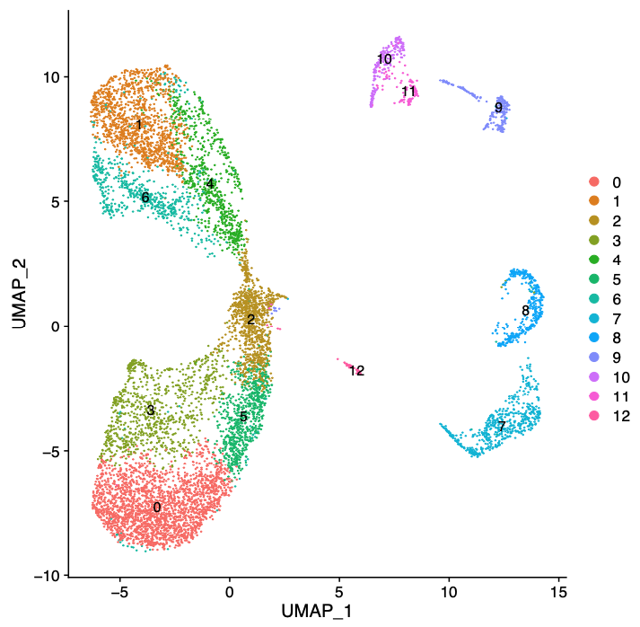
```

```{r before2, echo = FALSE, message=FALSE, fig.align='left', fig.cap='Uncorreted data. Top: UMAP clusters for MS21001. Bottom: expression profiles'}
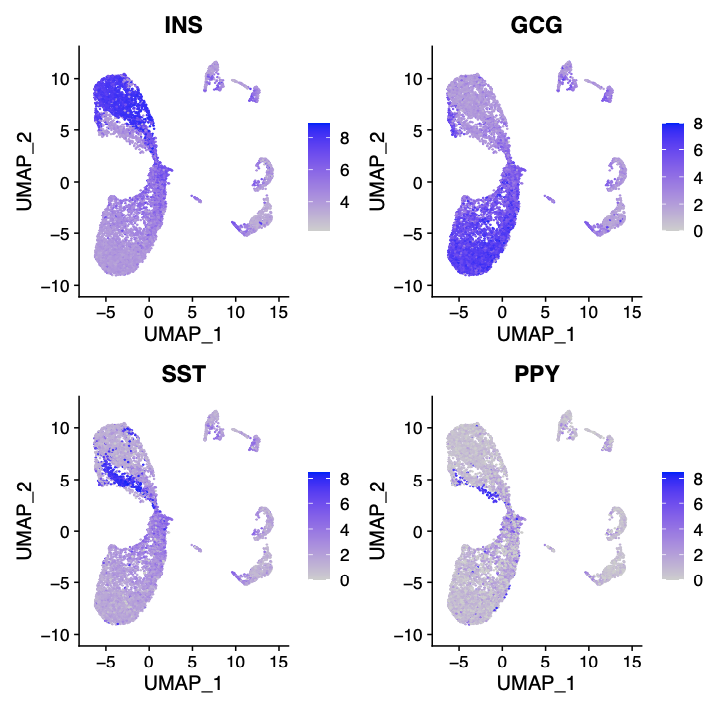
```

The four genes, INS, GCG, SST and PPY are markers of major endocrine cell types, namely Beta, Alpha, Delta and Gamma cells. We expect that they should highlight different locations of the UMAP.

```{r,SoupX.2,eval=FALSE}
# run SoupX
metadata <- toc@meta.data
metadata <- metadata %>% rownames_to_column("cell") %>% 
                         column_to_rownames("cell") %>% 
                         as.data.frame(stringsAsFactors = F)
p <- setNames(metadata$seurat_clusters, rownames(metadata))
sc = setClusters(sc, p)
sc = autoEstCont(sc)
head(sc$soupProfile[order(sc$soupProfile$est, decreasing = TRUE), ], n = 50)
out = adjustCounts(sc)

# create an updated Seurat object with the corrected data
toc2 <- CreateSeuratObject(out)
toc2 <- NormalizeData(toc2)
toc2 <- FindVariableFeatures(toc2, selection.method = "vst", nfeatures = 2000)
toc2 <- ScaleData(toc2)
toc2 <- RunPCA(toc2, features = VariableFeatures(object = toc2))
toc2 <- FindNeighbors(toc2, dims = 1:10)
toc2 <- FindClusters(toc2, resolution = 0.5)
toc2 <- RunUMAP(toc2, dims = 1:10)
writeRDS(toc2,"/path/to/MS21001/soupX_corrected_data.rds")

# plot the UMAP clusters of MS21001 (corrected data)
DimPlot(toc2, reduction= "umap", label = T)

# plot the expression of highly variable genes on the UMAP (corrected data)
FeaturePlot(toc2, features = c("INS", "GCG", "SST", "PPY"))

```

```{r after1, echo = FALSE, message=FALSE, fig.align='left', fig.cap=''}
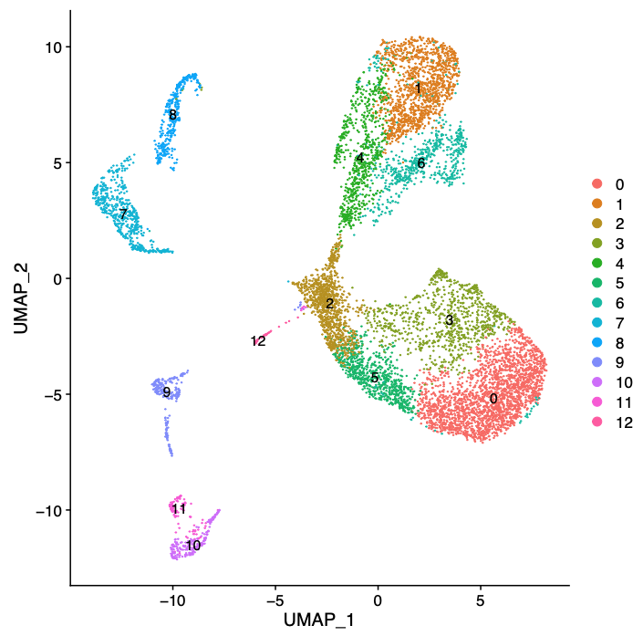
```

```{r after2, echo = FALSE, message=FALSE, fig.align='left', fig.cap='SoupX corrected data. Top: UMAP clusters for MS21001. Bottom: expression profiles'}
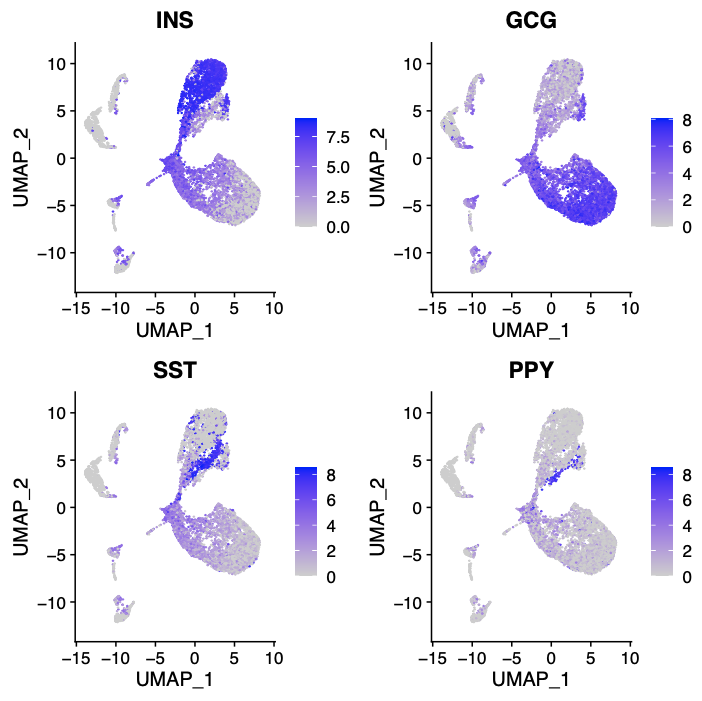
```

To see more clearly SoupX's correction, we visualized the expression profiles of a few highly variable genes (here INS and GCG). Evidently, substantial decontamination has taken place on the small clusters of the left side. Regarding the right side cluster, contaminating INS has been removed from the bottom part while contaminating GCG from the top part, leading to the conclusion that the top right side probably consists of Beta cells and the bottom right side of Alpha cells.

```{r,SoupX.3,eval=FALSE}
# decontamination visualization
# select INS and GCG genes
bef_gene1 <- FetchData(toc, "INS")
aft_gene1 <- FetchData(toc2, "INS")
bef_gene2 <- FetchData(toc, "GCG")
aft_gene2 <- FetchData(toc2, "GCG")

# calculate the uncorrected - corrected data
df1 <-merge(bef_gene1,aft_gene1,by='row.names',all=TRUE)
rownames(df1) <- df$Row.names
colnames(df1) <- c('Cell',"INS_uncorrected","INS_corrected")
df1["INS_diff"] <- (df1["INS_uncorrected"] - df1["INS_corrected"])
df2 <-merge(bef_gene2,aft_gene2,by='row.names',all=TRUE)
rownames(df2) <- df2$Row.names
colnames(df2) <- c('Cell',"GCG_uncorrected","GCG_corrected")
df2["GCG_diff"] <- (df2["GCG_uncorrected"] - df2["GCG_corrected"])
toc2@meta.data <- cbind(toc2@meta.data, INS_diff=df1$INS_diff,GCG_diff=df2$GCG_diff)

# plot the differences
FeaturePlot(toc2, features= "INS_diff", cols = c("red", "blue"))
FeaturePlot(toc2, features= "GCG_diff", cols = c("red", "blue"))
```

```{r diff, echo = FALSE, message=FALSE, fig.align='left', fig.cap='Expression differences: uncorrected - corrected. Left: INS. Right: GCG.'}
knitr::include_graphics("diff.png")
```

To see the contaminants in all cells simultaneously and the degree of decontamination at different expression levels, we generated an MA plot of all g = 1,...,36601 genes whose expression is depicted in our datasets. On the x-axis, we plotted for each gene *g* the $A_g=\frac{\sum_{j=1}^{J} [\bar U_g^{j} + \bar C_g^{j}]}{J}$ and on the y-axis the $M_g=\frac{\sum_{j=1}^{J} [\bar U_g^{j} - \bar C_g^{j}]}{J}$, where $\bar U_g^{j}$ is the average uncorrected raw count of gene *g* across all cells of library j and $\bar C_g^{j}$ is the average corrected raw count of gene *g* across all cells of library j. The two averages form the final average of averages (A) and average of differences (M) for plotting.     

```{r,allcontaminants,eval=FALSE}
# list all IDs
ss<-sort(c("MS17001","MS17005","MS18003","MS19001","MS19005","MS19009",
           "MS19013","MS19017","MS19021","MS19032","MS19038","MS20001",
           "MS20033","MS21001","MS17002","MS17006","MS18004","MS19002",
           "MS19006","MS19010","MS19014","MS19018","MS19022","MS19040",
           "MS20003","MS20086","MS21003","MS18001","MS17003","MS18005",
           "MS19003","MS19007","MS19011","MS19015","MS19019","MS19023",
           "MS19042","MS20005","MS20087","MS21009","MS17004","MS18002",
           "MS18006","MS19004","MS19008","MS19012","MS19016","MS19020",
           "MS19026","MS19035","MS19043","MS20017","MS20104"))

# Generate the MA data
diff<-ave<-matrix(0,36601,length(ss))
detunc<-detcor<-rep(0,length(ss))
for(i in 1:length(ss)){
    print(paste("Now processing sample ",ss[i],sep=""))
    unc <- Read10X(paste0("path/to/MS21011/filtered"))
    unc <- CreateSeuratObject(unc)
    detunc[i]<-mean(unc$nFeature_RNA)
    unc<-log2(unc@assays$RNA@counts+1)
    cor<-readRDS(paste0("path/to/MS21011/soupX_corrected_data.rds"))
    detcor[i]<-mean(cor$nFeature_RNA)
    cor<-log2(cor@assays$RNA@counts+1)
    diff1<-unc-cor
    diff[,i]<-rowMeans(diff1)
    ave1<-unc+cor
    ave[,i]<-rowMeans(ave1)
}
Diff<-data.frame(diff)
Ave<-data.frame(ave)
rownames(Diff)<-rownames(Ave)<-rownames(cor)
colnames(Diff)<-colnames(Ave)<-ss
M<-apply(Diff,1,mean)
A<-apply(Ave,1,mean)
MA<-data.frame(M=M,A=A)

# generate the average ranks
ran<-matrix(0,nrow(Diff),ncol(Diff))
for(i in 1:ncol(Diff)){
    ran[,i]<-rank(-as.numeric(as.character(Diff[,i])))
}
ran<-data.frame(ran)
colnames(ran)<-colnames(Diff)
rownames(ran)<-rownames(Diff)
ran<-apply(ran,1,mean)
MA<-cbind(MA,Rank=ran,
             Composite=apply(cbind(names(ran),round(as.numeric(as.character(ran)),3)),1,paste,collapse=": "))
```

Mouse over on the plot reveals the gene name and its average ranking $r_g$ in the contamination list, ie $r_g = \frac{\sum_{j=1}^{J} rank(M_g^j)}{J}$, where $M_g^j$ is the $\bar U_g^{j} - \bar C_g^{j}$ of library j.

```{r,allcontaminants.plot,eval=TRUE}
# read the pre-saved data
MA<-read.table("MA.txt",sep="\t")

# generate the plot
fig <- plot_ly(MA, x = ~A, y = ~M,text = ~Composite, textposition = 'middle right', 
               type="scatter",mode="markers") %>%
       layout(xaxis = list(title="A"),
              yaxis=list(title="M"))
fig

```

# 4. Donor deconvolution by Demuxlet

Genetic mutliplexing via modern barcoding technology improves the throughput of cells and genes detected in single-cell RNA RNA-seq studies. Various computational tools have thus been developed to harness natural genetic variation and determine the genetic (donor) identity of each droplet. Our dataset consists of 6 library pairs of V3 chemistry where two donors of different clinical / demographic backgrounds have been multiplexed (twice). 

1. MS19006 and MS19007: A 53 years old, white, non-diabetic female with 22.7 BMI (Islet 47) and 37 years old, hispanic, type 2 diabetic female with 33 BMI (Islet 48).

2. MS19016 and MS19017:  A 35 years old, white, non-diabetic female with 33.4 BMI (Islet 57) and 51 years old, hispanic, pre-diabetic male with 26.7 BMI (Islet 58).

3. MS19020 and MS19021:  A 48 years old, white, non-diabetic male with 38.8 BMI (Islet 59) and 58 years old, white, type 2 diabetic male with 32.5 BMI (Islet 60).

4. MS19034 and MS19035:  A 57 years old, white, pre-diabetic female with 32.9 BMI (Islet 70) and 63 years old, white, type 2 diabetic male with 31.7 BMI (Islet 71).

5. MS19042 and MS19043:  A 52 years old, hispanic, type 2 diabetic male with 24.7 BMI (Islet 84) and 58 years old, hispanic, pre-diabetic male with 26.6 BMI (Islet 85).

6. MS20086 and MS20087:  A 25 years old, white, pre-diabetic male with 31.6 BMI (Islet 118) and 62 years old, african american, type 2 diabetic female with 28.5 BMI (Islet 119).

To each of these 12 libraries, we run Demuxlet that considers he donor genetic variation to determine the genetic identity of each single cell in a droplet. In Demuxlet, a Bayesian mixture model evaluates the likelihood of observing RNA-seq reads overlapping a set of SNPs from each cell-containing droplet. A small number of reads overlapping common SNPs is sufficient to accurately demultiplex the data. Another feature of Demuxlet is the ability to identify and remove doublets, ie droplets with cells from two different individuals. In the data, such cases will show as cells with reads overlapping SNPs of more than one donor. 

To identify the SNPs of interest we utilized the respective donor genotyping information. The genotyped samples underwent quality control against the dbSNP database (<https://bravo.sph.umich.edu/freeze5/hg38/>) using the **HRC-1000G-check-bim** reference SNP check tool from <https://www.well.ox.ac.uk/~wrayner/tools/> to remove duplicate variants, mismatched variants, palindromic variants with frequency > 0.4 and to correct strand flips. Then, the chromosome-specific vcf files were generated, checked for errors and updated for use. 

This part of the analysis required the following software: *bcftools-1.11* and *htslib-1.14* (<https://samtools.github.io/bcftools/>), *plink* v1.90 (<https://www.cog-genomics.org/plink/>), *HRC-1000G-check-bim* Version 4.3.0 (<https://www.well.ox.ac.uk/~wrayner/tools/>) and *LiftoverVcf* (<https://gatk.broadinstitute.org/hc/en-us/articles/360037060932-LiftoverVcf-Picard->). The initial input is the map / ped files (stored in a separate folder) which carry the donor genotyping information. Using this input we generate the necessary bim and freq files **by chromosome** with plink and examine each of them for errors with *HRC-1000G-check-bim* using the reference file *PASS.Variantsbravo-dbsnp-all.tab* containing 170M variants on ~15k individuals (downloaded from <https://bravo.sph.umich.edu/freeze3a/hg19/>). The error-free, chromosome-specific vcf files are generated, concatenated (all chromosomes joined) and sorted with *bcftools*. In the final step, we liftOver the vcf to HG38 and obtain the estimates for the libraries of interest (the library ID infomation is contained at *Samples_filter.txt*). 

```{r,SNPqc,eval=FALSE}
# make bed / bim files
# folder: contains the map / ped files
#         also the output folder
plink --make-bed \
      --file path/to/folder/ \
      --out path/to/folder/    

# make the frq files
# folder: contains the map / ped and bim / bed files
#         also the output folder
plink --freq \
      --bfile /path/to/folder \
      --out /path/to/folder

# Check the bim and frq files and correct potential errors
# folder: contains the map / ped and bim / bed files
perl /path/to/HRC-1000G-check-bim-NoReadKey.pl \
      -b /path/to/folder/ \
      -f /path/to/folder/ \
      -r /path/to/PASS.Variantsbravo-dbsnp-all.tab \
      -h

# the above perl script generates the Run-plink.sh
# its execution corrects potential errors and generates vcf
sh /path/to/Run-plink.sh

# combining vcf and sort
bcftools concat path/to/vcf/folder/ \
                -o path/to/joined.vcf
bcftools sort path/to/joined.vcf \
              -m 30G \
              -o path/to/joined_and_sorted.vcf

# add chr prefix in front of chromosome number
awk '{if($0 !~ /^#/) print "chr"$0; else print $0}' \
      path/to/joined_and_sorted.vcf > path/to/joined_and_sorted_with_prefix.vcf

# liftover vcf from hg19 to hg38
java -jar /path/to/Programs/picard.jar LiftoverVcf \
      I=path/to/joined_and_sorted_with_prefix.vcf \
      O=path/to/joined_and_sorted_with_prefix_hg38.vcf \
      CHAIN=/path/to/hg19ToHg38.over.chain \
      REJECT=/path/to/rejected_variants.vcf \
      R=/path/to/hg38.fa

# filter to get the proper samples
bcftools view --threads 20 /path/to/joined_and_sorted_with_prefix_hg38.vcf
              -S Samples_filter.txt 
              -o /path/to/joined_and_sorted_with_prefix_hg38_filtered.vcf

# rename the VCF file sample names to match Islet Numbers
bcftools reheader /path/to/joined_and_sorted_with_prefix_hg38_filtered.vcf
                  -s Samples_reheader.txt 
                  -o /path/to/final.vcf 
```

The final.vcf contains all necessary SNP information by islet ID (the Islet numbers in parentheses at points 1-6 above):

```{r,vcf1,eval=TRUE}
# read the generated vcf file
vcf_file<-read.vcfR(paste(folder,"final.vcf",sep=""),verbose=F)
head(vcf_file)
```

We subset the *vcf_file* to analyze each islet pair separately and thus simplify the process. In the example below we extracted the information of Islet47 and Islet48 columns of the *vcf_file* and run Demuxlet on them to associate cell IDs (barcodes of the MS19006 bam file) to donor ID (Islet number of the vcf file):

```{r,vcf2,eval=FALSE}
# read the vcf file of Islets 47-48
vcf_file_islets47.48<-read.vcfR(paste(folder,"islet47_48.vcf",sep=""))

# run Demuxlet
./path/to/demuxlet --sam /path/to/MS19006.bam \
                   --vcf /path/to/islet47_48.vcf \
                   --field GT \
                   --out /path/to/MS19006/output
```

Demuxlet's output consists of a number of files that determine the association result in terms of a maximum likelihood test. We examined further the *.best* output files of each library that either associate each barcode to a single islet (singlets) or to multiple islets with high probability (doublets). The latter are dropped from further analysis (**Demuxlet doublets**).

```{r,vcf3,eval=TRUE}
# read the MS19006 file with the best estimates
# display the first 6 rows and 10 columns with the relevant info
best_MS19006<-fread(paste(folder,"MS19006.best",sep=""))
head(best_MS19006[,1:10])
```

On the above file, barcode *AAACCCAAGATGAATC-1* (1st row) is associated to both islets with high probability (see the maximum likelihood estimates of the last four columns) and thus is labelled as a *Demuxlet doublet*. On the other hand, barcodes *AAACCCATCCTCGATC-1* (3rd row) and *AAACGAAAGTGGATAT-1* (5th row) are respectively associated to Islets 48 and 47 with confidence. Similar analysis has been performed to the rest of the libraries of interest. 

### 4.1. Demuxlet doublet filtering

We integrated the *.best* information and the Seurat soupX adjusted objects of the previous section to filter out the Demuxlet doublets from further analysis. Here we use the variable *donor_chars* that carries the donor demographics / clinical information. For the multiplexed libraries, integration will split this information into the donor-specific data.

```{r,bestIntegration1,eval=TRUE}
# donor characteristics for 6 libraries
# rows 4-5 show the data of a multiplexed library pair
#     where the donor-specific data are separated by '_'
design<-read.table(paste(folder,"donor_chars.txt",sep=""),sep="\t",header=T)
design[c(1:3,18:20),]
```

```{r,bestIntegration2,eval=FALSE}
demux_folder<-"/path/to/Demuxlet/folder"
lf<-paste("/path/to/soupX/corrected/data/",design$LibraryID,sep="")

# will output the number of cells before and after Demuxlet
# useful in subsequent analysis
cells<-matrix(0,length(lf),3)
colnames(cells)<-c("LibraryID","STARsolo_cells","Demuxlet_singlets")

for(i in 1:length(lf)){
    
    # create new Seurat objects
    nn<-design$LibraryID[i]
    desi<-design[design$LibraryID==nn,]
    data<-readRDS(lf[i])
    data@meta.data<-data@meta.data[,1:3]
    data$orig.ident<-nn
    data<-PercentageFeatureSet(data, pattern = "MT-", col.name = "percent.mt")
    data@meta.data<-cbind(data@meta.data,desi[-1])
    
    # library ID and cells before Demuxlet integration
    cells[i,1]<-nn
    cells[i,2]<-ncol(data)
 
    
    # pick the multiplexed libraries
    g<-grep("_",desi$Chemistry)
    if(length(g)>0){
        ms<-matrix(unlist(apply(data@meta.data[1,5:12],2,strsplit,"_")),nrow=2)
        demux<-read.table(paste(demux_folder,"cr_",tolower(nn),"_demux.best",sep=""),sep="\t",header=T)
        demux$BARCODE<-t(matrix(unlist(strsplit(as.character(demux$BARCODE),"-")),nrow=2))[,1]
        ii<-intersect(as.character(rownames(data@meta.data)),as.character(demux$BARCODE))
        demux<-demux[match(ii,as.character(demux$BARCODE)),]
        data<-data[,match(ii,as.character(rownames(data@meta.data)))]
        data@meta.data<-cbind(data@meta.data,Demux=demux$BEST)
        ww<-which(data$Demux==paste("SNG-",ms[1,ncol(ms)],sep=""))
        for(j in 1:length(ww)){
            data@meta.data[ww[j],5:(ncol(data@meta.data)-1)]<-ms[1,]
        }
        ww<-which(data$Demux==paste("SNG-",ms[2,ncol(ms)],sep=""))
        for(j in 1:length(ww)){
            data@meta.data[ww[j],5:(ncol(data@meta.data)-1)]<-ms[2,]
        }
    
    # or keep the information of the non-multiplexed libraries
    } else {
        data$Demux<-paste("SNG-",data$IsletID,sep="")
    }
    
    # remove Demuxlet doublets and update
    ww<-grep("SNG-",data$Demux)
    data<-data[,ww]
    
    # cells after Demuxlet integration
    cells[i,3]<-ncol(data)
    
    saveRDS(data,paste("/path/to/Demuxlet/output/",design$LibraryID,sep=""))
}
write.table(cells,"/path/to/Demuxlet/output/CellNumbers.txt",
                  sep="\t",row.names=F,quote=F)
```

The above script generates (and stores in the last line) a new Seurat object for each library. For the multiplexed libraries, only the barcodes associated to a specific islet ID (Demuxlet signlets) are kept for further analysis. The islet information is kept on the *Demux* meta data column. Below we show the results of library MS19006. 

```{r,bestIntegration3,eval=TRUE}
x<-readRDS(paste(folder,"MS19006_DemuxSinglets.rds",sep=""))
head(x@meta.data)

# number of cells by donor
table(x$Demux)
```

We visualized the number of **Demuxlet doublets** as a function of the **library processing date** (date ordering: MS19006 / MS19007, MS19016 / MS19017, MS19020 / MS19021, MS19034 / MS19035, MS19042 / MS19043 and MS20086 / MS200087) and the number of **STARsolo identified cells** (after EmptyDrops_CR). The extracted data indicated a weak negative correlation between library processing date and the number of Demuxlet doublets (as if our data handling improved across time) and a weak positive correlation between the STARsolo identified cells and the number of Demuxlet doublets (as if STARsolo filtering affects the number of doublets).

```{r,bestIntegration4,eval=TRUE}
# loading of the CellNumbers data estimated above
cn<-read.table(paste(folder,"CellNumbers.txt",sep=""),sep="\t",header=T)

# adding the difference between STARsolo cells and Demuxlet singlets
cn$Doublets<-cn$STARsolo_cells - cn$Demuxlet_singlets

# check the numbers for some libraries:
# rows 1-3: non-multiplexed
# rows 4-5: multiplexed
cn[c(1:3,18:19),]

# extract the entries of all multiplexed libraries
cn1<-cn[c(18:19,
          28:29,
          32:33,
          38:39,
          42:43,
          49:50),]

# adding a date variable as defined above
cn1$Date<-rep(1:6,each=2)
cn1

# correlation of processing date vs doublets
cor.test(cn1$Date,cn1$Doublets)

# plot of processing date vs doublets
fig <- plot_ly(cn1, x = ~Date, y = ~Doublets,text = ~LibraryID, textposition = 'middle right', 
               type="scatter",mode="markers") %>%
       layout(xaxis = list(title="Processing Date"),
              yaxis=list(title="Filtered Out (Doublets)"))
fig

# correlation of STARsolo cells vs doublets
cor.test(cn1$STARsolo_cells,cn1$Doublets)

# plot of STARsolo cells vs doublets
fig <- plot_ly(cn1, x = ~STARsolo_cells, y = ~Doublets,text = ~LibraryID, textposition = 'middle right', 
               type="scatter",mode="markers") %>%
       layout(xaxis = list(title="STARsolo estimated cells"),
              yaxis=list(title="Filtered Out (Doublets)"))
fig
```

Finally, each of the demultiplexed libraries is split into two, each containing only the donor-specific data. We ended up with 66 libraries. We show the case of MS19006 below:

```{r,bestIntegration5,eval=TRUE}
# example of splitting MS19006 into:
#   MS19006_Islet47
#   MS19006_Islet48
x47<-x[,x$Demux=="SNG-Islet47"]
x48<-x[,x$Demux=="SNG-Islet48"]

# number of cells of each library after donor split
table(x47$Demux)
table(x48$Demux)
#saveRDS(x47,paste("/path/to/Demuxlet/output/MS19006_Islet47",sep=""))
#saveRDS(x48,paste("/path/to/Demuxlet/output/MS19006_Islet48",sep=""))
```

# 5. Doublet estimation

Doublets or multiplets arise when two or more cells are isolated in the same droplet, generating a hybrid transcriptome. Such events introduced a source of bias that, unless minimized / removed from the downstream analysis, can affect the data interpretation. In the previous section we saw how Demuxlet removed such doublets from each library separately. However, (1) the Demuxlet analysis will remove cells from different donors but not multiplets from the same donor and (2) the majority of our libraries was not processed with Demuxlet, thus possibly containing still a substantial number of multiplets.


### 5.1. Scrublet doublets

We used Scrublet (<https://github.com/swolock/scrublet>) to address the issue of removing the extra multiplets from each of our libraries. Briefly, Scrublet simulates doublets by randomly sampling and combining observed transcriptomes into cell clusters.  The local density of simulated doublets, as measured by a nearest neighbor graph, is used to calculate a doublet score for each observed transcriptome. Cells with high doublet scores are potential doublets and removed from further analysis.

As suggested by the developers, we *cleaned* the data of each library before applying Scrublet. In this premilinary QC step, we kept for further analysis only the cells with more than 500 expressed features (genes), more than 1000 UMIs and less than 50% reads mapped to the MT genome.

```{r,Scrublet1,eval=FALSE}
# list the names of all libraries
libs<-list.files("/path/to/Demuxlet/output/",pattern="MS",full.names=T)

# set the output file names
# libID<- < a vector of library IDs >

# work at each library individually
for(i in 1:length(libs)){
  dat<-readRDS(libs[i])
  
  # generate new seurat objects 
  # makes a difference for the demultiplexed data
  # change the variable name (dat -> x) because dat contains useful meta info
  x<-CreateSeuratObject(dat@assays$RNA@counts)
  x[["percent.mt"]] <- PercentageFeatureSet(x, pattern = "^MT-")
  
  # add the meta.data information from dat
  mm<-match(colnames(dat@meta.data),colnames(x@meta.data),nomatch=0)
  x@meta.data<-cbind(x@meta.data,
                    dat@meta.data[,which(mm==0)])

  x <- subset(x, subset = nFeature_RNA > 500 & nCount_RNA > 1000 & percent.mt < 50)
  
  # save the clean data in the 10x format
  # new LibraryID-specific folders are generated
  write10xCounts(paste("/path/to/Scrublet/folder/",libID[i],"/subfolder",sep=""), x@assays$RNA@counts, version="3")
  
  # save the clean Seurat .rds data of each library
  saveRDS(x,paste("/path/to/cleanQC1/output/folder/",libID[i],"_cleanQC1.rds",sep=""))
}
```

Scrublet was run in Python 3.6.15 on the 10x-formatted, unzipped data (barcodes.tsv, features.tsv and matrix.mtx) of each library. Below we present the example of library MS19001 (Chemistry: V3, Disease state: ND, Sex: Male, Race: White, BMI: 27.2, Age: 66). 

```{r,Scrublet2,eval=FALSE}
import scrublet as scr
import scipy.io
import matplotlib.pyplot as plt
import numpy as np
import os

input_dir = "/path/to/Scrublet/folder/MS19001/subfolder"
counts_matrix = scipy.io.mmread(input_dir + 'matrix.mtx').T.tocsc()
genes = np.array(scr.load_genes(input_dir + 'features.tsv', delimiter='\t', column=1))

scrub = scr.Scrublet(counts_matrix, expected_doublet_rate=0.1)
doublet_scores, predicted_doublets = scrub.scrub_doublets(min_counts=2,
min_cells=3,
min_gene_variability_pctl=85,
n_prin_comps=30)

## Preprocessing...
## Simulating doublets...
## Embedding transcriptomes using PCA...
## Calculating doublet scores...
## Automatically set threshold at doublet score = 0.36
## Detected doublet rate = 3.4%
## Estimated detectable doublet fraction = 38.8%
## Overall doublet rate:
##	Expected   = 10.0%
## 	Estimated  = 8.8%
## Elapsed time: 13.5 seconds

scrub.plot_histogram();
plt.savefig('/path/to/Scrublet/folder/MS19001/subfolder/doublet.png')
```

The last line stores the doublet score histogram for the observed transcriptomes and simulated doublets. To call (neotypic) doublets vs singlets, we inspect the latter panel which is typically bimodal. Scrublet automatically sets a thresold at the minimum between the two modes of the simulated doublet histogram and calls as doublets all cells of the observed transcriptome that exceed this score (here threshold = 0.36).

```{r scrublet3, echo = FALSE, message=FALSE, fig.align='left', fig.cap='Scrublet doublet score histogram: Left: Observed transriptome. Right: Simulated doublets.'}
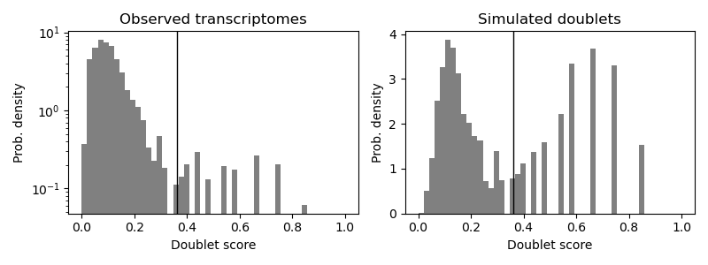
```

In practice, we checked the histograms of all libraries and set a global threshold = 0.25. This value is less conservative in doublet detection and fits better our data in overall.

```{r,Scrublet4,eval=FALSE}
repredicted_doublets=scrub.call_doublets(threshold=0.25)
## Detected doublet rate = 6.1%
## Estimated detectable doublet fraction = 47.3%
## Overall doublet rate:
## 	Expected   = 10.0%
##	Estimated  = 12.9%

scrub.plot_histogram();
plt.savefig('/path/to/Scrublet/folder/MS19001/subfolder/redoublet.png')
```

```{r scrublet5, echo = FALSE, message=FALSE, fig.align='left', fig.cap='Scrublet doublet score histogram after threshold adjustment to 0.25: Left: Observed transriptome. Right: Simulated doublets.'}
knitr::include_graphics("redoublet.png")
```

In Python, we store the doublets scores and predictions in .txt files for integration with the clean Seurat data. 

```{r,Scrublet6,eval=FALSE}
a_file = open('/path/to/Scrublet/folder/MS19001/subfolder/doublet_scores_MS19001.txt', "w")
np.savetxt(a_file, doublet_scores)
a_file.close()

b_file = open('/path/to/Scrublet/folder/MS19001/subfolder/doublet_predictions_MS19001.txt', "w")
np.savetxt(b_file, repredicted_doublets)
b_file.close()
```

Going back to R, we integrate the each library's doublet scores and predictions with the clean Seurat data. Using again MS19001 as an example, we show Scrublet's 294 doublets associated with higher scores:

```{r,Scrublet7,eval=TRUE}
# load the pre-saved data 
scrub19001<-readRDS(paste(folder,"MS19001_cleanQC1.rds",sep=""))
scr_doublet<-scan(paste(folder,"doublet_predictions_MS19001.txt",sep=""))
scr_score<-scan(paste(folder,"doublet_scores_MS19001.txt",sep=""))
scrub19001@meta.data<-cbind(scrub19001@meta.data,
                            scr_doublet=ifelse(scr_doublet==0,"Singlet","Doublet"),
                            scr_score=scr_score)

# doublets and singlets
table(scrub19001$scr_doublet)

# score quantiles by category
aggregate(scrub19001$scr_score,list(scrub19001$scr_doublet),quantile)
```

Similar results are obtained for all other libraries:

```{r,Scrublet8,eval=TRUE}
# read the predictions per cell and library ID
all.scrub<-read.table(paste(folder,"AllScrublet.txt",sep=""),sep="\t",header=T)

# make the summary table
tab<-table(all.scrub$LibraryID,all.scrub$predicted_doublet)
tab<-data.frame(cbind(LibraryID=rownames(tab),
                      Singlet=paste("Singlets: ",tab[,2],sep=""),
                      Doublet=paste("Doublets: ",tab[,1],sep=""),
                      Ratio=tab[,1]/apply(tab,1,sum)))
tab$Ratio<-round(as.numeric(as.character(tab$Ratio)),3)
tab$Composite<-apply(tab[,2:3],1,paste,collapse=", ")


# plot
fig <- plot_ly(tab, x = ~LibraryID, y = ~Ratio, type = 'bar',colors = "Set2",
       text = ~Composite, textposition = 'middle right') %>%
       layout(xaxis = list(tickfont = list(size = 5)),yaxis=list(title="Scrublet doublet ratio"))
fig

```


### 5.2. DoubletFinder doublets

DoubletFinder (<https://github.com/chris-mcginnis-ucsf/DoubletFinder>) works similar to Scrublet. The function expects a set of normalized and clustered data. We do this in Seurat using 10 PCs and Leuven clustering with resolution 0.5. Using this information, DoubletFinder generates artificial doublets from the single-cell RNA-seq data. The number of the generated artificial doublets is a user-controlled parameter $p_N$. The real and the simulated data are merged and fed into a PCA model that uses the principal components distance matrix to find each cell's proportion of artificial k nearest neighbors of a user-defined neighborhood size $p_K$ expressed as a proportion of the merged real-artificial data. For each library separately, we used $p_N=0.25$ (default), $p_K=0.09$ and the first 10 principal components to estimate the DoubletFinder doublets. The script was executed in R. Below we see the example of MS19001 analyzed above for Scrublet: 

```{r,df1,eval=TRUE}
# read the clean Seurat data of the previous step
df19001<-readRDS(paste(folder,"MS19001_cleanQC1.rds",sep=""))
df19001[["percent.mt"]] <- PercentageFeatureSet(df19001, pattern = "^MT-")

# run the 
df19001 <- NormalizeData(df19001)
df19001 <- FindVariableFeatures(df19001, selection.method = "vst", nfeatures = 2000)
df19001 <- ScaleData(df19001)
df19001 <- RunPCA(df19001, features = VariableFeatures(object = df19001))
df19001 <- RunUMAP(df19001, dims = 1:10)
df19001 <- FindNeighbors(df19001, dims = 1:10)
df19001 <- FindClusters(df19001, resolution = 0.5)

# run DoubletFinder with expected doublet ratio = 0.1 
nExp_poi <- round(0.1*nrow(df19001@meta.data))
df19001 <- doubletFinder_v3(df19001, PCs = 1:10, 
                            pN = 0.25, pK = 0.09, 
                            nExp = nExp_poi, 
                            reuse.pANN = FALSE, 
                            sct = FALSE)

# rename the meta data column having the doublet info
colnames(df19001@meta.data)[ncol(df19001@meta.data)] <- "DF_doublet"
```

Summarizing for all libraries, we observe that DoubletFinder reports exactly 10% of the cells as doublets (the pre-defined doublet ratio):

```{r,df2,eval=TRUE}
all.df<-read.table(paste(folder,"AllDF.txt",sep=""),sep="\t",header=T)

# make the summary table
tab<-table(all.df$LibraryID,all.df$predicted_doublet)
tab<-data.frame(cbind(LibraryID=rownames(tab),
                      Singlet=paste("Singlets: ",tab[,2],sep=""),
                      Doublet=paste("Doublets: ",tab[,1],sep=""),
                      Ratio=tab[,1]/apply(tab,1,sum)))
tab$Ratio<-round(as.numeric(as.character(tab$Ratio)),3)
tab$Composite<-apply(tab[,2:3],1,paste,collapse=", ")


# plot
fig <- plot_ly(tab, x = ~LibraryID, y = ~Ratio, type = 'bar',colors = "Set2",
       text = ~Composite, textposition = 'middle right') %>%
       layout(xaxis = list(tickfont = list(size = 5)),yaxis=list(title="DF doublet ratio"))
fig
```

### 5.3. Preliminary doublet filtering

At this point of the analysis, we merge the Scrublet and DoubletFinder estimates of each library. In terms of MS19001, the merging has the form:

```{r,scrubletDF1,eval=TRUE}
# first make sure that we merge identical barcodes
identical(rownames(df19001@meta.data),
          rownames(scrub19001@meta.data))

# then merge the DF estimates into Scrublet and add a 'Common_doublet' column
scrub19001@meta.data<-cbind(scrub19001@meta.data,df_doublet=df19001$DF_doublet)
scrub19001@meta.data<-cbind(scrub19001@meta.data,
                            Common_doublet=ifelse(scrub19001$scr_doublet=="Doublet" & 
                                                   scrub19001$df_doublet=="Doublet",
                                                   "Doublet","Singlet"))
head(scrub19001@meta.data)

# number of Scrublet doublets 
table(scrub19001$scr_doublet)

# number of DoubletFinder doublets 
table(scrub19001$df_doublet)

# number of common doublets 
table(scrub19001$Common_doublet)
```

Detailed analysis shows that, in contrast to Scrublet's, DoubletFinder's doublets are often concentrated in particular cell types thus biasing the analysis (if removed blindly). A particular example is this of MS19015 for which we run Scrublet and DoubletFinder as above, plotted the doublets on the UMAP and pre-annotated the clusters with a set of well-known endocrine and exocrine markers that we will discuss in a subsequent paragraph:

```{r,scrubletDF2,eval=FALSE}
# read the pre-saved MS19015 results
scrub19015<-readRDS("/path/to/Scrublet/and/DF/estimates/of/MS19015.rds")

# plot the doublets
DimPlot(scrub19015,group.by="scr_doublet")
DimPlot(scrub19015,group.by="df_doublet")
DimPlot(scrub19015,group.by="Common_doublet")
```

In this particular and indicative example, DoubletFinder doubelts are enriched in $COL1A1^+$ (Stellate cells) an $PECAM1^+$ (Endothelial cells) clusters which is not observed in Scrublet. Several such cases can be found in our data.

```{r scrubletDF3, echo = FALSE, message=FALSE, fig.align='left', fig.cap='Doublets for MS19015 (editted plots). Left: Scrublet doublets. Middle: DoubletFinder doublets. Right: Common doublets.'}
knitr::include_graphics("ScrubletDF1.png")
```

At this point of the analysis, we merge the Scrublet and DoubletFinder estimates of each library and remove only the common doublets:

```{r,scrubletDF4,eval=TRUE}
all.doub<-read.table(paste(folder,"CommonDoublets.txt",sep=""),sep="\t",header=T)

# make the summary table
tab<-table(all.doub$LibraryID,all.doub$Common_doublet)
tab<-data.frame(cbind(LibraryID=rownames(tab),
                      Singlet=paste("Singlets: ",tab[,2],sep=""),
                      Doublet=paste("Doublets: ",tab[,1],sep=""),
                      Ratio=tab[,1]/apply(tab,1,sum)))
tab$Ratio<-round(as.numeric(as.character(tab$Ratio)),3)
tab$Composite<-apply(tab[,2:3],1,paste,collapse=", ")


# plot
fig <- plot_ly(tab, x = ~LibraryID, y = ~Ratio, type = 'bar',colors = "Set2",
       text = ~Composite, textposition = 'middle right') %>%
       layout(xaxis = list(tickfont = list(size = 5)),yaxis=list(title="Common doublet ratio"))
fig
```

This preliminary filtering step removes the high-confidence hits that, as our analysis shows, do not show a 'preference' towards a particular cell type. Subsequently, the unique DoubletFinder doublet information is removed from the analysis while we keep the Scrublet information to use it after data integration and examine the existence of doublet-enriched clusters. In the case of MS19001:  

```{r,scrubletDF5,eval=FALSE}

# finally remove the common doublets and the 
scrub19001<-subset(scrub19001, subset = Common_doublet == 'Singlet')

# remove the DF and Common doublet information
scrub19001@meta.data<-scrub19001@meta.data[,1:(ncol(scrub19001@meta.data)-2)]

# store the data
saveRDS(scrub19001,"path/to/clean/and/Scrub/folder/MS19001.rds")
```

Similar Seurat objects are stored for the other libraries.

# 6. Identification and filtering of low-quality cells

We implement a multi-step quality control procedure to filter out the low quality cells from further analysis. For each library,  first we run data normalization and scaling, we reduce the dimensionality and cluster the cells. We check the distribution of the number of features (nFEA), number of UMIs (nUMI) and the percentage of MT reads (pMT) for each cluster in order to find appropriate cut-offs that mark the low-quality cells. To define these cut-offs and avoid over-filtering, we integrate marker information and pre-annotate the clusters, considering that the number of features, UMIs and MT percentages may vary substantially across endocrine and exocrine cells.    

### 6.1. Dimensionality reduction and clustering

The normalization, dimensionality reduction and clustering was done as described in the *soupX* section previously. Briefly, the normalized and scaled data of the top 2000 variable genes were fed into the PCA and UMAP models. The cells are clustered on the UMAP with the Leuven algorithm. We start from the Seurat objects containing the cleanest data up to this point, i.e. the cells with nFEA>500, nUMI>1000 and pMT<50% with the Scrublet and DoubletFinder common doublets removed.

```{r,mainqc1,eval=FALSE}
# list the files of interest
input_folder<-"path/to/clean/and/Scrub/folder"
lf<-list.files(input_folder)

# set the library IDs used in the output 
# libID<- < a vector of library IDs >

# for each rds file...
for(i in 1:length(lf)){
  
    # read the data and keep the relevant meta.data
    x<-readRDS(paste(input_folder,lf[i],sep=""))
    meta<-x@meta.data[,c(1,6:13)]
    
    # start a new Seurat object and slightly modify
    obj<-CreateSeuratObject(counts = x@assays$RNA@counts,min.cells=1,min.features=1)
    obj<-PercentageFeatureSet(obj, pattern = "MT-", col.name = "percent.mt")
    mm<-match(rownames(obj@meta.data),rownames(meta),nomatch=0)
    meta<-meta[mm,]
    obj$orig.ident<-libID[i]
    obj@meta.data<-cbind(obj@meta.data,meta[,-1])
    
    # run the normalization -> clustering pipeline
    # and do the plots
    obj<-Seurat_preliminaryQC(obj=obj,sampleID=libID[i],
                              outdir="path/to/plots/output/folder",
                              feature.cut=c(seq(400,3000,200),10000),
                              count.cut=c(seq(600,3000,200),4000,5000,100000),
                              mt.cut=seq(15,45,5),mt.pattern="MT-",
                              hb.cut=NULL,
                              genes2show=c("INS","GCG","PPY","SST","GHRL",
                                           "KRT19","REG1B","COL1A1","FABP4","PLVAP",
                                           "CRYAB","APOE","TPSB2","TOP2A"),
                              dims=50,resolution=0.8)[[1]]
}
```

Here, our function *Seurat_preliminaryQC()* summarizes the dimensionality reduction and clustering pipeline discussed above. It creates a new Seurat object for each library *i* with all relevant information and generates a series of QC plots for inspection. Among the various parameters, the most useful are:

1. feature.cut: will display all supplied cut-offs on the feature plot.

2. count.cut: will display all supplied cut-offs on the UMI plot.

3. mt.cut: will display all supplied cut-offs on the MT plot.

4. genes2show: will show one UMAP per gene with the expression gradient. The above script shows a subset of well-known endocrine and exocrine markers that we checked. Specifically: INS (Beta), GCG (Alpha), PPY (Gamma), SST (Delta), GHRL (Epsilon), KRT19 (Ductal), REG1B (Acinar), COL1A1 (Stellate), FABP4 (Activated Stellate), PLVAP (Endothelial), NGFR (Schwann), C1QC (Immune), TPSB2 (Mast) and TOP2A (proliferating cells). 

5. dims: defines how many dimensions to use for the construction of the UMAP.

6. resolution: defines the clustering resolution.

### 6.2. Filtering out of low-quality cells

We show how we filtered low-quality cells by referring to specific examples covering different chemistries and donor backgrounds. First we examine the quality control of **MS18001** (Chemistry: V2, Disease state: ND, Sex: Male, Race: Hispanic, BMI: 25.3, Age: 40).

```{r qc1_MS18001, echo = FALSE, message=FALSE, fig.align='left', fig.cap='QC for low-quality cells of MS18001. Top/left: UMAP clustering. Top/right: log nFEA by cluster. Bottom/left: log nUMI by cluster. Bottom/right: pMT by cluster.'}
knitr::include_graphics("qc1_MS18001.png")
```

MS18001 data are separated in 21 clusters whose distribution of nFEA, nUMI and pMT vary markedly. At first inspection, clusters 16 and 19 and 20 are suspicious and attempt to characterize them in terms of marker expression. We find that the only informative markers are INS and GCG whose expression is plotted below:

```{r qc2_MS18001, echo = FALSE, message=FALSE, fig.align='left', fig.cap='Marker expression of MS18001. Left: INS (Beta cells). Right: GCG (Alpha cells).'}
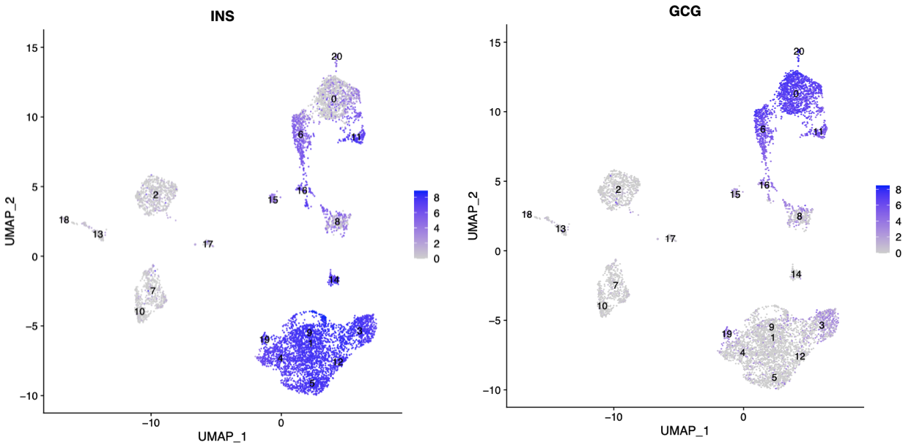
```

Taken together, the above plots show us that cluster 16 is close to the GCG cluster and it expresses comparable amounts of INS and GCG. Compared to other INS and GCG clusters (e.g. 9 and 0), it exhibits low nFEA and nUMI but relatively high pMT. Similar observations are made for clusters 19 and 20. Both are close to INS and GCG clusters respectively with distributions of nFEA and nUMI that differ from the rest of the cells of seemingly same type. The combination  of low pMT and low nUMI could also be the result of RNA degradation. We remove such clusters from further analysis.

Cluster 6 expressing both GCG and INS, and having low nFEA and nUMI is also suspicious. However, they also exhibit long right tails (high end of the nFEA and nUMI distribution) which might be an indication of high-quality cells mixed there. We do not remove such clusters completely but rather heavily filter their cells with our chosen cutoffs.

Next example is that of **MS19015** (Chemistry: V3, Disease state: PD, Sex: Male, Race: Hispanic, BMI: 26.7, Age: 51). Of the 26 identified clusters, cluster 21 and 24 are the most suspicious for complete removal with both nFEA and nUMI being relatively low. 

```{r qc1_MS19015, echo = FALSE, message=FALSE, fig.align='left', fig.cap='QC for low-quality cells of MS19015. Top/left: UMAP clustering. Top/right: log nFEA by cluster. Bottom/left: log nUMI by cluster. Bottom/right: pMT by cluster.'}
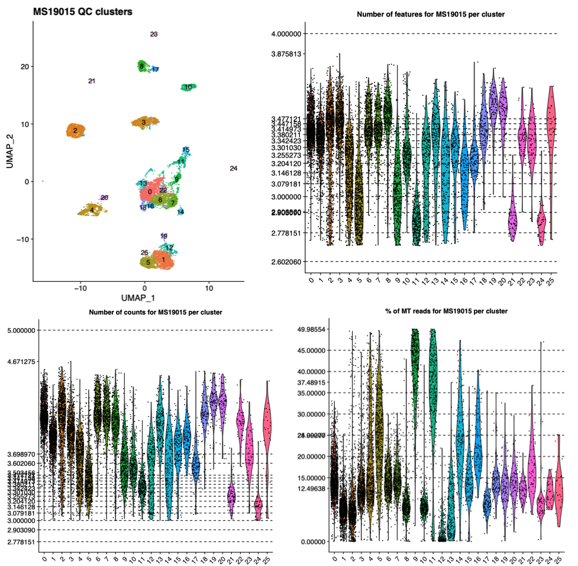
```

Cluster 21 does not express any of the markers we examined and it is removed from the analysis. Cluster 24 expresses uniquely TPSB2 that marks Mast cells and it is kept in the analysis. Clusters 9 and 11 are close to the INS cluster and express both INS and GCG that are the major RNA contaminants of our study. Their pMT heavy right tails could also highlight the presence of apoptotic cells. Alpha and Beta cells have been associated to higher pMT rates in the literature. In addition these clusters may also contain high-quality cells. For these reasons we do not remove such clusters completely but rather heavily filter their cells with our chosen cutoffs.      

```{r qc2_MS19015, echo = FALSE, message=FALSE, fig.align='left', fig.cap='Marker expression of MS19015. Top/left: INS (Beta cells). Top/right: GCG (Alpha cells). Bottom/left: PPY (Gamma cells). Bottom/right: TPSB2 (Mast cells).'}
knitr::include_graphics("qc2_MS19015.png")
```

The last example discusses the case of **MS19035_Islet71** that has been demultiplexed (Chemistry: V3, Disease state: T2D, Sex: Male, Race: White, BMI: 31.7, Age: 63). We show it because the filtering was resolved with subclustering.

```{r qc1_MS19035_Islet71, echo = FALSE, message=FALSE, fig.align='left', fig.cap='QC for low-quality cells of MS19035_Islet71. Top/left: UMAP clustering. Top/right: log nFEA by cluster. Bottom/left: log nUMI by cluster. Bottom/right: pMT by cluster.'}
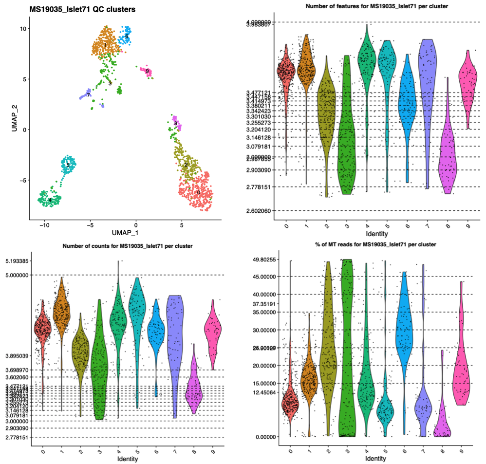
```

Clusters 3 and 8 contain several potential low-quality cells as shown by the nFEA and nUMI distributions. Both of them are located between the INS and GCG clusters and express both markers. Possibly the most important feature of the marker plots is the expression profile of cluster 7. Before filtering we split it into 7_1 (expressing COL1A1) and 7_2 (expressing PLVAP). 

```{r qc2_MS19035_Islet71, echo = FALSE, message=FALSE, fig.align='left', fig.cap='Marker expression of MS19035_Islet71. Top/left: INS (Beta cells). Top/right: GCG (Alpha cells). Bottom/left: COL1A1 (Stellate cells). Bottom/right: PLVAP (Endothelial cells).'}
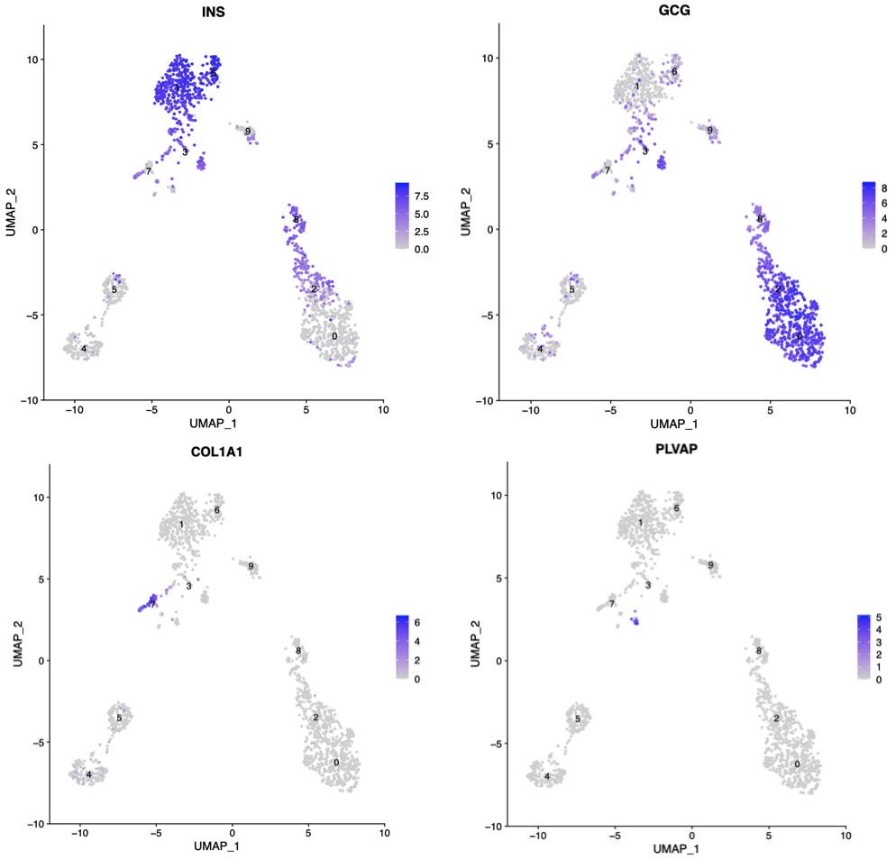
```

None of the clusters of MS19035_Islet71 were completely removed from the analysis.   

### 6.3. Setting global cutoffs for low-quality cell filtering and data cleaning with nFEA

We inspected the nFEA, nUMI and pMT plots of all libraries and observed that we could roughly separate the high-quality from the low-quality cells at nFEA = 1400 ($\log nFEA \approx 3.14$). This cutoff was often located near the high end of the low-quality cells (as discussed above) and near the low end of clusters with mostly high-quality cells. As an indicative example, see the case of MS18001 (low-quality clusters: 16, 19, 20; high-quality clusters: 0-2, 5, 10-13).   

As discussed there were two filtering strategies applied: (1) whole cluster filtering that removes whole low-quality clusters and (2) cell filtering that removes low-quality cells at nFEA cutoff = 1400 unless these cells belong to a cluster of a specific cell type with left-shifted nFEA distribution as is the case of TPSB2 cells. In such cases, we found that the most appropriate global cutoff was at nFEA = 1000 ($\log nFEA =3$). 


### 6.4. Inspection of the pMT distribution across libraries and markers and data cleaning with pMT

After features-based cell filtering, we examine whether certain cell types and, more importantly, disease states (ND, PD, T2D) exhibit higher pMT rates than others. We concatenated all estimated, pre-annotated clusters (the marker analysis discussed above) across all libraries and plotted different quantiles of their pMT distribution.

```{r,mt1,eval=FALSE}
input_folder<-"path/to/nFEA/cleaned/data"
lf<-list.files(input_folder)

# define the cell type markers
markers<-c("INS","GCG","PPY","SST","GHRL",
           "KRT19","REG1B","COL1A1","FABP4",
           "PLVAP","CRYAB","APOE","TPSB2","TOP2A")

# define the output variable
# the columns will store the pMT quantile values
resultMT<-matrix(0,1,22)

for(i in 1:length(lf)){
    
    x<-readRDS(paste(input_folder,lf[i],sep=""))
    aa<-matrix(0,(max(as.numeric(as.character(x$seurat_clusters)))+1),(length(markers)+1))
    aa[,1]<-0:max(as.numeric(as.character(x$seurat_clusters)))
    for(j in 1:length(markers)){
        mm<-match(markers[j],rownames(x@assays$RNA@data),nomatch=0)
        if(mm>0){
            dat<-log(as.numeric(as.character(x@assays$RNA@data[mm,]))+1,2)
            aa[,(j+1)]<-as.numeric(as.character(aggregate(dat,list(x$seurat_clusters),mean)[,2]))
        }
    }
    bb<-matrix(0,nrow(aa),4)
    bb[,1]<-x$Condition[1]
    bb[,2]<-id[i]
    bb[,3]<-paste("C",aa[,1],sep="")
    for(j in 1:nrow(aa)){
        cl<-aa[j,1]
        nn<-markers
        dat<-aa[j,-1]
        sl<-sort.list(dat,decreasing=T)
        dat<-dat[sl[1:2]]
        nn<-nn[sl[1:2]]
        bb[j,4]<-paste(paste(nn,round(dat,1),sep=":"),collapse="|")
    }
    bb<-apply(bb,1,paste,collapse=";")
    
    x$ClusterType<-NA
    for(j in 1:length(bb)){
        x$ClusterType[x$seurat_clusters==(j-1)]<-bb[j]
    }
    res<-as.matrix(aggregate(x$percent.mt,list(x$ClusterType),quantile,seq(0,1,0.05)))
    resultMT<-rbind(resultMT,res)
    
}
resultMT<-resultMT[-1,]
resultMT<-data.frame(resultMT)
lab<-lab[,c(1,4)]
lab<-cbind(lab,t(matrix(unlist(strsplit(lab[,2],":")),nrow=3)))
lab<-lab[,1:3]
resultMT<-cbind(lab,resultMT[,-1])
colnames(resultMT)<-c("Disease_State","Top2Markers:average_expression","TopMarker",paste("q",seq(0,100,5),sep=""))
```

The above script will show the pMT quantiles estimated from the pMT of the cells of each cluster of each library. However, extra manual work is required to show the correct pre-annotation (we automatically pre-annotate based on the most expressed marker but due to differences in the expression ranges and the ambient RNA it might not be always accurate). For illustration reasons, we present here only the most prevalent cell types: Alpha, Beta, Gamma, Delta, Ductal, Acinar, Endothelial, Stellate/Activated Stellate and Immune. Note that this pre-annotation gives a rough picture of the cell types by library. The cell types represented by relatively few cells (e.g. gamma, epsilon, endothelial, immune, mast cells etc) may not be well-separated in the library-specific analysis (and thus under-represented here). We will will see later they will be clearly stand out after data integration. 

```{r,mt2,eval=TRUE}
# read the pre-saved MT quantiles with accurate annotation
x<-read.table(paste(folder,"MTdata.txt",sep=""),sep="\t",header=T)

# fix some extra information to show at the plot
cols<-c(rep("#C6D57E",370),rep("#D57E7E",279),rep("#A2CDCD",336))
y<-x[,3]
pp<-y[-1]==y
pp<-cbind(as.character(y),pp,1:length(pp))
pp<-pp[pp[,2]=="FALSE",]
med<-c(0,as.numeric(pp[,3]))
for(i in 2:length(med)){
    med[(i-1)]<-median(med[(i-1)]:med[i])
}
pp<-cbind(pp,med[-length(med)])

# show some quantiles
#   column 14: median pMT
#   column 19: 75th quantile of pMT
#   column 22: 90th quantile of pMT
columns<-c(14,19,22)

for(i in 1:length(columns)){
    plot(x[,columns[i]],pch=20,col=cols,cex=0.5,xlab="Number of clusters",
         ylab=paste("% MT (",colnames(x)[columns[i]],")",sep=""),ylim=c(0,50),xlim=c(0,1100))
         legend("topright",inset=0.01,c("ND","PD","T2D"),pch=20,col=c("#C6D57E","#D57E7E","#A2CDCD"),cex=0.5)
         abline(v=as.numeric(pp[,3]),lwd=0.5,lty=2)
         axis(3,at=as.numeric(pp[,4]), labels=pp[,1],las=2,cex.axis=0.5)
}

```

Each point of the plots represents a cluster of a library (not specified here) pre-annotated as shown on the top axis. Visually, the pMT's differ substantially across cell types with Alpha and Beta cells exhibiting greater rates. Analysis of Variance and Tukey's test support this claim, especially for Beta cells (Bonferonni cutoff at 5%). Our *tukey_fun()* function below runs exactly this.

```{r,mt3,eval=TRUE}
# Tukey test: median(pMT)~Cell_Type in ND
tukey_fun(data=x,quantile="q50",fit="~Cell_Type",pcut=0.05,disease_state="ND")

# Tukey test: median(pMT)~Cell_Type in PD
tukey_fun(data=x,quantile="q50",fit="~Cell_Type",pcut=0.05,disease_state="PD")

# Tukey test: median(pMT)~Cell_Type in T2D
tukey_fun(data=x,quantile="q50",fit="~Cell_Type",pcut=0.05,disease_state="T2D")

# Tukey test: q90(pMT)~Cell_Type in ND
tukey_fun(data=x,quantile="q90",fit="~Cell_Type",pcut=0.05,disease_state="ND")

# Tukey test: q90(pMT)~Cell_Type in PD
tukey_fun(data=x,quantile="q90",fit="~Cell_Type",pcut=0.05,disease_state="PD")

# Tukey test: q90(pMT)~Cell_Type in T2D
tukey_fun(data=x,quantile="q90",fit="~Cell_Type",pcut=0.05,disease_state="T2D")
```

We check if there are differences across the disease states for the same cell types. Alpha, Beta, Gamma, Delta, Ductal and Acinar are identified everywhere in sufficient sizes. In general, the analysis showed no significant differences. There is no pattern that emerges across these cell types.  

```{r,mt4,eval=TRUE}
# Tukey test: median(pMT)~Disease_State in Beta
tukey_fun(data=x,quantile="q50",fit="~Disease_State",pcut=0.05,cell_type="Beta")

# Tukey test: median(pMT)~Disease_State in Alpha
tukey_fun(data=x,quantile="q50",fit="~Disease_State",pcut=0.05,cell_type="Alpha")

# Tukey test: median(pMT)~Disease_State in Gamma
tukey_fun(data=x,quantile="q50",fit="~Disease_State",pcut=0.05,cell_type="Gamma")

# Tukey test: median(pMT)~Disease_State in Delta
tukey_fun(data=x,quantile="q50",fit="~Disease_State",pcut=0.05,cell_type="Delta")

# Tukey test: median(pMT)~Disease_State in Ductal
tukey_fun(data=x,quantile="q50",fit="~Disease_State",pcut=0.05,cell_type="Ductal")

# Tukey test: median(pMT)~Disease_State in Acinar
tukey_fun(data=x,quantile="q50",fit="~Disease_State",pcut=0.05,cell_type="Acinar")

# Tukey test: q90(pMT)~Disease_State in Beta
tukey_fun(data=x,quantile="q90",fit="~Disease_State",pcut=0.05,cell_type="Beta")

# Tukey test: q90(pMT)~Disease_State in Alpha
tukey_fun(data=x,quantile="q90",fit="~Disease_State",pcut=0.05,cell_type="Alpha")

# Tukey test: q90(pMT)~Disease_State in Gamma
tukey_fun(data=x,quantile="q90",fit="~Disease_State",pcut=0.05,cell_type="Gamma")

# Tukey test: q90(pMT)~Disease_State in Delta
tukey_fun(data=x,quantile="q90",fit="~Disease_State",pcut=0.05,cell_type="Delta")

# Tukey test: q90(pMT)~Disease_State in Ductal
tukey_fun(data=x,quantile="q90",fit="~Disease_State",pcut=0.05,cell_type="Ductal")

# Tukey test: q90(pMT)~Disease_State in Acinar
tukey_fun(data=x,quantile="q90",fit="~Disease_State",pcut=0.05,cell_type="Acinar")
```

Inspecting the above pMT plots, we set a global pMT cutoff for cell filtering at 40% (which agrees with the maximum percent.mt observed from isolated Beta and Alpha in RNA-seq). Since there are essentially no differences or an emerging pattern across disease states, this cutoff applies everywhere. The final filtering step has the form:

```{r,mt5,eval=FALSE}
# list the mFEA-based cleaned data
input_folder<-"/path/to/nFEA/cleaned/data"
lf<-list.files(input_folder,full.names=T)

# set the library IDs used in the output 
# libID<- < a vector of library IDs >

for(i in 1:length(lf)){
  dat<-readRDS(lf[i])
  dat <- subset(dat, subset = percent.mt < 40)

  # save the clean Seurat .rds data of each library
  saveRDS(dat,paste("/path/to/QC/cleaned/data/output/folder/",libID[i],".rds",sep=""))
}
```


### 6.5. Library merging

The cleaned data are merged together. This is the last step before Harmony integration that adjusts for technical (chemistry) and other effects (sex, race, BMI and age).

```{r,merge1,eval=FALSE}
# list the clean data
input_folder<-"/path/to/QC/cleaned/data/output/folder/"
lf<-list.files(input_folder,full.names=T)

# set the library IDs used in the meta.data rownames
# here: MS17001, MS17002, ..., MS21009
# libID<- < a vector of library IDs >

# store the data in a list variable 
list.libs<-as.list(rep(0,length(lf)))
for(i in 1:length(lf)){
  list.libs[[i]]<-readRDS(lf[i])
}

# merge & save
merged<-merge(list.libs[[1]],
              list.libs[2:length(list.libs)],
              add.cell.ids=libID)

saveRDS(merged,"/path/to/MergedData.rds")
```

The merged data have been uploaded to GEO [put GEO ID here] with some minor editing of the meta data slot. Here, we summarize the meta data information. We merged together 66 libraries with 257070 cells in total. The doublet ratios were comparable across libraries. As expected, the range of the HbA1c values separated the ND from PD, while in T2D the donors might have moe controlled HbA1c levels where they are on medication (especially Metformin). 

```{r,merge2,eval=TRUE}
# read the pre-saved meta data
mergedMeta<-read.table(paste(folder,"merged_meta.txt",sep=""),sep="\t")

# number of cells
nrow(mergedMeta)

# number of cells per library
table(mergedMeta$orig.ident,mergedMeta$Condition)

# doublet frequency / ratio per library
tab<-table(mergedMeta$orig.ident,mergedMeta$scr_doublet)
cbind(tab,Ratio=tab[,1]/apply(tab,1,sum))

# doublet frequency / ratio per disease state
tab<-table(mergedMeta$Condition,mergedMeta$scr_doublet)
cbind(tab,Ratio=tab[,1]/apply(tab,1,sum))

# number of cells per disease state
table(mergedMeta$Condition)

# number of cells per disease state vs race
table(mergedMeta$Condition,mergedMeta$Race)

# HbA1c ranges per disease state
tab<-as.matrix(aggregate(as.numeric(as.character(mergedMeta$HbA1c)),
                         list(mergedMeta$Condition),range))
colnames(tab)<-c("Condition","min_HbA1c","max_HbA1c")
tab
```


# 7. Data integration

We used Harmony v3.8 within the Seurat v4.0 workflow to integrate the 66 libraries and adjust for chemistry (technical), sex and race (demographic). First, we generate a new Seurat object of the merged raw counts and updated the nFeature_RNA, nCount_RNA and percent.mt quantities. Harmony corrected for the factors of interest in 3 iterations and the adjusted data were embedded in a 100-dimensional UMAP space. The subsequent clustering was done with the Leuven method and resolution parameter 1. 

```{r,harmony1,eval=FALSE}
# read the merged data
merged<-readRS("/path/to/MergedData.rds")

# create a new Seurat object with updated summaries:
# nFeatures_RNA, nCounts_RNA, percent.mt
merged <- CreateSeuratObject(counts = merged@assays$RNA@counts, 
                         min.cells=3, min.features=100)
merged <- PercentageFeatureSet(merged, pattern = "MT-", col.name = "percent.mt")

# Harmony integration
harm <- merged %>%
        RunHarmony(group.by.vars = c("Chemistry","Sex","Race"))
harmony_embeddings <- Embeddings(harm, 'harmony')
harm <- harm %>%
    RunUMAP(reduction = "harmony", dims = 1:100) %>%
    FindNeighbors(reduction = "harmony", dims = 1:100) %>%
    FindClusters(resolution = 1.0) %>%
    identity()
```

The analysis identified 36 clusters separating clearly the various cell types. The cell annotation will be discussed in a subsequent paragraph.

```{r,harmony2,eval=FALSE}
DimPlot(harm,label=T)
```

```{r harmony3, echo = FALSE, message=FALSE, fig.align='left', fig.cap='UMAP clustering of the adjusted data.'}
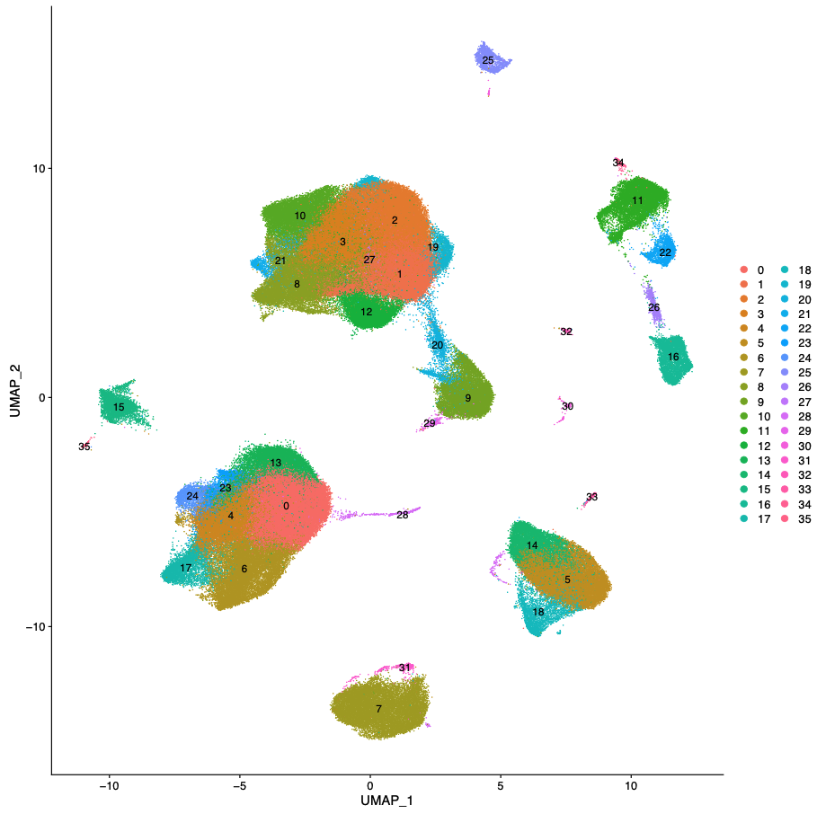
```


### 7.1. Integrated data filtering

At this point, we have a second look at he estimated Scrublet doublets that have been kept in the analysis so far. We would like to see where they are located in Harmony's UMAP plot and whether there are clusters enriched with them. To this extent, we estimated for each cluster i, i = 0, ..., 35, the quantity $DR_i = \frac{D_i}{S_i}$, where $D_i$ denotes the number of doublets in i and $S_i$ the number of respective singlets. Then, we compared the $DR_i$ values across clusters.

```{r,harmonyqc1,eval=TRUE}
# load the pre-saved Harmony meta data with doublets
harmonyMeta<-read.table(paste(folder,"harmony_meta.txt",sep=""),sep="\t")
tab<-table(harmonyMeta$seurat_clusters,harmonyMeta$scr_doublet)
tab<-data.frame(cbind(Cluster=as.numeric(rownames(tab)),tab,Ratio=round(tab[,1]/tab[,2],3)))
tab

# plot the ratios by cluster
fig <- plot_ly(tab, x = ~Cluster, y = ~Ratio, type = 'bar',colors = "Set2",
       textposition = 'middle right') %>%
       layout(xaxis = list(tickfont = list(size = 5)),yaxis=list(title="Doublet Ratio"))
fig
```

In general, the estimated doublets seem to be uniformly spread across all clusters except for the $DR$ elevated cluster 20 and, more prominently, cluster 29. As the marker analysis shows, cluster 20 consists of $INS^+$ (Beta cells) and $SST^+$ (Delta cells). Similarly, cluster 29 constists of cells expressing both GCG (Alpha cells) and SST (Delta cells).

```{r harmonyqc_plot1, echo = FALSE, message=FALSE, fig.align='left', fig.cap='Doublet detection on Harmony integrated UMAP. Top/left: Singlets and Scrublet doublets. Top/right: INS expression (Beta cells). Bottom/left: GCG expression (Alpha cells). Bottom/right: SST expression (Delta cells).'}
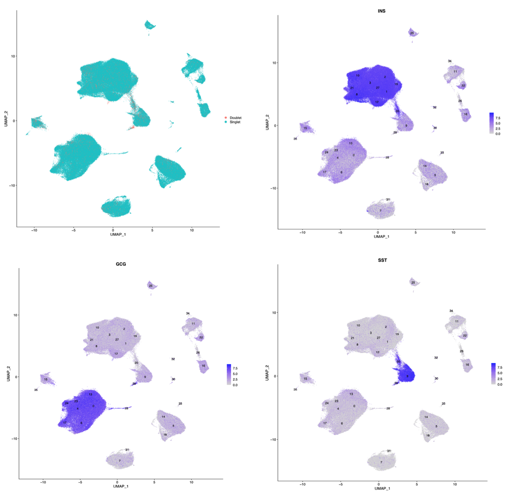
```

We also checked the results of the *Likelihood Ratio* differential expression test of Seurat. The model estimates the differentially expressed genes of cluster i vs all other clusters (i = 0, ...,35). We keep only the genes with $\log_2 FC \geq 0.2$:

```{r,harmonyqc2,eval=FALSE}
# run the single-cell based differential expression analysis cross cell types
Idents(harm)<-harm$seurat_clusters
all_markers <- FindAllMarkers(harm, slot="data",test.use="LR", 
                              latent.vars=c("Chemistry","Sex","Race"), 
                              only.pos=TRUE)
```

Below we show the top 20 markers per comparison. Cluster 29 upregulates both CGC and SST. Cluster's 20 top list does not show a strong signal from well-known markers of different cell types.   

```{r,harmonyqc3,eval=FALSE}
# load the pre-saved differential expression analysis across cell types
all_markers<-read.table(paste(folder,"SC_all_celltype_markers.txt",sep=""),sep="\t",header=T)
all_markers %>% group_by(cluster) %>% top_n(n = 20, wt = avg_log2FC) -> top

# for cluster 20
top[top$cluster==20,]
## # A tibble: 20 × 7
## # Groups:   cluster [1]
##       p_val avg_log2FC pct.1 pct.2 p_val_adj cluster gene    
##       <dbl>      <dbl> <dbl> <dbl>     <dbl>   <int> <chr>   
##  1 0              3.20  0.918 0.404 0              20 SST     
##  2 0              2.93  0.988 0.391 0              20 RBP4    
##  3 1.48e-165      1.82  0.694 0.53  4.11e-161      20 HSPA1A  
##  4 2.68e-131      1.63  0.192 0.058 7.43e-127      20 HSPA6   
##  5 2.37e-193      1.21  0.595 0.354 6.57e-189      20 HSPA1B  
##  6 0              1.09  0.989 0.91  0              20 SEC11C  
##  7 1.29e-129      1.02  0.583 0.409 3.58e-125      20 DNAJB1  
##  8 0              0.991 0.915 0.491 0              20 PCSK1   
##  9 0              0.944 0.837 0.401 0              20 DHRS2   
## 10 4.69e- 97      0.897 0.618 0.457 1.3 e- 92      20 HSPH1   
## 11 0              0.894 0.64  0.201 0              20 RGS2    
## 12 0              0.808 0.863 0.534 0              20 PCP4    
## 13 1.86e-268      0.802 0.685 0.347 5.16e-264      20 TPPP3   
## 14 1.77e-284      0.802 0.49  0.096 4.92e-280      20 PRG4    
## 15 2.02e-228      0.737 0.674 0.308 5.6 e-224      20 AQP3    
## 16 0              0.725 0.91  0.547 0              20 HADH    
## 17 0              0.717 0.879 0.5   0              20 PKIB    
## 18 1.74e- 94      0.705 0.995 0.986 4.84e- 90      20 HSP90AA1
## 19 0              0.677 0.588 0.103 0              20 HHEX    
## 20 1.58e-202      0.557 0.909 0.64  4.39e-198      20 MIR7-3HG

# for cluster 29
top[top$cluster==29,]
## # A tibble: 20 × 7
## # Groups:   cluster [1]
##       p_val avg_log2FC pct.1 pct.2 p_val_adj cluster gene   
##       <dbl>      <dbl> <dbl> <dbl>     <dbl>   <int> <chr>  
##  1 1.13e-199      2.79  0.787 0.409 3.13e-195      29 SST    
##  2 1.01e- 92      1.39  0.841 0.396 2.81e- 88      29 RBP4   
##  3 1.82e- 63      1.06  0.968 0.642 5.04e- 59      29 GPX3   
##  4 1.88e- 92      0.799 0.992 0.852 5.21e- 88      29 IDS    
##  5 3.15e- 64      0.795 0.984 0.469 8.74e- 60      29 TM4SF4 
##  6 5.15e- 70      0.765 0.922 0.543 1.43e- 65      29 ISL1   
##  7 7.09e- 80      0.743 0.965 0.609 1.97e- 75      29 ARFGEF3
##  8 1.17e- 39      0.732 0.857 0.525 3.23e- 35      29 PEG10  
##  9 1.37e- 45      0.725 0.968 0.82  3.8 e- 41      29 BEX3   
## 10 7.05e- 70      0.723 1     0.818 1.96e- 65      29 PCSK1N 
## 11 5.71e- 43      0.709 0.876 0.536 1.58e- 38      29 PCP4   
## 12 1.96e- 57      0.691 0.997 0.804 5.43e- 53      29 BEX1   
## 13 6.97e- 47      0.679 0.968 0.601 1.93e- 42      29 CRYBA2 
## 14 1.37e- 42      0.677 0.981 0.886 3.81e- 38      29 NENF   
## 15 4.04e- 63      0.663 0.984 0.911 1.12e- 58      29 SEC11C 
## 16 1.99e- 91      0.652 0.987 0.705 5.53e- 87      29 GCG    
## 17 2.54e- 41      0.629 0.876 0.531 7.04e- 37      29 BTG2   
## 18 1.42e- 33      0.625 0.739 0.253 3.93e- 29      29 SMIM24 
## 19 1.91e- 66      0.614 0.949 0.712 5.31e- 62      29 ZKSCAN1
## 20 7.1 e- 49      0.613 0.96  0.611 1.97e- 44      29 PPP1R1A
```

Based on the $DR$ statistic, the expression profiles and the results of the differential expression analysis, we consider clusters 20 and 29 as doublets-enriched clusters and we remove their cells from the data. The following is our final single-cell set that will be annotated and studied further:

```{r,harmonyqc4,eval=FALSE}
clean_harm <- subset(harm, subset = scr_doublet == "Singlet")
clean_harm <- clean_harm[,-which(clean_harm$seurat_clusters!=20 |
                                 clean_harm$seurat_clusters!=29)]
saveRDS(clean_harm,"/path/to/final/IntegratedData.rds")
```

The cleaned integrated data have been uploaded to GEO [put GEO ID here] with some minor editing of the meta data slot. Other useful donor characteristics have also been added such as the type of medication, the cause of death, the data collection center and the cell viability / purity. Below, we summarize some useful cell characteristics:

```{r,harmonyqc5,eval=FALSE}
Idents(clean_harm)<-clean_harm$seurat_clusters
clean_harm$BMI<-as.numeric(as.character(clean_harm$BMI))
clean_harm$Age<-as.numeric(as.character(clean_harm$Age))

# QC characteristics
DimPlot(clean_harm,label=T,raster=FALSE)
FeaturePlot(object = clean_harm, features = "nFeature_RNA", cols = c("purple", "yellow"), label= T, raster = F)
FeaturePlot(object = clean_harm, features = "nCount_RNA", cols = c("purple", "yellow"), label= T, raster = F)
FeaturePlot(object = clean_harm, features = "percent.mt", cols = c("purple", "yellow"), label= T, raster = F)

# Technical and demographic factors
DimPlot(clean_harm, reduction = "umap", raster = F, group.by= "Chemistry")
DimPlot(clean_harm, reduction = "umap", raster = F, group.by= "Condition")
FeaturePlot(object = clean_harm, features = "BMI", cols = c("purple", "yellow"), label= T, raster = F)
FeaturePlot(object = clean_harm, features = "Age", cols = c("purple", "yellow"),label= T,  raster = F)
```

```{r harmonyqc_plot2, echo = FALSE, message=FALSE, fig.align='left', fig.cap='UMAP clustering of the integrated data and cell characteristics. Top/left: UMAP clusters. Top/right: Number of UMIs. Bottom/left: Number of features. Bottom/right: Percentage of reads pmapped to MT genome.'}
knitr::include_graphics("harmony_qc2.png")
```

```{r harmonyqc_plot3, echo = FALSE, message=FALSE, fig.align='left', fig.cap='UMAP clustering of the integrated data and library / donor characteristics. Top/left: Chemistry. Top/right: Disease state. Bottom/left: BMI. Bottom/right: Age.'}
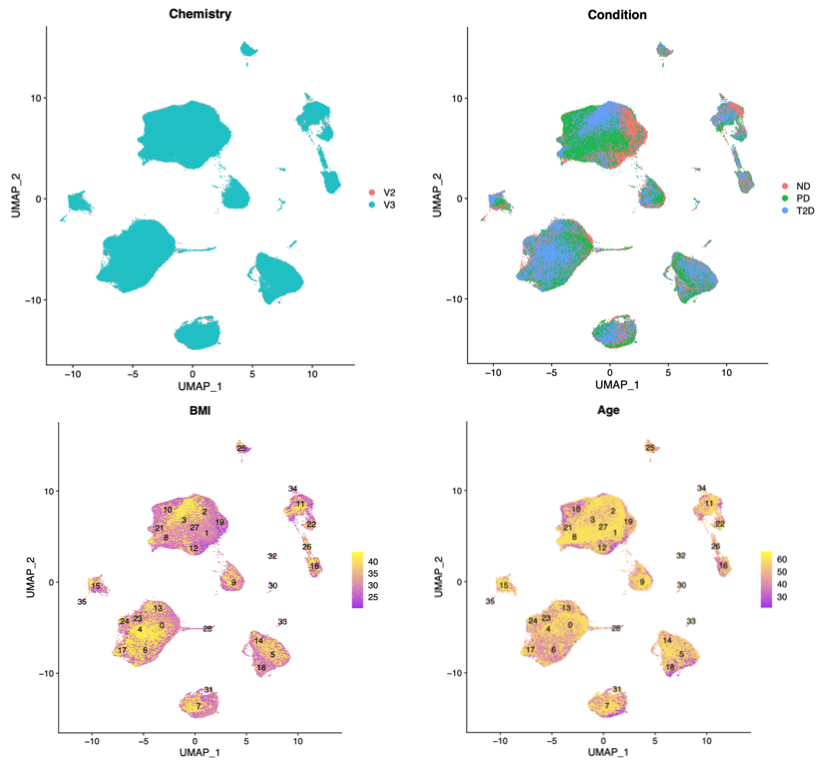
```

# 8. Cell annotation

We annotate the cells using well-known markers from the literature. Alternative cell type markers were highly reproducible. Here we focus on this set: INS (Beta cells), GCG (Alpha cells), PPY (Gamma cells), SST (Delta cells), GHRL (Epsilon cells), KRT19 (Ductal cells), REG1B (Acinar cells), COL1A1 (Stellate cells), FABP4 (Activated Stellate cells), PLVAP (Endothelial cells), NGFR (Schwann cells), C1QC (Immune cells), TPSB2 (Mast cells) and TOP2A (proliferating cells).

```{r,annotation1,eval=FALSE}
# read the clean integrated data
dat<-readRDS("/path/to/final/IntegratedData.rds")

# define the markers
markers<-c("INS","GCG","PPY","SST","GHRL",  # endocrine
           "KRT19","REG1B","COL1A1","FABP4","PLVAP","NGFR","C1QC","TPSB2",  #exocrine
           "TOP2A")  # any cycling

# generate a series of marker plots
Idents(dat)<-dat$seurat_clusters
FeaturePlot(dat,features=markers,label=T,combine=F,raster=F)
```

```{r annotation_plot1, echo = FALSE, message=FALSE, fig.align='left', fig.cap='Gradient expression of endocrine markers on UMAP. Top/left: INS (Beta cells). Top/middle: GCG (Alpha cells). Top/right: PPY (Gamma cells). Bottom/left: SST (Delta cells). Bottom/middle: GHRL (Epsilon cells). Bottom/right: TOP2A (cycling Alpha and Ductal cells).'}
knitr::include_graphics("annotation1.png")
```

```{r annotation_plot2, echo = FALSE, message=FALSE, fig.align='left', fig.cap='Gradient expression of exocrine markers on UMAP (set1). Top/left: KRT19 (Ductal cells). Top/right: REG1B (Acinar cells). Bottom/left: COL1A1 (Stellate cells). Bottom/right: FABP4 (Activated Stellate cells).'}
knitr::include_graphics("annotation2.png")
```

```{r annotation_plot3, echo = FALSE, message=FALSE, fig.align='left', fig.cap='Gradient expression of exocrine markers on UMAP (set2). Top/left: PLVAP (Endothelial cells). Top/right: NGFR (Schwann cells). Bottom/left: C1QC (Immune cells). Bottom/right: TPSB2 (Mast cells).'}
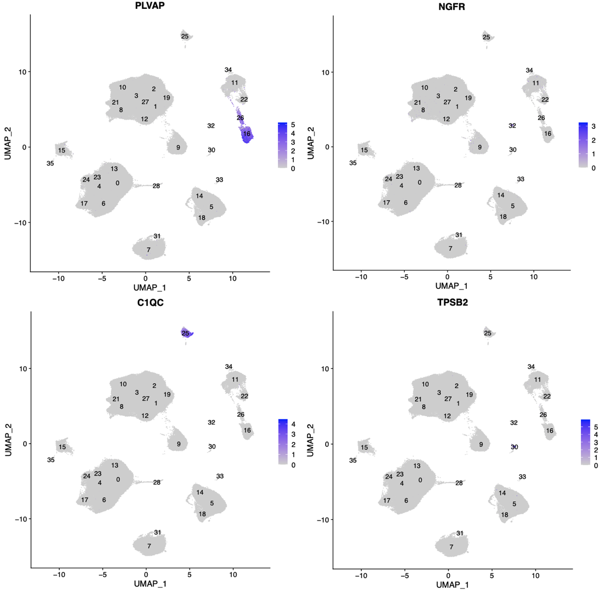
```

After we annotate the cells (the annotation is already present in the 'Clusters' column of the meta data slot), we generate a more condensed view of marker expression and cell annotation by violin plots:

```{r,annotation2.1,eval=TRUE,echo=FALSE}
annot_colors<-c(BetaND = "gold2", BetaPD = "goldenrod2", BetaT2D = "goldenrod3", 
                AlphaND = "orchid2", AlphaPD = "orchid3", AlphaT2D = "mediumorchid3", 
                GammaND = "darkolivegreen2", GammaPD = "darkolivegreen3",
                                                        GammaT2D = "darkolivegreen3",
                DeltaND = "lightsalmon2", DeltaPD = "salmon2",DeltaT2D = "salmon3",
                EpsilonND = "brown1", EpsilonPD = "brown2",EpsilonT2D = "brown3", 
                AcinarND = "slateblue", AcinarPD = "slateblue2",AcinarT2D = "slateblue4", 
                DuctalND = "skyblue1", DuctalPD = "skyblue3",DuctalT2D = "skyblue4", 
                StellateND = "cyan1", StellatePD = "cyan3", StellateT2D = "cyan4", 
                EndothelialND = "springgreen1", EndothelialPD = "springgreen3",
                                                        EndothelialT2D="springgreen4", 
                Activated_StellateND = "plum1", Activated_StellatePD = "plum3",
                                                        Activated_StellateT2D= "plum4",
                ImmuneND = "indianred1", ImmunePD = "indianred3", ImmuneT2D = "indianred4",
                MastND = "hotpink", MastPD = "hotpink2", MastT2D = "hotpink4",
                SchwannND = "mediumpurple1", SchwannPD = "mediumpurple3", 
                                                        SchwannT2D= "mediumpurple4",
                Proliferating_AlphaND = "tan1", Proliferating_AlphaPD = "tan3", 
                                                        Proliferating_AlphaT2D= "tan4")

```

```{r,annotation2,eval=FALSE}
# update the Idents
Idents(dat)<-dat$Clusters
Idents(dat) <- factor(Idents(dat), levels= c("Alpha","Proliferating_Alpha","Beta",
                                             "Delta","Epsilon","Gamma","Acinar",
                                             "Ductal", "Endothelial","Immune","Mast",
                                             "Schwann","Stellate","Activated_Stellate"))

# make an extra variable to color the violins
dat$ClustersCondition<-apply(cbind(dat$Clusters,dat$Condition),1,paste,collapse="")

# make the violin plots with a set of predefined colors
annot_colors<-c(BetaND = "gold2", BetaPD = "goldenrod2", BetaT2D = "goldenrod3", 
                AlphaND = "orchid2", AlphaPD = "orchid3", AlphaT2D = "mediumorchid3", 
                GammaND = "darkolivegreen2", GammaPD = "darkolivegreen3",
                                                        GammaT2D = "darkolivegreen3",
                DeltaND = "lightsalmon2", DeltaPD = "salmon2",DeltaT2D = "salmon3",
                EpsilonND = "brown1", EpsilonPD = "brown2",EpsilonT2D = "brown3", 
                AcinarND = "slateblue", AcinarPD = "slateblue2",AcinarT2D = "slateblue4", 
                DuctalND = "skyblue1", DuctalPD = "skyblue3",DuctalT2D = "skyblue4", 
                StellateND = "cyan1", StellatePD = "cyan3", StellateT2D = "cyan4", 
                EndothelialND = "springgreen1", EndothelialPD = "springgreen3",
                                                        EndothelialT2D="springgreen4", 
                Activated_StellateND = "plum1", Activated_StellatePD = "plum3",
                                                        Activated_StellateT2D= "plum4",
                ImmuneND = "indianred1", ImmunePD = "indianred3", ImmuneT2D = "indianred4",
                MastND = "hotpink", MastPD = "hotpink2", MastT2D = "hotpink4",
                SchwannND = "mediumpurple1", SchwannPD = "mediumpurple3", 
                                                        SchwannT2D= "mediumpurple4",
                Proliferating_AlphaND = "tan1", Proliferating_AlphaPD = "tan3", 
                                                        Proliferating_AlphaT2D= "tan4")
p <- VlnPlot(dat, feature= c("GCG","TOP2A","INS",
                             "SST","GHRL","PPY","REG1B",
                             "KRT19","PLVAP","C1QC","TPSB2",
                             "NGFR", "COL1A1", "FABP4"),
                             stack = TRUE, flip = TRUE, 
                             split.by= "ClustersCondition") + 
    theme(axis.text.x = element_text(angle = 90, vjust = 0.5, hjust=1)) 

p + 
  ggplot2::scale_fill_manual(
            values = annot_colors) + 
  NoLegend()
```

```{r annotation_plot4, echo = FALSE, message=FALSE, fig.align='left', fig.cap='Violin plots of annotated clusters for a selected set of markers.'}
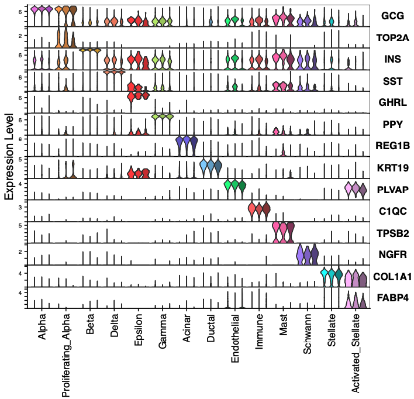
```

The UMAP plots below summarize the annotation information. Optionally, the user can generate an interactive UMAP to access some aspects of the data (the plot is not shown due to processing requirements). Mouse over shows all relevant library and donor information. Due to memory limitations, this interactive UMAP is not presented here. The viewer can visualize the **UCSC CellBrowser** version of it at [put the http here]. 

```{r,annotation4.1,eval=TRUE}
# read the pre-saved meta data of the annotated object
annotMeta<-read.table(paste(folder,"annotated_meta.txt",sep=""),sep="\t",header=T)

# plot the cell types
p<-ggplot(annotMeta,aes(x=UMAP1,y=UMAP2,color=Clusters))+geom_point(size=0.1)
p

# plot the conditions
p<-ggplot(annotMeta,aes(x=UMAP1,y=UMAP2,color=Condition))+geom_point(size=0.1)
p

# plot the interactive UMAP (acivate if needed)
#fig <- plot_ly(annotMeta,x = ~UMAP1, y = ~UMAP2,text = ~Comp, color=~Clusters,
#               textposition = 'middle right',type="scatter",mode="markers",
#               marker = list(size = 0.3)) %>%
#        layout(xaxis = list(title="UMAP 1",zeroline = FALSE),
#               yaxis=list(title="UMAP 2",zeroline = FALSE))
#fig
```


### 8.1. Cell characteristics (all cell types)

Below we summarize the main characteristics of the generated data. First we compare the various cell types. As expected Beta and Alpha are the most prominent cell types occupying more than 70% of cells, followed by Ductal (9.9%), Acinar (5.4%), Stellate (4.4%) and Delta (4.4%): 

```{r,annotation3,eval=TRUE}
# number and ratio of cell types 
tab<-table(annotMeta$Clusters)
tab<-data.frame(cbind(Cell_Type=names(tab),Frequency=tab,Ratio=tab/sum(tab)))
tab$Frequency<-apply(cbind(tab$Cell_Type,tab$Frequency),1,paste,collapse=": ")
tab$Ratio<-as.numeric(as.character(tab$Ratio))
tab$Cell_Type<-factor(tab$Cell_Type,levels=c("Beta","Alpha","Delta","Gamma",
                                             "Proliferating_Alpha","Epsilon",
                                             "Ductal","Acinar","Stellate",
                                             "Endothelial","Immune","Activated_Stellate",
                                             "Mast","Schwann"))
tab[sort.list(tab$Ratio,decreasing=T),] 

# plot the number and the ratio of cell types
fig <- plot_ly(tab, x = ~Cell_Type, y = ~Ratio, type = 'bar',colors = "Set2",
       text=~Frequency,textposition = 'middle right') %>%
       layout(xaxis = list(tickfont = list(size = 5)),yaxis=list(title="Cell type ratio"))
fig
```

Next, we visualize the cell frequency per cell type and condition. All cell types and conditions are represented in our dataset at various degrees. Perhaps the most striking feature of the below plot is the substantial reduction of Beta cells in T2D compared to ND and PD (same number of ND and T2D donors).  

```{r,annotation4,eval=TRUE}
# Number of condition-specific cells by cell type
tab<-table(annotMeta$Clusters,annotMeta$Condition)
tab<-data.frame(cbind(Cell_Type=rownames(tab),tab))
tab$ND<-as.numeric(as.character(tab$ND))
tab$PD<-as.numeric(as.character(tab$PD))
tab$T2D<-as.numeric(as.character(tab$T2D))
tab$Cell_Type<-factor(tab$Cell_Type,levels=c("Beta","Alpha","Delta","Gamma",
                                             "Proliferating_Alpha","Epsilon",
                                             "Ductal","Acinar","Stellate",
                                             "Endothelial","Immune","Activated_Stellate",
                                             "Mast","Schwann"))
tab

# make the barplot
fig <- plot_ly(tab, x = ~Cell_Type, y = ~ND, type = 'bar',colors = "Set2",name="ND",
       textposition = 'middle right') %>%
       layout(xaxis = list(tickfont = list(size = 5)),yaxis=list(title="Number of cells"))
fig <- fig %>% add_trace(y = ~PD, name = 'PD')
fig <- fig %>% add_trace(y = ~T2D, name = 'T2D')
fig
```

To account for the differences in cell numbers across cell types, we generate the same plot using cell ratios:

```{r,annotation5,eval=TRUE}
# calculate the percentages
tab$ND<-tab$ND/sum(tab$ND)
tab$PD<-tab$PD/sum(tab$PD)
tab$T2D<-tab$T2D/sum(tab$T2D)

# make the barplot
fig <- plot_ly(tab, x = ~Cell_Type, y = ~ND, type = 'bar',colors = "Set2",name="ND",
       textposition = 'middle right') %>%
       layout(xaxis = list(tickfont = list(size = 5)),yaxis=list(title="Ratio of cells"))
fig <- fig %>% add_trace(y = ~PD, name = 'PD')
fig <- fig %>% add_trace(y = ~T2D, name = 'T2D')
fig
```

The ratio barplot corroborates the observation of the Beta cell reduction in T2D while the ND and PD values look very comparable. This is in par with the notion of beta cell death in type 2 diabetic donors. 

Below, we summarize other data features related to the cell quality and donor information:

```{r,annotation8,eval=TRUE}
# cell viability
table(annotMeta$Condition,annotMeta$Viability)

# cell purity
table(annotMeta$Condition,annotMeta$Purity)

# donor medication
table(annotMeta$Condition,annotMeta$Medication)
```


### 8.2. Cell characteristics (endocrine cells)

We shift our focus to the endocrine cells whose numbers are not influenced by technical (experimental) factors and, as before, we estimate the ratios by condition. Then, we quantify the statistical difference in cell type numbers and ratios by Tukey test p-values and boxplots:

```{r,annotation6,eval=TRUE}
# calculate the number of endocrin cells per islet ID and cluster / condition
tab1<-table(annotMeta$Islet,annotMeta$ClustersCondition)
gg<-c(grep("^Alpha",colnames(tab1)),
      grep("Beta",colnames(tab1)),
      grep("Gamma",colnames(tab1)),
      grep("Delta",colnames(tab1)),
      grep("Epsilon",colnames(tab1)))
tab1<-tab1[,gg]

# calculate the ratios
tab2<-tab1
for(i in 1:nrow(tab2)){
  tab2[i,]<-tab2[i,]/sum(tab2[i,])
}

# see the Beta cell data (number of cells)
beta1<-tab1[,grep("Beta",colnames(tab1))]

# see the Beta cell data (ratio of cells)
beta2<-tab2[,grep("Beta",colnames(tab2))]

# make the boxplot of the number of cells
betaND<-beta1[beta1[,1]>0,1]
betaPD<-beta1[beta1[,2]>0,2]
betaT2D<-beta1[beta1[,3]>0,3]

fig <- plot_ly(y = ~betaND, type = "box",name="ND",
               boxpoints = "all", jitter = 0.3,pointpos = -1.8) %>%
       layout(xaxis = list(tickfont = list(size = 10)),
              yaxis=list(title="Number of Beta cells"))
fig <- fig %>% add_trace(y = ~betaPD,name="PD")
fig <- fig %>% add_trace(y = ~betaT2D,name="T2D")
fig

# pairwise statistical differences by Tukey's test (number of cells)
test.data<-rbind(cbind(Ratio=betaND,Condition="ND"),
                 cbind(Ratio=betaPD,Condition="PD"),
                 cbind(Ratio=betaT2D,Condition="T2D"))
test.data<-data.frame(test.data)
test.data$Ratio<-as.numeric(as.character(test.data$Ratio))
test.data$Condition<-factor(test.data$Condition)

mod<-aov(Ratio~Condition,data=test.data)
TukeyHSD(mod, conf.level=.95)


# make the boxplot of the ratio of cells
betaND<-beta2[beta2[,1]>0,1]
betaPD<-beta2[beta2[,2]>0,2]
betaT2D<-beta2[beta2[,3]>0,3]

fig <- plot_ly(y = ~betaND, type = "box",name="ND",
               boxpoints = "all", jitter = 0.3,pointpos = -1.8) %>%
       layout(xaxis = list(tickfont = list(size = 10)),
              yaxis=list(title="Ratio of Beta cells"))
fig <- fig %>% add_trace(y = ~betaPD,name="PD")
fig <- fig %>% add_trace(y = ~betaT2D,name="T2D")
fig

# pairwise statistical differences by Tukey's test
test.data<-rbind(cbind(Ratio=betaND,Condition="ND"),
                 cbind(Ratio=betaPD,Condition="PD"),
                 cbind(Ratio=betaT2D,Condition="T2D"))
test.data<-data.frame(test.data)
test.data$Ratio<-as.numeric(as.character(test.data$Ratio))
test.data$Condition<-factor(test.data$Condition)

mod<-aov(Ratio~Condition,data=test.data)
TukeyHSD(mod, conf.level=.95)
```

Evidently, there is a statistically significant difference in both the number and the ratio of T2D Beta cells compared to both ND and PD at significance level $\alpha=5\%$ (Bonferonni p-values). In the same way, we quantify the number and ratio differences in Alpha cells:

```{r,annotation7,eval=TRUE}
# Alpha cells (numbers)
alpha1<-tab1[,grep("^Alpha",colnames(tab1))]
alphaND<-alpha1[alpha1[,1]>0,1]
alphaPD<-alpha1[alpha1[,2]>0,2]
alphaT2D<-alpha1[alpha1[,3]>0,3]

fig <- plot_ly(y = ~alphaND, type = "box",name="ND",
               boxpoints = "all", jitter = 0.3,pointpos = -1.8) %>%
       layout(xaxis = list(tickfont = list(size = 10)),
              yaxis=list(title="Ratio of Alpha cells"))
fig <- fig %>% add_trace(y = ~alphaPD,name="PD")
fig <- fig %>% add_trace(y = ~alphaT2D,name="T2D")
fig

test.data<-rbind(cbind(Ratio=alphaND,Condition="ND"),
                 cbind(Ratio=alphaPD,Condition="PD"),
                 cbind(Ratio=alphaT2D,Condition="T2D"))
test.data<-data.frame(test.data)
test.data$Ratio<-as.numeric(as.character(test.data$Ratio))
test.data$Condition<-factor(test.data$Condition)

mod<-aov(Ratio~Condition,data=test.data)
TukeyHSD(mod, conf.level=.95)

# Alpha cells (ratios)
alpha2<-tab2[,grep("^Alpha",colnames(tab2))]
alphaND<-alpha2[alpha2[,1]>0,1]
alphaPD<-alpha2[alpha2[,2]>0,2]
alphaT2D<-alpha2[alpha2[,3]>0,3]

fig <- plot_ly(y = ~alphaND, type = "box",name="ND",
               boxpoints = "all", jitter = 0.3,pointpos = -1.8) %>%
       layout(xaxis = list(tickfont = list(size = 10)),
              yaxis=list(title="Ratio of Alpha cells"))
fig <- fig %>% add_trace(y = ~alphaPD,name="PD")
fig <- fig %>% add_trace(y = ~alphaT2D,name="T2D")
fig

test.data<-rbind(cbind(Ratio=alphaND,Condition="ND"),
                 cbind(Ratio=alphaPD,Condition="PD"),
                 cbind(Ratio=alphaT2D,Condition="T2D"))
test.data<-data.frame(test.data)
test.data$Ratio<-as.numeric(as.character(test.data$Ratio))
test.data$Condition<-factor(test.data$Condition)

mod<-aov(Ratio~Condition,data=test.data)
TukeyHSD(mod, conf.level=.95)
```

Alpha cells show a statistically significant difference in the cell ratios across conditions while the absolute numbers remain statistically the same. The interpretation is that beta cells death in T2D leads to more Alpha cell capture for sequencing and thus the observed increased Alpha cell ratio in T2D occurs for technical reasons.    


# 9. Conversion to pseudobulk

After cell type annotation, we will perform differential expression (DE) analysis (1) **across cell types** and (2) **across conditions within cell types**. We consider that single cells within a donor are not independent of each other so that DE at the single-cell level could well-explain the variation across a cell population but not across donors. To infer which genes might be biologically important, especially across conditions, we use a pseudobulk approach where the raw counts of each individual within each cell type are aggregated. In this way, the donors serve as the biological replicates of the experimental design to study the differences among cell types and ND vs PD vs T2D conditions.

First we isolate the cell type specific data and then we convert the single-cell signal into pseudobulk using our function **pseudobulk_conversion()**. We show here the example of Beta cells:

```{r,pseudobulk1,eval=FALSE}
# read the single cell data and keep those of the beta cells
dat<-readRDS("/path/to/final/IntegratedData.rds")
beta.dat<-subset(dat,subset=Clusters=="Beta")

# do the conversion to pseudobulk
beta.pseudo<-pseudobulk_conversion(data=beta.dat)

# see some of the beta raw counts
head(beta.pseudo$Counts)

##            Islet104 Islet107 Islet123 Islet29 Islet34 Islet37 Islet38 Islet42
## AL627309.1       14       12       10       1      10       3       5      10
## AL627309.5       17       17       34      10       7      14       8      17
## AP006222.2        9       12       30      49      24      39      10      36
## LINC01409       311      393      672     227     324     424     149     315
## FAM87B            2        0        2       3       3       2       1       1
## LINC01128      1006     1392     2622     628    1400    1023     424    1095

##            Islet45 Islet47 Islet54 Islet57 Islet59 Islet61 Islet68 Islet73
## AL627309.1       4      13      10      23      10      14      10       1
## AL627309.5      26      52      11      35      56      23      24       5
## AP006222.2      41      37      17      12      21      10      23       3
## LINC01409      335     626     176     776     539     290     433     114
## FAM87B           2       1       0       0       7       0       0       0
## LINC01128     1093    3198     814    2633    2005     839    1193     411

##            Islet80 Islet101 Islet118 Islet127 Islet40 Islet50 Islet53 Islet55
## AL627309.1      13        7        7       36      11       0       7      13
## AL627309.5      22        7       13       59       9       4       4      30
## AP006222.2      10       19        8       57      13       4      14      17
## LINC01409      273      307      298      630     147     133     145     506
## FAM87B           1        1        0        1       0       0       0       0
## LINC01128      724     1159      956     1785     783     423     454    2144

##            Islet56 Islet58 Islet62 Islet63 Islet70 Islet85 Islet89 Islet119
## AL627309.1       2       8       4       4       7      15      19       14
## AL627309.5      26      38       9      15      20      35      25       26
## AP006222.2       8      60       7      26      14      38      62       84
## LINC01409      204     693     269     444     257     457     494      426
## FAM87B           0       1       0       0       2       7       6        5
## LINC01128      890    1992     714     611     720    1523    1269     1935

##            Islet126 Islet128 Islet28 Islet30 Islet31 Islet32 Islet33 Islet39
## AL627309.1        8       13       5      28       9      11       0      11
## AL627309.5       19        7      17      27       3       1       7       6
## AP006222.2       15        3       8      32      27      38      52      14
## LINC01409       339      158     227     334     154     215     138     144
## FAM87B            1        3       0       0       0       0       1       0
## LINC01128       705      487    1029    2054     489     776     523     641

##            Islet41 Islet44 Islet48 Islet52 Islet60 Islet71 Islet84 Islet91
## AL627309.1       7      10       3       2      11       6       4      13
## AL627309.5       2      27      12      10      20       8      14      11
## AP006222.2      17      57       2      22      49      20       0      20
## LINC01409       99     414     153     149     345     120     167     301
## FAM87B           0       0       0       1       2       0       0       0
## LINC01128      622    1259    1246     646    1525     647     649    1109

# see some of the beta meta data
head(beta.pseudo$Design)
##          Chemistry Condition Sex  BMI Race HbA1c Age Ncells
## Islet104        V3        ND   M 20.2   AA   5.2  48   1330
## Islet107        V3        ND   M 24.2    H   5.2  26    686
## Islet123        V3        ND   F 28.3    H   4.6  60    661
## Islet29         V2        ND   M 35.6    W   5.1  54    598
## Islet34         V2        ND   M 25.3    H   5.3  40    903
## Islet37         V2        ND   M 28.5    W   5.2  32   2343

# save the information
saveRDS(beta.pseudo,"/path/to/pseudobulk/folder/BetaPseudobulk.rds")
```

In a similar way, we generate the pseudobulk data of the other cell types. Note that in some cases, e.g. Epsilon and Mast, that we detect a relatively small number of cells, the donors and conditions are not well represented. There, we keep only the donors with at least one cell of the specific cell type captured. Below we show the example of Epsilon cells:

```{r,pseudobulk2,eval=TRUE}
# read the pre-saved pseudobulk data of all cells
all.pseudodat<-readRDS(paste(folder,"AllPseudobulk.rds",sep=""))
epsMeta<-all.pseudodat$Design[all.pseudodat$Design$CellType=="Epsilon",]

# number of donors with at least 1 epsilon cell
nrow(epsMeta)

# analytic meta data of the epsilon cells
epsMeta

# cell number distribution across donors
quantile(epsMeta$Ncells,seq(0,1,0.1))
```

As shown above, only 41 out 48 donors have at least one Epsilon cell detected. Column *Ncells* indicates that the vast majority of the donors has between 1 to 4 cells.

### 9.1. Quality control

We run a basic quality control analysis on the pseudobulk data. For simplicity we will focus on the Endocrine cells with adequate sample sizes, i.e. Alpha, Beta, Gamma and Delta but the user can generalize to any of the estimated cell types. We use our function **pseudoQC()** to plot: 

1. The library sizes and the adjusted library sizes (divided by the number of cells aggregated).

2. The library sizes and the adjusted library sizes (divided by the number of cells aggregated) excluding the MT genes and the four endocrine markers (among them are the top contaminants).

3. The percentage of reads mapped to the MT genome.

4. The number of detected genes (positive counts).

5. The expression of the top 50 expressed genes.


```{r,pseudoqc1,eval=TRUE}
# read the pseudobulk data
alpha<-readRDS(paste(folder,"AlphaPseudobulk.rds",sep=""))
beta<-readRDS(paste(folder,"BetaPseudobulk.rds",sep=""))
gamma<-readRDS(paste(folder,"GammaPseudobulk.rds",sep=""))
delta<-readRDS(paste(folder,"DeltaPseudobulk.rds",sep=""))

# make the Alpha plots
figsAlpha<-pseudoQC(data=alpha)

# make the Beta plots
figsBeta<-pseudoQC(data=beta)

# make the Beta plots
figsGamma<-pseudoQC(data=gamma)

# make the Beta plots
figsDelta<-pseudoQC(data=delta)
```

The plots below offer a comparative view of each of the above characteristics. We observe a substantial jump on the library sizes of the Beta cells. 

```{r pseudoqc_plot1, echo = FALSE, message=FALSE, fig.align='left', fig.cap='Library size by donor sample.'}
knitr::include_graphics("Unadj_lib.png")
```

```{r pseudoqc_plot2, echo = FALSE, message=FALSE, fig.align='left', fig.cap='Adjusted library size by donor sample. The adjustment accounts for the different number of aggregated cells.'}
knitr::include_graphics("Adj_lib.png")
```

We examine whether the library size differences can be explained by the expression of MT genes and the expression of the cell type markers, especially INS and GCG that are the most highly expressed genes.

```{r pseudoqc_plot3, echo = FALSE, message=FALSE, fig.align='left', fig.cap='Library size by donor sample after removing the MT genes and the endocrine cell type markers.'}
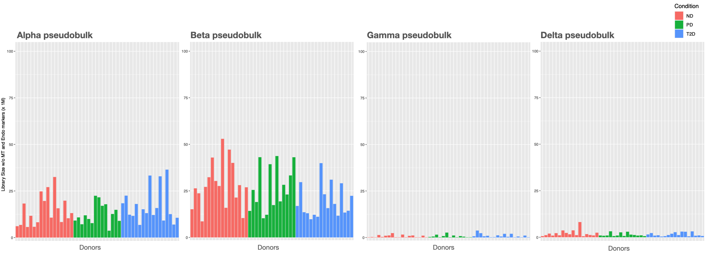
```

```{r pseudoqc_plot4, echo = FALSE, message=FALSE, fig.align='left', fig.cap='Adjusted library size by donor sample after removing the MT genes and the endocrine cell type markers. The adjustment accounts for the different number of aggregated cells.'}
knitr::include_graphics("Adj_lib_nomito.png")
```

The plot of the adjusted data show that the differences are minimized after accounting **for both** the expression of MT genes and the endocrine markers. Accounting for one of the two is suboptimal (not shown). The percentage of reads mapped to the MT genome is distinctly lower in Alpha compared to the other types. INS and GCG are the most expressed markers while the top 50 expressed genes in Beta cells seem to be expressed at higher levels.

```{r pseudoqc_plot5, echo = FALSE, message=FALSE, fig.align='left', fig.cap='Percentage of reads mapped to MT genome.'}
knitr::include_graphics("mt.png")
```

```{r pseudoqc_plot6, echo = FALSE, message=FALSE, fig.align='left', fig.cap='Top 50 expressed markers.'}
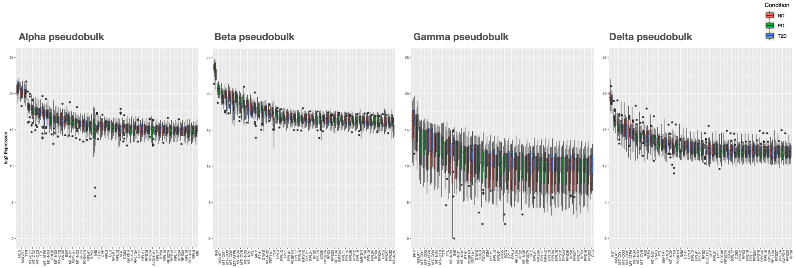
```

Finally, Alpha and Beta cells detect a median of approximately 20,000 genes followed by the Delta cells with approximately 16,000 and the Gamma by less than 15,000.

```{r,pseudoqc2,eval=TRUE}
# quantiles of the number of detected genes
quantile(figsAlpha[[1]]$DetGenes)
quantile(figsBeta[[1]]$DetGenes)
quantile(figsGamma[[1]]$DetGenes)
quantile(figsDelta[[1]]$DetGenes)
```

```{r pseudoqc_plot7, echo = FALSE, message=FALSE, fig.align='left', fig.cap='Number of expressed genes.'}
knitr::include_graphics("detg.png")
```


# 10. Comparison of the estimated cell types in ND and all data

From this point onward we will analyze only the pseudobulk counts. First we assess the similarities and differences across the estimated cell types with differential expression and pathway analysis.

### 10.1 Dimensionality reduction and cell type similarities

We examine the factors that explain the data variability by multidimensional scaling (MDS) of the top $z = 1,000$ variable features using our **MDS_fun()**. First, we explore the differences among the endocrine cell types that are of particular interest in this study: 

```{r,celltype1,eval=TRUE}
# select the endocrine data
endo<-which(all.pseudodat$Design$CellType=="Beta" |
            all.pseudodat$Design$CellType=="Alpha" |
            all.pseudodat$Design$CellType=="Proliferating_Alpha" |
            all.pseudodat$Design$CellType=="Gamma" |
            all.pseudodat$Design$CellType=="Delta" |
            all.pseudodat$Design$CellType=="Epsilon")
endodat<-list(Counts=all.pseudodat$Counts[,endo],
              Design=all.pseudodat$Design[endo,])

# run the MDS using z = 1000 top features
# and show the plot
mds<-MDS_fun(data=endodat,top=1000)
mds[[2]]
```

Apparently, the top $z=1000$ variable features separate well the endocrine cell types. The Beta cells look more similar to the Delta, the Gamma and Epsilon cells partly overlap and the proliferating Alpha, exhibiting the largest variability, is as expected most similar to Alpha cells. Note however that the large variabilities and cell types similarities exhibited in this plot could be due to the low number of Gamma, Epsilon and proliferating Alpha cells. 

The picture is much more complicated when considering all estimated cell types, possibly due to the small cell numbers for many types. The endocrine cell types are located/mixed at the left side of the MDS plot, the Acinar and Ductal cells are at the bottom, the Endothelial and the Stellate at the right side and in the middle are the Immune and Mast cells.

```{r,celltype2,eval=TRUE}
# load the pre-save MDS data
# note: MDS_fun makes a list with the table and the plots
#       here we stored only the table
mds<-read.table(paste(folder,"MDS_alltypes.txt",sep=""),sep="\t",header=T)
head(mds)

fig <- plot_ly(mds, x = ~MDS_1, y = ~MDS_2,color=~CellType,
               text = ~CellType, textposition = 'middle right', 
               type="scatter",mode="markers",colors="Set2") %>%
       layout(xaxis = list(title="MDS 1"),
              yaxis=list(title="MDS 2"))
fig
```

```{r celltype2_plot1, echo = FALSE, message=FALSE, fig.align='left', fig.cap='MDS plot of the pseudobulk data of all cell types. Each panel highlights different factors. Top/left: Condition. Top/right: Sex. Bottom/left: Chemistry. Bottom/right: Race.'}
knitr::include_graphics("alldata_pseudobulkMDS.png")
```

### 10.2. Cell type markers (ND data)

We use the pseudobulk data to identify cell type markers. First we use the ND data only to explore markers that do not depend on disease state. Below we will show how we calculate the Beta cell markers via our function **Pseudo_marker_celltype()**. 

```{r,celltype3,eval=TRUE}
# DE analysis of Beta ND vs all other ND
DE_betaND<-Pseudo_marker_celltype(data=all.pseudodat,
                                  condition="ND",
                                  celltype="Beta")
head(DE_betaND)
```

Several well-known cell type markers can be found at the top of the list. To characterize the list of DE genes we use **GO enrichment** and **GSEA** analysis from the *clusterProfiler* R package. For GO enrichment we use the function *enrichGO()* with all DE genes and keep the Biological Process (BP) terms with an adjusted pvalue cutoff  $pvalueCutoff \leq 5\%$ and qvalue cutoff $qvalueCutoff \leq 10\%$. For GSEA we use the fast GSEA version of *gseGO()* function with all genes with $|logFC| \geq 0.585$ and keep the BP terms with $FDR \leq 5\%$. 

```{r,celltype4,eval=TRUE}
# run enrichGO (GO analysis)
UP_betaND <- dplyr::filter(DE_betaND, logFC >= 0.585 & FDR<=0.05)
up<-UP_betaND$logFC
names(up)<-UP_betaND$Gene
up<-up[sort.list(up,decreasing=T)]
ego_up <- enrichGO(gene = names(up),
        OrgDb     = org.Hs.eg.db,
        keyType    = "SYMBOL",
        ont      = "BP",
        pAdjustMethod = "BH",
        pvalueCutoff = 0.05,
        qvalueCutoff = 0.1)
ego_up.df<-summary(ego_up)

# run gseGO (fGSEA analysis)
UP_betaND <- dplyr::filter(DE_betaND, logFC >= 0.585)
up<-UP_betaND$logFC
names(up)<-UP_betaND$Gene
up<-up[sort.list(up,decreasing=T)]
gse <- gseGO(geneList=up,
       ont ="BP",
       keyType = "SYMBOL",
       pvalueCutoff = 0.05,
       verbose = TRUE,
       OrgDb = org.Hs.eg.db,
       pAdjustMethod = "BH")
gse.df<-summary(gse)
```

First, we show / plot some of the top GSEA terms:

```{r,celltype5,eval=TRUE}
# filter the terms by direction
gse.df<-gse.df[gse.df$NES>0,]
gse.df<-gse.df[sort.list(gse.df$NES,decreasing=T),]

# number of significant terms
nrow(gse.df)

# top terms
head(gse.df)

# cnetplot plot of top 5 terms
cnetplot(gse,showCategory=as.character(gse.df$Description[1:5]),
         cex_category = 0.5,
             cex_gene = 0.5,
             cex_label_category = 0.5,
             cex_label_gene = 0.5)

# enrichment plot of top 20 terms
gse.df$Description<-factor(gse.df$Description,levels=gse.df$Description)
ggplot(gse.df[1:20,],
             aes(x = NES, y = Description)) + 
             geom_point(aes(size = NES, color = p.adjust)) +
             theme_bw(base_size = 14) +
             scale_colour_gradient(limits=c(0, 0.10), low="red") +
             ylab(NULL) +
             ggtitle("Top 20 terms of GSEA analysis (Beta vs all other)")
```

We estimate the markers and enriched terms for each of the other cell types in ND as above. Below we provide the top GO terms of each cell type in a single dotplot:

```{r,celltype6,eval=FALSE}
# read the pre-saved GO analysis enriched terms
go<-read.table(paste(folder,"GO_alltypesND.txt",sep=""),sep="\t",header=T)

# select the top 5 terms of each cell type
go %>% group_by(Celltype) %>% top_n(n = 5, wt = p.adjust) -> top
top$Description <- factor(top$Description, levels=unique(top$Description))
head(top)
## # A tibble: 6 × 10
## # Groups:   Celltype [2]
##   ID         Description                                           GeneRatio BgRatio    pvalue p.adjust qvalue geneID                        Count Celltype      
##   <chr>      <fct>                                                 <chr>     <chr>       <dbl>    <dbl>  <dbl> <chr>                         <int> <chr>         
## 1 GO:0007586 digestion                                             6/171     141/18866 0.00182   0.0483 0.0411 MUC13/PTGER3/ARX/CRH/TAC1/CCK     6 Alpha         
## 2 GO:0001963 synaptic transmission, dopaminergic                   3/171     27/18866  0.00182   0.0483 0.0411 ADORA2A/CRH/DRD1                  3 Alpha         
## 3 GO:0006817 phosphate ion transport                               3/171     27/18866  0.00182   0.0483 0.0411 SLC17A1/SLC34A3/SLC17A3           3 Alpha         
## 4 GO:0048520 positive regulation of behavior                       3/171     27/18866  0.00182   0.0483 0.0411 ADORA2A/CRH/CCK                   3 Alpha         
## 5 GO:0072539 T-helper 17 cell differentiation                      3/171     27/18866  0.00182   0.0483 0.0411 IL23R/NLRP3/IL4                   3 Alpha         
## 6 GO:1905508 protein localization to microtubule organizing center 3/232     33/18866  0.00763   0.0465 0.0378 SPAG5/AURKA/STIL                  3 Proliferating…


# plot the results
p<- ggplot(top, aes(x=Celltype,y=Description, size=Count, color=p.adjust, group=Celltype)) + 
      geom_point(alpha = 1) + theme_classic() +
      theme(axis.text.x = element_text(angle = 90)) + 
      scale_x_discrete(limits= c("Alpha","Proliferating Alpha","Beta","Delta","Epsilon", 
                                 "Gamma","Acinar","Ductal","Endothelial","Immune","Mast",
                                 "Schwann","Stellate","Activated Stellate")) + 
      theme(text = element_text(size = 6)) + 
      coord_flip() + 
      theme(axis.text.x = element_text(angle = 45, hjust=1))
print(p)
```

```{r pseudobulk8_plot1, echo = FALSE, message=FALSE, fig.align='left', fig.cap='Top 5 GO terms of each estimated cell type.'}
knitr::include_graphics("GO_alltypesND.png")
```


### 10.3. Cell type markers across all conditions

Generalizing to marker estimation across all conditions is straightforward. We use again **Pseudo_marker_celltype()** with the specified conditions of interest. As before, without loss of generality, we show the Beta example: 

```{r,celltype7,eval=FALSE}
# DE analysis of Beta ND vs all other ND
DE_beta<-Pseudo_marker_celltype(data=all.pseudodat,
                                  condition=c("ND","PD","T2D"),
                                  celltype="Beta")
head(DE_beta)
##                  Gene    logFC    logCPM       LR PValue FDR       Comp
## LRFN2           LRFN2 6.286631 1.6708794 3458.143      0   0 Beta-Other
## AC132217.2 AC132217.2 6.133839 2.1733989 1562.462      0   0 Beta-Other
## AP000894.2 AP000894.2 5.914060 2.0760483 1567.302      0   0 Beta-Other
## HHATL           HHATL 5.738937 1.6446275 1596.899      0   0 Beta-Other
## OLIG1           OLIG1 5.297676 1.0103970 1630.465      0   0 Beta-Other
## HAPLN4         HAPLN4 5.049870 0.8225302 1656.391      0   0 Beta-Other
```

In a similar way, we generate the output of the other cell types. Marker expression can be visualized by UMAPs at the single-cell level or by heatmaps at the pseudobulk level. Here, we show the latter option from the **pheatmap** R package. For simplicity, we hand-pick 5 top markers for each cell type. The plot below has been post-edited for cosmetic reasons but the message is fully reproducible with the provided script. 

```{r,celltype8,eval=FALSE}
# read the pseudobulk data
y<-all.pseudodat$Counts
desi<-all.pseudodat$Design

# normalize the counts
cpms <- edgeR::cpm(y)
log_cpm <- log2(cpms+1)

# load the genes of interest
genes <- c("GCG","LOXL4","TMEM236", "IRX2","PLCE1",
           "TOP2A","MKI67", "CENPF", "BIRC5", "FAM111B",
           "INS","IAPP","SIX3","MAFA","DLK1",
           "SST","BCHE","LEPR","GAST","SALL1",
           "GHRL","BHMT","PHGR1","OPRK1","ASGR1",
           "PPY","FGB","CHN2","ENTPD2","THSD7A",
           "REG1B","PRSS1","CELA2A","REG1B","CELA3A",
           "KRT19", "TSPAN8","CFTR","MMP7","LGALS4",
           "PLVAP","FCN3","VWF","PECAM1","EMCN",
           "C1QC","C1QA","CD163","LY86","MS4A6A",
           "TPSB2","TPSAB1","CPA3","MS4A2","HPGDS",
           "CRYAB","NGFR","SLITRK2","GFRA3","EGFL8",
           "COL1A1","COL6A1","PDGFRB","COL1A2","SFRP2",
           "ST8SIA2","HIGD1B","WNT6","COX4I2")

# filter the data and remove the batch effects
sub_samp <- sub_samp[match(genes,rownames(log_cpm)), ]
sub_samp<-removeBatchEffect(sub_samp,batch=desi$Chemistry,batch2=desi$Sex)

# define the labels and colors
ann_col<-data.frame(Annot=apply(cbind(desi$CellType,desi$Condition),
                                1,paste,collapse=""))
rownames(ann_col)<-rownames(desi)
ann_colors <- list(Annot=annot_colors)

p<-pheatmap(sub_samp,
               color = grDevices::colorRampPalette(c("blue1","blue1", "white",
                                                     "firebrick2","firebrick2"))(1000),
               scale="row",
               show_colnames=F,
               show_rownames = T,
               clustering_distancerows = "euclidean",
               treeheight_col = 0,
               fontsize = 3,
               cluster_cols=F,
               cluster_rows = F,
               annotation_col = ann_col,
               annotation_colors = ann_colors)
p
```

```{r celltype8_plot1, echo = FALSE, message=FALSE, fig.align='left', fig.cap='Heatmap of top cell types markers across all estimated cell types in ND, PD and T2D.'}
knitr::include_graphics("alltypes_hist1.png")
```

### 10.4. Unique endocrine cell type markers (ND data)

We focus on the endocrine cells that are of primary interest in this project due to their biological implications in T2D. We are interested in deriving respective markers that are unique for each cell type. To this extent, we used the following strategy implemented via our function **pairwise_analysis()**:

1. Run all pairwise comparisons among the ND data of Beta, Alpha, Gamma and Delta. The Epsilon and the proliferating Alpha cells are under-represented and not used here. 

2. For each of the above cell types, extract the DE genes that are common in all comparisons at $|\logFC| \leq 1$ and $FDR \leq 5\%$. For example, the Beta cell markers are those *i* genes with $|\log FC_i^{B-A}| = \log(\bar e_i^B) - \log(\bar e_i^A) \geq 1$ and $FDR_i^{B-A} \leq 5\%$ and $|\log FC_i^{B-G}| = \log(\bar e_i^B) - \log(\bar e_i^G) \geq 1$ and $FDR_i^{B-G} \leq 5\%$ and $|\log FC_i^{B-D}| = \log(\bar e_i^B) - \log(\bar e_i^D) \geq 1$ and $FDR_i^{B-D} \leq 5\%$. Here, $|\log FC_i^{B-A}|$ is the log fold change of gene *i* in Beta versus Alpha cells, $FDR_i^{B-A}$ is the respective FDR estimate and G, D denote the Gamma and Delta cells respectively.        

3. Combine the data across the cell types  and keep as unique markers those that appear only in one of the lists. For example, INS should be upregulated in Beta cells in all comparisons. Assuming this, we keep INS if and only if it does not appear in any of the other lists (Alpha, Gamma and Delta).   

4. We show in a heatmap that the selected markers are stable across conditions of the same cell type. However, one can optionally run the same analysis for the PD only and T2D only data and collect the cell type (and condition) specific markers. The integration of the ND, PD and T2D results, which is shown below, gives a clear picture of cell type specific markers which are common across all conditions.   

```{r,celltype9,eval=TRUE,echo=FALSE}
unique_types<-c("Alpha","Beta","Delta","Gamma")
```

```{r,celltype9.1,eval=FALSE}
# define the cell types of interest
unique_types<-c("Alpha","Beta","Delta","Gamma")

# run the analysis
pairwND<-pairwise_analysis(data=all.pseudodat,
                           celltypes=unique_types,
                           condition="ND",
                           include.chemistry=TRUE)

# see the well-known markers
pairwND[match(pairwND$Gene,c("GCG","INS","SST","PPY"),nomatch=0)>0,]
##      Gene       logFC    logCPM           LR        PValue           FDR          Comp
## GCG   GCG   7.7761733 15.511254 367.43026132  6.787519e-82  7.242606e-80  Alpha - Beta
## INS   INS  -7.2258016 17.397205 338.91258465  1.100757e-75  9.414412e-74  Alpha - Beta
## SST   SST  -1.3243900  9.003585  12.75363542  3.553179e-04  9.135930e-04  Alpha - Beta
## PPY   PPY   1.7640785  7.552757   6.61795994  1.009554e-02  1.979878e-02  Alpha - Beta
## SST1  SST  -9.8955993 17.102321 388.86428799  1.462595e-86  3.027429e-84 Alpha - Delta
## GCG1  GCG   7.6917969 15.734930 352.65852863  1.117412e-78  1.791221e-76 Alpha - Delta
## INS1  INS  -1.9067707 12.699793  30.47489724  3.382147e-08  2.539886e-07 Alpha - Delta
## PPY1  PPY   1.5408401  8.389214   2.70710614  9.990207e-02  1.854678e-01 Alpha - Delta
## PPY2  PPY  -8.6335782 16.131748 177.95586366  1.354416e-40  2.493656e-38 Alpha - Gamma
## GCG2  GCG   5.7620983 15.951760 120.81567760  4.193380e-28  3.746263e-26 Alpha - Gamma
## INS2  INS  -1.0670777 12.833092   4.13664879  4.196417e-02  1.154205e-01 Alpha - Gamma
## SST2  SST  -0.5332575  9.124238   1.04733011  3.061228e-01  4.839858e-01 Alpha - Gamma
## SST3  SST  -8.5970302 16.880794 593.45375679 4.442955e-131 3.658033e-128  Beta - Delta
## INS3  INS   5.2581088 17.361886 564.36504591 9.442375e-125 6.771097e-122  Beta - Delta
## PPY3  PPY  -0.3115056  7.426786   0.14787913  7.005704e-01  8.054658e-01  Beta - Delta
## GCG3  GCG  -0.1211625  8.895975   0.09484883  7.581011e-01  8.469488e-01  Beta - Delta
## PPY4  PPY -10.4607700 15.870807 236.29534499  2.526454e-53  3.949986e-51  Beta - Gamma
## INS4  INS   5.9907622 17.557598 120.91553318  3.987533e-28  1.916174e-26  Beta - Gamma
## GCG4  GCG  -2.0358329 10.876440  14.21625036  1.629572e-04  6.353636e-04  Beta - Gamma
## SST4  SST   0.8064050  9.332986   2.82807771  9.262917e-02  1.762328e-01  Beta - Gamma
## SST5  SST   9.3987100 17.270453 283.72793918  1.156731e-63  4.098457e-61 Delta - Gamma
## PPY5  PPY  -9.9142964 16.054399 183.02004380  1.061822e-41  1.626028e-39 Delta - Gamma
## GCG5  GCG  -1.8934902 11.034554  14.01876636  1.809952e-04  1.047592e-03 Delta - Gamma
## INS5  INS   0.7846087 13.452008   2.87111412  9.018242e-02  1.909982e-01 Delta - Gamma

# save the results
write.table(pairwND,"/path/to/pseudobulk/pairwise/analysis/folder/pairwiseND.txt",
            sep="\t",row.names=F,quote=F)
```

Above we see the top hits (both directions; in terms of FDR) of the various comparisons. Famous cell type markers such as INS (Beta cells) and GCG (Alpha cells) show evidence of differential expression in other cell types which could be due to the ambient RNA effects. Specifically, GCG is differentially expressed in *Gamma - Delta* with $\log FC = -1.8934902$ and $FDR = 1.047592e-03$. However, due to our design, GCG will still be an Alpha specific marker. To see this consider only the GCG data:

```{r,celltype10,eval=TRUE}
# load the pre-saved ND pairwise comparisons
pairwND<-read.table(paste(folder,"pairwiseND.txt",sep=""),sep="\t",header=T)
gcg<-pairwND[which(pairwND$Gene=="GCG"),]
gcg$Significant<-FALSE
for(i in 1:nrow(gcg)){
  if(abs(gcg$logFC[i])>1 & gcg$FDR[i]<=0.05){
    gcg$Significant[i]<-TRUE
  }
}
gcg[sort.list(gcg$Comp),]
```

The above result shows that GCG is robustly (in all pairwise comparisons) upregulated only in Alpha. That's why it is an Alpha-specific marker. In this fashion, we collect the unique markers via our function **pairwise_unique()**:

```{r,celltype11,eval=TRUE}
# run the marker analysis
uniND<-pairwise_unique(data=pairwND,
                       celltypes=unique_types,
                       logfc.cut=1,
                       fdr.cut=0.05)
```

As shown in the Venn diagram, our strict criteria reports only cell type specific markers. All well-known cell types markers are present in the data:

```{r,celltype12,eval=TRUE}
uniND[match(uniND[,1],c("INS","GCG","SST","PPY"),nomatch=0)>0,]
```

The heatmap below, highlights the substantial transcriptomic variability of the endocrine cell types:

```{r,celltype13,eval=FALSE}
# read the pseudobulk data
y<-all.pseudodat$Counts
desi<-all.pseudodat$Design

# filter the cell types
ww<-c(which(desi$CellType=="Beta"),
      which(desi$CellType=="Alpha"),
      which(desi$CellType=="Delta"),
      which(desi$CellType=="Gamma"))
y<-y[,ww]
desi<-desi[ww,]

# normalize and batch correct the data
cpms <- edgeR::cpm(y)
log_cpm <- log2(cpms+1)
sub_samp<-log_cpm[match(uniND[,1],rownames(log_cpm)),]
sub_samp<-removeBatchEffect(sub_samp,batch=desi$Chemistry,batch2=desi$Sex)

# run the pheatmap with the chosen labels / colors
ann_col<-data.frame(Annot=apply(cbind(desi$CellType,desi$Condition),1,paste,collapse=""))
rownames(ann_col)<-rownames(desi)
ann_colors <- list(Annot=c(BetaND= "gold2", BetaPD = "goldenrod2", 
                                              BetaT2D = "goldenrod3",
                           AlphaND = "orchid2", AlphaPD = "orchid3", 
                                              AlphaT2D = "mediumorchid3",
                           DeltaND = "lightsalmon2", DeltaPD = "salmon2", 
                                              DeltaT2D = "salmon3",
                           GammaND = "darkolivegreen2", GammaPD = "darkolivegreen3", 
                                              GammaT2D = "darkolivegreen3"))

p<-pheatmap(sub_samp,
               color = grDevices::colorRampPalette(c("blue1","blue1", 
                                                     "white","firebrick2",
                                                     "firebrick2"))(1000),
               scale="row",
               show_colnames=F,
               show_rownames = F,
               clustering_distancerows = "euclidean",
               treeheight_col = 0,
               fontsize = 3,
               cluster_cols=F,
               cluster_rows = F,
               annotation_col = ann_col,
               annotation_colors = ann_colors)
```

```{r celltype13_plot1, echo = FALSE, message=FALSE, fig.align='left', fig.cap='Heatmap of the endrocrine cell type specific markers in ND, PD and T2D.'}
knitr::include_graphics("endo_hist1.png")
```


### 10.5. Unique endocrine cell type markers across all conditions

Optionally, one may repeat the above procedure to PD and T2D conditions and estimate the two sets of endocrine type specific markers.

```{r,celltype14,eval=FALSE}
# run the analysis on PD (remove the V2 chemistry)
pairwPD<-pairwise_analysis(data=all.pseudodat,
                           celltypes=unique_types,
                           condition="PD",
                           include.chemistry=FALSE)
uniPD<-pairwise_unique(data=pairwPD,
                       celltypes=unique_types,
                       logfc.cut=1,
                       fdr.cut=0.05)

# run the analysis on T2D
pairwT2D<-pairwise_analysis(data=all.pseudodat,
                           celltypes=unique_types,
                           condition="T2D",
                           include.chemistry=TRUE)
uniT2D<-pairwise_unique(data=pairwT2D,
                       celltypes=unique_types,
                       logfc.cut=1,
                       fdr.cut=0.05)
```

By intersecting the information from the generated sets, we can obtain a shorter list of  markers which are common across all conditions:

```{r,celltype15,eval=FALSE}
uni<-rbind(cbind(uniND,rep("ND",nrow(uniND))),
           cbind(uniPD,rep("PD",nrow(uniPD))),
           cbind(uniT2D,rep("T2D",nrow(uniT2D))))
uni<-cbind(uni,apply(uni[,2:3],1,paste,collapse=""))
par(mfrow=c(2,2),cex=1)
beta.venn<-venn(list(BetaND=uni[uni[,4]=="BetaND",1],
                     BetaPD=uni[uni[,4]=="BetaPD",1],
                     BetaT2D=uni[uni[,4]=="BetaT2D",1]))
alpha.venn<-venn(list(AlphaND=uni[uni[,4]=="AlphaND",1],
                      AlphaPD=uni[uni[,4]=="AlphaPD",1],
                      AlphaT2D=uni[uni[,4]=="AlphaT2D",1]))
delta.venn<-venn(list(DeltaND=uni[uni[,4]=="DeltaND",1],
                      DeltaPD=uni[uni[,4]=="DeltaPD",1],
                      DeltaT2D=uni[uni[,4]=="DeltaT2D",1]))
gamma.venn<-venn(list(GammaND=uni[uni[,4]=="GammaND",1],
                      GammaPD=uni[uni[,4]=="GammaPD",1],
                      GammaT2D=uni[uni[,4]=="GammaT2D",1]))
```

```{r celltype15_plot1, echo = FALSE, message=FALSE, fig.align='left', fig.cap='Venn plots of endrocrine specific markers across conditions.'}
knitr::include_graphics("endo_venns.png")
```

```{r,celltype15.1,eval=TRUE,echo=FALSE}
par(mfrow=c(1,1),cex=1)
```


# 11. Disease state (condition) comparisons with edgeR 

We switch gears to study the transcriptomic differences across conditions for each cell type using edgeR. We examined the data variability by means of MultiDimensional Scaling (MDS) plots, the Differential Expression (DE) analysis table and plots and relevant GO enrichment results. 

### 11.1. Beta cells

First we show the example of Beta cells in which we obtain clear ND and T2D gene signatures:  

```{r,betadisease1,eval=TRUE}
# read the Beta pseudobulk data
beta<-readRDS(paste(folder,"BetaPseudobulk.rds",sep=""))

# plot the MDS
mds<-MDS_fun(data=beta)
mds[[2]]
```

The MDS plot of Beta cells (top 1,000 variable genes) shows that Sex and Chemistry are major sources of data variability.There is a weak separation between T2D and ND/PD donors while ND and PD seem to have very similar expression profiles. 

The differential expression analysis of the pseudobulk data is performed by **edgeR v3.34.1** via our function **edgeR_fun()**. The model adjusted for sex, race, chemistry, BMI and Age. We call the differentially expressed genes at $|\log_2 FC| \geq 0.585$ ($FC \geq 1.5$ or $FC \leq 0.666$) and $FDR \leq 5\%$. In comparisons involving PD where we have only one V2 donor that makes the minimization of chemistry effect problematic. For this reason, we remove the V2 data altogether in *PD vs T2D* and *PD vs ND* (as in all cell types).

```{r,betadisease2,eval=TRUE}
# see the chemistries by condition
table(beta$Design$Condition,beta$Design$Chemistry)

# beta ND vs T2D comparison and DEs
res1<-edgeR_fun(data=beta,cond.1="ND",cond.2="T2D",include.chemistry=TRUE)
head(res1)
tt<-table(res1$FDR<=0.05,abs(res1$logFC)>=0.585)
rownames(tt)<-c("FDR>5%","FDR<=5%")
colnames(tt)<-c("|logFC|<0.585","|logFC|>=0.585")
tt


# beta PD vs T2D comparison and DEs
res2<-edgeR_fun(data=beta,cond.1="T2D",cond.2="PD",include.chemistry=FALSE)
head(res2)
tt<-table(res2$FDR<=0.05,abs(res2$logFC)>=0.585)
rownames(tt)<-c("FDR>5%","FDR<=5%")
colnames(tt)<-c("|logFC|<0.585","|logFC|>=0.585")
tt

# beta ND vs PD comparison and DEs
res3<-edgeR_fun(data=beta,cond.1="ND",cond.2="PD",include.chemistry=FALSE)
head(res3)
tt<-table(res3$FDR<=0.05,abs(res3$logFC)>=0.585)
rownames(tt)<-c("FDR>5%","FDR<=5%")
colnames(tt)<-c("|logFC|<0.585","|logFC|>=0.585")
tt
```

As expected the vast majority of the DE genes come from the ND vs T2D comparison with 511 hits while ND vs PD have essentially very similar transcriptomes. We construct a Venn diagram to see the unique and common hits by comparison:

```{r,betadisease3,eval=TRUE}
# venn of all significant genes
v<-venn(list(NDvsT2D=as.character(res1$Gene[res1$FDR<=0.05 & abs(res1$logFC)>0.585]),
             PDvsT2D=as.character(res2$Gene[res2$FDR<=0.05 & abs(res2$logFC)>0.585]),
             NDvsPD=as.character(res3$Gene[res3$FDR<=0.05 & abs(res3$logFC)>0.585])))

# common in ND vs PD and ND vs T2D (ND downregulated)
attributes(v)$intersection$'NDvsT2D:NDvsPD'
sign(res1$logFC[match(attributes(v)$intersection$'NDvsT2D:NDvsPD',res1$Gene)])==
  sign(res3$logFC[match(attributes(v)$intersection$'NDvsT2D:NDvsPD',res3$Gene)])


# commons in ND vs T2D and PD vs T2D (all same direction)
attributes(v)$intersection$'NDvsT2D:PDvsT2D'
sign(res1$logFC[match(attributes(v)$intersection$'NDvsT2D:PDvsT2D',res1$Gene)])==
  sign(res2$logFC[match(attributes(v)$intersection$'NDvsT2D:PDvsT2D',res2$Gene)])
```

The MA plots highlight the differences across the conditions:

```{r,betadisease4,eval=TRUE}
# MA plot of ND vs T2D
res1$Comb<-apply(res1[,c(1,6)],1,paste,collapse=": FDR=")
res1$Significance<-ifelse(res1$FDR<=0.05 & abs(res1$logFC)>=0.585,
                          "Significant","Non-significant")
fig <- plot_ly(res1, x = ~logCPM, y = ~logFC,color=~Significance,
               text = ~Comb, textposition = 'middle right', 
               type="scatter",mode="markers",colors="Set2",
               marker = list(size = 3)) %>%
       layout(xaxis = list(title="log 2 Average"),
              yaxis=list(title="log 2 Difference (T2D - ND)"))
fig


# MA plot of PD vs T2D
res2$Comb<-apply(res2[,c(1,6)],1,paste,collapse=": FDR=")
res2$Significance<-ifelse(res2$FDR<=0.05 & abs(res2$logFC)>=0.585,
                          "Significant","Non-significant")
fig <- plot_ly(res2, x = ~logCPM, y = ~logFC,color=~Significance,
               text = ~Comb, textposition = 'middle right', 
               type="scatter",mode="markers",colors="Set2",
               marker = list(size = 3)) %>%
       layout(xaxis = list(title="log 2 Average"),
              yaxis=list(title="log 2 Difference (T2D - PD)"))
fig


# MA plot of ND vs PD
res3$Comb<-apply(res3[,c(1,6)],1,paste,collapse=": FDR=")
res3$Significance<-ifelse(res3$FDR<=0.05 & abs(res3$logFC)>=0.585,
                          "Significant","Non-significant")
fig <- plot_ly(res3, x = ~logCPM, y = ~logFC,color=~Significance,
               text = ~Comb, textposition = 'middle right', 
               type="scatter",mode="markers",colors="Set2",
               marker = list(size = 3)) %>%
       layout(xaxis = list(title="log 2 Average"),
              yaxis=list(title="log 2 Difference (PD - ND)"))
fig

```

We summarize the information in a heatmap:

```{r,betadisease5,eval=TRUE}
# read the pseudobulk data
y<-beta$Counts
desi<-beta$Design

# normalize the counts
cpms <- edgeR::cpm(y)
log_cpm <- log2(cpms+1)

# load the genes of interest
genes <- unique(c(res1$Gene[res1$Significance=="Significant"],
                  res2$Gene[res2$Significance=="Significant"],
                  res3$Gene[res3$Significance=="Significant"]))

# filter the data and remove the batch effects
sub_samp <- log_cpm[match(genes,rownames(log_cpm),nomatch=0), ]
sub_samp<-removeBatchEffect(sub_samp,batch=desi$Chemistry,batch2=desi$Sex)

# define the labels and colors
ann_col<-data.frame(Annot=desi$Condition)
rownames(ann_col)<-rownames(desi)

grid::current.viewport()
p<-pheatmap(as.matrix(sub_samp),
               color = grDevices::colorRampPalette(c("blue1","blue1", "white",
                                                     "firebrick2","firebrick2"))(1000),
               scale="row",
               show_colnames=F,
               show_rownames = F,
               clustering_distancerows = "euclidean",
               treeheight_col = 0,
               fontsize = 3,
               cluster_cols=F,
               cluster_rows = T,
               annotation_col = ann_col)
```

We check the enriched GO terms of the ND vs T2D comparison since the PD state does not seem to give a clear signature:

```{r,betadisease6,eval=TRUE}
# separate the T2D up- and down- regulated genes
signi<-res1[res1$Significance=="Significant",]
signi_up <- dplyr::filter(signi, logFC > 0)
signi_up$Direction <- "T2D>ND"
signi_down <- dplyr::filter(signi, logFC < 0)
signi_down$Direction <- "T2D<ND"

#make the list for GO analysis with clusterProfiler
GO.up<-signi_up$logFC
names(GO.up)<-as.character(signi_up$Gene)
GO.up<-sort(GO.up,decreasing=T)
GO.down<-signi_down$logFC
names(GO.down)<-as.character(signi_down$Gene)
GO.down<-sort(GO.down,decreasing=F)

# enriched terms in T2D > ND
ego_up <- enrichGO(gene=names(GO.up),
                OrgDb=org.Hs.eg.db,
                keyType="SYMBOL",
                ont="BP",
                pAdjustMethod="BH",
                pvalueCutoff=0.05,
                qvalueCutoff=0.1)
head(summary(ego_up))


# enriched terms in T2D < ND
ego_down <- enrichGO(gene=names(GO.down),
                OrgDb=org.Hs.eg.db,
                keyType="SYMBOL",
                ont="BP",
                pAdjustMethod="BH",
                pvalueCutoff=0.05,
                qvalueCutoff=0.1)
head(summary(ego_down))
```

In the same way, we carry out the disease state comparisons of the other cell types.


### 11.2. Alpha cells

It is worth showing briefly the results of the Alpha cells as well. The MDS plot is similar to that of Beta in the sense that Sex and Chemistry are again the variable that explain most of the data variability. The transcriptional differences across conditions are essentially undetected.

```{r,alphadisease1,eval=TRUE}
# read the Alpha pseudobulk data
alpha<-readRDS(paste(folder,"AlphaPseudobulk.rds",sep=""))

# plot the MDS
mds<-MDS_fun(data=alpha)
mds[[2]]
```

The differential expression analysis after adjusting for sex, race, chemistry, BMI and Age (or any subset of these variables) gives only 3 differentially expressed genes at $|\log_2 FC| \geq 0.585$ and $FDR \leq 5\%$: 

```{r,alphadisease2,eval=TRUE}
# alpha ND vs T2D comparison and DEs
res4<-edgeR_fun(data=alpha,cond.1="ND",cond.2="T2D",include.chemistry=TRUE)
head(res4)
tt<-table(res4$FDR<=0.05,abs(res4$logFC)>=0.585)
rownames(tt)<-c("FDR>5%","FDR<=5%")
colnames(tt)<-c("|logFC|<0.585","|logFC|>=0.585")
tt
res4$Significance<-ifelse(res4$FDR<=0.05 & abs(res4$logFC)>=0.585,"Significant","Non-significant")
res4[res4$Significance=="Significant",]

# alpha PD vs T2D comparison and DEs
res5<-edgeR_fun(data=alpha,cond.1="T2D",cond.2="PD",include.chemistry=FALSE)
head(res5)
tt<-table(res5$FDR<=0.05,abs(res5$logFC)>=0.585)
rownames(tt)<-"FDR>5%"
colnames(tt)<-c("|logFC|<0.585","|logFC|>=0.585")
tt
res5$Significance<-ifelse(res5$FDR<=0.05 & abs(res5$logFC)>=0.585,"Significant","Non-significant")
res5[res5$Significance=="Significant",]

# alpha ND vs PD comparison and DEs
res6<-edgeR_fun(data=alpha,cond.1="ND",cond.2="PD",include.chemistry=FALSE)
head(res6)
tt<-table(res6$FDR<=0.05,abs(res6$logFC)>=0.585)
rownames(tt)<-c("FDR>5%","FDR<=5%")
colnames(tt)<-c("|logFC|<0.585","|logFC|>=0.585")
tt
res6$Significance<-ifelse(res6$FDR<=0.05 & abs(res6$logFC)>=0.585,"Significant","Non-significant")
res6[res6$Significance=="Significant",]
```

To examine more closely this result, we collect all genes that shows 'weak' differences across the conditions at $|\log_2 FC| \geq 0.585$ and $p-value \leg 0.05\%$ (not an FDR threshold):

```{r,alphadisease3,eval=TRUE}
# weak significance in ND vs T2D
res4$WeakSignificance<-ifelse(res4$PValue<=0.0005 & 
                              abs(res4$logFC)>=0.585,"Significant","Non-significant")
table(res4$WeakSignificance)

# weak significance in PD vs T2D
res5$WeakSignificance<-ifelse(res5$PValue<=0.0005 & 
                              abs(res5$logFC)>=0.585,"Significant","Non-significant")
table(res5$WeakSignificance)

# weak significance in ND vs PD
res6$WeakSignificance<-ifelse(res6$PValue<=0.0005 & 
                              abs(res6$logFC)>=0.585,"Significant","Non-significant")
table(res6$WeakSignificance)
```

The analysis indicates the existence of approximately 65 genes exhibiting weak differences that go undetected with edgeR. The heatmap summarizes their expression profiles highlighting differences in ND vs T2D.

```{r,alphadisease4,eval=TRUE}
# read the pseudobulk data
y<-alpha$Counts
desi<-alpha$Design

# normalize the counts
cpms <- edgeR::cpm(y)
log_cpm <- log2(cpms+1)

# load the genes of interest
genes <- unique(c(res4$Gene[res4$WeakSignificance=="Significant"],
                  res5$Gene[res5$WeakSignificance=="Significant"],
                  res6$Gene[res6$WeakSignificance=="Significant"]))

# filter the data and remove the batch effects
sub_samp <- log_cpm[match(genes,rownames(log_cpm),nomatch=0), ]
sub_samp<-removeBatchEffect(sub_samp,batch=desi$Chemistry,batch2=desi$Sex)

# define the labels and colors
ann_col<-data.frame(Annot=desi$Condition)
rownames(ann_col)<-rownames(desi)

grid::current.viewport()
p<-pheatmap(as.matrix(sub_samp),
               color = grDevices::colorRampPalette(c("blue1","blue1", "white",
                                                     "firebrick2","firebrick2"))(1000),
               scale="row",
               show_colnames=F,
               show_rownames = F,
               clustering_distancerows = "euclidean",
               treeheight_col = 0,
               fontsize = 3,
               cluster_cols=F,
               cluster_rows = T,
               annotation_col = ann_col)
```

# 12. Disease state (condition) comparisons with HbA1c

We examine alternative differential expression models to detect genes whose expression levels can confidently separate the conditions under study.To this extent, we consider the glycated hemoglobin levels, HbA1c, as a proxy for disease progression and build a Negative Binomial generalized linear model, fitting the gene expression profiles as a function of HbA1c. The differentially expressed genes are detected using the log-likelihood ratio (LR) test. 

The null model has the form: $E_i= Chemistry + Sex + Race + Age + BMI$. Here, $E_i$ is the expression (raw counts) of gene $i$ across the donor data being tested. The alternative model is $E_i = sm.ns(HbA1c,df=2) + Chemistry + Sex + Race + Age + BMI$ where $sm.ns$ generates a basis matrix for natural cubic splines with 2 degrees of freedom, quantifying the smooth changes in mean expression as a function of HbA1c. The model adjusts for the chemistry, sex, race, age and BMI effects. The LR test assesses the goodness of fit of the two competing models based on the ratio of their likelihoods $\lambda_{LR}= \frac{Null likelihood}{Alt likelihood} \sim \chi_1^2$. Rejection of the null model at significance level $\alpha$ is associated with a potentially significant finding, i.e. a gene whose expression could vary significantly across the HbA1c levels and the disease state itself.

### 12.1. Beta cells

As before, we start again with the Beta cells:

```{r,beta_hba1c_1,eval=FALSE}
# read the gene annotation information
genes.attr<-read.table(paste(folder,"Human_transcripts_to_genes.txt",sep=""),sep="\t",header=T)

# run the ND vs T2D analysis
res_NDvsT2D<-hb_fun(data=beta,genes.attr=genes.attr,conds=c("ND","T2D"),
                    include.chemistry=TRUE,model.df=2)
## [1] "Assuming that rownames(counts) are gene symbols. Converting them to EnsemblID:Symbol!"
## [1] "Estimating size factors and dispersions..."
## [1] "Variable filters was not defined. All data will be used for analysis!"
## [1] "Setting HbA1c as pseudotime."
## [1] "9 unique pseudotimes (out of 17) in branch 1"
## [1] "16 unique pseudotimes (out of 17) in branch 2"
## [1] "Now running LorgnetteDE for all data (joined branches )..."
```

```{r,beta_hba1c_1.1,eval=TRUE,echo=FALSE}
res_NDvsT2D<-readRDS(paste(folder,"NDvsT2D_Beta.rds",sep=""))
```

```{r,beta_hba1c_1.2,eval=TRUE}
# show the top 5 genes
res_NDvsT2D$DE$Comb<-apply(res_NDvsT2D$DE[,c(1,7)],1,paste,collapse=": qval=")
res_NDvsT2D$DE$Significance<-ifelse(res_NDvsT2D$DE$qval<=0.05 & 
                                      abs(res_NDvsT2D$DE$logFC)>=0.585,
                                                "Significant","Non-significant")
res_NDvsT2D$DE<-res_NDvsT2D$DE[sort.list(res_NDvsT2D$DE$qval),]
head(res_NDvsT2D$DE)

# show the number of significant genes
tab<-table(res_NDvsT2D$DE$qval<=0.05,abs(res_NDvsT2D$DE$logFC)>0.585)
rownames(tab)<-c("qval>5%","qval<=5%")
colnames(tab)<-c("|logFC|<0.585","|logFC|>=0.585")
tab
```

```{r,beta_hba1c_2,eval=FALSE}
# run the ND vs PD analysis
res_NDvsPD<-hb_fun(data=beta,genes.attr=genes.attr,conds=c("ND","PD"),
                   include.chemistry=FALSE,model.df=2)
## [1] "Assuming that rownames(counts) are gene symbols. Converting them to EnsemblID:Symbol!"
## [1] "Estimating size factors and dispersions..."
## [1] "Variable filters was not defined. All data will be used for analysis!"
## [1] "Setting HbA1c as pseudotime."
## [1] "8 unique pseudotimes (out of 13) in branch 1"
## [1] "6 unique pseudotimes (out of 13) in branch 2"
## [1] "Now running LorgnetteDE for all data (joined branches )..."
```

```{r,beta_hba1c_2.1,eval=TRUE,echo=FALSE}
res_NDvsPD<-readRDS(paste(folder,"NDvsPD_Beta.rds",sep=""))
```

```{r,beta_hba1c_2.2,eval=TRUE}
# show the top 5 genes
res_NDvsPD$DE$Comb<-apply(res_NDvsPD$DE[,c(1,7)],1,paste,collapse=": qval=")
res_NDvsPD$DE$Significance<-ifelse(res_NDvsPD$DE$qval<=0.05 & 
                                   abs(res_NDvsPD$DE$logFC)>=0.585,
                                            "Significant","Non-significant")
res_NDvsPD$DE<-res_NDvsPD$DE[sort.list(res_NDvsPD$DE$qval),]
head(res_NDvsPD$DE)

# show the number of significant genes
tab<-table(res_NDvsPD$DE$qval<=0.05,abs(res_NDvsPD$DE$logFC)>0.585)
rownames(tab)<-c("qval>5%","qval<=5%")
colnames(tab)<-c("|logFC|<0.585","|logFC|>=0.585")
tab
```

```{r,beta_hba1c_3,eval=FALSE}
# run the PD vs T2D analysis
res_PDvsT2D<-hb_fun(data=beta,genes.attr=genes.attr,conds=c("PD","T2D"),
                    include.chemistry=FALSE,model.df=2)
## [1] "Assuming that rownames(counts) are gene symbols. Converting them to EnsemblID:Symbol!"
## [1] "Estimating size factors and dispersions..."
## [1] "Variable filters was not defined. All data will be used for analysis!"
## [1] "Setting HbA1c as pseudotime."
## [1] "6 unique pseudotimes (out of 13) in branch 1"
## [1] "9 unique pseudotimes (out of 10) in branch 2"
## [1] "Now running LorgnetteDE for all data (joined branches )..."
```

```{r,beta_hba1c_3.1,eval=TRUE,echo=FALSE}
res_PDvsT2D<-readRDS(paste(folder,"PDvsT2D_Beta.rds",sep=""))
```

```{r,beta_hba1c_3.2,eval=TRUE}
# show the top 5 genes
res_PDvsT2D$DE$Comb<-apply(res_PDvsT2D$DE[,c(1,7)],1,paste,collapse=": qval=")
res_PDvsT2D$DE$Significance<-ifelse(res_PDvsT2D$DE$qval<=0.05 & 
                                    abs(res_PDvsT2D$DE$logFC)>=0.585,
                                            "Significant","Non-significant")
res_PDvsT2D$DE<-res_PDvsT2D$DE[sort.list(res_PDvsT2D$DE$qval),]
head(res_PDvsT2D$DE)

# show the number of significant genes
tab<-table(res_PDvsT2D$DE$qval<=0.05,abs(res_PDvsT2D$DE$logFC)>0.585)
rownames(tab)<-c("qval>5%","qval<=5%")
colnames(tab)<-c("|logFC|<0.585","|logFC|>=0.585")
tab
```

Note that in the HbA1c analysis, we detect significant genes at $qval=5\%$ and $|\log_2 FC| \geq 0.585$ (edgeR estimate). The latter filter is added to avoid keeping genes with small $qval$ estimates driven by a few outliers (due to the small sample size and the degrees of freedom term). To compare the results against edgeR's we run a series of checks. First, we look at venn diagrams per comparison:

```{r,beta_hba1c_4,eval=FALSE}
# venn of ND vs T2D
v1<-venn(list(edgeR=res1$Gene[res1$Significance=="Significant"],
              HbA1c=res_NDvsT2D$DE$Symbol[res_NDvsT2D$DE$Significance=="Significant"]))

# venn of PD vs T2D
v2<-venn(list(edgeR=res2$Gene[res2$Significance=="Significant"],
              HbA1c=res_PDvsT2D$DE$Symbol[res_PDvsT2D$DE$Significance=="Significant"]))

# venn of ND vs PD
v3<-venn(list(edgeR=res3$Gene[res3$Significance=="Significant"],
              HbA1c=res_NDvsPD$DE$Symbol[res_NDvsPD$DE$Significance=="Significant"]))
```

```{r,beta_hba1c_4.1,eval=TRUE,echo=FALSE}
# venn of ND vs T2D
v1<-venn(list(edgeR=res1$Gene[res1$Significance=="Significant"],
              HbA1c=res_NDvsT2D$DE$Symbol[res_NDvsT2D$DE$Significance=="Significant"]),show.plot=F)

# venn of PD vs T2D
v2<-venn(list(edgeR=res2$Gene[res2$Significance=="Significant"],
              HbA1c=res_PDvsT2D$DE$Symbol[res_PDvsT2D$DE$Significance=="Significant"]),show.plot=F)

# venn of ND vs PD
v3<-venn(list(edgeR=res3$Gene[res3$Significance=="Significant"],
              HbA1c=res_NDvsPD$DE$Symbol[res_NDvsPD$DE$Significance=="Significant"]),show.plot=F)
```

```{r beta_hba1c_4_plot1, echo = FALSE, message=FALSE, fig.align='left', fig.cap='Venn plots of differentially expressed genes by edgeR and HbA1c analysis.'}
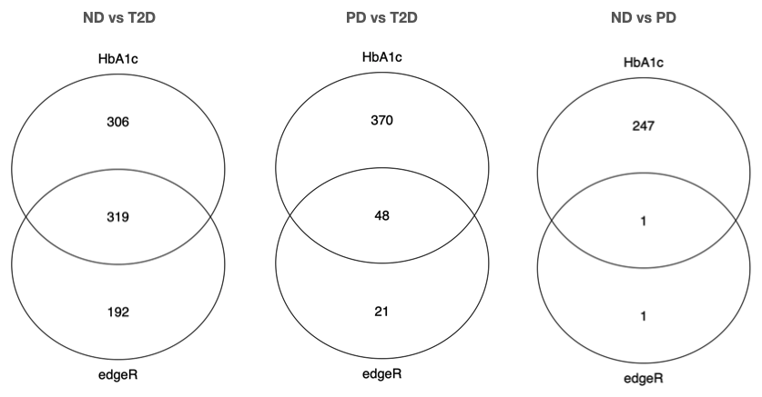
```

We find that the two methods produce largely different results. In ND vs T2D analysis, there are several common and HbA1c-unique hits. Still, a relatively large set of 192 genes are uniquely identified by the edgeR model only. It is worth summarizing these significant genes in heatmaps:

```{r,beta_hba1c_5,eval=FALSE}
# read the pseudobulk data
y<-beta$Counts
desi<-beta$Design
ww<-which(desi$Condition!="PD")
y<-y[,ww]
desi<-desi[ww,]
sl<-order(desi$Condition,desi$HbA1c)
desi<-desi[sl,]
y<-y[,sl]

# normalize the counts
cpms <- edgeR::cpm(y)
log_cpm <- log2(cpms+1)

# load the common genes
genes1 <- attributes(v1)$intersections$'edgeR:HbA1c'

# load the edgeR genes
genes2 <- attributes(v1)$intersections$'edgeR'

# load the HbA1c genes
genes3 <- attributes(v1)$intersections$'HbA1c'


# filter the data and remove the batch effects
sub_samp1 <- log_cpm[match(genes1,rownames(log_cpm),nomatch=0), ]
sub_samp1<-removeBatchEffect(sub_samp1,batch=desi$Chemistry,batch2=desi$Sex)
sub_samp2 <- log_cpm[match(genes2,rownames(log_cpm),nomatch=0), ]
sub_samp2<-removeBatchEffect(sub_samp2,batch=desi$Chemistry,batch2=desi$Sex)
sub_samp3 <- log_cpm[match(genes3,rownames(log_cpm),nomatch=0), ]
sub_samp3<-removeBatchEffect(sub_samp3,batch=desi$Chemistry,batch2=desi$Sex)

# define the labels and colors
ann_col<-data.frame(Annot=desi$Condition)
rownames(ann_col)<-rownames(desi)

# heatmap of common
grid::current.viewport()
p1<-pheatmap(as.matrix(sub_samp1),
               color = grDevices::colorRampPalette(c("blue1","blue1", "white",
                                                     "firebrick2","firebrick2"))(1000),
               scale="row",
               show_colnames=F,
               show_rownames = F,
               clustering_distancerows = "euclidean",
               treeheight_col = 0,
               fontsize = 6,
               cluster_cols=F,
               cluster_rows = T,
               annotation_col = ann_col)

# heatmap of edgeR
grid::current.viewport()
p2<-pheatmap(as.matrix(sub_samp2),
               color = grDevices::colorRampPalette(c("blue1","blue1", "white",
                                                     "firebrick2","firebrick2"))(1000),
               scale="row",
               show_colnames=F,
               show_rownames = F,
               clustering_distancerows = "euclidean",
               treeheight_col = 0,
               fontsize = 6,
               cluster_cols=F,
               cluster_rows = T,
               annotation_col = ann_col)

# heatmap of HbA1c
grid::current.viewport()
p3<-pheatmap(as.matrix(sub_samp3),
               color = grDevices::colorRampPalette(c("blue1","blue1", "white",
                                                     "firebrick2","firebrick2"))(1000),
               scale="row",
               show_colnames=F,
               show_rownames = F,
               clustering_distancerows = "euclidean",
               treeheight_col = 0,
               fontsize = 6,
               cluster_cols=F,
               cluster_rows = T,
               annotation_col = ann_col)
```

```{r beta_hba1c_5_plot1, echo = FALSE, message=FALSE, fig.align='left', fig.cap='Heatmaps of differentially expressed genes. Left: Common by edgeR and HbA1c analysis. Middle: EdgeR only. Right: HbA1c only.'}
knitr::include_graphics("heatmap_hba1c.png")
```

As expected, the common genes show strong ND and T2D signatures (left heatmap panel). Several new hits emerge from the HbA1c analysis (right heatmap panel). Many of the edgeR-specific and HbA1c-specific genes exhibit relatively large variability (cmpared to the common). To see what has been missed by each method, we characterize the edgeR and HbA1c only sets by GO enrichment analysis (biological processes).

```{r,beta_hba1c_6.1,eval=TRUE,echo=FALSE}
genes.attr<-read.table(paste(folder,"Human_transcripts_to_genes.txt",sep=""),sep="\t",header=T)
y<-beta$Counts
desi<-beta$Design
ww<-which(desi$Condition!="PD")
y<-y[,ww]
desi<-desi[ww,]
sl<-order(desi$Condition,desi$HbA1c)
desi<-desi[sl,]
y<-y[,sl]
cpms <- edgeR::cpm(y)
log_cpm <- log2(cpms+1)
genes1 <- attributes(v1)$intersections$'edgeR:HbA1c'
genes2 <- attributes(v1)$intersections$'edgeR'
genes3 <- attributes(v1)$intersections$'HbA1c'
sub_samp1 <- log_cpm[match(genes1,rownames(log_cpm),nomatch=0), ]
sub_samp1<-removeBatchEffect(sub_samp1,batch=desi$Chemistry,batch2=desi$Sex)
sub_samp2 <- log_cpm[match(genes2,rownames(log_cpm),nomatch=0), ]
sub_samp2<-removeBatchEffect(sub_samp2,batch=desi$Chemistry,batch2=desi$Sex)
sub_samp3 <- log_cpm[match(genes3,rownames(log_cpm),nomatch=0), ]
sub_samp3<-removeBatchEffect(sub_samp3,batch=desi$Chemistry,batch2=desi$Sex)
```

```{r,beta_hba1c_6,eval=TRUE}
# enriched terms in the ND upregulated genes
x2<-res_NDvsT2D$DE[match(rownames(sub_samp2),res_NDvsT2D$DE$Symbol),]
x2.up<-x2[x2$logFC>0,]
up <- x2.up$logFC
names(up)<-x2.up$Symbol
up<-up[sort.list(up,decreasing=T)]
ego_up <- enrichGO(gene = names(up),
        OrgDb     = org.Hs.eg.db,
        keyType    = "SYMBOL",
        ont      = "BP",
        pAdjustMethod = "BH",
        pvalueCutoff = 0.05,
        qvalueCutoff = 0.1)
ego_up.df<-summary(ego_up)
ego_up.df

# enriched terms in the T2D upregulated genes
x2.down<-x2[x2$logFC<0,]
down <- x2.down$logFC
names(down)<-x2.down$Symbol
down<-down[sort.list(down,decreasing=T)]
ego_down <- enrichGO(gene = names(down),
        OrgDb     = org.Hs.eg.db,
        keyType    = "SYMBOL",
        ont      = "BP",
        pAdjustMethod = "BH",
        pvalueCutoff = 0.05,
        qvalueCutoff = 0.1)
ego_down.df<-summary(ego_down)
ego_down.df
```

GO analysis with clusterProfiler detected only one enriched GO term only in the T2D upregulated list, regulation of membrane potential, at $qvalue = 10\%$.

```{r,beta_hba1c_7,eval=TRUE}
# number of enriched terms in the ND upregulated genes
x3<-res_NDvsT2D$DE[match(rownames(sub_samp3),res_NDvsT2D$DE$Symbol),]
x3.up<-x3[x3$logFC>0,]
up <- x3.up$logFC
names(up)<-x3.up$Symbol
up<-up[sort.list(up,decreasing=T)]
ego_up <- enrichGO(gene = names(up),
        OrgDb     = org.Hs.eg.db,
        keyType    = "SYMBOL",
        ont      = "BP",
        pAdjustMethod = "BH",
        pvalueCutoff = 0.05,
        qvalueCutoff = 0.1)
ego_up.df<-summary(ego_up)
nrow(ego_up.df)
ego_up.df[c(11,13,21,22,55),]

# number of enriched terms in the T2D upregulated genes
x3.down<-x3[x3$logFC<0,]
down <- x3.down$logFC
names(down)<-x3.down$Symbol
down<-down[sort.list(down,decreasing=T)]
ego_down <- enrichGO(gene = names(down),
        OrgDb     = org.Hs.eg.db,
        keyType    = "SYMBOL",
        ont      = "BP",
        pAdjustMethod = "BH",
        pvalueCutoff = 0.05,
        qvalueCutoff = 0.1)
ego_down.df<-summary(ego_down)
nrow(ego_down.df)
ego_down.df[c(1,5,17,22,29),]
```

Much richer results are obtained in the HbA1c analysis. There are 67 enriched terms in the ND upregulated list several of which are related to hormone secretion / transport (5 examples are provided). On the other hand, the T2D upregulated list enriches for 95 terms, highly related to immune response (5 examples are provided). All these genes show weaker signal than those found commonly by the edgeR and the HbA1c model but nevertheless are biologically meaningful and statistically significant.

Another aspect of this analysis is the discovery of several candidates separating PD and T2D as well as the more challenging ND and PD conditions. For simplicity we will only show the genes found by HbA1c, i.e. the intersection and the HbA1c-specific parts of the above venn diagrams.

```{r,beta_hba1c_8,eval=TRUE}
# read the pseudobulk data
y<-beta$Counts
desi<-beta$Design

# keep the PD vs T2D data and normalize
ww<-which(desi$Condition!="ND")
y<-y[,ww]
desi<-desi[ww,]
sl<-order(desi$Condition,desi$HbA1c)
desi<-desi[sl,]
y<-y[,sl]
cpms <- edgeR::cpm(y)
log_cpm <- log2(cpms+1)

# load the HbA1c genes and make the plot
genes_HbA1c <-rbind( 
          cbind(Genes=attributes(v2)$intersections$'HbA1c',
                Found=rep("HbA1c",length(attributes(v2)$intersections$'HbA1c'))),
          cbind(Genes=attributes(v2)$intersections$'edgeR:HbA1c',
                Found=rep("Common",length(attributes(v2)$intersections$'edgeR:HbA1c')))
                    )
sub_samp <- log_cpm[match(genes_HbA1c[,1],rownames(log_cpm),nomatch=0), ]
sub_samp<-removeBatchEffect(sub_samp,batch=desi$Chemistry,batch2=desi$Sex)
ann_col<-data.frame(Annot=desi$Condition)
rownames(ann_col)<-rownames(desi)
ann_row<-data.frame(Source=genes_HbA1c[,2])
rownames(ann_row)<-genes_HbA1c[,1]

grid::current.viewport()
p1<-pheatmap(as.matrix(sub_samp),
               color = grDevices::colorRampPalette(c("blue1","blue1", "white",
                                                     "firebrick2","firebrick2"))(1000),
               scale="row",
               show_colnames=F,
               show_rownames = F,
               clustering_distancerows = "euclidean",
               treeheight_col = 0,
               fontsize = 6,
               cluster_cols=F,
               cluster_rows = T,
               annotation_col = ann_col,
               annotation_row = ann_row)
```

Our model reports several undetected genes that separate the PD and T2D conditions. GO enrichment analysis of the HbA1c-specific genes reveals that the PD upregulated genes are associated to hormone secretion and hypoxia processes (5 examples are provided). The T2D upregulated genes are highly enriched in immune response processes.  

```{r,beta_hba1c_9,eval=TRUE}
# PD upregulated genes
g<-attributes(v2)$intersections$'HbA1c'
x3<-res_PDvsT2D$DE[match(g,res_PDvsT2D$DE$Symbol),]
x3.up<-x3[x3$logFC>0,]
up <- x3.up$logFC
names(up)<-x3.up$Symbol
up<-up[sort.list(up,decreasing=T)]
ego_up <- enrichGO(gene = names(up),
        OrgDb     = org.Hs.eg.db,
        keyType    = "SYMBOL",
        ont      = "BP",
        pAdjustMethod = "BH",
        pvalueCutoff = 0.05,
        qvalueCutoff = 0.1)
ego_up.df<-summary(ego_up)
dim(ego_up.df)
ego_up.df[6:10,]

# T2D upregulated genes
x3.down<-x3[x3$logFC<0,]
down <- x3.down$logFC
names(down)<-x3.down$Symbol
down<-down[sort.list(down,decreasing=T)]
ego_down <- enrichGO(gene = names(down),
        OrgDb     = org.Hs.eg.db,
        keyType    = "SYMBOL",
        ont      = "BP",
        pAdjustMethod = "BH",
        pvalueCutoff = 0.05,
        qvalueCutoff = 0.1)
ego_down.df<-summary(ego_down)
dim(ego_down.df)
ego_down.df[c(8,12,19,21,62),]
```

We repeat the analysis to the ND vs PD comparison that egdeR reported only 2 significant genes. As expected, the heatmap shows a weak (noisy) separation of PD and ND. 

```{r,beta_hba1c_10,eval=TRUE}
# read the pseudobulk data
y<-beta$Counts
desi<-beta$Design

# keep the ND vs PD data and normalize
ww<-which(desi$Condition!="T2D")
y<-y[,ww]
desi<-desi[ww,]
sl<-order(desi$Condition,desi$HbA1c)
desi<-desi[sl,]
y<-y[,sl]
cpms <- edgeR::cpm(y)
log_cpm <- log2(cpms+1)

# load the HbA1c genes and make the plot
genes_HbA1c <-rbind( 
          cbind(Genes=attributes(v3)$intersections$'HbA1c',
                Found=rep("HbA1c",length(attributes(v3)$intersections$'HbA1c'))),
          cbind(Genes=attributes(v3)$intersections$'edgeR:HbA1c',
                Found=rep("Common",length(attributes(v3)$intersections$'edgeR:HbA1c')))
                    )
sub_samp <- log_cpm[match(genes_HbA1c[,1],rownames(log_cpm),nomatch=0), ]
sub_samp<-removeBatchEffect(sub_samp,batch=desi$Chemistry,batch2=desi$Sex)
ann_col<-data.frame(Annot=desi$Condition)
rownames(ann_col)<-rownames(desi)
ann_row<-data.frame(Source=genes_HbA1c[,2])
rownames(ann_row)<-genes_HbA1c[,1]

grid::current.viewport()
p1<-pheatmap(as.matrix(sub_samp),
               color = grDevices::colorRampPalette(c("blue1","blue1", "white",
                                                     "firebrick2","firebrick2"))(1000),
               scale="row",
               show_colnames=F,
               show_rownames = F,
               clustering_distancerows = "euclidean",
               treeheight_col = 0,
               fontsize = 6,
               cluster_cols=F,
               cluster_rows = T,
               annotation_col = ann_col,
               annotation_row = ann_row)
```

Nevertheless, the GO enrichment analysis shows enrichment of cell adhesion, hormone secretion processes (in ND) and immune-related processes (in PD).

```{r,beta_hba1c_11,eval=TRUE}
# ND upregulated genes
g<-attributes(v3)$intersections$'HbA1c'
x3<-res_NDvsPD$DE[match(g,res_NDvsPD$DE$Symbol),]
x3.up<-x3[x3$logFC>0,]
up <- x3.up$logFC
names(up)<-x3.up$Symbol
up<-up[sort.list(up,decreasing=T)]
ego_up <- enrichGO(gene = names(up),
        OrgDb     = org.Hs.eg.db,
        keyType    = "SYMBOL",
        ont      = "BP",
        pAdjustMethod = "BH",
        pvalueCutoff = 0.05,
        qvalueCutoff = 0.1)
ego_up.df<-summary(ego_up)
ego_up.df[1:10,]

# PD upregulated genes
x3.down<-x3[x3$logFC<0,]
down <- x3.down$logFC
names(down)<-x3.down$Symbol
down<-down[sort.list(down,decreasing=T)]
ego_down <- enrichGO(gene = names(down),
        OrgDb     = org.Hs.eg.db,
        keyType    = "SYMBOL",
        ont      = "BP",
        pAdjustMethod = "BH",
        pvalueCutoff = 0.05,
        qvalueCutoff = 0.1)
ego_down.df<-summary(ego_down)
ego_down.df[c(4,11,13,16,17),]
```

We can visualize the trends in plots depicting all disease states. We selected some indicative examples among the 30 genes whose expression levels vary significantly across all states. In particular, VIM shows a monotonically increasing trend, ACSM3 a monotonically decreasing and CELAB3B's mean expression peaks at PD. 

```{r,beta_hba1c_12,eval=TRUE}
# select the significant genes of the HbA1c model
gg<-unique(c(res_NDvsT2D$DE$Gene[res_NDvsT2D$DE$Significance=="Significant"],
             res_PDvsT2D$DE$Gene[res_PDvsT2D$DE$Significance=="Significant"],
             res_NDvsPD$DE$Gene[res_NDvsPD$DE$Significance=="Significant"]))
x1<-res_NDvsT2D$DE[match(gg,res_NDvsT2D$DE$Gene),]
x2<-res_PDvsT2D$DE[match(gg,res_PDvsT2D$DE$Gene),]
x3<-res_NDvsPD$DE[match(gg,res_NDvsPD$DE$Gene),]

# summarize the 'significance' labels in a matrix
stats<-matrix(0,1,4)
for(i in 1:nrow(x1)){
  if(!is.na(x1$Gene[i]) & !is.na(x2$Gene[i]) & !is.na(x3$Gene[i])){
    stats<-rbind(stats,matrix(c(gg[i],x1$Significance[i],
                                      x2$Significance[i],
                                      x3$Significance[i]),
                                      nrow=1))
  }
}
stats<-stats[-1,]

# keep the genes that are significant in all comparisons
ww<-which(stats[,2]=="Significant" & stats[,3]=="Significant" & stats[,4]=="Significant")
stats.all<-stats[ww,]
GeneNames(stats.all[,1])

# plot a monotonically increasing gene
p1<-plot_hb(data=beta,genes.attr=genes.attr,conds=c("ND","PD","T2D"),
            genes2plot=stats.all[6,1],normalize.data=TRUE,plot.formula="y~x")

# plot a monotonically decreasing gene
p2<-plot_hb(data=beta,genes.attr=genes.attr,conds=c("ND","PD","T2D"),
            genes2plot=stats.all[16,1],normalize.data=TRUE,plot.formula="y~x")

# plot a gene that peaks in PD
p3<-plot_hb(data=beta,genes.attr=genes.attr,conds=c("ND","PD","T2D"),
            genes2plot=stats.all[15,1],normalize.data=TRUE,plot.formula="y~poly(x,2)")
```

With respect to edgeR estimates for these particular genes we notice that only CELAB3B is not identified in ND vs T2D but none of them is found in PD vs T2D and ND vs PD. Our plots indicate a visually clear separation of the three disease states, at least for VIM and ACSM3. Several such examples can be found in our list.   


```{r,beta_hba1c_13,eval=TRUE}
# HbA1c and edgeR's estimates for these three genes in ND vs T2D
res_NDvsT2D$DE[match(c("ENSG00000026025:VIM",
                       "ENSG00000005187:ACSM3",
                       "ENSG00000219073:CELA3B"),
                    res_NDvsT2D$DE$Gene),]

# HbA1c and edgeR's estimates for these three genes in PD vs T2D
res_PDvsT2D$DE[match(c("ENSG00000026025:VIM",
                       "ENSG00000005187:ACSM3",
                       "ENSG00000219073:CELA3B"),
                    res_PDvsT2D$DE$Gene),]

# HbA1c and edgeR's estimates for these three genes in PD vs T2D
res_NDvsPD$DE[match(c("ENSG00000026025:VIM",
                       "ENSG00000005187:ACSM3",
                       "ENSG00000219073:CELA3B"),
                    res_NDvsPD$DE$Gene),]

```

A global view of the HbA1c-detected genes is shown in the heatmap below. Once more we observe strong ND and T2D signatures and weaker, intermediate, PD without a clear gene signature. PD seem to be similar to the ND condition. 

```{r,beta_hba1c_14,eval=TRUE}
# read the pseudobulk data
y<-beta$Counts
desi<-beta$Design
sl<-order(desi$Condition,desi$HbA1c)
desi<-desi[sl,]
y<-y[,sl]

# keep the ND vs PD data and normalize
cpms <- edgeR::cpm(y)
log_cpm <- log2(cpms+1)

# load the HbA1c genes and make the plot
genes_HbA1c <-unique(
                    c(attributes(v1)$intersections$'HbA1c',
                      attributes(v1)$intersections$'edgeR:HbA1c',
                      attributes(v2)$intersections$'HbA1c',
                      attributes(v2)$intersections$'edgeR:HbA1c',
                      attributes(v3)$intersections$'HbA1c',
                      attributes(v3)$intersections$'edgeR:HbA1c')
                    )

sub_samp <- log_cpm[match(genes_HbA1c,rownames(log_cpm),nomatch=0), ]
sub_samp<-removeBatchEffect(sub_samp,batch=desi$Chemistry,batch2=desi$Sex)
ann_col<-data.frame(Annot=desi$Condition)
rownames(ann_col)<-rownames(desi)

grid::current.viewport()
p1<-pheatmap(as.matrix(sub_samp),
               color = grDevices::colorRampPalette(c("blue1","blue1", "white",
                                                     "firebrick2","firebrick2"))(1000),
               scale="row",
               show_colnames=F,
               show_rownames = F,
               clustering_distancerows = "euclidean",
               treeheight_col = 0,
               fontsize = 6,
               cluster_cols=F,
               cluster_rows = T,
               annotation_col = ann_col)

```


### 12.2. Alpha cells

In Alpha cells edgeR failed to detect any significant genes. Similar results were produced in the other cell types of this study. Here we show the performance of the HbA1c model in Alpha cells which, together with Beta, are of primary interest.

```{r,alpha_hba1c_1,eval=FALSE}
# read the gene annotation information
genes.attr<-read.table(paste(folder,"Human_transcripts_to_genes.txt",sep=""),sep="\t",header=T)

# run the ND vs T2D analysis and show top 5
res_NDvsT2D<-hb_fun(data=alpha,genes.attr=genes.attr,conds=c("ND","T2D"),
                    include.chemistry=TRUE,model.df=2)
## [1] "Assuming that rownames(counts) are gene symbols. Converting them to EnsemblID:Symbol!"
## [1] "Estimating size factors and dispersions..."
## [1] "Variable filters was not defined. All data will be used for analysis!"
## [1] "Setting HbA1c as pseudotime."
## [1] "9 unique pseudotimes (out of 17) in branch 1"
## [1] "16 unique pseudotimes (out of 17) in branch 2"
## [1] "Now running LorgnetteDE for all data (joined branches )..."
```

```{r,alpha_hba1c_1.1,eval=TRUE,echo=FALSE}
res_NDvsT2D<-readRDS(paste(folder,"NDvsT2D_Alpha.rds",sep=""))
```

```{r,alpha_hba1c_1.2,eval=TRUE}
# show the top 5 genes
res_NDvsT2D$DE$Comb<-apply(res_NDvsT2D$DE[,c(1,7)],1,paste,collapse=": qval=")
res_NDvsT2D$DE$Significance<-ifelse(res_NDvsT2D$DE$qval<=0.05 & 
                                      abs(res_NDvsT2D$DE$logFC)>=0.585,
                                                "Significant","Non-significant")
res_NDvsT2D$DE<-res_NDvsT2D$DE[sort.list(res_NDvsT2D$DE$qval),]
head(res_NDvsT2D$DE)

# show the number of significant genes
tab<-table(res_NDvsT2D$DE$qval<=0.05,abs(res_NDvsT2D$DE$logFC)>0.585)
rownames(tab)<-c("qval>5%","qval<=5%")
colnames(tab)<-c("|logFC|<0.585","|logFC|>=0.585")
tab
```


```{r,alpha_hba1c_2,eval=FALSE}
# run the PD vs T2D analysis and show top 5
res_PDvsT2D<-hb_fun(data=alpha,genes.attr=genes.attr,conds=c("PD","T2D"),
                    include.chemistry=FALSE,model.df=2)
## [1] "Assuming that rownames(counts) are gene symbols. Converting them to EnsemblID:Symbol!"
## [1] "Estimating size factors and dispersions..."
## [1] "Variable filters was not defined. All data will be used for analysis!"
## [1] "Setting HbA1c as pseudotime."
## [1] "6 unique pseudotimes (out of 13) in branch 1"
## [1] "9 unique pseudotimes (out of 10) in branch 2"
## [1] "Now running LorgnetteDE for all data (joined branches )..."
```

```{r,alpha_hba1c_2.1,eval=TRUE,echo=FALSE}
res_PDvsT2D<-readRDS(paste(folder,"PDvsT2D_Alpha.rds",sep=""))
```

```{r,alpha_hba1c_2.2,eval=TRUE}
# show the top 5 genes
res_PDvsT2D$DE$Comb<-apply(res_PDvsT2D$DE[,c(1,7)],1,paste,collapse=": qval=")
res_PDvsT2D$DE$Significance<-ifelse(res_PDvsT2D$DE$qval<=0.05 & 
                                      abs(res_PDvsT2D$DE$logFC)>=0.585,
                                                "Significant","Non-significant")
res_PDvsT2D$DE<-res_PDvsT2D$DE[sort.list(res_PDvsT2D$DE$qval),]
head(res_PDvsT2D$DE)

# show the number of significant genes
tab<-table(res_PDvsT2D$DE$qval<=0.05,abs(res_PDvsT2D$DE$logFC)>0.585)
rownames(tab)<-c("qval>5%","qval<=5%")
colnames(tab)<-c("|logFC|<0.585","|logFC|>=0.585")
tab
```

```{r,alpha_hba1c_3,eval=FALSE}
# run the ND vs PD analysis and show top 5
res_NDvsPD<-hb_fun(data=alpha,genes.attr=genes.attr,conds=c("ND","PD"),
                    include.chemistry=FALSE,model.df=2)
## [1] "Assuming that rownames(counts) are gene symbols. Converting them to EnsemblID:Symbol!"
## [1] "Estimating size factors and dispersions..."
## [1] "Variable filters was not defined. All data will be used for analysis!"
## [1] "Setting HbA1c as pseudotime."
## [1] "8 unique pseudotimes (out of 13) in branch 1"
## [1] "6 unique pseudotimes (out of 13) in branch 2"
## [1] "Now running LorgnetteDE for all data (joined branches )..."
```

```{r,alpha_hba1c_3.1,eval=TRUE,echo=FALSE}
res_NDvsPD<-readRDS(paste(folder,"NDvsPD_Alpha.rds",sep=""))
```

```{r,alpha_hba1c_3.2,eval=TRUE}
# show the top 5 genes
res_NDvsPD$DE$Comb<-apply(res_NDvsPD$DE[,c(1,7)],1,paste,collapse=": qval=")
res_NDvsPD$DE$Significance<-ifelse(res_NDvsPD$DE$qval<=0.05 & 
                                      abs(res_NDvsPD$DE$logFC)>=0.585,
                                                "Significant","Non-significant")
res_NDvsPD$DE<-res_NDvsPD$DE[sort.list(res_NDvsPD$DE$qval),]
head(res_NDvsPD$DE)

# show the number of significant genes
tab<-table(res_NDvsPD$DE$qval<=0.05,abs(res_NDvsPD$DE$logFC)>0.585)
rownames(tab)<-c("qval>5%","qval<=5%")
colnames(tab)<-c("|logFC|<0.585","|logFC|>=0.585")
tab
```

The model detects several differentially expressed genes across the various comparisons. Below we summarize the GO enrichment analysis for each of these sets. We start with the ND vs T2D DE genes where we find hormone secretion processes in ND and immune response in the T2D upregulated list.

```{r,alpha_hba1c_4,eval=TRUE}
# ND vs T2D DE genes
x1<-res_NDvsT2D$DE[res_NDvsT2D$DE$Significance=="Significant",]

# GO terms in ND > T2D (ND upregulated)
x1.up<-x1[x1$logFC>0,]
up <- x1.up$logFC
names(up)<-x1.up$Symbol
up<-up[sort.list(up,decreasing=T)]
ego_up <- enrichGO(gene = names(up),
        OrgDb     = org.Hs.eg.db,
        keyType    = "SYMBOL",
        ont      = "BP",
        pAdjustMethod = "BH",
        pvalueCutoff = 0.05,
        qvalueCutoff = 0.1)
ego_up.df<-summary(ego_up)
ego_up.df[c(1,12,26,29),]

# GO terms in ND < T2D (T2D upregulated)
x1.down<-x1[x1$logFC<0,]
down <- x1.down$logFC
names(down)<-x1.down$Symbol
down<-down[sort.list(down,decreasing=T)]
ego_down <- enrichGO(gene = names(down),
        OrgDb     = org.Hs.eg.db,
        keyType    = "SYMBOL",
        ont      = "BP",
        pAdjustMethod = "BH",
        pvalueCutoff = 0.05,
        qvalueCutoff = 0.1)
ego_down.df<-summary(ego_down)
head(ego_down.df)
```

In the PD vs T2D comparison, the PD upregulated genes enrich for metabolic and homeostasis processes while the T2D upregulated genes enrich as before for immune response processes.

```{r,alpha_hba1c_5,eval=TRUE}
# PD vs T2D DE genes
x2<-res_PDvsT2D$DE[res_PDvsT2D$DE$Significance=="Significant",]

# GO terms in PD > T2D (PD upregulated)
x2.up<-x2[x2$logFC>0,]
up <- x2.up$logFC
names(up)<-x2.up$Symbol
up<-up[sort.list(up,decreasing=T)]
ego_up <- enrichGO(gene = names(up),
        OrgDb     = org.Hs.eg.db,
        keyType    = "SYMBOL",
        ont      = "BP",
        pAdjustMethod = "BH",
        pvalueCutoff = 0.05,
        qvalueCutoff = 0.1)
ego_up.df<-summary(ego_up)
ego_up.df[c(1,9,11,18),]

# GO terms in PD < T2D (T2D upregulated)
x2.down<-x2[x2$logFC<0,]
down <- x2.down$logFC
names(down)<-x2.down$Symbol
down<-down[sort.list(down,decreasing=T)]
ego_down <- enrichGO(gene = names(down),
        OrgDb     = org.Hs.eg.db,
        keyType    = "SYMBOL",
        ont      = "BP",
        pAdjustMethod = "BH",
        pvalueCutoff = 0.05,
        qvalueCutoff = 0.1)
ego_down.df<-summary(ego_down)
head(ego_down.df)
```

Finally, in the ND vs PD comparison, the PD upregulated genes are strongly associated to immune response.

```{r,alpha_hba1c_6,eval=TRUE}
# ND vs PD DE genes
x3<-res_NDvsPD$DE[res_NDvsPD$DE$Significance=="Significant",]

# GO terms in ND > PD (ND upregulated)
x3.up<-x3[x3$logFC>0,]
up <- x3.up$logFC
names(up)<-x3.up$Symbol
up<-up[sort.list(up,decreasing=T)]
ego_up <- enrichGO(gene = names(up),
        OrgDb     = org.Hs.eg.db,
        keyType    = "SYMBOL",
        ont      = "BP",
        pAdjustMethod = "BH",
        pvalueCutoff = 0.05,
        qvalueCutoff = 0.1)
ego_up.df<-summary(ego_up)
ego_up.df

# GO terms in ND < PD (PD upregulated)
x3.down<-x3[x3$logFC<0,]
down <- x3.down$logFC
names(down)<-x3.down$Symbol
down<-down[sort.list(down,decreasing=T)]
ego_down <- enrichGO(gene = names(down),
        OrgDb     = org.Hs.eg.db,
        keyType    = "SYMBOL",
        ont      = "BP",
        pAdjustMethod = "BH",
        pvalueCutoff = 0.05,
        qvalueCutoff = 0.1)
ego_down.df<-summary(ego_down)
head(ego_down.df)
```

We generate a heatmap of the significant genes in Alpha cells to examine the existence of condition-specific signatures. Such signatures exist in ND and T2D but the differences are weaker than what have been observed in Beta cells. 

```{r,alpha_hba1c_7,eval=TRUE}
# read the pseudobulk data
y<-alpha$Counts
desi<-alpha$Design
sl<-order(desi$Condition,desi$HbA1c)
desi<-desi[sl,]
y<-y[,sl]

# keep the ND vs PD data and normalize
cpms <- edgeR::cpm(y)
log_cpm <- log2(cpms+1)

# load the HbA1c genes and make the plot
genes_HbA1c <-unique(
                    c(res_NDvsT2D$DE$Symbol[res_NDvsT2D$DE$Significance=="Significant"],
                      res_PDvsT2D$DE$Symbol[res_PDvsT2D$DE$Significance=="Significant"],
                      res_NDvsPD$DE$Symbol[res_NDvsPD$DE$Significance=="Significant"])
                    )

sub_samp <- log_cpm[match(genes_HbA1c,rownames(log_cpm),nomatch=0), ]
sub_samp<-removeBatchEffect(sub_samp,batch=desi$Chemistry,batch2=desi$Sex)
ann_col<-data.frame(Annot=desi$Condition)
rownames(ann_col)<-rownames(desi)

grid::current.viewport()
p1<-pheatmap(as.matrix(sub_samp),
               color = grDevices::colorRampPalette(c("blue1","blue1", "white",
                                                     "firebrick2","firebrick2"))(1000),
               scale="row",
               show_colnames=F,
               show_rownames = F,
               clustering_distancerows = "euclidean",
               treeheight_col = 0,
               fontsize = 6,
               cluster_cols=F,
               cluster_rows = T,
               annotation_col = ann_col)
```

# 13. Other comparisons

In this paragraph we will estimate genes whose expression varies across BMI or Age after adjusting for Sex, Race and Age or BMI, respectively. We will use the above NB general linear model after replacing HbA1c with BMI or Age respectively. To account for the confounding between Age / BMI and T2D effects,  only the ND and PD donors are considered. For simplicity, we will only show the case of Beta cells but the results of all other cell types can be obtained in the same way.

### 13.1. BMI effects

The model is specified as before but this time HbA1c is replaced with BMI. The extra criterion considered, replacing the $|\log_2 FC| \geq 0.585$, is  the Pearson correlation coefficient between gene's *i* log-normalized expression and BMI with cutoff $|\rho|>0.4$. The analysis is carried out with the **hb_fun2()** function. 

```{r,BMI_1,eval=FALSE}
# read the gene annotation information
genes.attr<-read.table(paste(folder,"Human_transcripts_to_genes.txt",sep=""),sep="\t",header=T)

# run the BMI analysis
res_bmi<-hb_fun2(data=beta,genes.attr=genes.attr,conds=c("ND","PD"),x="BMI",include.chemistry=FALSE)
## [1] "Assuming that rownames(counts) are gene symbols. Converting them to EnsemblID:Symbol!"
## [1] "Estimating size factors and dispersions..."
## [1] "Variable filters was not defined. All data will be used for analysis!"
## [1] "Setting BMI as pseudotime."
## [1] "12 unique pseudotimes (out of 13) in branch 1"
## [1] "13 unique pseudotimes (out of 13) in branch 2"
## [1] "Now running LorgnetteDE for all data (joined branches )..."
```

```{r,BMI_1.1,eval=TRUE,echo=FALSE}
res_bmi<-read.table(paste(folder,"BMI_analysis.txt",sep=""),sep="\t",header=T)
```

```{r,BMI_1.2,eval=TRUE}
# show the top 5 genes
res_bmi$Significance<-ifelse(res_bmi$qval<=0.05 & 
                               abs(as.numeric(as.character(res_bmi$CorrCoef)))>=0.4,
                                 "Significant","Non-significant")
res_bmi<-res_bmi[order(res_bmi$Significance,
                       abs(as.numeric(as.character(res_bmi$CorrCoef))),decreasing=T),]
head(res_bmi)

# number of significant hits
tt<-table(as.numeric(as.character(res_bmi$CorrCoef))>0,res_bmi$Significance)
rownames(tt)<-c("rho <= -0.4","rho >= 0.4")
colnames(tt)<-c("qval > 0.05","qval <= 0.05")
tt
```

We find 27 genes whose log-normalized expression is positively correlated with BMI and 27 whose log-normalized expression is anti-correlated with BMI at $qval \leg 5\%$ and $|\rho|>0.4$.

### 13.2. Age effects

We repeat the above analysis focusing on the Age factor. The analysis gives back 121 genes whose expression is positively correlated to Age and 62 whose expression is anticorrelated to Age.

```{r,Age_1,eval=FALSE}
# read the gene annotation information
genes.attr<-read.table(paste(folder,"Human_transcripts_to_genes.txt",sep=""),sep="\t",header=T)

# run the BMI analysis
res_age<-hb_fun2(data=beta,genes.attr=genes.attr,conds=c("ND","PD"),x="Age",include.chemistry=FALSE)
## [1] "Assuming that rownames(counts) are gene symbols. Converting them to EnsemblID:Symbol!"
## [1] "Estimating size factors and dispersions..."
## [1] "Variable filters was not defined. All data will be used for analysis!"
## [1] "Setting Age as pseudotime."
## [1] "11 unique pseudotimes (out of 13) in branch 1"
## [1] "13 unique pseudotimes (out of 13) in branch 2"
## [1] "Now running LorgnetteDE for all data (joined branches )..."
```

```{r,Age_1.1,eval=TRUE,echo=FALSE}
res_age<-read.table(paste(folder,"Age_analysis.txt",sep=""),sep="\t",header=T)
```

```{r,Age_1.2,eval=TRUE}
# show the top 5 genes
res_age$Significance<-ifelse(res_age$qval<=0.05 & 
                               abs(as.numeric(as.character(res_age$CorrCoef)))>=0.4,
                                 "Significant","Non-significant")
res_age<-res_age[order(res_age$Significance,
                       abs(as.numeric(as.character(res_age$CorrCoef))),decreasing=T),]
head(res_age)

# number of significant hits
tt<-table(as.numeric(as.character(res_age$CorrCoef))>0,res_age$Significance)
rownames(tt)<-c("rho <= -0.4","rho >= 0.4")
colnames(tt)<-c("qval > 0.05","qval <= 0.05")
tt
```

# 14. Subclustering

We would like to examine in more detail the functional characteristics of the endocrine cell types and identify subtypes related to the disease state or other important factors. Such subtypes should be associated with specific gene signatures and functions that we will recover via differential expression and pathway enrichment analysis. To this extent, we utilize cell subclustering in Seurat. We will subcluster the Beta and the Alpha cells for which we have adequately large sample sizes.  

### 14.1. Beta cell subclustering

The subclustering was performed on the 99,029 beta cells. The merged data were re-integrated with Harmony, adjusting for sex, chemistry, race and age. The clustering was done with Leuven and resolution parameter 0.5.

```{r,betasub0,eval=FALSE}
betasubMeta<-read.table(paste(folder,"betasubcl_meta.txt",sep=""),sep="\t",header=T)
```

```{r,betasub1,eval=FALSE}
# read the single-cell data
dat<-readRDS("/path/to/final/IntegratedData.rds")

# select the beta cells
beta.dat<-subset(dat,subset=Clusters=="Beta")

# integrate with harmony
beta.sub <- beta.dat %>%
            RunHarmony(group.by.vars = c("Chemistry","Sex","Race","Age"))

# cluster the data
beta.sub <- beta.sub %>%
            RunUMAP(reduction = "harmony", dims = 1:10) %>%
            FindNeighbors(reduction = "harmony", dims = 1:10) %>%
            FindClusters(resolution = 0.5) %>%
            identity()

# store the data
beta.sub<-saveRDS(beta.sub,"/path/to/Beta/subclusters.rds")
```

```{r,betasub1.1,eval=TRUE,echo=FALSE}
betasubMeta<-read.table(paste(folder,"betasubcl_meta.txt",sep=""),sep="\t",header=T)
```

We examine the number of cells per cluster in overall and across other experimental factors:

```{r,betasub1.2,eval=TRUE}
# see the number of cells per cluster
table(betasubMeta$seurat_clusters)

# see the number of cells per cluster and disease state
table(betasubMeta$seurat_clusters,betasubMeta$Condition)

# see the number of cells per cluster and chemistry
table(betasubMeta$seurat_clusters,betasubMeta$Chemistry)

# see the number of cells per cluster and sex
table(betasubMeta$seurat_clusters,betasubMeta$Sex)

# see the number of cells per cluster and race
table(betasubMeta$seurat_clusters,betasubMeta$Race)
```

We also visualize the above information on the UMAP plots:

```{r,betasub2,eval=FALSE}
DimPlot(beta.sub, reduction = "umap", label = TRUE, raster= FALSE)
```

```{r betasub2_plot1, echo = FALSE, message=FALSE, fig.align='left', fig.cap='Subclustering of Beta cells.'}
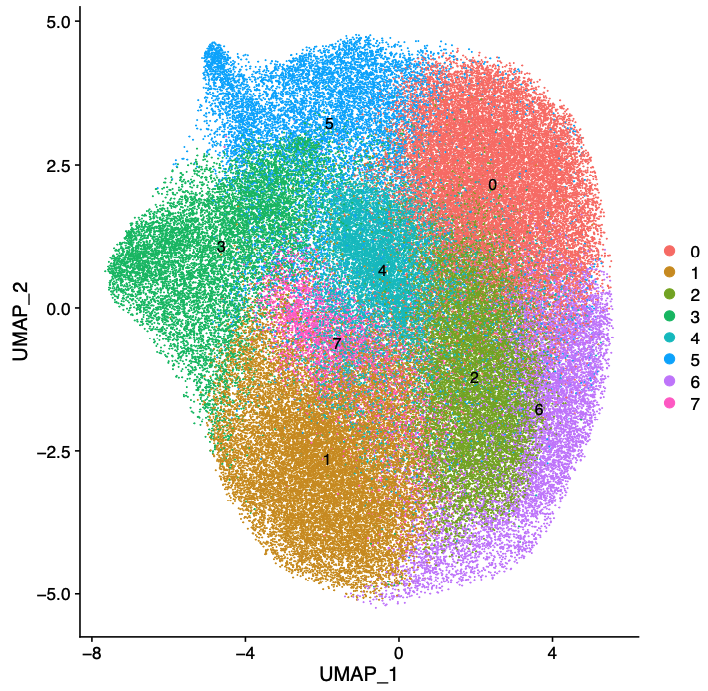
```

We can also see how the clinical and technical factors are integrated. First the disease state:

```{r,betasub3,eval=FALSE}
DimPlot(beta.sub, reduction = "umap", label = TRUE, raster= FALSE, split.by= 'Condition')
```

```{r betasub3_plot1, echo = FALSE, message=FALSE, fig.align='left', fig.cap='Subclusters of Beta cells across disease states.'}
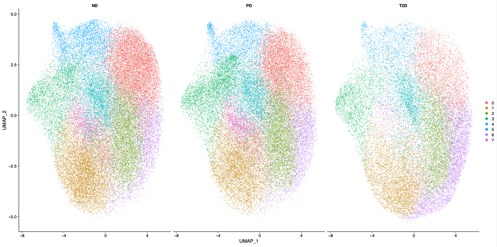
```

We observe that the disease states are enriched in certain subclusters. For example, cluster 0 (top/right) seem to be populated by mostly ND cells, implying that the PD and T2D co-located there might also be ND-like. To see more clearly the distribution of the disease states across clusters we use boxplots.

```{r,betasub4,eval=FALSE}
# read the pre-saved beta subcluster meta data
betasubMeta<-read.table(paste(folder,"betasubcl_meta.txt",sep=""),sep="\t",header=T)

# calculate the percentge of cells per cluster and donor
df<-table(betasubMeta$Islet,betasubMeta$seurat_clusters)
for(i in 1:nrow(df)){
    df[i,]<-100*df[i,]/sum(df[i,])
}

# add the condition variable
cond<-unique(betasubMeta[,c(18,11,10,12,14)])
cond<-cond[match(rownames(df),cond[,1]),]
df<-data.frame(df,Condition=factor(cond[,2],levels=c("ND","PD","T2D")),
                  Chemistry=factor(cond[,3],levels=c("V2","V3")),
                  Sex=factor(cond[,4],levels=c("M","F")),
                  Race=factor(cond[,5],levels=c("W","H","AA")))
colnames(df)<-c("Islet","Subcluster","Perc",
                "Condition","Chemistry","Sex","Race")

# specify the pairwise comparisons (for the plot)
my_comparisons <- list( c("ND", "PD"), c("PD", "T2D"), c("ND", "T2D") )

# plot the result
p <- ggplot(data = df, aes(x=Condition, y=Perc)) + ylim(0,80) + ylab("Percentage of cells") +
            geom_boxplot(aes(fill=Condition),outlier.shape = NA) +
            geom_jitter(size=0.4)
p + facet_wrap( ~ Subcluster, scales="free") +
    stat_compare_means(comparisons = my_comparisons,size=3)
```

```{r betasub4_plot1, echo = FALSE, message=FALSE, fig.align='left', fig.cap='Percentage of cells per beta subcluster and donor. Wilcoxon p-values are depicted.'}
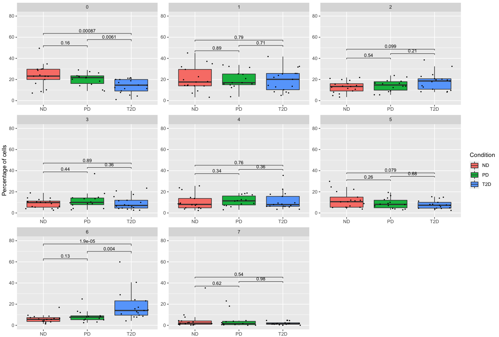
```

```{r,betasub4.1,eval=TRUE,echo=FALSE}
# read the pre-saved beta subcluster meta data
betasubMeta<-read.table(paste(folder,"betasubcl_meta.txt",sep=""),sep="\t",header=T)
df<-table(betasubMeta$Islet,betasubMeta$seurat_clusters)
for(i in 1:nrow(df)){
    df[i,]<-100*df[i,]/sum(df[i,])
}
cond<-unique(betasubMeta[,c(18,11,10,12,14)])
cond<-cond[match(rownames(df),cond[,1]),]
df<-data.frame(df,Condition=factor(cond[,2],levels=c("ND","PD","T2D")),
                  Chemistry=factor(cond[,3],levels=c("V2","V3")),
                  Sex=factor(cond[,4],levels=c("M","F")),
                  Race=factor(cond[,5],levels=c("W","H","AA")))
colnames(df)<-c("Islet","Subcluster","Perc",
                "Condition","Chemistry","Sex","Race")
```

Using the Wilcoxon non-parametric test, we find that the number of T2D cells in Cluster 0 are statistically less than both those of ND and PD at $\alpha = 5\%$ (T2D vs ND FDR = 0.0104; T2D vs PD FDR = 0.036). On the other hand, Cluster 6 is enriched in T2D cells which are statistically more than both the ND and PD at $\alpha = 5\%$ (BH adjusted p-value for T2D vs ND: 0.000449; BH adjusted p-value for T2D vs PD: 0.032).

```{r,betasub5,eval=TRUE}
stat.test <- df %>%
  group_by(Subcluster) %>%
  wilcox_test(Perc ~ Condition) %>%
  adjust_pvalue(method = "BH") %>%
  add_significance()
stat.test[stat.test$Subcluster==0 |
          stat.test$Subcluster==6,]
```

The integration of chemistry, sex and race can be visualized on the UMAP.

```{r,betasub6,eval=FALSE}
DimPlot(beta.sub, reduction = "umap", label = TRUE, raster= FALSE, split.by= 'Chemistry')
DimPlot(beta.sub, reduction = "umap", label = TRUE, raster= FALSE, split.by= 'Sex')
DimPlot(beta.sub, reduction = "umap", label = TRUE, raster= FALSE, split.by= 'Race')
```

```{r betasub6_plot1, echo = FALSE, message=FALSE, fig.align='left', fig.cap='Integration of V2 and V3 chemistries in beta subclustering.'}
knitr::include_graphics("beta_sub_chemistry.png")
```

```{r betasub6_plot2, echo = FALSE, message=FALSE, fig.align='left', fig.cap='Integration of Males and Females in beta subclustering.'}
knitr::include_graphics("beta_sub_sex.png")
```

```{r betasub6_plot3, echo = FALSE, message=FALSE, fig.align='left', fig.cap='Integration of races in beta subclustering.'}
knitr::include_graphics("beta_sub_race.png")
```

Importantly, there are no statistical differences in chemistries, sexes and races in the subclusters:

```{r,betasub7,eval=TRUE}
# test the Chemistries
stat.test <- df %>%
  group_by(Subcluster) %>%
  wilcox_test(Perc ~ Chemistry) %>%
  adjust_pvalue(method = "BH") %>%
  add_significance()
stat.test

# test the Sexes
stat.test <- df %>%
  group_by(Subcluster) %>%
  wilcox_test(Perc ~ Sex) %>%
  adjust_pvalue(method = "BH") %>%
  add_significance()
stat.test

# test the Races
stat.test <- df %>%
  group_by(Subcluster) %>%
  wilcox_test(Perc ~ Race) %>%
  adjust_pvalue(method = "BH") %>%
  add_significance()
stat.test
```

To characterize the cell clusters, we run differential expression analysis at the single-cell level with Seurat's negative binomial model. The model detects genes whose mean expression in Cluster *i* is statistically greater than the mean expression of that gene in all other clusters after adjusting for chemistry, sex, age and race. Only the hits with $\log_2 FC \geq 0.2$ are kept. 


```{r,betasub8,eval=TRUE,echo=FALSE}
beta_markers<-read.table(paste(folder,"beta_subcluster_markers.txt",sep=""),sep="\t")
```

```{r,betasub8.1,eval=FALSE}
beta_markers <- FindAllMarkers(beta.sub, slot="counts", 
                                         min.pct = 0.1,
                                         logfc.threshold = 0.2,
                                         test.use="negbinom", object = 
                                         latent.vars=c("chemistry","Sex","Race","Age"), 
                                         only.pos=TRUE)
write.table(beta_markers,"/path/to/beta/subcluster/markers.txt",sep="\t",row.names=F)

# number of DE genes per cluster
table(beta_markers$cluster)
##    0    1    2    3    4    5    6    7 
##  476  352  394  122    2  802 1325  745
```

We plot a few top subcluster markers on a heatmap. The markers were manually selected for visualization reasons:

```{r,betasub9,eval=FALSE}
DoHeatmap(beta.sub,features=c("ASCL2","TMED6","RBP4","CITED2","HILPDA","DEPP1",
                              "SIX3","TFF3","KCNK16","HSPA6","HSPA1B","HSPA1A",
                              "MT-ND6","MTRNR2L8","DDIT3","HSPA5","HERPUD1",
                              "CDKN2A","ID3","ADCYAP1","LMCD1","GAD2")) + NoLegend()
```

```{r betasub9_plot1, echo = FALSE, message=FALSE, fig.align='left', fig.cap='Heatmap of selected beta subcluster markers.'}
knitr::include_graphics("beta_sub_heat.png")
```

Another way to visualize the genes is via the UMAP and violin plots. Here we show the examples of ASCL2's (upregulated in in Cluster 0) and SIX3's (upregulated in Clusters 2 and 6) expression profiles in ND and T2D.

```{r,betasub10,eval=TRUE}
# DE analysis of ASCL2
beta_markers[beta_markers$gene=="ASCL2",]

# DE analysis of SIX3
beta_markers[beta_markers$gene=="SIX3",]
```

```{r,betasub11,eval=FALSE}
# subset the data into ND and T2D specific
beta.sub.nd<-subset(beta.sub,subset=Condition=="ND")
beta.sub.t2d<-subset(beta.sub,subset=Condition=="T2D")

# plot the genes of interest
FeaturePlot(beta.sub.nd, features= c("ASCL2","SIX3"),order=T,combine=F,raster=F,label=T)
FeaturePlot(beta.sub.t2d, features= c("ASCL2","SIX3"),order=T,combine=F,raster=F,label=T)
VlnPlot(beta.sub.nd, features= c("ASCL2","SIX3"),combine=F)
VlnPlot(beta.sub.t2d, features= c("ASCL2","SIX3"),combine=F)
```

```{r betasub11_plot1, echo = FALSE, message=FALSE, fig.align='left', fig.cap='ASCL2 expression profiles. Top: UMAP plots. Bottom: Violin plots. Left: ND. Right: T2D. The plot format has been modified to sumarize the information in one figure.'}
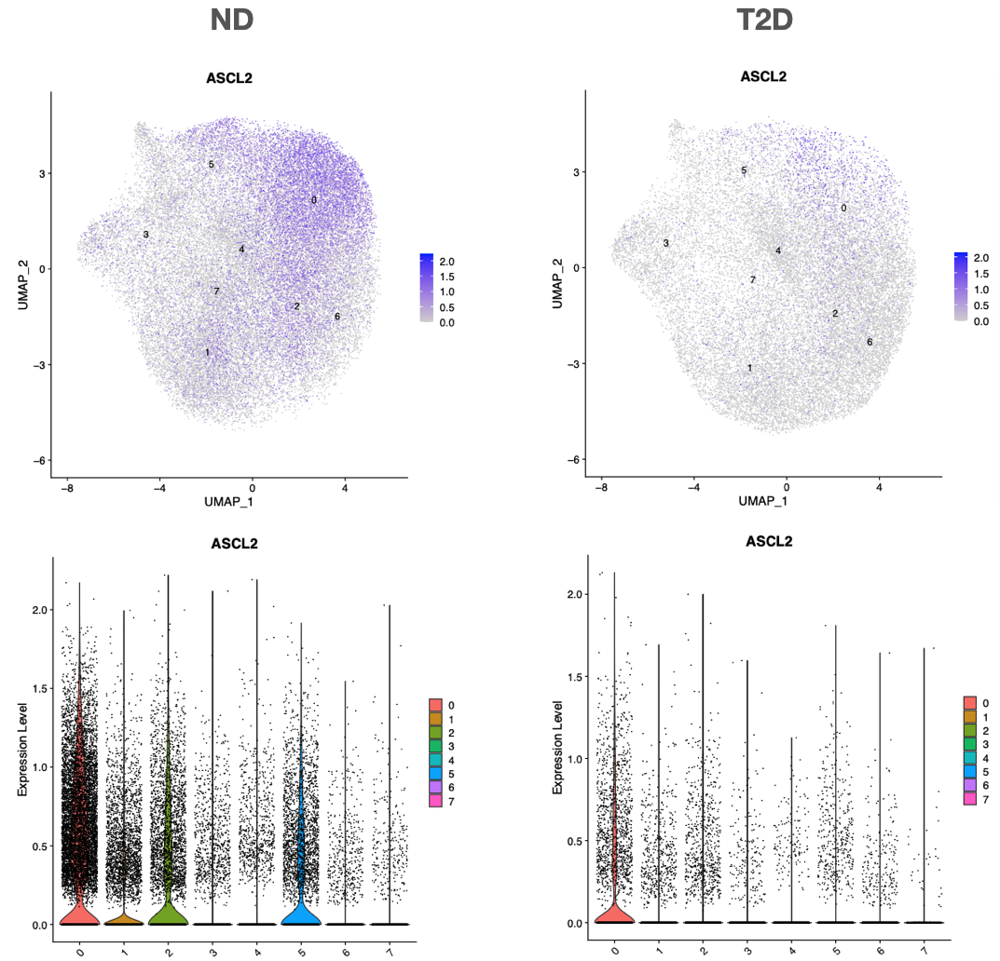
```

```{r betasub11_plot2, echo = FALSE, message=FALSE, fig.align='left', fig.cap='SIX3 expression profiles. Top: UMAP plots. Bottom: Violin plots. Left: ND. Right: T2D. The plot format has been modified to sumarize the information in one figure.'}
knitr::include_graphics("beta_sub_six3.png")
```

GO enrichment analysis with **clusterProfiler** provides more evidence on the upregulated genes (and their functions) of each subcluster. Here we show how we obtained the Cluster 0 and Cluster 6 enriched biological processes using the top 50 differentially expressed genes. 

```{r,betasub12,eval=TRUE}
# Cluster 0 upregulated genes and enriched processes
marks.0<-beta_markers[beta_markers$cluster==0,]
marks.0<-marks.0[1:50,]
ego <- enrichGO(gene         = marks.0$gene,
                OrgDb         = org.Hs.eg.db,
                keyType       = "SYMBOL",
                ont           = "BP",
                pAdjustMethod = "BH",
                pvalueCutoff = 0.05,
                qvalueCutoff  = 0.1)
ego0 <- summary(ego)
head(ego0)

# Cluster 6 upregulated genes and enriched processes
marks.6<-beta_markers[beta_markers$cluster==6,]
marks.6<-marks.6[1:50,]
ego <- enrichGO(gene         = marks.6$gene,
                OrgDb         = org.Hs.eg.db,
                keyType       = "SYMBOL",
                ont           = "BP",
                pAdjustMethod = "BH",
                pvalueCutoff = 0.05,
                qvalueCutoff  = 0.1)
ego6 <- summary(ego)
head(ego6)
```

In a similar way, we obtain the significant biological processes from the other clusters. The most informative terms are depicted in a bubble plot. Cluster 4 has not been included because it has only 2 differentially upregulated genes. The analysis highlights the existence of high-quality cells in Cluster 0 and of senescent cells in Cluster 6. 

```{r,betasub13,eval=TRUE}
# read the pre-saved pathways
ego0<-read.csv(paste(folder,"Cluster_0_GO_pathways_Beta.csv",sep=""),row.names=1)
ego1<-read.csv(paste(folder,"Cluster_1_GO_pathways_Beta.csv",sep=""),row.names=1)
ego2<-read.csv(paste(folder,"Cluster_2_GO_pathways_Beta.csv",sep=""),row.names=1)
ego3<-read.csv(paste(folder,"Cluster_3_GO_pathways_Beta.csv",sep=""),row.names=1)
ego4<-read.csv(paste(folder,"Cluster_4_GO_pathways_Beta.csv",sep=""),row.names=1)
ego5<-read.csv(paste(folder,"Cluster_5_GO_pathways_Beta.csv",sep=""),row.names=1)
ego6<-read.csv(paste(folder,"Cluster_6_GO_pathways_Beta.csv",sep=""),row.names=1)
ego7<-read.csv(paste(folder,"Cluster_7_GO_pathways_Beta.csv",sep=""),row.names=1)

# selected terms from Cluster 0
ego0.sel <- ego0[ego0$Description == "hormone transport" |  
                 ego0$Description == "protein localization to extracellular region" | 
                 ego0$Description == "insulin secretion",]
ego0.sel$Comparison <- "Cluster 0"

# selected terms from Cluster 1
ego1.sel <- ego1[ego1$Description == "response to hypoxia" |  
                 ego1$Description == "cellular response to hypoxia" | 
                 ego1$Description == "cellular divalent inorganic cation homeostasis",]
ego1.sel$Comparison <- "Cluster 1"

# selected terms from Cluster 2
ego2.sel <- ego2[ego2$Description == "nuclear-transcribed mRNA catabolic process, nonsense-mediated decay" |  
                 ego2$Description == "SRP-dependent cotranslational protein targeting to membrane" | 
                 ego2$Description == "translational initiation",]
ego2.sel$Comparison <- "Cluster 2"

# selected terms from Cluster 3
ego3.sel <- ego3[ego3$Description == "response to unfolded protein" |  
                 ego3$Description == "response to heat" | 
                 ego3$Description == "response to temperature stimulus",]
ego3.sel$Comparison <- "Cluster 3"

# selected terms from Cluster 5
ego5.sel <- ego5[ego5$Description == "response to endoplasmic reticulum stress" |  
                 ego5$Description == "response to topologically incorrect protein" | 
                 ego5$Description == "endoplasmic reticulum unfolded protein response",]
ego5.sel$Comparison <- "Cluster 5"

# selected terms from Cluster 6
ego6.sel <- ego6[ego6$Description == "antigen processing and presentation of endogenous peptide antigen" |  
                 ego6$Description == "cellular senescence" | 
                 ego6$Description == "regulation of cell killing",]
ego6.sel$Comparison <- "Cluster 6"

# selected terms from Cluster 7
ego7.sel <- ego7[ego7$Description == "positive regulation of neurotransmitter transport" |  
                 ego7$Description == "positive regulation of amine transport" | 
                 ego7$Description == "cell growth",]
ego7.sel$Comparison <- "Cluster 7"

# collect all pathways and make the plot
all_pathways <-  rbind(ego0.sel, 
                       ego1.sel, 
                       ego2.sel,
                       ego3.sel,
                       ego5.sel,
                       ego6.sel,
                       ego7.sel)
all_pathways$Description <- factor(all_pathways$Description, 
                                   levels=unique(all_pathways$Description))

p1<- ggplot(all_pathways, aes(x=Comparison,y=Description, 
                              size=Count, color=p.adjust, group=Comparison)) + 
     geom_point(alpha = 2) + 
     theme_classic() +
     theme(axis.text.x = element_text(angle = 90)) + 
           scale_x_discrete(limits= c("Cluster 0","Cluster 1","Cluster 2", 
                                      "Cluster 3", "Cluster 5","Cluster 6","Cluster 7")) + 
     theme(text = element_text(size = 10)) 
p1
```

```{r betasub13_plot1, echo = FALSE, message=FALSE, fig.align='left', fig.cap='Selected enriched biological processes in each beta subcluster.'}
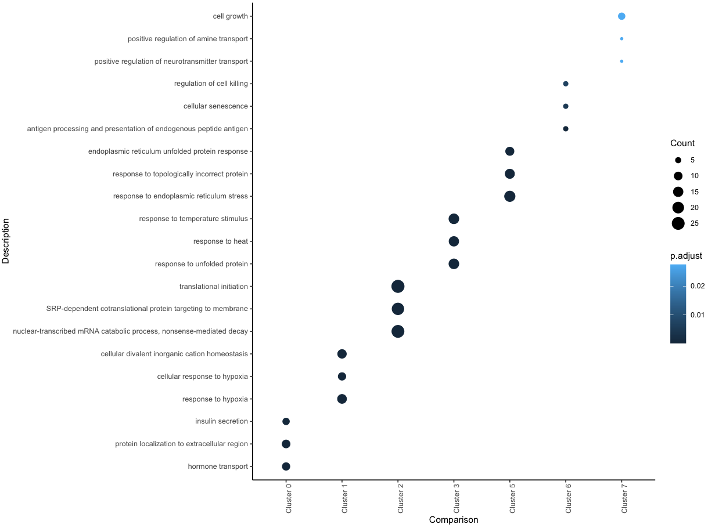
```

### 14.2. Alpha cell subclustering

We have perform the Alpha cell subclustering in the same fashion. The set consists of 74,812 high-quality cells. The merged data were re-integrated with Harmony, adjusting for sex, chemistry, race and age. The clustering was done with Leuven and resolution parameter 0.5.

```{r,alphasub0,eval=FALSE}
alphasubMeta<-read.table(paste(folder,"alphasubcl_meta.txt",sep=""),sep="\t",header=T)
```

```{r,alphasub1,eval=FALSE}
# read the single-cell data
dat<-readRDS("/path/to/final/IntegratedData.rds")

# select the beta cells
alpha.dat<-subset(dat,subset=Clusters=="Alpha")

# integrate with harmony
alpha.sub <- alpha.dat %>%
              RunHarmony(group.by.vars = c("Chemistry","Sex","Race","Age"))

# cluster the data
alpha.sub <- alpha.sub %>%
              RunUMAP(reduction = "harmony", dims = 1:10) %>%
              FindNeighbors(reduction = "harmony", dims = 1:10) %>%
              FindClusters(resolution = 0.5) %>%
              identity()

# store the data
alpha.sub<-saveRDS(alpha.sub,"/path/to/Alpha/subclusters.rds")
```

```{r,alphasub1.1,eval=TRUE,echo=FALSE}
alphasubMeta<-read.table(paste(folder,"alphasubcl_meta.txt",sep=""),sep="\t",header=T)
```

We examine the number of cells per cluster in overall and across other experimental factors:

```{r,alphasub1.2,eval=TRUE}
# see the number of cells per cluster
table(alphasubMeta$seurat_clusters)

# see the number of cells per cluster and disease state
table(alphasubMeta$seurat_clusters,alphasubMeta$Condition)

# see the number of cells per cluster and chemistry
table(alphasubMeta$seurat_clusters,alphasubMeta$Chemistry)

# see the number of cells per cluster and sex
table(alphasubMeta$seurat_clusters,alphasubMeta$Sex)

# see the number of cells per cluster and race
table(alphasubMeta$seurat_clusters,alphasubMeta$Race)
```

We also visualize the above information on the UMAP plots:

```{r,alphasub2,eval=FALSE}
DimPlot(alpha.sub, reduction = "umap", label = TRUE, raster= FALSE)
```

```{r alphasub2_plot1, echo = FALSE, message=FALSE, fig.align='left', fig.cap='Subclustering of Beta cells.'}
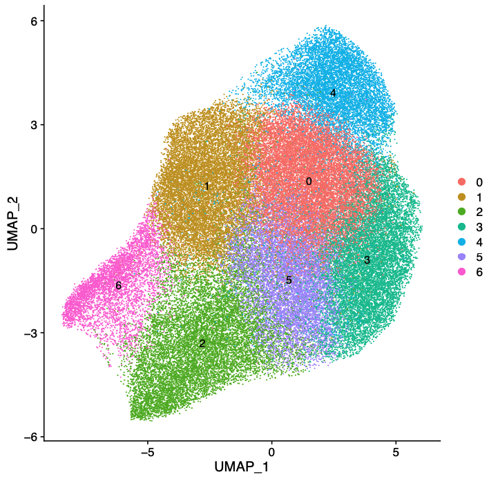
```

We can also see how the clinical and technical factors are integrated. First the disease state:

```{r,alphasub3,eval=FALSE}
DimPlot(alpha.sub, reduction = "umap", label = TRUE, raster= FALSE, split.by= 'Condition')
```

```{r alphasub3_plot1, echo = FALSE, message=FALSE, fig.align='left', fig.cap='Subclusters of Beta cells across disease states.'}
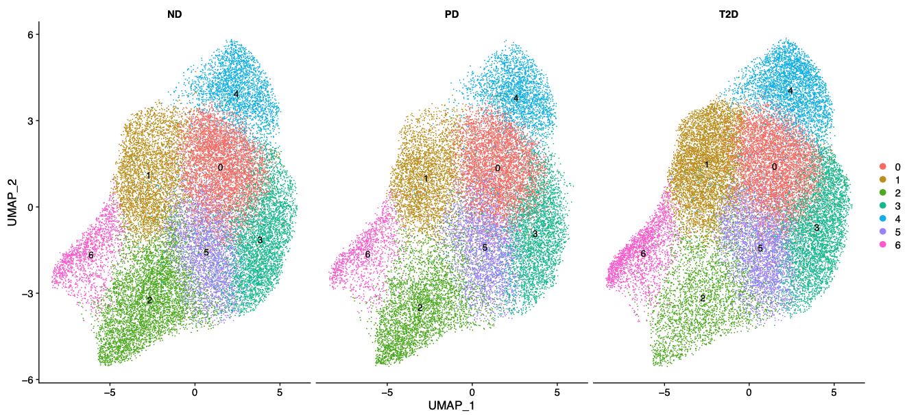
```

In contrast to beta cell analysis, in alpha subclustering we do not observe enrichment of disease states across subclusters.

```{r,alphasub4,eval=FALSE}
# read the pre-saved alpha subcluster meta data
alphasubMeta<-read.table(paste(folder,"alphasubcl_meta.txt",sep=""),sep="\t",header=T)

# calculate the percentge of cells per cluster and donor
df<-table(alphasubMeta$Islet,alphasubMeta$seurat_clusters)
for(i in 1:nrow(df)){
    df[i,]<-100*df[i,]/sum(df[i,])
}

# add the condition variable
cond<-unique(betasubMeta[,c(18,11,10,12,14)])
cond<-cond[match(rownames(df),cond[,1]),]
df<-data.frame(df,Condition=factor(cond[,2],levels=c("ND","PD","T2D")),
                  Chemistry=factor(cond[,3],levels=c("V2","V3")),
                  Sex=factor(cond[,4],levels=c("M","F")),
                  Race=factor(cond[,5],levels=c("W","H","AA")))
colnames(df)<-c("Islet","Subcluster","Perc",
                "Condition","Chemistry","Sex","Race")

# specify the pairwise comparisons (for the plot)
my_comparisons <- list( c("ND", "PD"), c("PD", "T2D"), c("ND", "T2D") )

# plot the result
p <- ggplot(data = df, aes(x=Condition, y=Perc)) + ylim(0,110) + ylab("Percentage of cells") +
            geom_boxplot(aes(fill=Condition),outlier.shape = NA) +
            geom_jitter(size=0.4)
p + facet_wrap( ~ Subcluster, scales="free") +
    stat_compare_means(comparisons = my_comparisons,size=2)
```

```{r alphasub4_plot1, echo = FALSE, message=FALSE, fig.align='left', fig.cap='Percentage of cells per alpha subcluster and donor. Wilcoxon p-values are depicted.'}
knitr::include_graphics("alpha_sub_perc.png")
```

```{r,alphasub4.1,eval=TRUE,echo=FALSE}
alphasubMeta<-read.table(paste(folder,"alphasubcl_meta.txt",sep=""),sep="\t",header=T)
df<-table(alphasubMeta$Islet,alphasubMeta$seurat_clusters)
for(i in 1:nrow(df)){
    df[i,]<-100*df[i,]/sum(df[i,])
}
cond<-unique(betasubMeta[,c(18,11,10,12,14)])
cond<-cond[match(rownames(df),cond[,1]),]
df<-data.frame(df,Condition=factor(cond[,2],levels=c("ND","PD","T2D")),
                  Chemistry=factor(cond[,3],levels=c("V2","V3")),
                  Sex=factor(cond[,4],levels=c("M","F")),
                  Race=factor(cond[,5],levels=c("W","H","AA")))
colnames(df)<-c("Islet","Subcluster","Perc",
                "Condition","Chemistry","Sex","Race")
```

The integration of chemistry, sex and race can be visualized on the UMAP.

```{r,alphasub6,eval=FALSE}
DimPlot(alpha.sub, reduction = "umap", label = TRUE, raster= FALSE, split.by= 'Chemistry')
DimPlot(alpha.sub, reduction = "umap", label = TRUE, raster= FALSE, split.by= 'Sex')
DimPlot(alpha.sub, reduction = "umap", label = TRUE, raster= FALSE, split.by= 'Race')
```

```{r alphasub6_plot1, echo = FALSE, message=FALSE, fig.align='left', fig.cap='Integration of V2 and V3 chemistries in alpha subclustering.'}
knitr::include_graphics("alpha_sub_chemistry.png")
```

```{r alphasub6_plot2, echo = FALSE, message=FALSE, fig.align='left', fig.cap='Integration of Males and Females in alpha subclustering.'}
knitr::include_graphics("alpha_sub_sex.png")
```

```{r alphasub6_plot3, echo = FALSE, message=FALSE, fig.align='left', fig.cap='Integration of races in alpha subclustering.'}
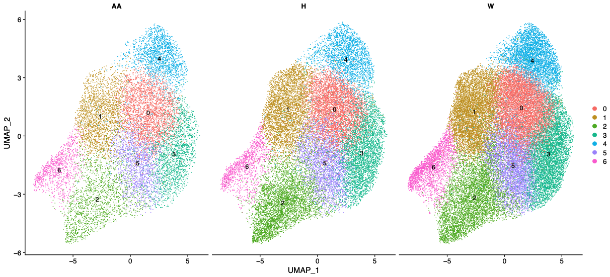
```

As before, there are no statistical differences in chemistries, sexes and races in the subclusters:

```{r,alphasub7,eval=TRUE}
# test the Chemistries
stat.test <- df %>%
  group_by(Subcluster) %>%
  wilcox_test(Perc ~ Chemistry) %>%
  adjust_pvalue(method = "BH") %>%
  add_significance()
stat.test

# test the Sexes
stat.test <- df %>%
  group_by(Subcluster) %>%
  wilcox_test(Perc ~ Sex) %>%
  adjust_pvalue(method = "BH") %>%
  add_significance()
stat.test

# test the Races
stat.test <- df %>%
  group_by(Subcluster) %>%
  wilcox_test(Perc ~ Race) %>%
  adjust_pvalue(method = "BH") %>%
  add_significance()
stat.test
```

To characterize the cell clusters, we run again differential expression analysis at the single-cell level with Seurat's negative binomial model. Compared to Beta, the hits are considerably less implying that the alpha cell heterogeneity is not as prominent.  


```{r,alphasub8,eval=TRUE,echo=FALSE}
alpha_markers<-read.table(paste(folder,"alpha_subcluster_markers.txt",sep=""),sep="\t")
```

```{r,alphasub8.1,eval=FALSE}
alpha_markers <- FindAllMarkers(alpha.sub, slot="counts", 
                                           min.pct = 0.1,
                                           logfc.threshold = 0.2,
                                           test.use="negbinom", object = 
                                           latent.vars=c("chemistry","Sex","Race","Age"), 
                                           only.pos=TRUE)
write.table(alpha_markers,"/path/to/alpha/subcluster/markers.txt",sep="\t",row.names=F)

# number of DE genes per cluster
table(alpha_markers$cluster)
##    0    1    2    3    4    5    6 
##   65  357  423 1106   13 1570  145
```

We plot a few top subcluster markers on a heatmap. The markers were manually selected for visualization reasons:

```{r,alphasub9,eval=FALSE}
DoHeatmap(alpha.sub,features=c("ARRDC4","SPC25","PLK2","KIF12","FXYD6","NDRG1","CITED2",
                               "SOCS1","CEBPD","LDHA","TNFRSF12A","RSAD2","TPM4",
                               "CD68","TUBB3","PLCE1","G6PC2","CRH","TMEM236","PFN2",
                               "MT-ND6","MT-CO3","MT-ATP6","MT-CYB","PART1","SMOC1",
                               "MUC13","IGFBP2","PDK4","HSPA1A","HSPA6","HSPA1B",
                               "DNAJB1","HSPH1")) + NoLegend()
```

```{r alphasub9_plot1, echo = FALSE, message=FALSE, fig.align='left', fig.cap='Heatmap of selected alpha subcluster markers.'}
knitr::include_graphics("beta_sub_heat.png")
```

As before, we can visualize the top markers in the UMAP and violin plots. Here we show the examples of HSPA1A (upregulated in in Cluster 6)

```{r,alphasub10,eval=TRUE}
# DE analysis of ASCL2
alpha_markers[alpha_markers$gene=="HSPA1A",]
```

```{r,alphasub11,eval=FALSE}
# subset the data into ND and T2D specific
alpha.sub.nd<-subset(alpha.sub,subset=Condition=="ND")
alpha.sub.t2d<-subset(alpha.sub,subset=Condition=="T2D")

# plot the genes of interest
FeaturePlot(alpha.sub.nd, features= "HSPA1A",order=T,combine=F,raster=F,label=T)
FeaturePlot(alpha.sub.t2d, features= "HSPA1A",order=T,combine=F,raster=F,label=T)
VlnPlot(alpha.sub.nd, features= "HSPA1A",combine=F)
VlnPlot(alpha.sub.t2d, features= "HSPA1A",combine=F)
```

```{r alphasub11_plot1, echo = FALSE, message=FALSE, fig.align='left', fig.cap='HSPA1A expression profiles. Top: UMAP plots. Bottom: Violin plots. Left: ND. Right: T2D. The plot format has been modified to sumarize the information in one figure.'}
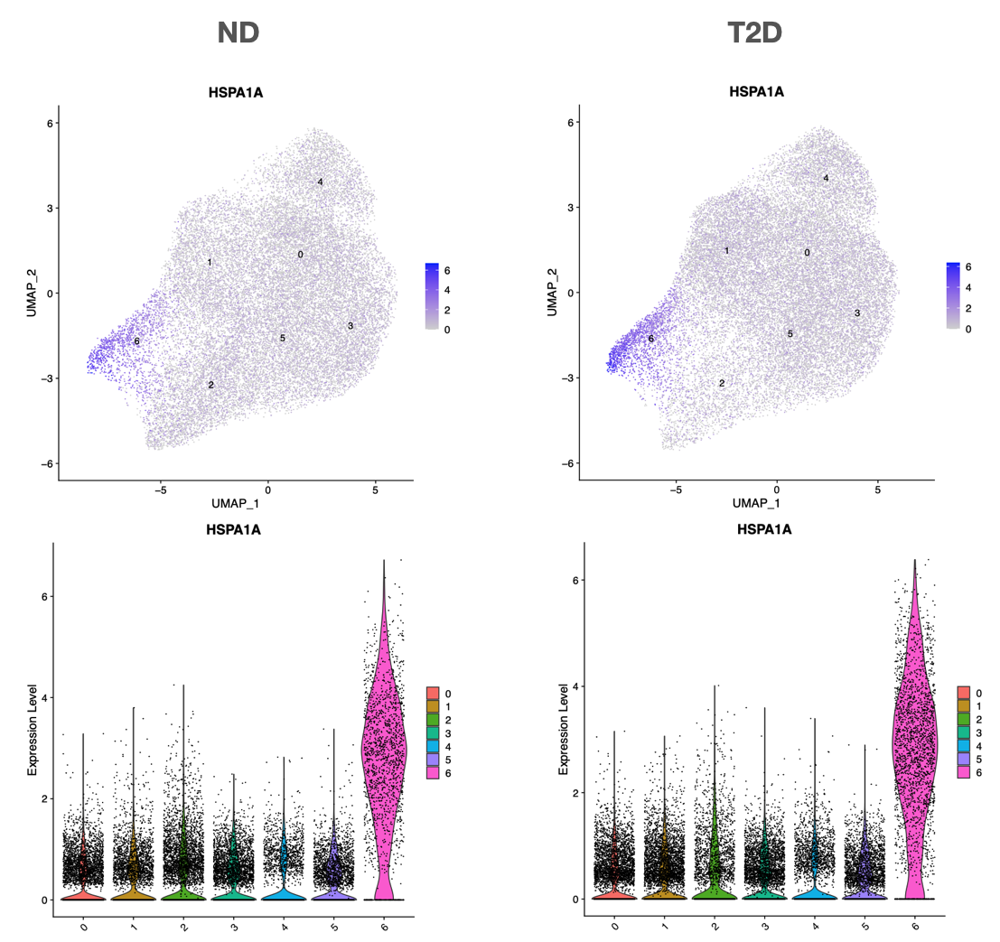
```

To summarize the functional characterization of each subcluster we use GO enrichment analysis with **clusterProfiler**. We will show the example of Clusters 0 and 6. It is worth plotting the **cnetplot()** of the top enriched biological processes that also depicts the genes involved in the processes and found in our data.

```{r,alphasub12,eval=TRUE}
# enrichment of Cluster 0
marks.0<-alpha_markers[alpha_markers$cluster==0,]
marks.0<-marks.0[1:50,]
ego0 <- enrichGO(gene = marks.0$gene,
                OrgDb = org.Hs.eg.db,
                keyType = "SYMBOL",
                ont = "BP",
                pAdjustMethod = "BH",
                pvalueCutoff = 0.05,
                qvalueCutoff  = 0.1)

# plot the top 20 terms from Cluster 0
cnetplot(ego0,showCategory=20,
         cex_category = 0.5,
         cex_gene = 0.5,
         cex_label_category = 0.5,
         cex_label_gene = 0.5)

```

Among the top terms of Cluster 0, we find the regulation of insulin secretion, regulation of sodium and other mitotic terms. 

```{r,alphasub13,eval=TRUE}
# enrichment of Cluster 6
marks.6<-alpha_markers[alpha_markers$cluster==6,]
marks.6<-marks.6[1:50,]
ego6 <- enrichGO(gene = marks.6$gene,
                OrgDb = org.Hs.eg.db,
                keyType = "SYMBOL",
                ont = "BP",
                pAdjustMethod = "BH",
                pvalueCutoff = 0.05,
                qvalueCutoff  = 0.1)

# plot the top 20 terms from Cluster 6
cnetplot(ego6,showCategory=20,
         cex_category = 0.5,
         cex_gene = 0.5,
         cex_label_category = 0.5,
         cex_label_gene = 0.5)
```

On the other hand, Cluster 6 seems to upregulate genes involved in hypoxia and response to heat.
